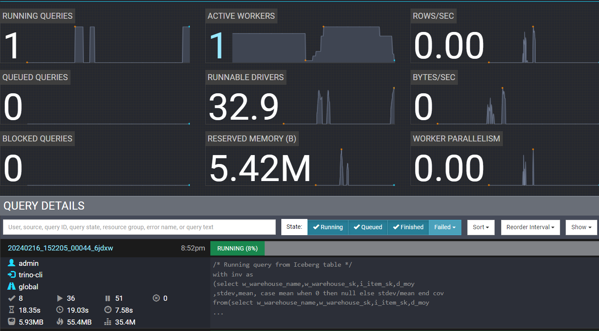
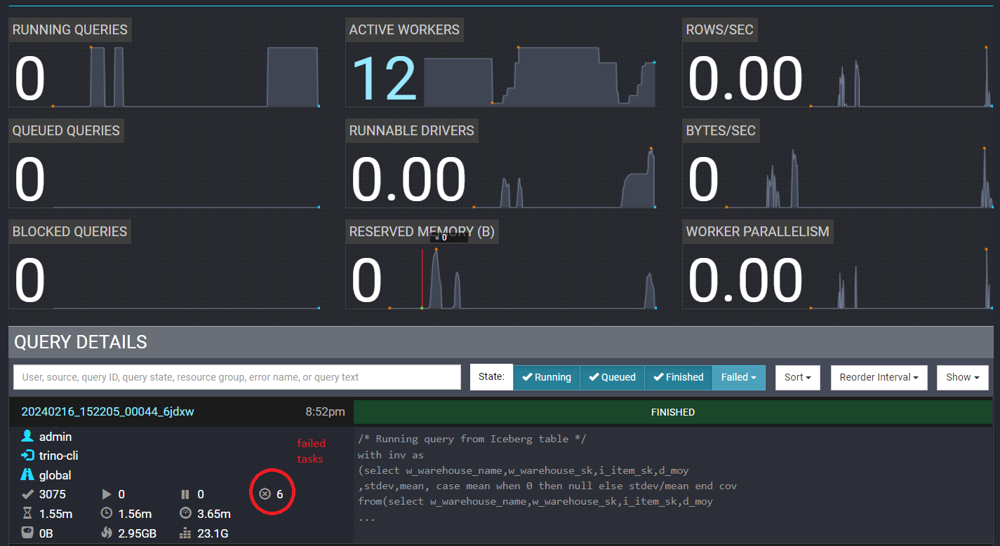

# EKS에 Trino 배포

## 소개

[Trino](https://trino.io/)는 Amazon S3, 관계형 데이터베이스, 분산 데이터 저장소 및 데이터 웨어하우스를 포함한 다양한 데이터 소스에 대해 빅데이터 분석을 위한 SQL 쿼리를 실행하도록 설계된 오픈소스의 빠른 분산 쿼리 엔진입니다.

Trino가 쿼리를 실행할 때 실행을 단계의 계층 구조로 분할하며, 이는 Trino 워커 네트워크에 분산된 일련의 작업으로 구현됩니다. Trino 클러스터는 병렬 처리를 위한 코디네이터와 많은 워커로 구성되며, EKS 클러스터에 Kubernetes 파드로 배포할 수 있습니다. 코디네이터와 워커는 협력하여 연결된 데이터 소스에 액세스하며, 스키마와 참조는 카탈로그에 저장됩니다. 데이터 소스에 액세스하려면 Trino에서 Trino에 맞게 조정하기 위해 제공하는 많은 [커넥터](https://trino.io/docs/current/connector.html) 중 하나를 사용할 수 있습니다. 예를 들어 Hive, Iceberg, Kafka가 있습니다. Trino 프로젝트에 대한 자세한 내용은 이 [링크](https://trino.io)에서 확인할 수 있습니다.

## 블루프린트 솔루션

이 블루프린트는 Karpenter(v0.34.0)를 사용하여 노드가 프로비저닝된 EKS 클러스터(Kubernetes 버전 1.29)에 Trino를 배포합니다. 비용과 성능을 최적화하기 위해 Karpenter는 Trino 코디네이터용으로 온디맨드 노드를, Trino 워커용으로 EC2 스팟 인스턴스를 프로비저닝합니다. Trino의 다중 아키텍처 컨테이너 이미지를 사용하면 Karpenter [NodePool](https://karpenter.sh/v0.34/concepts/nodepools/)이 AWS Graviton 기반 인스턴스를 포함한 다양한 CPU 아키텍처의 EC2 인스턴스로 노드를 프로비저닝할 수 있습니다. Trino는 [공식 Helm 차트](https://trinodb.github.io/charts/charts/trino/)를 사용하여 배포되며, 사용자가 Hive 및 Iceberg 커넥터를 활용할 수 있도록 커스텀 값이 제공됩니다. 예제는 AWS의 Glue 및 Iceberg 테이블을 백엔드 데이터 소스로 사용하고 S3를 스토리지로 사용합니다.

## 솔루션 배포

배포 단계를 살펴보겠습니다.

### 사전 요구 사항

다음 도구가 로컬 머신에 설치되어 있는지 확인하세요.

1. [aws cli](https://docs.aws.amazon.com/cli/latest/userguide/install-cliv2.html)
2. [kubectl](https://Kubernetes.io/docs/tasks/tools/)
3. [terraform](https://learn.hashicorp.com/tutorials/terraform/install-cli)
4. [Trino CLI client](https://trino.io/docs/current/client/cli.html)
<details>
<summary> Trino CLI 설치 단계를 보려면 토글하세요</summary>
```bash
wget https://repo1.maven.org/maven2/io/trino/trino-cli/427/trino-cli-427-executable.jar
mv trino-cli-427-executable.jar trino
chmod +x trino
```
</details>

### Trino로 EKS 클러스터 배포

먼저 저장소를 복제합니다.

```bash
git clone https://github.com/awslabs/data-on-eks.git
```

`distributed-databases/trino`로 이동하고 `install.sh` 스크립트를 실행합니다. 프롬프트가 표시되면 리소스를 프로비저닝할 AWS 리전을 입력합니다(예: `us-west-2`).

```bash
cd data-on-eks/distributed-databases/trino

./install.sh
```

### 배포 확인

Amazon EKS 클러스터 확인

```bash
#리소스를 배포한 리전을 선택하세요
aws eks describe-cluster --name trino-on-eks --region us-west-2
```

로컬 kubeconfig를 업데이트하여 kubernetes 클러스터에 액세스할 수 있도록 합니다(terraform output `configure_kubectl`에서도 이 명령을 가져올 수 있습니다).

```bash
aws eks update-kubeconfig --name trino-on-eks --region us-west-2
```

먼저 클러스터에서 Karpenter가 프로비저닝한 워커 노드가 있는지 확인합니다. 가용 영역과 용량 유형(온디맨드 또는 스팟)도 확인합니다.

```bash
kubectl get nodes --selector=karpenter.sh/nodepool=trino-sql-karpenter -L topology.kubernetes.io/zone -L karpenter.sh/capacity-type -L node.kubernetes.io/instance-type
```
#### 출력
```bash
NAME                                        STATUS   ROLES    AGE   VERSION               ZONE         CAPACITY-TYPE   INSTANCE-TYPE
ip-10-1-11-49.us-west-2.compute.internal    Ready    <none>   24m   v1.29.0-eks-5e0fdde   us-west-2b   on-demand       t4g.medium
```
위에서 Karpenter가 Trino 코디네이터를 실행하기 위한 온디맨드 노드를 프로비저닝한 것을 볼 수 있습니다.
:::info

대규모 병렬 처리 클러스터에서 실행되는 Trino와 같은 분산 빅데이터 쿼리 엔진의 경우 높은 가용 영역 간 데이터 전송 비용을 피하기 위해 동일한 가용 영역에 클러스터를 배포하는 것이 좋습니다. 그래서 Karpenter NodePool은 동일한 AZ에서 EKS 노드를 시작하도록 구성되었습니다.

:::

이제 `trino` 네임스페이스에서 실행 중인 코디네이터와 워커 파드를 확인합니다.

```bash
kubectl get pods --namespace=trino
```
#### 출력
```bash
NAME                                 READY   STATUS    RESTARTS   AGE
trino-coordinator-5cfd685c8f-mchff   1/1     Running   0          37m
```

다음으로 로컬에서 액세스할 수 있도록 trino 서비스를 포트 포워딩합니다.

```bash
kubectl -n trino port-forward service/trino 8080:8080
```

이제 웹 브라우저를 통해 [http://localhost:8080](http://localhost:8080) 에서 Trino UI에 액세스하고 아래와 같이 로그인 창에서 사용자 이름 `admin`으로 로그인합니다:


Trino Web UI는 활성 워커가 0개로 표시됩니다:


## 데이터베이스 쿼리 실행을 위한 Trino 사용

### 예제 #1: Hive 커넥터 사용

이 예제에서는 AWS Glue를 사용하여 Hive 메타스토어를 설정하고, S3에 저장된 소스 데이터와 스키마를 추론하여 Glue 테이블을 구축하는 크롤러를 설정합니다.

Glue 커넥터와 함께 EKS의 Trino를 사용하여 Trino CLI로 데이터를 검색하기 위한 샘플 SQL 쿼리를 실행합니다.

#### 설정

`examples` 디렉토리에서 hive 스크립트를 실행하여 2022 NYC 택시 데이터셋(Parquet 형식)이 포함된 블루프린트 S3 버킷을 설정하고 Glue 메타스토어를 구축합니다:

```bash
cd examples/
./hive-setup.sh
```

진행 상황을 보여주는 출력이 표시되며, 성공하면 메타데이터를 저장할 Glue 테이블 이름이 `hive`로 표시됩니다.

#### 쿼리 실행
사전 요구 사항의 일부로 Trino CLI가 설치되어 있어야 합니다. 블루프린트는 이전 섹션에서 설정한 버킷으로 Hive 커넥터가 구성되어 있으므로 추가 설정 없이 데이터 소스를 쿼리할 수 있습니다.

먼저 이전 섹션에서 세션을 닫은 경우 로컬로 액세스하기 위해 trino 서비스를 포트 포워딩합니다:
```
kubectl -n trino port-forward service/trino 8080:8080
```

포트 포워딩이 실행되는 동안 Trino CLI가 있는 다른 터미널 탭을 열고 다음 명령을 실행하여 코디네이터에 액세스합니다:
```bash
./trino http://127.0.0.1:8080 --user admin
```

성공하면 명령을 실행할 수 있는 프롬프트가 표시됩니다. `help` 명령을 사용하여 지원되는 명령 목록을 볼 수 있습니다. 처음 실행하는 명령은 trino 워커의 자동 스케일링을 0에서 1로 트리거하고 완료하는 데 몇 분이 걸립니다.

예를 들어:

카탈로그 목록을 보려면 `SHOW CATALOGS;` 쿼리를 실행하면 블루프린트에 의해 구성된 다른 카탈로그 중에서 `hive`와 `iceberg` 카탈로그를 볼 수 있습니다.
#### 출력
```bash
 Catalog
---------
 hive
 iceberg
 system
 tpcds
 tpch
(5 rows)

Query 20240215_200117_00003_6jdxw, FINISHED, 1 node
Splits: 1 total, 1 done (100.00%)
0.49 [0 rows, 0B] [0 rows/s, 0B/s]
```

Hive 카탈로그의 스키마(데이터베이스)를 보려면 `SHOW SCHEMAS FROM hive;` 쿼리를 실행합니다:
#### 출력
```bash
  Schema
--------------------
 information_schema
 taxi_hive_database
(2 rows)
```

`taxi_hive_database`를 사용하고 이 데이터베이스의 테이블을 표시합니다 -
```
USE hive.taxi_hive_database;
```
```
SHOW TABLES;
```
#### 출력
```
Table
-------
hive
(1 row)
```

마지막으로 항목을 나열하는 간단한 쿼리를 실행합니다 - `SELECT * FROM hive LIMIT 5;`
#### 출력
```
vendorid |  tpep_pickup_datetime   |  tpep_dropoff_datetime  | passenger_count | trip_distance | ratecodeid | store_and_fwd_flag | pulocationid | dolocation>
----------+-------------------------+-------------------------+-----------------+---------------+------------+--------------------+--------------+----------->
        1 | 2022-09-01 00:28:12.000 | 2022-09-01 00:36:22.000 |             1.0 |           2.1 |        1.0 | N                  |          100 |          2>
        1 | 2022-11-01 00:24:49.000 | 2022-11-01 00:31:04.000 |             2.0 |           1.0 |        1.0 | N                  |          158 |          1>
        1 | 2022-11-01 00:37:32.000 | 2022-11-01 00:42:23.000 |             2.0 |           0.8 |        1.0 | N                  |          249 |          1>
        2 | 2022-09-01 00:02:24.000 | 2022-09-01 00:09:39.000 |             1.0 |          1.32 |        1.0 | N                  |          238 |          1>
        2 | 2022-09-01 00:47:25.000 | 2022-09-01 00:56:09.000 |             1.0 |          2.94 |        1.0 | N                  |
```

#### Hive 리소스 정리

1. Trino CLI에서 `exit` 명령으로 종료합니다.

2. `examples` 디렉토리에서 정리 스크립트를 실행하여 hive 스크립트에서 생성된 모든 리소스를 삭제합니다:

```
cd data-on-eks/distributed-databases/trino/examples
./hive-cleanup.sh
```

### 예제 #2: Iceberg 커넥터 사용

이 예제에서는 AWS Glue를 카탈로그 유형으로 사용하여 Apache Iceberg를 설정하고 PARQUET 형식으로 Amazon S3에 데이터를 저장합니다.

Iceberg 커넥터와 함께 EKS의 Trino를 사용하여 Trino CLI로 위의 리소스를 생성하고 데이터를 삽입 및 검색하기 위한 샘플 SQL 쿼리를 실행합니다.

#### 쿼리 실행

- 블루프린트가 생성한 S3 데이터 버킷을 확인합니다. 이 버킷을 사용하여 PARQUET 형식으로 Iceberg 테이블에 데이터를 저장합니다.
```bash
cd data-on-eks/distributed-databases/trino
export BUCKET=$(terraform output --state="./terraform.tfstate" --raw data_bucket)
echo $BUCKET
```
#### 출력
```bash
trino-data-bucket-20240215180855515400000001
```

- 이제 [TPCDS](https://trino.io/docs/current/connector/tpcds.html)의 sf10000 스키마 테이블에서 데이터로 채워진 테이블이 있는 Iceberg 스키마를 만들어 보겠습니다. CREATE TABLE AS SELECT (CTAS) 문을 사용합니다. SQL 파일 `examples/trino_sf10000_tpcds_to_iceberg.sql`에는 아래 SQL 문이 있습니다:

```bash
use tpcds.sf10000;
select * from tpcds.sf10000.item limit 10;
select * from tpcds.sf10000.warehouse limit 10;

/* Drop tables & schema */

drop schema iceberg.iceberg_schema;
drop table iceberg.iceberg_schema.warehouse;
drop table iceberg.iceberg_schema.item;
drop table iceberg.iceberg_schema.inventory;
drop table iceberg.iceberg_schema.date_dim;

/* Iceberg schema creation */

create schema if not exists iceberg.iceberg_schema
with (LOCATION = 's3://trino-data-bucket-20240215180855515400000001/iceberg/');

/* Iceberg Table Creation with CTAS from tpcds tables */

create table if not exists iceberg.iceberg_schema.inventory
with (FORMAT = 'PARQUET')
as select *
from tpcds.sf10000.inventory;

create table if not exists iceberg.iceberg_schema.date_dim
with (FORMAT = 'PARQUET')
as select d_date_sk,
cast(d_date_id as varchar(16)) as d_date_id,
d_date,
d_month_seq,
d_week_seq,
d_quarter_seq,
d_year,
d_dow,
d_moy,
d_dom,
d_qoy,
d_fy_year,
d_fy_quarter_seq,
d_fy_week_seq,
cast(d_day_name as varchar(9)) as d_day_name,
cast(d_quarter_name as varchar(6)) as d_quarter_name,
cast(d_holiday as varchar(1)) as d_holiday,
cast(d_weekend as varchar(1)) as d_weekend,
cast(d_following_holiday as varchar(1)) as d_following_holiday,
d_first_dom,
d_last_dom,
d_same_day_ly,
d_same_day_lq,
cast(d_current_day as varchar(1)) as d_current_day,
cast(d_current_week as varchar(1)) as d_current_week,
cast(d_current_month as varchar(1)) as d_current_month,
cast(d_current_quarter as varchar(1)) as d_current_quarter
from tpcds.sf10000.date_dim;

create table if not exists iceberg.iceberg_schema.warehouse
with (FORMAT = 'PARQUET')
as select
w_warehouse_sk,
cast(w_warehouse_id as varchar(16)) as w_warehouse_id,
w_warehouse_name,
w_warehouse_sq_ft,
cast(w_street_number as varchar(10)) as w_street_number,
w_street_name,
cast(w_street_type as varchar(15)) as w_street_type,
cast(w_suite_number as varchar(10)) as w_suite_number,
w_city,
w_county,
cast(w_state as varchar(2)) as w_state,
cast(w_zip as varchar(10)) as w_zip,
w_country,
w_gmt_offset
from tpcds.sf10000.warehouse;

create table if not exists iceberg.iceberg_schema.item
with (FORMAT = 'PARQUET')
as select
i_item_sk,
cast(i_item_id as varchar(16)) as i_item_id,
i_rec_start_date,
i_rec_end_date,
i_item_desc,
i_current_price,
i_wholesale_cost,
i_brand_id,
cast(i_brand as varchar(50)) as i_brand,
i_class_id,
cast(i_class as varchar(50)) as i_class,
i_category_id,
cast(i_category as varchar(50)) as i_category,
i_manufact_id,
cast(i_manufact as varchar(50)) as i_manufact,
cast(i_size as varchar(50)) as i_size,
cast(i_formulation as varchar(20)) as i_formulation,
cast(i_color as varchar(20)) as i_color,
cast(i_units as varchar(10)) as i_units,
cast(i_container as varchar(10)) as i_container,
i_manager_id,
cast(i_product_name as varchar(50)) as i_product_name
from tpcds.sf10000.item;


/* Select from Iceberg table */

select * from iceberg.iceberg_schema.date_dim limit 10;
select * from iceberg.iceberg_schema.item limit 10;
select * from iceberg.iceberg_schema.inventory limit 10;

/* Running query from Iceberg table */

with inv as
(select w_warehouse_name,w_warehouse_sk,i_item_sk,d_moy
,stdev,mean, case mean when 0 then null else stdev/mean end cov
from(select w_warehouse_name,w_warehouse_sk,i_item_sk,d_moy
,stddev_samp(inv_quantity_on_hand) stdev,avg(inv_quantity_on_hand) mean
from iceberg.iceberg_schema.inventory
,iceberg.iceberg_schema.item
,iceberg.iceberg_schema.warehouse
,iceberg.iceberg_schema.date_dim
where inv_item_sk = i_item_sk
and inv_warehouse_sk = w_warehouse_sk
and inv_date_sk = d_date_sk
and d_year =1999
group by w_warehouse_name,w_warehouse_sk,i_item_sk,d_moy) foo
where case mean when 0 then 0 else stdev/mean end > 1)
select inv1.w_warehouse_sk,inv1.i_item_sk,inv1.d_moy,inv1.mean, inv1.cov
,inv2.w_warehouse_sk,inv2.i_item_sk,inv2.d_moy,inv2.mean, inv2.cov
from inv inv1,inv inv2
where inv1.i_item_sk = inv2.i_item_sk
and inv1.w_warehouse_sk = inv2.w_warehouse_sk
and inv1.d_moy=4
and inv2.d_moy=4+1
and inv1.cov > 1.5
order by inv1.w_warehouse_sk,inv1.i_item_sk,inv1.d_moy,inv1.mean,inv1.cov,inv2.d_moy,inv2.mean, inv2.cov;
```

- 위 SQL 명령은 다음 작업을 실행합니다:
    - `iceberg_schema`라는 Iceberg 스키마 생성
    - tpcds의 동일한 테이블에서 데이터가 포함된 4개의 Iceberg 테이블 - `warehouse`, `item`, `inventory` 및 `date_dim` 생성
    - 위 Iceberg 테이블에서 데이터 쿼리

- 이제 Trino CLI를 사용하여 위 SQL 명령을 실행합니다:
```bash
envsubst < examples/trino_sf10000_tpcds_to_iceberg.sql > examples/iceberg.sql
./trino --file 'examples/iceberg.sql' --server http://localhost:8080 --user admin --ignore-errors
```

- 아래와 같이 Trino UI 웹 모니터에서 완료된 쿼리와 실행 중인 SQL 쿼리를 볼 수 있습니다:


- 다른 터미널을 열고 위 SQL 명령이 실행되는 동안 KEDA가 Trino 워커 파드를 어떻게 스케일링하는지 확인합니다:
```bash
kubectl get hpa -n trino -w
```
#### 출력
```bash
NAME                                REFERENCE                 TARGETS                MINPODS   MAXPODS   REPLICAS   AGE
keda-hpa-keda-scaler-trino-worker   Deployment/trino-worker   <unknown>/1, <unknown>/1 + 1 more...   1         15        0          37m
keda-hpa-keda-scaler-trino-worker   Deployment/trino-worker   0/1, 1/1 + 1 more...                   1         15        1          38m
keda-hpa-keda-scaler-trino-worker   Deployment/trino-worker   0/1, 500m/1 + 1 more...                1         15        1          40m
keda-hpa-keda-scaler-trino-worker   Deployment/trino-worker   0/1, 0/1 + 1 more...                   1         15        1          40m
keda-hpa-keda-scaler-trino-worker   Deployment/trino-worker   0/1, 0/1 + 1 more...                   1         15        1          40m
keda-hpa-keda-scaler-trino-worker   Deployment/trino-worker   0/1, 0/1 + 1 more...                   1         15        1          40m
keda-hpa-keda-scaler-trino-worker   Deployment/trino-worker   0/1, 0/1 + 1 more...                   1         15        2          41m
keda-hpa-keda-scaler-trino-worker   Deployment/trino-worker   0/1, 0/1 + 1 more...                   1         15        2          41m
keda-hpa-keda-scaler-trino-worker   Deployment/trino-worker   0/1, 0/1 + 1 more...                   1         15        2          41m
```
쿼리 부하 증가와 워커의 평균 CPU 사용률에 따라 HPA가 초기 0개 워커에서 2개 워커로 스케일링되는 것을 볼 수 있습니다:


### 예제 #3 (선택 사항): Trino의 내결함성 실행
[내결함성 실행](https://trino.io/docs/current/admin/fault-tolerant-execution.html)은 [Project Tardigrade](https://trino.io/blog/2022/05/05/tardigrade-launch.html#what-is-project-tardigrade)를 사용하여 구현된 Trino의 선택적 메커니즘입니다. 내결함성 구성이 없으면 워커 노드 장애 또는 종료와 같은 이유로 쿼리의 구성 요소 작업 중 하나가 실패할 때마다 Trino 쿼리가 실패합니다. 이러한 실패한 쿼리는 처음부터 다시 시작해야 하며, 특히 장기 실행 쿼리의 경우 실행 시간이 길어지고 컴퓨팅 낭비 및 비용이 발생합니다.

[재시도 정책](https://trino.io/docs/current/admin/fault-tolerant-execution.html#retry-policy)으로 Trino에서 내결함성 실행이 구성되면 중간 교환 데이터는 [exchange manager](https://trino.io/docs/current/admin/fault-tolerant-execution.html#exchange-manager)를 사용하여 Amazon S3 또는 HDFS와 같은 외부 스토리지에 스풀링됩니다. 그런 다음 Trino는 실패한 쿼리(재시도 정책이 "QUERY"로 구성된 경우) 또는 실패한 작업(재시도 정책이 "TASK"로 구성된 경우)을 재시도합니다. Trino의 나머지 워커는 exchange manager 데이터를 재사용하여 쿼리 실행 중 워커 중단 또는 기타 오류가 발생한 경우 쿼리를 재시도하고 완료합니다.
:::info
**QUERY 재시도 정책**은 워커 노드에서 오류가 발생할 때 전체 쿼리를 재시도하도록 Trino에 지시합니다. Trino 클러스터의 대부분의 워크로드가 많은 작은 쿼리로 구성된 경우 이 재시도 정책을 사용하는 것이 좋습니다.

**TASK 재시도 정책**은 장애 발생 시 개별 작업을 재시도하도록 Trino에 지시합니다. Trino가 대규모 배치 쿼리를 실행할 때 이 정책을 사용하는 것이 좋습니다. 클러스터는 전체 쿼리를 재시도하는 대신 쿼리 내의 더 작은 작업을 더 효율적으로 재시도할 수 있습니다.
:::
- 이 블루프린트는 코디네이터 및 워커 파드의 **`config.properties`** 파일에 `TASK` 재시도 정책으로 내결함성 구성이 포함된 Trino 클러스터를 배포했습니다. 코디네이터 파드 내에서 bash 명령 셸을 열어 확인합니다:
```bash
COORDINATOR_POD=$(kubectl get pods -l "app.kubernetes.io/instance=trino,app.kubernetes.io/component=coordinator" -o name -n trino)
kubectl exec --stdin --tty $COORDINATOR_POD -n trino -- /bin/bash
cat /etc/trino/config.properties
```
#### 출력
```bash
coordinator=true
node-scheduler.include-coordinator=false
http-server.http.port=8080
query.max-memory=280GB
query.max-memory-per-node=22GB
discovery.uri=http://localhost:8080
retry-policy=TASK
exchange.compression-enabled=true
query.low-memory-killer.delay=0s
query.remote-task.max-error-duration=1m
query.hash-partition-count=50
```
- 블루프린트는 또한 코디네이터 및 워커 파드의 **`exchange-manager.properties`** 파일에서 Amazon S3 버킷을 사용하여 exchange manager를 구성했습니다. 코디네이터 파드 내에서도 확인합니다.
```bash
cat /etc/trino/exchange-manager.properties
```
#### 출력
```bash
exchange-manager.name=filesystem
exchange.base-directories=s3://trino-exchange-bucket-20240215180855570800000004
exchange.s3.region=us-west-2
exchange.s3.iam-role=arn:aws:iam::xxxxxxxxxx:role/trino-sa-role
```
위에서 exchange manager S3 버킷 이름을 메모하세요. AWS 콘솔에서 위 S3 버킷의 내용을 탐색할 수 있습니다. 쿼리가 실행되지 않을 때는 비어 있습니다.
- 이제 코디네이터 파드의 bash 셸에서 종료합니다.
```bash
exit
```

아래 단계에서는 `select` 쿼리를 실행하고 쿼리가 아직 실행 중일 때 일부 Trino 워커를 종료하여 내결함성 실행을 테스트합니다.
- `examples` 폴더에서 아래 SQL 명령이 포함된 `trino_select_query_iceberg.sql` 파일을 찾습니다:
```bash
with inv as
(select w_warehouse_name,w_warehouse_sk,i_item_sk,d_moy
,stdev,mean, case mean when 0 then null else stdev/mean end cov
from(select w_warehouse_name,w_warehouse_sk,i_item_sk,d_moy
,stddev_samp(inv_quantity_on_hand) stdev,avg(inv_quantity_on_hand) mean
from iceberg.iceberg_schema.inventory
,iceberg.iceberg_schema.item
,iceberg.iceberg_schema.warehouse
,iceberg.iceberg_schema.date_dim
where inv_item_sk = i_item_sk
and inv_warehouse_sk = w_warehouse_sk
and inv_date_sk = d_date_sk
and d_year =1999
group by w_warehouse_name,w_warehouse_sk,i_item_sk,d_moy) foo
where case mean when 0 then 0 else stdev/mean end > 1)
select inv1.w_warehouse_sk,inv1.i_item_sk,inv1.d_moy,inv1.mean, inv1.cov
,inv2.w_warehouse_sk,inv2.i_item_sk,inv2.d_moy,inv2.mean, inv2.cov
from inv inv1,inv inv2
where inv1.i_item_sk = inv2.i_item_sk
and inv1.w_warehouse_sk = inv2.w_warehouse_sk
and inv1.d_moy=4
and inv2.d_moy=4+1
and inv1.cov > 1.5
order by inv1.w_warehouse_sk,inv1.i_item_sk,inv1.d_moy,inv1.mean,inv1.cov,inv2.d_moy,inv2.mean, inv2.cov;
```
- 먼저 select 쿼리를 실행합니다.
```bash
./trino --file 'examples/trino_select_query_iceberg.sql' --server http://localhost:8080 --user admin --ignore-errors
```
- 위 명령 직후 위 쿼리가 아직 실행 중일 때 다른 터미널을 열고 아래 명령으로 워커 파드를 1개 워커로 축소하여 다른 모든 워커를 종료합니다:
```bash
kubectl scale deployment trino-worker -n trino --replicas=1
```
브라우저에서 Trino Web UI를 보면 다른 워커가 종료되어 이제 1개의 활성 워커만 실행 중인 것을 볼 수 있습니다:



- Amazon S3 콘솔로 이동하여 `trino-exchange-bucket`으로 시작하는 이름의 exchange manager S3 버킷에서 중간 교환 데이터 스풀링을 확인합니다.


- 이제 Trino Web UI 모니터를 다시 확인하여 종료된 워커로 인해 6개의 실패한 작업에도 불구하고 쿼리가 완료되었는지 확인합니다(아래 스크린샷에서 빨간색으로 표시했습니다).

:::info
Trino Web UI에서 실패한 작업 수는 종료된 워커에서 실행 중이었던 작업 수에 따라 다를 수 있습니다.

또한 CPU 사용률 메트릭을 사용하여 Horizontal Pod Autoscaler(HPA)에 의해 스케일링된 워커 파드에 따라 다른 수의 활성 워커가 표시될 수 있습니다.
:::



#### Iceberg 리소스 정리

1. Trino CLI를 엽니다.
```bash
./trino http://127.0.0.1:8080 --user admin
```

2. 이제 Trino CLI에서 아래 SQL 명령을 실행하여 Iceberg 테이블과 스키마를 삭제합니다:
 ```bash
drop table iceberg.iceberg_schema.warehouse;
drop table iceberg.iceberg_schema.item;
drop table iceberg.iceberg_schema.inventory;
drop table iceberg.iceberg_schema.date_dim;
drop schema iceberg.iceberg_schema;
```
3. `exit` 명령으로 Trino CLI에서 종료합니다.

## 정리

이 블루프린트의 일부로 프로비저닝된 모든 구성 요소를 삭제하려면 다음 명령을 사용하여 모든 리소스를 삭제합니다.

```bash
cd data-on-eks/distributed-databases/trino
./cleanup.sh
```

:::caution

AWS 계정에 원치 않는 요금이 부과되지 않도록 이 배포 중에 생성된 모든 AWS 리소스를 삭제하세요

예: Trino Exchange manager용 S3 버킷
:::

## 결론

Trino는 데이터 소스에서 방대한 양의 데이터를 빠르게 쿼리하기 위한 도구입니다. 이 예제에서는 내결함성 구성으로 Amazon EKS에 Trino를 배포하는 terraform 기반 블루프린트를 공유했으며, 완전한 EKS 클러스터를 구축하는 데 필요한 애드온(예: 노드 자동 스케일링을 위한 Karpenter, Trino 워커 파드 자동 스케일링을 위한 Metrics server 및 HPA, Prometheus/Grafana 스택을 통한 모니터링)이 포함되어 있습니다. 많은 기능 중에서 Amazon S3를 스토리지로 사용하여 Iceberg 또는 Hive 데이터 저장소를 만들고 결과를 위한 간단한 Trino 쿼리를 실행하는 몇 가지 예제를 강조했습니다. 또한 비용 최적화를 위해 스팟 인스턴스에서 Trino 워커를 배포하고 스케일링했습니다. 장기 실행 배치 쿼리에 대한 비용 절감을 위해 스팟 인스턴스에 적합하게 만드는 Trino의 내결함성 기능도 시연했습니다.
