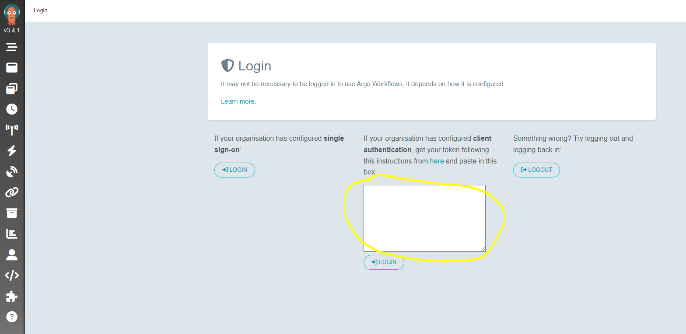

# EKS 기반 Argo Workflows
Argo Workflows는 Kubernetes에서 병렬 작업을 오케스트레이션하기 위한 오픈소스 컨테이너 네이티브 워크플로우 엔진입니다. Kubernetes CRD(Custom Resource Definition)로 구현됩니다. 결과적으로 Argo workflows는 kubectl을 사용하여 관리할 수 있으며 볼륨, 시크릿, RBAC와 같은 다른 Kubernetes 서비스와 네이티브로 통합됩니다.

이 예제는 [Argo Workflows](https://argoproj.github.io/argo-workflows/)를 사용하여 Amazon EKS에 작업을 할당하는 방법을 보여줍니다.

1. Argo Workflows를 사용하여 spark 작업 생성
2. Argo Workflows를 사용하여 spark operator를 통해 spark 작업 생성
3. [Argo Events](https://argoproj.github.io/argo-events/)를 사용하여 Amazon SQS 메시지 삽입 이벤트를 기반으로 Argo Workflows를 트리거하여 spark 작업 생성

이 예제의 [코드 저장소](https://github.com/awslabs/data-on-eks/tree/main/schedulers/terraform/argo-workflow)입니다.

## 사전 요구 사항:

다음 도구가 로컬에 설치되어 있는지 확인하세요:

1. [aws cli](https://docs.aws.amazon.com/cli/latest/userguide/install-cliv2.html)
2. [kubectl](https://Kubernetes.io/docs/tasks/tools/)
3. [terraform](https://learn.hashicorp.com/tutorials/terraform/install-cli)
4. [Argo Workflow CLI](https://github.com/argoproj/argo-workflows/releases/latest)

## 배포

이 예제를 프로비저닝하려면:

```bash
git clone https://github.com/awslabs/data-on-eks.git
cd data-on-eks/schedulers/terraform/argo-workflow

region=<your region> # 다음 명령에 사용할 region 변수 설정
terraform init
terraform apply -var region=$region #기본값은 us-west-2
```

명령 프롬프트에서 `yes`를 입력하여 적용합니다.

다음 구성 요소가 환경에 프로비저닝됩니다:
- 샘플 VPC, 2개의 프라이빗 서브넷 및 2개의 퍼블릭 서브넷
- 퍼블릭 서브넷용 인터넷 게이트웨이 및 프라이빗 서브넷용 NAT Gateway
- 하나의 관리형 노드 그룹이 있는 EKS 클러스터 컨트롤 플레인
- EKS 관리형 애드온: VPC_CNI, CoreDNS, Kube_Proxy, EBS_CSI_Driver
- K8S Metrics Server, CoreDNS Autoscaler, Cluster Autoscaler, AWS for FluentBit, Karpenter, Argo Workflows, Argo Events, Kube Prometheus Stack, Spark Operator 및 Yunikorn Scheduler
- Argo Workflows 및 Argo Events를 위한 K8s roles 및 rolebindings


## 확인

다음 명령은 로컬 머신의 `kubeconfig`를 업데이트하고 `kubectl`을 사용하여 EKS 클러스터와 상호 작용하여 배포를 확인할 수 있게 합니다.

### `update-kubeconfig` 명령 실행:

```bash
aws eks --region eu-west-1 update-kubeconfig --name argoworkflows-eks
```

### 노드 목록 조회

```bash
kubectl get nodes

# 출력은 아래와 같아야 합니다
NAME                                       STATUS   ROLES    AGE   VERSION
ip-10-1-0-189.eu-west-1.compute.internal   Ready    <none>   10m   v1.29.15-eks-473151a
ip-10-1-0-240.eu-west-1.compute.internal   Ready    <none>   10m   v1.29.15-eks-473151a
ip-10-1-1-135.eu-west-1.compute.internal   Ready    <none>   10m   v1.29.15-eks-473151a
```

### EKS 클러스터의 네임스페이스 목록 조회

```bash
kubectl get ns

# 출력은 아래와 같아야 합니다
NAME                    STATUS   AGE
argo-events             Active   7m45s
argo-workflows           Active   8m25s
spark-team-a            Active   5m51s
default                 Active   25m
karpenter               Active   21m
kube-node-lease         Active   25m
kube-prometheus-stack   Active   8m5s
kube-public             Active   25m
kube-system             Active   25m
spark-operator          Active   5m43s
yunikorn                Active   5m44s
```

### Argo Workflow WebUI 액세스

브라우저에서 Argo Workflow WebUI에 액세스하려면 다른 터미널을 열고 아래 명령을 실행합니다:

```bash
kubectl port-forward service/argo-workflows-server -n argo-workflows 2746:2746
```

샘플 출력:

```bash
Forwarding from 127.0.0.1:2746 -> 2746
Forwarding from [::1]:2746 -> 2746
Handling connection for 2746
...
```

브라우저에서 [http://localhost:2746/](http://localhost:2746/) 을 통해 WebUI에 액세스합니다.

초기 사용자 이름은 `admin`입니다. 로그인 토큰은 자동 생성되며 다음 명령을 실행하여 가져올 수 있습니다:

```bash
ARGO_TOKEN=$(argo auth token)
echo $ARGO_TOKEN
```

샘플 출력:

```bash
Bearer k8s-aws-v1.aHR0cHM6Ly9zdHMudXMtd2VzdC0yLmF...
```



### Argo Workflow로 Spark Job 제출

`terraform output`에서 EKS API 내보내기

```bash
eks_api_url=https://ABCDEFG1234567890.yl4.eu-west-2.eks.amazonaws.com

cat workflow-examples/argo-spark.yaml | sed "s/<your_eks_api_server_url>/$eks_api_url/g" | kubectl apply -f -

kubectl get wf -n argo-workflows
NAME    STATUS    AGE   MESSAGE
spark   Running   8s
```

Web UI에서도 워크플로우 상태를 확인할 수 있습니다.


### Spark Operator와 Argo Workflow로 Spark Job 제출

```bash
kubectl apply -f workflow-examples/argo-spark-operator.yaml

kubectl get wf -n argo-workflows
NAME             STATUS      AGE     MESSAGE
spark            Succeeded   3m58s
spark-operator   Running     5s
```

Web UI에서 워크플로우 상태


## SQS 메시지를 기반으로 spark 작업을 생성하는 워크플로우 트리거

### argo events에서 이벤트 전송을 위한 [eventbus](https://argoproj.github.io/argo-events/eventbus/eventbus/) 설치

```bash
kubectl apply -f argo-events-manifests/eventbus.yaml
```

### 외부 SQS와 연결하기 위해 `eventsource-sqs.yaml` 배포

이 경우 `us-east-1` 리전의 `test1` 큐를 수신하도록 EventSource를 구성합니다. eventsource는 리전 간 이벤트를 모니터링할 수 있으므로 Amazon EKS 클러스터와 Amazon SQS 큐가 동일한 리전에 있을 필요가 없습니다.

```bash
queue_name=test1
region_sqs=us-east-1

cat argo-events-manifests/eventsource-sqs.yaml | sed "s/<region_sqs>/$region_sqs/g;s/<queue_name>/$queue_name/g" | kubectl apply -f -
```

계정에 해당 큐를 생성합니다.

```bash
# 큐 생성
queue_url=$(aws sqs create-queue --queue-name $queue_name --region $region_sqs --output text)

# 큐 arn 가져오기
sqs_queue_arn=$(aws sqs get-queue-attributes --queue-url $queue_url --attribute-names QueueArn --region $region_sqs --query "Attributes.QueueArn" --output text)

template=`cat argo-events-manifests/sqs-accesspolicy.json | sed -e "s|<sqs_queue_arn>|$sqs_queue_arn|g;s|<your_event_irsa_arn>|$your_event_irsa_arn|g"`

aws sqs set-queue-attributes --queue-url $queue_url --attributes $template --region $region_sqs
```

### 워크플로우 트리거를 위해 `sensor-rbac.yaml` 및 `sensor-sqs-spark-crossns.yaml` 배포

```bash
kubectl apply -f argo-events-manifests/sensor-rbac.yaml
```

```bash
cd workflow-examples
```

셸 스크립트에서 변수를 업데이트하고 실행합니다.

```bash
./taxi-trip-execute.sh
```

YAML 파일을 업데이트하고 아래 명령을 실행합니다.

```bash
kubectl apply -f sensor-sqs-sparkjobs.yaml
```

### argo-events 네임스페이스 확인

```bash
kubectl get all,eventbus,EventSource,sensor,sa,role,rolebinding -n argo-events

# 출력은 아래와 같아야 합니다
NAME                                                      READY   STATUS    RESTARTS   AGE
pod/argo-events-controller-manager-bfb894cdb-26qw7        1/1     Running   0          18m
pod/aws-sqs-crossns-spark-sensor-zkgz5-6584787c47-zjm9p   1/1     Running   0          44s
pod/aws-sqs-eventsource-544jd-8fccc6f8-w6ssd              1/1     Running   0          4m45s
pod/eventbus-default-stan-0                               2/2     Running   0          5m21s
pod/eventbus-default-stan-1                               2/2     Running   0          5m13s
pod/eventbus-default-stan-2                               2/2     Running   0          5m11s
pod/events-webhook-6f8d9fdc79-l9q9w                       1/1     Running   0          18m

NAME                                TYPE        CLUSTER-IP     EXTERNAL-IP   PORT(S)                      AGE
service/eventbus-default-stan-svc   ClusterIP   None           <none>        4222/TCP,6222/TCP,8222/TCP   5m21s
service/events-webhook              ClusterIP   172.20.4.211   <none>        443/TCP                      18m

NAME                                                 READY   UP-TO-DATE   AVAILABLE   AGE
deployment.apps/argo-events-controller-manager       1/1     1            1           18m
deployment.apps/aws-sqs-crossns-spark-sensor-zkgz5   1/1     1            1           44s
deployment.apps/aws-sqs-eventsource-544jd            1/1     1            1           4m45s
deployment.apps/events-webhook                       1/1     1            1           18m

NAME                                                            DESIRED   CURRENT   READY   AGE
replicaset.apps/argo-events-controller-manager-bfb894cdb        1         1         1       18m
replicaset.apps/aws-sqs-crossns-spark-sensor-zkgz5-6584787c47   1         1         1       44s
replicaset.apps/aws-sqs-eventsource-544jd-8fccc6f8              1         1         1       4m45s
replicaset.apps/events-webhook-6f8d9fdc79                       1         1         1       18m

NAME                                     READY   AGE
statefulset.apps/eventbus-default-stan   3/3     5m21s

NAME                           AGE
eventbus.argoproj.io/default   5m22s

NAME                              AGE
eventsource.argoproj.io/aws-sqs   4m46s

NAME                                       AGE
sensor.argoproj.io/aws-sqs-crossns-spark   45s

NAME                                            SECRETS   AGE
serviceaccount/argo-events-controller-manager   0         18m
serviceaccount/argo-events-events-webhook       0         18m
serviceaccount/default                          0         18m
serviceaccount/event-sa                         0         16m
serviceaccount/operate-workflow-sa              0         53s

NAME                                                   CREATED AT
role.rbac.authorization.k8s.io/operate-workflow-role   2023-07-24T18:52:30Z

NAME                                                                  ROLE                         AGE
rolebinding.rbac.authorization.k8s.io/operate-workflow-role-binding   Role/operate-workflow-role   52s
```

### SQS에서 테스트

SQS에서 메시지 전송: `{"message": "hello"}`

```bash
aws sqs send-message --queue-url $queue_url --message-body '{"message": "hello"}' --region $region_sqs
```

Argo Events는 메시지를 캡처하고 Argo Workflows를 트리거하여 spark 작업을 위한 워크플로우를 생성합니다.

```bash
kubectl get wf -A

# 출력은 아래와 같아야 합니다
NAMESPACE        NAME                           STATUS    AGE   MESSAGE
argo-workflows   aws-sqs-spark-workflow-hh79p   Running   11s
```

아래 명령을 실행하여 spark-team-a 네임스페이스에서 spark application 드라이버 파드와 익스큐터 파드를 확인합니다.

```bash
kubectl get po -n spark-team-a

# 출력은 아래와 같아야 합니다
NAME                               READY   STATUS    RESTARTS   AGE
event-wf-sparkapp-tcxl8-driver     1/1     Running   0          45s
pythonpi-a72f5f89894363d2-exec-1   1/1     Running   0          16s
pythonpi-a72f5f89894363d2-exec-2   1/1     Running   0          16s
```

Web UI에서 SQS 워크플로우 상태 확인


## 삭제

이 예제에서 생성된 리소스를 해제하고 제거하려면:

```bash
kubectl delete -f argo-events-manifests/.

./cleanup.sh
```
