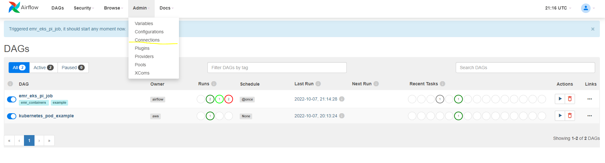
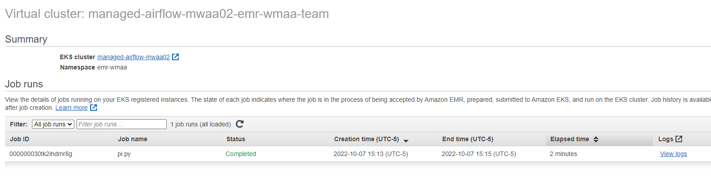

# Amazon Managed Workflows for Apache Airflow (MWAA)
Amazon Managed Workflows for Apache Airflow(MWAA)는 Apache Airflow를 위한 관리형 오케스트레이션 서비스로, 클라우드에서 대규모로 엔드투엔드 데이터 파이프라인을 더 쉽게 설정하고 운영할 수 있게 합니다. Apache Airflow는 "워크플로우"라고 하는 일련의 프로세스와 작업을 프로그래밍 방식으로 작성, 스케줄링 및 모니터링하는 데 사용되는 오픈소스 도구입니다. Managed Workflows를 사용하면 확장성, 가용성 및 보안을 위한 기본 인프라를 관리할 필요 없이 Airflow와 Python을 사용하여 워크플로우를 만들 수 있습니다.

이 예제는 [Amazon Managed Workflows for Apache Airflow(MWAA)](https://docs.aws.amazon.com/mwaa/latest/userguide/what-is-mwaa.html)를 사용하여 두 가지 방법으로 Amazon EKS에 작업을 할당하는 방법을 보여줍니다.
1. EKS에 직접 작업을 생성하고 배포합니다.
2. EKS를 EMR의 가상 클러스터로 등록하고 EMR on EKS에 spark 작업을 할당합니다.

이 예제의 [코드 저장소](https://github.com/awslabs/data-on-eks/tree/main/schedulers/terraform/managed-airflow-mwaa)입니다.

### 고려 사항

인프라를 프로비저닝하기 위한 Terraform 코드와 다른 수명주기를 가진 DAG 개발을 위해 requirements 동기화/dag 동기화 단계를 MWAA S3 버킷에 CI/CD 파이프라인의 일부로 추가하는 것이 이상적으로 권장됩니다.
단순화를 위해 `null_resource`에서 AWS CLI 명령을 실행하는 Terraform을 사용하여 해당 단계를 제공합니다.

## 사전 요구 사항:

다음 도구가 로컬에 설치되어 있는지 확인하세요:

1. [aws cli](https://docs.aws.amazon.com/cli/latest/userguide/install-cliv2.html)
2. [kubectl](https://Kubernetes.io/docs/tasks/tools/)
3. [terraform](https://learn.hashicorp.com/tutorials/terraform/install-cli)

## 배포

이 예제를 프로비저닝하려면:

```bash
git clone https://github.com/awslabs/data-on-eks.git
cd data-on-eks/schedulers/terraform/managed-airflow-mwaa
chmod +x install.sh
./install.sh
```

계속하려면 명령 프롬프트에서 리전을 입력합니다.

완료되면 아래와 같은 terraform output이 표시됩니다.


다음 구성 요소가 환경에 프로비저닝됩니다:
  - 샘플 VPC, 3개의 프라이빗 서브넷 및 3개의 퍼블릭 서브넷
  - 퍼블릭 서브넷용 인터넷 게이트웨이 및 프라이빗 서브넷용 NAT Gateway
  - 하나의 관리형 노드 그룹이 있는 EKS 클러스터 컨트롤 플레인
  - EKS 관리형 애드온: VPC_CNI, CoreDNS, Kube_Proxy, EBS_CSI_Driver
  - K8S metrics server 및 cluster autoscaler
  - 버전 2.2.2의 MWAA 환경
  - 새로 생성된 EKS에 등록된 EMR 가상 클러스터
  - DAG 코드가 있는 S3 버킷

## 확인

다음 명령은 로컬 머신의 `kubeconfig`를 업데이트하고 `kubectl`을 사용하여 EKS 클러스터와 상호 작용하여 배포를 확인할 수 있게 합니다.

### `update-kubeconfig` 명령 실행

아래 명령을 실행합니다. terraform output 'configure_kubectl'에서도 명령을 복사할 수 있습니다.
```bash
aws eks --region us-west-2 update-kubeconfig --name managed-airflow-mwaa
```

### 노드 목록 조회

```bash
kubectl get nodes

# 출력은 아래와 같아야 합니다
NAME                         STATUS   ROLES    AGE     VERSION
ip-10-0-0-42.ec2.internal    Ready    <none>   5h15m   v1.26.4-eks-0a21954
ip-10-0-22-71.ec2.internal   Ready    <none>   5h15m   v1.26.4-eks-0a21954
ip-10-0-44-63.ec2.internal   Ready    <none>   5h15m   v1.26.4-eks-0a21954
```

### EKS 클러스터의 네임스페이스 목록 조회

```bash
kubectl get ns

# 출력은 아래와 같아야 합니다
default           Active   4h38m
emr-mwaa          Active   4h34m
kube-node-lease   Active   4h39m
kube-public       Active   4h39m
kube-system       Active   4h39m
mwaa              Active   4h30m
```

`emr-mwaa` 네임스페이스는 EMR에서 spark 작업을 실행하는 데 사용됩니다.<br />
`mwaa` 네임스페이스는 MWAA에서 직접 사용됩니다.


## MWAA에서 작업 트리거

### Apache Airflow UI 로그인

- Amazon MWAA 콘솔에서 Environments 페이지를 엽니다.
- 환경을 선택합니다.
- `Details` 섹션에서 Airflow UI 링크를 클릭합니다.<br />

참고: 로그인하면 빨간색 오류 메시지가 표시됩니다. EMR 연결이 아직 설정되지 않았기 때문입니다. 아래 단계에 따라 연결을 설정하고 다시 로그인하면 메시지가 사라집니다.

### EMR on EKS에서 작업을 실행하기 위한 DAG 워크플로우 트리거

먼저 MWAA에서 EMR 가상 클러스터에 대한 연결을 설정해야 합니다.



- Add 버튼을 클릭합니다. <br />
- Connection Id로 `emr_eks`를 사용해야 합니다. <br />
- Connection Type으로 `Amazon Web Services`를 선택합니다. <br />
- terraform output을 기반으로 `Extra`의 값을 대체합니다. <br />
`{"virtual_cluster_id":"<terraform output의 emrcontainers_virtual_cluster_id>", "job_role_arn":"<terraform output의 emr_on_eks_role_arn>"}`


Airflow UI 메인 페이지로 돌아가서 예제 DAG `emr_eks_pi_job`을 활성화하고 작업을 트리거합니다.


실행되는 동안 다음 명령을 사용하여 spark 작업을 확인합니다:

```bash
kubectl get all -n emr-mwaa
```

다음과 유사한 출력이 표시됩니다:

```bash
NAME                                   READY   STATUS    RESTARTS   AGE
pod/000000030tk2ihdmr8g-psstj          3/3     Running   0          90s
pod/pythonpi-a8051f83b415c911-exec-1   2/2     Running   0          14s
pod/pythonpi-a8051f83b415c911-exec-2   2/2     Running   0          14s
pod/spark-000000030tk2ihdmr8g-driver   2/2     Running   0          56s

NAME                                                            TYPE        CLUSTER-IP   EXTERNAL-IP   PORT(S)                      AGE
service/spark-000000030tk2ihdmr8g-ee64be83b4151dd5-driver-svc   ClusterIP   None         <none>        7078/TCP,7079/TCP,4040/TCP   57s

NAME                            COMPLETIONS   DURATION   AGE
job.batch/000000030tk2ihdmr8g   0/1           92s        92s
```

Amazon EMR 콘솔에서도 작업 상태를 확인할 수 있습니다. `Virtual clusters` 섹션에서 Virtual cluster를 클릭합니다.



### EKS에서 작업을 실행하기 위한 DAG 워크플로우 트리거

Airflow UI에서 예제 DAG kubernetes_pod_example을 활성화한 다음 트리거합니다.


파드가 성공적으로 실행되었는지 확인합니다.

실행되고 성공적으로 완료된 후 다음 명령을 사용하여 파드를 확인합니다:

```bash
kubectl get pods -n mwaa
```

다음과 유사한 출력이 표시됩니다:

```bash
NAME                                             READY   STATUS      RESTARTS   AGE
mwaa-pod-test.4bed823d645844bc8e6899fd858f119d   0/1     Completed   0          25s
```

## 삭제

환경을 정리하려면 `cleanup.sh` 스크립트를 실행합니다.

```bash
chmod +x cleanup.sh
./cleanup.sh
```
---
