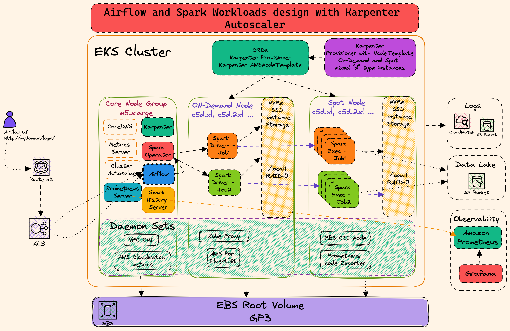
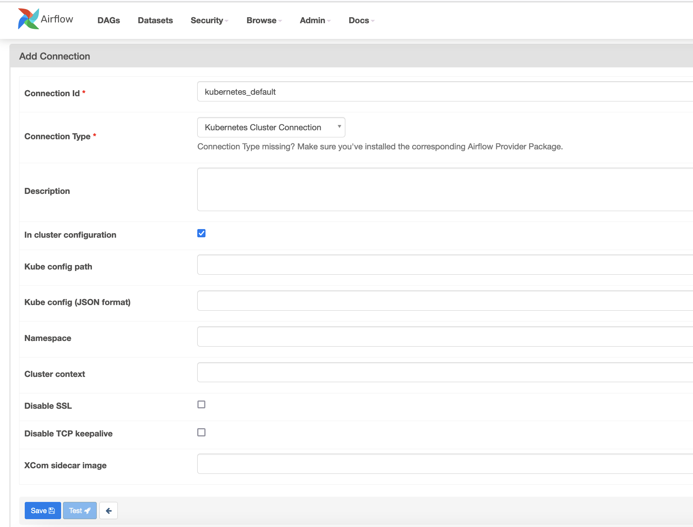

import Tabs from '@theme/Tabs';
import TabItem from '@theme/TabItem';
import CollapsibleContent from '@site/src/components/CollapsibleContent';

import CodeBlock from '@theme/CodeBlock';

# Amazon EKS에서 자체 관리형 Apache Airflow 배포

## 소개

이 패턴은 EKS에 자체 관리형 [Apache Airflow](https://airflow.apache.org/docs/apache-airflow/stable/) 배포를 구현합니다. 이 블루프린트는 Amazon EKS 관리형 노드 그룹에 Airflow를 배포하고 Karpenter를 활용하여 워크로드를 실행합니다.

**아키텍처**


이 패턴은 배포 경험을 단순하게 유지하면서도 배포 중에 필요한 애드온을 선택할 수 있는 유연성을 제공하는 독자적인 기본값을 사용합니다. 기본값을 유지하고 교체할 실행 가능한 대안 옵션이 있는 경우에만 사용자 지정하는 것이 좋습니다.

인프라 측면에서 이 패턴으로 생성되는 리소스는 다음과 같습니다:

- 퍼블릭 엔드포인트가 있는 EKS 클러스터 컨트롤 플레인(데모/poc 환경에 권장)
- 하나의 관리형 노드 그룹
  - Apache Airflow 및 기타 시스템 크리티컬 파드를 실행하기 위한 다중 AZ에 걸친 3개의 인스턴스가 있는 Core Node 그룹. 예: Cluster Autoscaler, CoreDNS, Observability, Logging 등

- Apache Airflow 핵심 구성 요소 (airflow-core.tf 포함):
  - Airflow 메타 데이터베이스용 Amazon RDS PostgreSQL 인스턴스 및 보안 그룹
  - Airflow 네임스페이스
  - Airflow Webserver, Airflow Scheduler, Airflow Worker를 위한 Kubernetes 서비스 계정 및 AWS IAM roles for service account(IRSA)
  - Airflow 파드를 위한 Airflow DAG 마운트용 Amazon Elastic File System(EFS), EFS 마운트, Kubernetes Storage Class for EFS, Kubernetes Persistent Volume Claim
  - Airflow 로그용 Amazon S3 로그 버킷

AWS for FluentBit이 로깅에 사용되며, Prometheus, Amazon Managed Prometheus, 오픈소스 Grafana 조합이 관찰성을 위해 사용됩니다. 아래에서 사용 가능한 애드온의 전체 목록을 볼 수 있습니다.
:::tip
이 패턴에서 제공하는 `core-node-group`과 같은 전용 EKS 관리형 노드그룹에서 모든 기본 시스템 애드온을 실행하는 것이 좋습니다.
:::
:::danger
중요 애드온(`Amazon VPC CNI`, `CoreDNS`, `Kube-proxy`)을 제거하는 것은 권장하지 않습니다.
:::
| 애드온 | 기본 활성화? | 이점 | 링크 |
| :---  | :----: | :---- | :---- |
| Amazon VPC CNI | Yes | VPC CNI는 [EKS 애드온](https://docs.aws.amazon.com/eks/latest/userguide/eks-networking-add-ons.html)으로 제공되며 spark 애플리케이션 파드를 위한 ENI 및 IPv4 또는 IPv6 주소 생성을 담당합니다 | [VPC CNI Documentation](https://docs.aws.amazon.com/eks/latest/userguide/managing-vpc-cni.html) |
| CoreDNS | Yes | CoreDNS는 [EKS 애드온](https://docs.aws.amazon.com/eks/latest/userguide/eks-networking-add-ons.html)으로 제공되며 spark 애플리케이션 및 Kubernetes 클러스터의 DNS 쿼리 해결을 담당합니다 | [EKS CoreDNS Documentation](https://docs.aws.amazon.com/eks/latest/userguide/managing-coredns.html) |
| Kube-proxy | Yes | Kube-proxy는 [EKS 애드온](https://docs.aws.amazon.com/eks/latest/userguide/eks-networking-add-ons.html)으로 제공되며 노드에서 네트워크 규칙을 유지하고 spark 애플리케이션 파드로의 네트워크 통신을 가능하게 합니다 | [EKS kube-proxy Documentation](https://docs.aws.amazon.com/eks/latest/userguide/managing-kube-proxy.html) |
| Amazon EBS CSI driver | Yes | EBS CSI driver는 [EKS 애드온](https://docs.aws.amazon.com/eks/latest/userguide/eks-add-ons.html)으로 제공되며 EKS 클러스터가 EBS 볼륨의 수명주기를 관리할 수 있게 합니다 | [EBS CSI Driver Documentation](https://docs.aws.amazon.com/eks/latest/userguide/ebs-csi.html)
| Amazon EFS CSI driver | Yes | Amazon EFS Container Storage Interface(CSI) driver는 AWS에서 실행되는 Kubernetes 클러스터가 Amazon EFS 파일 시스템의 수명주기를 관리할 수 있는 CSI 인터페이스를 제공합니다 | [EFS CSI Driver Documentation](https://docs.aws.amazon.com/eks/latest/userguide/efs-csi.html)
| Karpenter | Yes | Karpenter는 Kubernetes 클러스터에서 spark 애플리케이션을 위한 적시 컴퓨팅 용량을 제공하는 노드그룹 없는 오토스케일러입니다 | [Karpenter Documentation](https://karpenter.sh/) |
| Cluster Autoscaler | Yes | Kubernetes Cluster Autoscaler는 클러스터의 노드그룹(예: `core-node-group`) 스케일링에 사용 가능하며 Kubernetes 클러스터의 크기를 자동으로 조정합니다 | [Cluster Autoscaler Documentation](https://github.com/kubernetes/autoscaler/blob/master/cluster-autoscaler/cloudprovider/aws/README.md) |
| Cluster proportional autoscaler | Yes | Kubernetes 클러스터에서 CoreDNS 파드 스케일링을 담당합니다 | [Cluster Proportional Autoscaler Documentation](https://github.com/kubernetes-sigs/cluster-proportional-autoscaler) |
| Metrics server | Yes | Kubernetes metrics server는 클러스터 내에서 cpu, 메모리 및 기타 컨테이너 리소스 사용량을 집계하는 역할을 합니다 | [EKS Metrics Server Documentation](https://docs.aws.amazon.com/eks/latest/userguide/metrics-server.html) |
| Prometheus | Yes | Prometheus는 EKS 클러스터 내의 spark 애플리케이션을 포함한 EKS 클러스터 모니터링을 담당합니다. Amazon Managed Prometheus와 Kubecost로 메트릭을 스크래핑하고 수집하기 위해 Prometheus 배포를 사용합니다 | [Prometheus Documentation](https://prometheus.io/docs/introduction/overview/) |
| Amazon Managed Prometheus | Yes | EKS 클러스터 및 spark 애플리케이션 메트릭의 저장 및 스케일링을 담당합니다 | [Amazon Managed Prometheus Documentation](https://docs.aws.amazon.com/prometheus/latest/userguide/what-is-Amazon-Managed-Service-Prometheus.html) |
| Kubecost | Yes | Kubecost는 Spark 애플리케이션별 비용 분석을 제공하는 역할을 합니다. 작업별, 네임스페이스별 또는 레이블별로 비용을 모니터링할 수 있습니다 | [EKS Kubecost Documentation](https://docs.aws.amazon.com/eks/latest/userguide/cost-monitoring.html) |
| CloudWatch metrics | Yes | CloudWatch container insights metrics는 CloudWatch 대시보드에서 AWS 리소스뿐만 아니라 EKS 리소스도 모니터링하는 간단하고 표준화된 방법을 제공합니다 | [CloudWatch Container Insights Documentation](https://docs.aws.amazon.com/AmazonCloudWatch/latest/monitoring/Container-Insights-metrics-EKS.html) |
|AWS for Fluent-bit | Yes | EKS 클러스터 및 워커 노드 로그를 CloudWatch Logs 또는 타사 로깅 시스템에 게시하는 데 사용할 수 있습니다 | [AWS For Fluent-bit Documentation](https://github.com/aws/aws-for-fluent-bit) |
| AWS Load Balancer Controller | Yes | AWS Load Balancer Controller는 Kubernetes 클러스터를 위한 AWS Elastic Load Balancers를 관리합니다 | [AWS Load Balancer Controller Documentation](https://docs.aws.amazon.com/eks/latest/userguide/aws-load-balancer-controller.html) |

## 사전 요구 사항

다음 도구가 로컬 머신에 설치되어 있는지 확인하세요.

1. [aws cli](https://docs.aws.amazon.com/cli/latest/userguide/install-cliv2.html)
2. [kubectl](https://Kubernetes.io/docs/tasks/tools/)
3. [terraform](https://learn.hashicorp.com/tutorials/terraform/install-cli)

## 솔루션 배포

저장소 복제

```bash
git clone https://github.com/awslabs/data-on-eks.git
```

self-managed-airflow 디렉토리로 이동하고 install.sh 스크립트 실행

```bash
cd data-on-eks/schedulers/terraform/self-managed-airflow
chmod +x install.sh
./install.sh
```

## 리소스 확인

### kubectl config 생성

AWS 리전 플레이스홀더를 업데이트하고 아래 명령을 실행합니다.

```bash
mv ~/.kube/config ~/.kube/config.bk
aws eks update-kubeconfig --region <region>  --name self-managed-airflow
```

### EKS 클러스터 설명

```bash
aws eks describe-cluster --name self-managed-airflow
```

### 이 배포로 생성된 EFS PV 및 PVC 확인

```bash
kubectl get pvc -n airflow

NAME           STATUS   VOLUME                                     CAPACITY   ACCESS MODES   STORAGECLASS   AGE
airflow-dags   Bound    pvc-157cc724-06d7-4171-a14d-something   10Gi       RWX            efs-sc         73m

kubectl get pv -n airflow
NAME                                       CAPACITY   ACCESS MODES   RECLAIM POLICY   STATUS   CLAIM                          STORAGECLASS   REASON   AGE
pvc-157cc724-06d7-4171-a14d-something   10Gi       RWX            Delete           Bound    airflow/airflow-dags           efs-sc                  74m

```

### EFS 파일시스템 확인

```bash
aws efs describe-file-systems --query "FileSystems[*].FileSystemId" --output text
```
### Airflow 로그용으로 생성된 S3 버킷 확인

```bashell
aws s3 ls | grep airflow-logs-
```

### Airflow 배포 확인

```bashell
kubectl get deployment -n airflow

NAME                READY   UP-TO-DATE   AVAILABLE   AGE
airflow-pgbouncer   1/1     1            1           77m
airflow-scheduler   2/2     2            2           77m
airflow-statsd      1/1     1            1           77m
airflow-triggerer   1/1     1            1           77m
airflow-webserver   2/2     2            2           77m

```

### Postgres RDS 비밀번호 가져오기

Amazon Postgres RDS 데이터베이스 비밀번호는 Secrets manager에서 가져올 수 있습니다.

- AWS 콘솔에 로그인하고 secrets manager를 엽니다.
- `postgres` secret name을 클릭합니다.
- Retrieve secret value 버튼을 클릭하여 Postgres DB 마스터 비밀번호를 확인합니다.

### Airflow Web UI 로그인

이 배포는 데모 목적으로 public LoadBalancer(internal # Private Load Balancer는 VPC 내에서만 액세스 가능)가 있는 Ingress 객체를 생성합니다.
프로덕션 워크로드의 경우 `airflow-values.yaml`을 수정하여 `internal` LB를 선택할 수 있습니다. 또한 HTTPS 포트에서 Airflow에 액세스하기 위해 Airflow 도메인용 Route53과 인증서 생성용 ACM을 사용하는 것이 좋습니다.

ALB DNS 이름을 가져오려면 다음 명령을 실행합니다.

```bash
kubectl get ingress -n airflow

NAME                      CLASS   HOSTS   ADDRESS                                                                PORTS   AGE
airflow-airflow-ingress   alb     *       k8s-dataengineering-c92bfeb177-randomnumber.us-west-2.elb.amazonaws.com   80      88m

```

위 ALB URL은 배포에 따라 다릅니다. 따라서 본인의 URL을 사용하여 브라우저에서 엽니다.

예: 브라우저에서 `http://k8s-dataengineering-c92bfeb177-randomnumber.us-west-2.elb.amazonaws.com/` URL 열기


기본적으로 Airflow는 `admin` 사용자와 비밀번호 `admin`으로 기본 사용자를 생성합니다.

Admin 사용자와 비밀번호로 로그인하고 Admin 및 Viewer 역할에 대한 새 사용자를 만든 후 기본 admin 사용자를 삭제합니다.

### 샘플 Airflow Job 실행

- Airflow WebUI에 로그인합니다.
- 페이지 상단의 `DAGs` 링크를 클릭합니다. GitSync 기능으로 미리 생성된 dag가 표시됩니다.
- 재생 버튼(`>`)을 클릭하여 hello_world_scheduled_dag DAG를 실행합니다.
- `Graph` 링크에서 DAG 실행을 확인합니다.
- 몇 분 후 모든 Task가 녹색으로 변합니다.
- 녹색 Task 중 하나를 클릭하면 S3를 가리키는 로그를 확인할 수 있는 로그 링크가 있는 팝업이 열립니다.

<CollapsibleContent header={<h2><span>Karpenter로 Spark 워크로드를 실행하는 Airflow</span></h2>}>



이 옵션은 Karpenter를 오토스케일러로 활용하여 Managed Node Groups 및 Cluster Autoscaler의 필요성을 제거합니다. 이 설계에서 Karpenter와 해당 Nodepool은 사용자 요구에 따라 인스턴스 유형을 동적으로 선택하여 온디맨드 및 스팟 인스턴스를 모두 생성하는 역할을 합니다. Karpenter는 Cluster Autoscaler에 비해 더 효율적인 노드 스케일링과 더 빠른 응답 시간으로 향상된 성능을 제공합니다. Karpenter의 주요 기능에는 0부터 스케일링하는 기능이 포함되어 리소스에 대한 수요가 없을 때 리소스 활용을 최적화하고 비용을 줄입니다. 또한 Karpenter는 컴퓨팅, 메모리, GPU 집약적 작업과 같은 다양한 워크로드 유형에 필요한 인프라를 정의하는 데 더 큰 유연성을 허용하는 여러 Nodepool을 지원합니다. 또한 Karpenter는 Kubernetes와 원활하게 통합되어 관찰된 워크로드와 스케일링 이벤트를 기반으로 클러스터 크기를 자동으로 실시간 조정합니다. 이를 통해 Spark 애플리케이션 및 기타 워크로드의 끊임없이 변화하는 요구에 적응하는 더 효율적이고 비용 효율적인 EKS 클러스터 설계가 가능합니다.

이 튜토리얼에서는 메모리 최적화 인스턴스를 사용하는 Karpenter Nodepool을 사용합니다. 이 템플릿은 Userdata가 있는 AWS Node 템플릿을 사용합니다.

<details>
<summary> 메모리 최적화 인스턴스용 Karpenter Nodepool을 보려면 클릭하여 내용을 토글하세요!</summary>

```yaml
    name: spark-compute-optimized
      clusterName: ${module.eks.cluster_name}
      ec2NodeClass:
        karpenterRole: ${split("/", module.eks_blueprints_addons.karpenter.node_iam_role_arn)[1]}
        subnetSelectorTerms:
          tags:
            Name: "${module.eks.cluster_name}-private*"
        securityGroupSelectorTerms:
          tags:
            Name: ${module.eks.cluster_name}-node
        userData: |
          MIME-Version: 1.0
          Content-Type: multipart/mixed; boundary="BOUNDARY"

          --BOUNDARY
          Content-Type: text/x-shellscript; charset="us-ascii"

          cat <<-EOF > /etc/profile.d/bootstrap.sh
          #!/bin/sh


          # Configure the NVMe volumes in RAID0 configuration in the bootstrap.sh call.
          # https://github.com/awslabs/amazon-eks-ami/blob/master/files/bootstrap.sh#L35
          # This will create a RAID volume and mount it at /mnt/k8s-disks/0
          #   then mount that volume to /var/lib/kubelet, /var/lib/containerd, and /var/log/pods
          #   this allows the container daemons and pods to write to the RAID0 by default without needing PersistentVolumes
          export LOCAL_DISKS='raid0'
          EOF

          # Source extra environment variables in bootstrap script
          sed -i '/^set -o errexit/a\\nsource /etc/profile.d/bootstrap.sh' /etc/eks/bootstrap.sh

          --BOUNDARY--

      nodePool:
        labels:
          - type: karpenter
          - NodeGroupType: SparkComputeOptimized
          - multiArch: Spark
        requirements:
          - key: "karpenter.sh/capacity-type"
            operator: In
            values: ["spot", "on-demand"]
          - key: "kubernetes.io/arch"
            operator: In
            values: ["amd64"]
          - key: "karpenter.k8s.aws/instance-category"
            operator: In
            values: ["c"]
          - key: "karpenter.k8s.aws/instance-family"
            operator: In
            values: ["c5d"]
          - key: "karpenter.k8s.aws/instance-cpu"
            operator: In
            values: ["4", "8", "16", "36"]
          - key: "karpenter.k8s.aws/instance-hypervisor"
            operator: In
            values: ["nitro"]
          - key: "karpenter.k8s.aws/instance-generation"
            operator: Gt
            values: ["2"]
        limits:
          cpu: 20 # Change this to 1000 or more for production according to your needs
        disruption:
          consolidationPolicy: WhenEmpty
          consolidateAfter: 30s
          expireAfter: 720h
        weight: 100
```
</details>

이 Nodepool을 사용할 수 있는 Spark Job을 실행하려면 Spark Application 매니페스트에 `tolerations`를 추가하여 작업을 제출해야 합니다. 또한 Spark Driver 파드가 `On-Demand` 노드에서만 실행되고 Spark Executor가 `Spot` 노드에서만 실행되도록 하려면 `karpenter.sh/capacity-type` 노드 선택기를 추가합니다.

예를 들어,

```yaml
    # Using Karpenter Nodepool nodeSelectors and tolerations
    nodeSelector:
      NodeGroupType: "SparkComputeOptimized"
      karpenter.sh/capacity-type: "on-demand"
    tolerations:
      - key: "spark-compute-optimized"
        operator: "Exists"
        effect: "NoSchedule"
```

### Airflow Web UI에서 Kubernetes Default Connection 생성

이 단계는 Airflow가 EKS 클러스터에 연결하기 위해 작성하는 데 중요합니다.

- ALB URL을 사용하여 `admin`과 비밀번호 `admin`으로 Airflow WebUI에 로그인합니다.
- `Admin` 드롭다운을 선택하고 `Connections`를 클릭합니다.
- "+" 버튼을 클릭하여 새 레코드를 추가합니다.
- Connection Id로 `kubernetes_default`, Connection Type으로 `Kubernetes Cluster Connection`을 입력하고 **In cluster configuration** 체크박스를 선택합니다.
- Save 버튼을 클릭합니다.



airflow 디렉토리로 이동하고 **variable.tf**에서 **enable_airflow_spark_example** 변수를 `true`로 변경합니다.

```bash
cd schedulers/terraform/self-managed-airflow
```

```yaml
variable "enable_airflow_spark_example" {
  description = "Enable Apache Airflow and Spark Operator example"
  type        = bool
  default     = true
}
```

**addons.tf**에서 **enable_spark_operator** 변수를 `true`로 변경합니다.

```yaml
variable "enable_airflow_spark_example" {
  description = "Enable Apache Airflow and Spark Operator example"
  type        = bool
  default     = true
}
```

install.sh 스크립트 실행
```bash
cd data-on-eks/schedulers/terraform/self-managed-airflow
chmod +x install.sh
./install.sh
```

### 샘플 Spark Job DAG 실행

- Airflow WebUI에 로그인합니다.
- 페이지 상단의 `DAGs` 링크를 클릭합니다. GitSync 기능으로 미리 생성된 dag가 표시됩니다.
- 재생 버튼(`>`)을 클릭하여 `example_pyspark_pi_job` DAG를 실행합니다.

<details>
<summary> 예제 DAG를 보려면 클릭하여 내용을 토글하세요!</summary>

```python
"""
from __future__ import annotations

import os
from datetime import datetime, timedelta

# [START import_module]
# The DAG object; we'll need this to instantiate a DAG
from airflow import DAG

# Operators; we need this to operate!
from airflow.providers.cncf.kubernetes.operators.spark_kubernetes import SparkKubernetesOperator
from airflow.providers.cncf.kubernetes.sensors.spark_kubernetes import SparkKubernetesSensor

# [END import_module]

# [START instantiate_dag]

DAG_ID = "example_pyspark_pi_job"

with DAG(
    DAG_ID,
    default_args={"max_active_runs": 1},
    description="submit spark-pi as sparkApplication on kubernetes",
    schedule=timedelta(days=1),
    start_date=datetime(2021, 1, 1),
    catchup=False,
) as dag:
    # [START SparkKubernetesOperator_DAG]
    t1 = SparkKubernetesOperator(
        task_id="pyspark_pi_submit",
        namespace="spark-team-a",
        application_file="example_pyspark_pi_job.yaml",
        do_xcom_push=True,
        dag=dag,
    )

    t2 = SparkKubernetesSensor(
        task_id="pyspark_pi_monitor",
        namespace="spark-team-a",
        application_name="{{ task_instance.xcom_pull(task_ids='pyspark_pi_submit')['metadata']['name'] }}",
        dag=dag,
    )
    t1 >> t2
```
</details>

- DAG에는 두 개의 task가 있으며, 첫 번째 task는 샘플 SparkApplication `example_pyspark_pi_job.yaml` 파일을 사용하는 `SparkKubernetesOperator`입니다. SparkKubernetesOperator task는 `airflow` 네임스페이스에 Airflow 워커 파드를 생성합니다. Airflow 워커는 `spark-operator` 네임스페이스에 사전 설치된 Kubernetes Spark Operator를 트리거합니다. 그런 다음 Kubernetes Spark Operator는 `example_pyspark_pi_job.yaml`을 사용하여 `On-Demand` 노드에 Spark Driver를, `Spot` 노드에 Spark Executor를 `spark-team-a` 네임스페이스에 시작하고 Pi 값을 계산하는 PySpark 작업을 제출합니다.

<details>
<summary> tolerations 및 node selectors가 있는 샘플 SparkApplication을 보려면 클릭하여 내용을 토글하세요!</summary>

```yaml
# NOTE: This example requires the following prerequisites before executing the jobs
# 1. Ensure spark-team-a name space exists

---
apiVersion: "sparkoperator.k8s.io/v1beta2"
kind: SparkApplication
metadata:
  name: pyspark-pi-karpenter
  namespace: spark-team-a
spec:
  type: Python
  pythonVersion: "3"
  mode: cluster
  image: "public.ecr.aws/r1l5w1y9/spark-operator:3.2.1-hadoop-3.3.1-java-11-scala-2.12-python-3.8-latest"
  imagePullPolicy: Always
  mainApplicationFile: local:///opt/spark/examples/src/main/python/pi.py
  sparkVersion: "3.1.1"
  restartPolicy:
    type: OnFailure
    onFailureRetries: 1
    onFailureRetryInterval: 10
    onSubmissionFailureRetries: 5
    onSubmissionFailureRetryInterval: 20
  driver:
    cores: 1
    coreLimit: "1200m"
    memory: "512m"
    labels:
      version: 3.1.1
    serviceAccount: spark-team-a
    # Using Karpenter Nodepool nodeSelectors and tolerations
    nodeSelector:
      NodeGroupType: "SparkComputeOptimized"
      karpenter.sh/capacity-type: "on-demand"
    tolerations:
      - key: "spark-compute-optimized"
        operator: "Exists"
        effect: "NoSchedule"
  executor:
    cores: 1
    instances: 2
    memory: "512m"
    serviceAccount: spark-team-a
    labels:
      version: 3.1.1
    # Using Karpenter Nodepool nodeSelectors and tolerations
    nodeSelector:
      NodeGroupType: "SparkComputeOptimized"
      karpenter.sh/capacity-type: "spot"
    tolerations:
      - key: "spark-compute-optimized"
        operator: "Exists"
        effect: "NoSchedule"

```
</details>

- 두 번째 task는 Kubernetes Spark Operator가 실행을 완료할 때까지 기다리는 `SparkKubernetesSensor`입니다.
- `Graph` 링크에서 DAG 실행을 확인합니다.
- 몇 분 후 모든 Task가 녹색으로 변합니다.
- 녹색 Task 중 하나를 클릭하면 S3를 가리키는 로그를 확인할 수 있는 로그 링크가 있는 팝업이 열립니다.

</CollapsibleContent>

<CollapsibleContent header={<h2><span>정리</span></h2>}>

이 스크립트는 `-target` 옵션을 사용하여 모든 리소스가 올바른 순서로 삭제되도록 환경을 정리합니다.

```bash
cd data-on-eks/schedulers/terraform/self-managed-airflow && chmod +x cleanup.sh
./cleanup.sh
```

</CollapsibleContent>

:::caution
AWS 계정에 원치 않는 요금이 부과되지 않도록 이 배포 중에 생성된 모든 AWS 리소스를 삭제하세요
:::
