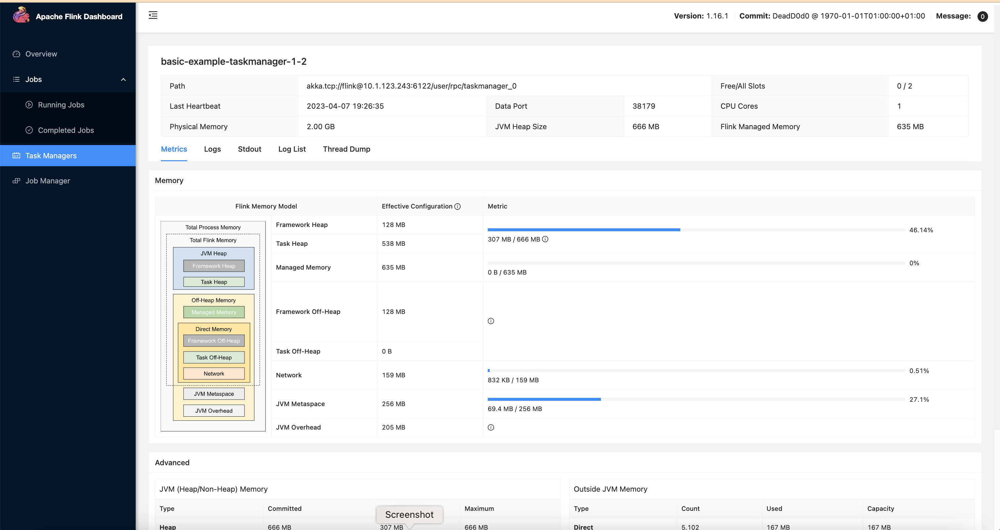

import Tabs from '@theme/Tabs';
import TabItem from '@theme/TabItem';
import CollapsibleContent from '@site/src/components/CollapsibleContent';

:::info
현재 다양한 커넥터를 활용한 Flink 예제, WebUI용 Ingress, Grafana 대시보드 등 더 많은 기능을 이 블루프린트에 추가하는 작업을 진행 중입니다.
:::

## Apache Flink 소개
[Apache Flink](https://flink.apache.org/)는 대량의 데이터를 처리하도록 설계된 오픈소스 통합 스트림 처리 및 배치 처리 프레임워크입니다. 내결함성과 exactly-once 시맨틱스를 갖춘 빠르고 안정적이며 확장 가능한 데이터 처리를 제공합니다.
Flink의 주요 기능은 다음과 같습니다:
- **분산 처리(Distributed Processing)**: Flink는 대량의 데이터를 분산 방식으로 처리하도록 설계되어 수평적 확장이 가능하고 내결함성을 제공합니다.
- **스트림 처리 및 배치 처리(Stream Processing and Batch Processing)**: Flink는 스트림 처리와 배치 처리 모두를 위한 API를 제공합니다. 이는 데이터가 생성되는 대로 실시간으로 처리하거나 배치로 처리할 수 있음을 의미합니다.
- **내결함성(Fault Tolerance)**: Flink는 노드 장애, 네트워크 파티션 및 기타 유형의 장애를 처리하기 위한 내장 메커니즘을 갖추고 있습니다.
- **Exactly-once 시맨틱스(Exactly-once Semantics)**: Flink는 장애가 발생하더라도 각 레코드가 정확히 한 번만 처리되도록 보장하는 exactly-once 처리를 지원합니다.
- **저지연(Low Latency)**: Flink의 스트리밍 엔진은 저지연 처리에 최적화되어 있어 실시간 데이터 처리가 필요한 사용 사례에 적합합니다.
- **확장성(Extensibility)**: Flink는 풍부한 API와 라이브러리 세트를 제공하여 특정 사용 사례에 맞게 쉽게 확장하고 커스터마이징할 수 있습니다.

## 아키텍처

EKS를 활용한 Flink 아키텍처 고수준 설계입니다.


## EMR on EKS Flink Kubernetes Operator
Amazon EMR 6.13.0 이상 릴리스는 Amazon EMR on EKS with Apache Flink 또는 를 Amazon EMR on EKS의 작업 제출 모델로 지원합니다. Amazon EMR on EKS with Apache Flink를 사용하면 자체 Amazon EKS 클러스터에서 Amazon EMR 릴리스 런타임으로 Flink 애플리케이션을 배포하고 관리할 수 있습니다. Amazon EKS 클러스터에 Flink Kubernetes operator를 배포하면 operator를 통해 직접 Flink 애플리케이션을 제출할 수 있습니다. operator는 Flink 애플리케이션의 수명주기를 관리합니다.
1. 애플리케이션 실행, 일시 중지 및 삭제
2. 상태 유지(Stateful) 및 무상태(Stateless) 애플리케이션 업그레이드
3. 세이브포인트(Savepoint) 트리거 및 관리
4. 오류 처리, 실패한 업그레이드 롤백

위 기능 외에도 EMR Flink Kubernetes operator는 다음과 같은 추가 기능을 제공합니다:
1. Amazon S3의 jar를 사용한 Flink 애플리케이션 실행
2. Amazon S3 및 Amazon CloudWatch와의 모니터링 통합 및 컨테이너 로그 로테이션
3. 관찰된 메트릭의 과거 추세를 기반으로 Autoscaler 구성 자동 튜닝
4. 스케일링 또는 장애 복구 중 더 빠른 Flink Job 재시작
5. IRSA(IAM Roles for Service Accounts) 네이티브 통합
6. Pyflink 지원


Flink Operator는 Kubernetes API의 확장인 두 가지 유형의 커스텀 리소스(CR)를 정의합니다.

<Tabs>
<TabItem value="FlinkDeployment" label="FlinkDeployment">


**FlinkDeployment**
- FlinkDeployment CR은 **Flink Application** 및 **Session Cluster** 배포를 정의합니다.
- Application 배포는 Application 모드에서 전용 Flink 클러스터에 단일 작업 배포를 관리합니다.
- Session 클러스터는 기존 Session 클러스터에서 여러 Flink Job을 실행할 수 있게 합니다.

    <details>
    <summary>Application 모드의 FlinkDeployment, 클릭하여 내용 토글!</summary>

    ```yaml
    apiVersion: flink.apache.org/v1beta1
    kind: FlinkDeployment
    metadata:
    namespace: default
    name: basic-example
    spec:
    image: flink:1.16
    flinkVersion: v1_16
    flinkConfiguration:
        taskmanager.numberOfTaskSlots: "2"
    serviceAccount: flink
    jobManager:
        resource:
        memory: "2048m"
        cpu: 1
    taskManager:
        resource:
        memory: "2048m"
        cpu: 1
    job:
        jarURI: local:///opt/flink/examples/streaming/StateMachineExample.jar
        parallelism: 2
        upgradeMode: stateless
        state: running
    ```
    </details>

</TabItem>

<TabItem value="FlinkSessionJob" label="FlinkSessionJob">

**FlinkSessionJob**
- `FlinkSessionJob` CR은 **Session cluster**에서 세션 작업을 정의하며, 각 Session 클러스터는 여러 `FlinkSessionJob`을 실행할 수 있습니다.
- Session 배포는 작업 관리 없이 Flink Session 클러스터를 관리합니다.

    <details>
    <summary>기존 "basic-session-cluster" 세션 클러스터 배포를 사용하는 FlinkSessionJob</summary>

    ```yaml
    apiVersion: flink.apache.org/v1beta1
    kind: FlinkSessionJob
    metadata:
    name: basic-session-job-example
    spec:
    deploymentName: basic-session-cluster
    job:
        jarURI: https://repo1.maven.org/maven2/org/apache/flink/flink-examples-streaming_2.12/1.15.3/flink-examples-streaming_2.12-1.15.3-TopSpeedWindowing.jar
        parallelism: 4
        upgradeMode: stateless
    ```

    </details>

</TabItem>
</Tabs>

:::info
Session 클러스터는 yaml 스펙에서 `job`이 정의되지 않는다는 점만 제외하면 Application 클러스터와 유사한 스펙을 사용합니다.
:::

:::info
Flink 문서에 따르면 프로덕션 환경에서는 Application 모드의 FlinkDeployment를 사용하는 것이 권장됩니다.
:::

배포 유형 외에도 Flink Kubernetes Operator는 두 가지 배포 모드를 지원합니다: `Native`와 `Standalone`.

<Tabs>
<TabItem value="Native" label="Native">

**Native**

- Native 클러스터 배포는 기본 배포 모드이며 클러스터 배포 시 Flink의 내장 Kubernetes 통합을 사용합니다.
- Flink 클러스터는 Kubernetes와 직접 통신하여 Kubernetes 리소스를 관리할 수 있습니다. 예를 들어 TaskManager 파드를 동적으로 할당하고 해제할 수 있습니다.
- Flink Native는 자체 클러스터 관리 시스템을 구축하거나 기존 관리 시스템과 통합하려는 고급 사용자에게 유용할 수 있습니다.
- Flink Native는 작업 스케줄링 및 실행 측면에서 더 많은 유연성을 제공합니다.
- 표준 Operator 사용의 경우 Native 모드에서 자체 Flink Job을 실행하는 것이 권장됩니다.

```yaml
apiVersion: flink.apache.org/v1beta1
kind: FlinkDeployment
...
spec:
...
mode: native
```
</TabItem>

<TabItem value="Standalone" label="Standalone">

**Standalone**

- Standalone 클러스터 배포는 단순히 Kubernetes를 Flink 클러스터가 실행되는 오케스트레이션 플랫폼으로 사용합니다.
- Flink는 Kubernetes에서 실행 중임을 인식하지 못하므로 모든 Kubernetes 리소스는 Kubernetes Operator에 의해 외부에서 관리되어야 합니다.

    ```yaml
    apiVersion: flink.apache.org/v1beta1
    kind: FlinkDeployment
    ...
    spec:
    ...
    mode: standalone
    ```

</TabItem>
</Tabs>

## Kubernetes에서 Flink Job 실행을 위한 모범 사례
Kubernetes에서 Flink를 최대한 활용하기 위해 따라야 할 모범 사례는 다음과 같습니다:

- **Kubernetes Operator 사용**: Kubernetes에서 Flink 클러스터의 배포 및 관리를 자동화하기 위해 Flink Kubernetes Operator를 설치하고 사용하세요.
- **전용 네임스페이스에 배포**: Flink Kubernetes Operator용 별도 네임스페이스와 Flink 작업/워크로드용 별도 네임스페이스를 생성하세요. 이렇게 하면 Flink 작업이 격리되고 자체 리소스를 갖게 됩니다.
- **고품질 스토리지 사용**: Flink 체크포인트(checkpoint)와 세이브포인트(savepoint)를 Amazon S3 또는 기타 내구성 있는 외부 스토리지와 같은 고품질 스토리지에 저장하세요. 이러한 스토리지 옵션은 대량의 데이터에 대해 안정적이고 확장 가능하며 내구성을 제공합니다.
- **리소스 할당 최적화**: 최적의 성능을 보장하기 위해 Flink 작업에 충분한 리소스를 할당하세요. Flink 컨테이너에 대한 리소스 요청 및 제한을 설정하여 이를 수행할 수 있습니다.
- **적절한 네트워크 격리**: Kubernetes Network Policy를 사용하여 동일한 Kubernetes 클러스터에서 실행되는 다른 워크로드로부터 Flink 작업을 격리하세요. 이렇게 하면 Flink 작업이 다른 워크로드의 영향을 받지 않고 필요한 네트워크 액세스를 갖게 됩니다.
- **Flink 최적 구성**: 사용 사례에 따라 Flink 설정을 튜닝하세요. 예를 들어, 입력 데이터 크기에 따라 Flink 작업이 적절하게 확장되도록 Flink의 병렬 처리 설정을 조정하세요.
- **체크포인트와 세이브포인트 사용**: Flink 애플리케이션 상태의 주기적인 스냅샷을 위해 체크포인트를 사용하고, 애플리케이션 업그레이드 또는 다운그레이드와 같은 고급 사용 사례를 위해 세이브포인트를 사용하세요.
- **체크포인트와 세이브포인트를 올바른 위치에 저장**: 체크포인트는 Amazon S3 또는 기타 내구성 있는 외부 스토리지와 같은 분산 파일 시스템 또는 키-값 저장소에 저장하세요. 세이브포인트는 Amazon S3와 같은 내구성 있는 외부 스토리지에 저장하세요.

## Flink 업그레이드
Flink Operator는 Flink 작업에 대해 세 가지 업그레이드 모드를 제공합니다. 최신 정보는 [Flink 업그레이드 문서](https://nightlies.apache.org/flink/flink-kubernetes-operator-docs-main/docs/custom-resource/job-management/#stateful-and-stateless-application-upgrades)를 확인하세요.

1. **stateless**: 빈 상태에서 무상태 애플리케이션 업그레이드
2. **last-state**: 모든 애플리케이션 상태에서 빠른 업그레이드(실패한 작업에도 해당), 항상 최신 체크포인트 정보를 사용하므로 정상적인 작업이 필요하지 않습니다. HA 메타데이터가 손실되면 수동 복구가 필요할 수 있습니다.
3. **savepoint**: 업그레이드에 세이브포인트를 사용하여 최대 안전성과 백업/포크 포인트로 사용할 수 있는 가능성을 제공합니다. 세이브포인트는 업그레이드 프로세스 중에 생성됩니다. 세이브포인트가 생성되려면 Flink 작업이 실행 중이어야 합니다. 작업이 비정상 상태인 경우 마지막 체크포인트가 사용됩니다(kubernetes.operator.job.upgrade.last-state-fallback.enabled가 false로 설정되지 않은 경우). 마지막 체크포인트를 사용할 수 없는 경우 작업 업그레이드가 실패합니다.

:::info
프로덕션 환경에서는 `last-state` 또는 `savepoint` 모드가 권장됩니다.
:::


<CollapsibleContent header={<h2><span>솔루션 배포</span></h2>}>

이 [예제](https://github.com/awslabs/data-on-eks/tree/main/streaming/emr-eks-flink)에서는 Flink Operator와 Apache YuniKorn으로 Flink Job을 실행하는 데 필요한 다음 리소스를 프로비저닝합니다.

이 예제는 새로운 VPC에 Flink Operator를 실행하는 EKS 클러스터를 배포합니다.

- 새 샘플 VPC, 2개의 프라이빗 서브넷 및 2개의 퍼블릭 서브넷 생성
- 퍼블릭 서브넷용 인터넷 게이트웨이 및 프라이빗 서브넷용 NAT Gateway 생성
- 퍼블릭 엔드포인트(데모 목적으로만)를 가진 EKS 클러스터 컨트롤 플레인과 코어 관리형 노드 그룹, Flink 워크로드용 온디맨드 노드 그룹 및 Spot 노드 그룹 생성
- Metrics server, Cluster Autoscaler, Apache YuniKorn, Karpenter, Grafana, AMP 및 Prometheus server 배포
- Cert Manager 및 EMR Flink Operator 배포. Flink Operator는 Cert Manager에 의존합니다.
- 네임스페이스, IRSA, Role 및 Role binding을 포함하는 새 Flink Data team 리소스 생성
- flink-compute-optimized 유형을 위한 Karpenter provisioner 배포

### 사전 요구 사항

다음 도구가 로컬 머신에 설치되어 있는지 확인하세요.

1. [aws cli](https://docs.aws.amazon.com/cli/latest/userguide/install-cliv2.html)
2. [kubectl](https://Kubernetes.io/docs/tasks/tools/)
3. [terraform](https://learn.hashicorp.com/tutorials/terraform/install-cli)

### 배포

저장소를 복제합니다.

```bash
git clone https://github.com/awslabs/data-on-eks.git
```

Flink의 Terraform 템플릿 디렉토리로 이동하고 `install.sh` 스크립트를 실행합니다.

```bash
cd data-on-eks/streaming/emr-flink-eks
chmod +x install.sh
./install.sh
```
클러스터 상태 확인

```bash
    ➜ kubectl get nodes -A
    NAME                                         STATUS   ROLES    AGE   VERSION
    ip-10-1-160-150.us-west-2.compute.internal   Ready    <none>   24h   v1.24.11-eks-a59e1f0
    ip-10-1-169-249.us-west-2.compute.internal   Ready    <none>   6d    v1.24.11-eks-a59e1f0
    ip-10-1-69-244.us-west-2.compute.internal    Ready    <none>   6d    v1.24.11-eks-a59e1f0

    ➜  ~ kubectl get pods -n flink-kubernetes-operator-ns
    NAME                                         READY   STATUS    RESTARTS   AGE
    flink-kubernetes-operator-555776785f-pzx8p   2/2     Running   0          4h21m
    flink-kubernetes-operator-555776785f-z5jpt   2/2     Running   0          4h18m

    ➜  ~ kubectl get pods -n cert-manager
    NAME                                      READY   STATUS    RESTARTS   AGE
    cert-manager-77fc7548dc-dzdms             1/1     Running   0          24h
    cert-manager-cainjector-8869b7ff7-4w754   1/1     Running   0          24h
    cert-manager-webhook-586ddf8589-g6s87     1/1     Running   0          24h
```

이 네임스페이스를 사용하여 Flink team이 Flink 작업을 실행하기 위해 생성된 모든 리소스를 나열하려면

```bash
    ➜  ~ kubectl get all,role,rolebinding,serviceaccount --namespace flink-team-a-ns
    NAME                                               CREATED AT
    role.rbac.authorization.k8s.io/flink-team-a-role   2023-04-06T13:17:05Z

    NAME                                                              ROLE                     AGE
    rolebinding.rbac.authorization.k8s.io/flink-team-a-role-binding   Role/flink-team-a-role   22h

    NAME                             SECRETS   AGE
    serviceaccount/default           0         22h
    serviceaccount/flink-team-a-sa   0         22h
```

</CollapsibleContent>


<CollapsibleContent header={<h2><span>Karpenter로 샘플 Flink job 실행</span></h2>}>

작업 실행 서비스 계정에 연결된 role arn을 가져옵니다.
```bash
export FLINK_JOB_ROLE=$( terraform output flink_job_execution_role_arn )
```
체크포인트, 세이브포인트, 로그 및 작업 저장 데이터용 S3 버킷 이름을 가져옵니다.
```bash
export S3_BUCKET="${$( terraform output flink_operator_bucket )//\"/}"
```

예제 디렉토리로 이동하고 Flink 작업을 제출합니다.

```bash
cd data-on-eks/streaming/emr-eks-flink/examples/karpenter
```

위의 두 환경 변수 값으로 플레이스홀더를 대체하여 basic-example-app-cluster.yaml을 수정합니다.

```bash
envsubst < basic-example-app-cluster.yaml > basic-example-app-cluster.yaml
```

kubectl deploy 명령을 실행하여 작업을 배포합니다.

```bash
kubectl apply -f basic-example-app-cluster.yaml
```

아래 명령을 사용하여 작업 상태를 모니터링합니다.
karpenter에 의해 트리거된 새 노드와 YuniKorn이 이 노드에 하나의 Job manager 파드와 하나의 Taskmanager 파드를 스케줄링하는 것을 볼 수 있습니다.

```bash
kubectl get deployments -n flink-team-a-ns
NAME                              READY   UP-TO-DATE   AVAILABLE   AGE
basic-example-karpenter-flink   2/2     2            2           3h6m

kubectl get pods -n flink-team-a-ns
NAME                                               READY   STATUS    RESTARTS   AGE
basic-example-karpenter-flink-7c7d9c6fd9-cdfmd   2/2     Running   0          3h7m
basic-example-karpenter-flink-7c7d9c6fd9-pjxj2   2/2     Running   0          3h7m
basic-example-karpenter-flink-taskmanager-1-1    2/2     Running   0          3h6m

kubectl get services -n flink-team-a-ns
NAME                                   TYPE        CLUSTER-IP      EXTERNAL-IP   PORT(S)    AGE
basic-example-karpenter-flink-rest   ClusterIP   172.20.17.152   <none>        8081/TCP   3h7m
```

작업의 Flink WebUI에 액세스하려면 로컬에서 이 명령을 실행하세요.

```bash
kubectl port-forward svc/basic-example-karpenter-flink-rest 8081 -n flink-team-a-ns
```





</CollapsibleContent>


<CollapsibleContent header={<h2><span>Autoscaler 예제</span></h2>}>

작업 실행 서비스 계정에 연결된 role arn을 가져옵니다.
```bash
export FLINK_JOB_ROLE=$( terraform output flink_job_execution_role_arn )
```
체크포인트, 세이브포인트, 로그 및 작업 저장 데이터용 S3 버킷 이름을 가져옵니다.
```bash
export S3_BUCKET="${$( terraform output flink_operator_bucket )//\"/}"
```

예제 디렉토리로 이동하고 Flink 작업을 제출합니다.

```bash
cd data-on-eks/streaming/emr-eks-flink/examples/karpenter
```

위의 두 환경 변수 값으로 플레이스홀더를 대체하여 basic-example-app-cluster.yaml을 수정합니다.

```bash
envsubst < autoscaler-example.yaml > autoscaler-example.yaml
```

작업 예제에는 Autoscaler 구성이 포함되어 있습니다:

```
...
flinkConfiguration:

    taskmanager.numberOfTaskSlots: "4"
    # Autotuning parameters
    kubernetes.operator.job.autoscaler.enabled: "true"
    kubernetes.operator.job.autoscaler.stabilization.interval: 1m
    kubernetes.operator.job.autoscaler.metrics.window: 1m
    kubernetes.operator.job.autoscaler.target.utilization: "0.5"
    kubernetes.operator.job.autoscaler.target.utilization.boundary: "0.2"
    kubernetes.operator.job.autoscaler.restart.time: 1m
    kubernetes.operator.job.autoscaler.catch-up.duration: 5m
    kubernetes.operator.job.autoscaler.vertex.exclude.ids: ""

...
```


0에서 최대(1,2,4,8)까지 변동하는 부하를 시뮬레이션하는 [LoadSimulationPipeline](https://nightlies.apache.org/flink/flink-kubernetes-operator-docs-main/api/java/autoscaling/LoadSimulationPipeline.html) 작업을 시작합니다:

```
job:
    # if you have your job jar in S3 bucket you can use that path as well
    jarURI: local:///opt/flink/examples/streaming/AutoscalingExample.jar
    entryClass: org.apache.flink.streaming.examples.autoscaling.LoadSimulationPipeline
    args:
      - "--maxLoadPerTask"
      - "1;2;4;8;16;"
      - "--repeatsAfterMinutes"
      - "60"
```

kubectl deploy 명령으로 작업을 배포합니다.

```bash
kubectl apply -f autoscaler-example.yaml
```

아래 명령을 사용하여 작업 상태를 모니터링합니다. karpenter에 의해 트리거된 새 노드와 YuniKorn이 Job manager 파드와 두 개의 Taskmanager 파드를 스케줄링하는 것을 볼 수 있습니다. 부하가 증가하면 autoscaler가 작업의 병렬 처리를 변경하고 필요에 따라 더 많은 task manager 파드가 추가됩니다:

```bash
NAME                                             READY   STATUS    RESTARTS   AGE
autoscaler-example-5cbd4c9864-bt2qj              2/2     Running   0          81m
autoscaler-example-5cbd4c9864-r4gbg              2/2     Running   0          81m
autoscaler-example-taskmanager-1-1               2/2     Running   0          80m
autoscaler-example-taskmanager-1-2               2/2     Running   0          80m
autoscaler-example-taskmanager-1-4               2/2     Running   0          78m
autoscaler-example-taskmanager-1-5               2/2     Running   0          78m
autoscaler-example-taskmanager-1-6               2/2     Running   0          38m
autoscaler-example-taskmanager-1-7               2/2     Running   0          38m
autoscaler-example-taskmanager-1-8               2/2     Running   0          38m
```

이 명령을 실행하여 작업의 Flink WebUI에 액세스합니다:

```bash
kubectl port-forward svc/basic-example-karpenter-flink-rest 8081 -n flink-team-a-ns
```

그런 다음 [http://localhost:8081](http://localhost:8081) 로 이동합니다:


각 작업의 `max_load`와 `parallelism`을 확인합니다.

</CollapsibleContent>


<CollapsibleContent header={<h2><span>정리</span></h2>}>

이 스크립트는 `-target` 옵션을 사용하여 모든 리소스가 올바른 순서로 삭제되도록 환경을 정리합니다.

```bash
cd .. && chmod +x cleanup.sh
./cleanup.sh
```

</CollapsibleContent>

:::caution
AWS 계정에 원치 않는 요금이 부과되지 않도록 이 배포 중에 생성된 모든 AWS 리소스를 삭제하세요
:::
