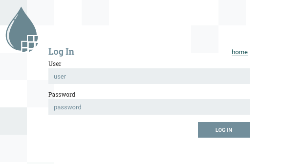
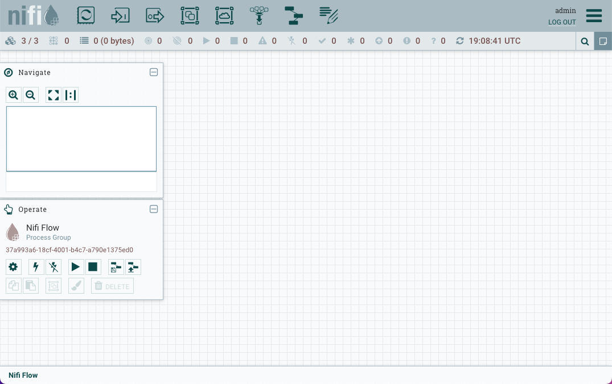
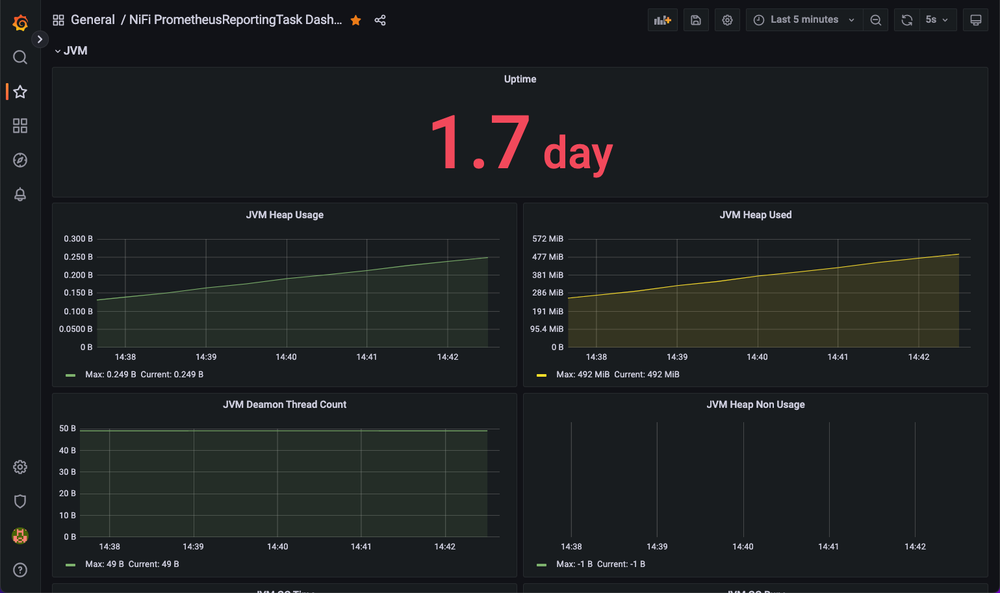
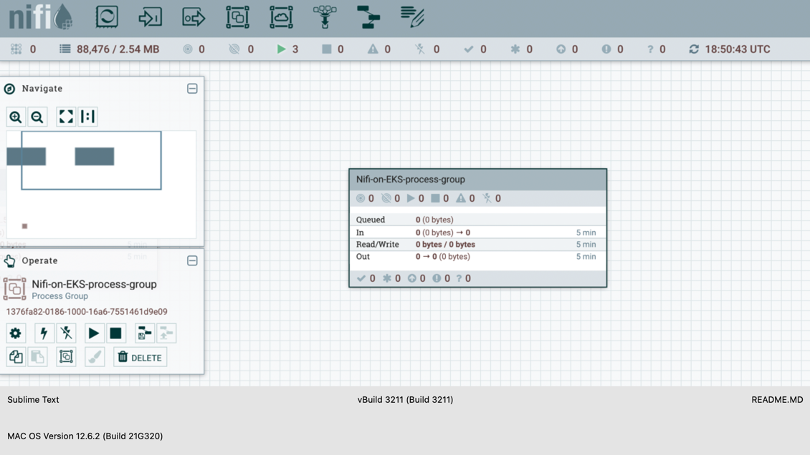
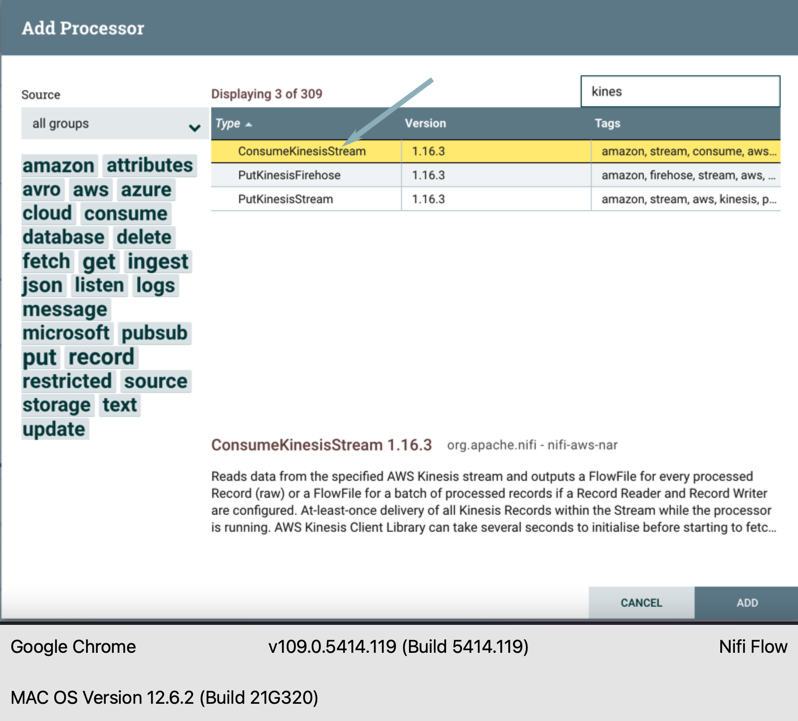
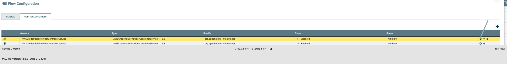
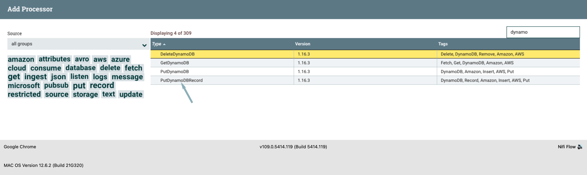

# EKS 기반 Apache NiFi

## 소개

Apache NiFi는 시스템 간 데이터 흐름을 자동화하고 관리하도록 설계된 오픈소스 데이터 통합 및 관리 시스템입니다. 실시간으로 데이터 흐름을 생성, 모니터링 및 관리하기 위한 웹 기반 사용자 인터페이스를 제공합니다.

강력하고 유연한 아키텍처를 통해 Apache NiFi는 구조화된 데이터와 비구조화된 데이터를 포함한 광범위한 데이터 소스, 클라우드 플랫폼 및 형식을 처리할 수 있으며, 데이터 수집, 데이터 처리(중저 수준), 데이터 라우팅, 데이터 변환 및 데이터 배포와 같은 다양한 데이터 통합 시나리오에 사용할 수 있습니다.

Apache NiFi는 데이터 흐름을 구축하고 관리하기 위한 GUI 기반 인터페이스를 제공하여 비기술 사용자도 쉽게 사용할 수 있습니다. 또한 민감한 데이터의 안전하고 보안적인 전송을 보장하기 위해 SSL, SSH 및 세분화된 액세스 제어를 포함한 강력한 보안 기능을 제공합니다. 데이터 분석가, 데이터 엔지니어 또는 데이터 과학자이든 Apache NiFi는 AWS 및 기타 플랫폼에서 데이터를 관리하고 통합하기 위한 포괄적인 솔루션을 제공합니다.
:::caution

이 블루프린트는 실험적인 것으로 간주되어야 하며 개념 증명에만 사용해야 합니다.
:::

이 [예제](https://github.com/awslabs/data-on-eks/tree/main/streaming-platforms/nifi)는 Apache NiFi 클러스터를 실행하는 EKS 클러스터를 배포합니다. 이 예제에서 Apache NiFi는 일부 형식 변환 후 AWS Kinesis Data Stream에서 Amazon DynamoDB 테이블로 데이터를 스트리밍합니다.

- 새 샘플 VPC, 3개의 프라이빗 서브넷 및 3개의 퍼블릭 서브넷 생성
- 퍼블릭 서브넷용 인터넷 게이트웨이 및 프라이빗 서브넷용 NAT Gateway 생성
- 하나의 관리형 노드 그룹이 있는 퍼블릭 엔드포인트(데모 목적으로만)를 가진 EKS 클러스터 컨트롤 플레인 생성
- Apache NiFi, AWS Load Balancer Controller, Cert Manager 및 External DNS(선택 사항) 애드온 배포
- `nifi` 네임스페이스에 Apache NiFi 클러스터 배포

## 사전 요구 사항

다음 도구가 로컬 머신에 설치되어 있는지 확인하세요.

1. [aws cli](https://docs.aws.amazon.com/cli/latest/userguide/install-cliv2.html)
2. [kubectl](https://Kubernetes.io/docs/tasks/tools/)
3. [terraform](https://learn.hashicorp.com/tutorials/terraform/install-cli)
4. [jq](https://stedolan.github.io/jq/)

추가로 Ingress의 엔드투엔드 구성을 위해 다음을 제공해야 합니다:

1. 이 예제를 배포하는 계정에 구성된 [Route53 Public Hosted Zone](https://docs.aws.amazon.com/Route53/latest/DeveloperGuide/dns-configuring.html). 예: "example.com"
2. 이 예제를 배포하는 계정 + 리전의 [ACM 인증서](https://docs.aws.amazon.com/acm/latest/userguide/gs-acm-request-public.html). 와일드카드 인증서가 권장됩니다. 예: "*.example.com"

## Apache NiFi로 EKS 클러스터 배포

### 저장소 복제

```bash
git clone https://github.com/awslabs/data-on-eks.git
```

### Terraform 초기화

예제 디렉토리로 이동하고 `terraform init`을 실행합니다.

```bash
cd data-on-eks/streaming/nifi/
terraform init
```

### Terraform Plan

Terraform plan을 실행하여 이 실행으로 생성될 리소스를 확인합니다.

Route53 Hosted Zone 호스트 이름과 해당 ACM 인증서를 제공합니다.

```bash
export TF_VAR_eks_cluster_domain="<CHANGEME - example.com>"
export TF_VAR_acm_certificate_domain="<CHANGEME - *.example.com>"
export TF_VAR_nifi_sub_domain="nifi"
export TF_VAR_nifi_username="admin"
```

### 패턴 배포

```bash
terraform plan
terraform apply
```

적용하려면 `yes`를 입력합니다.

```
Outputs:

configure_kubectl = "aws eks --region us-west-2 update-kubeconfig --name nifi-on-eks"
```


### 배포 확인

kubeconfig 업데이트

```bash
aws eks --region us-west-2 update-kubeconfig --name nifi-on-eks
```

모든 파드가 실행 중인지 확인합니다.

```bash
NAMESPACE           NAME                                                         READY   STATUS    RESTARTS      AGE
amazon-cloudwatch   aws-cloudwatch-metrics-7fbcq                                 1/1     Running   1 (43h ago)   2d
amazon-cloudwatch   aws-cloudwatch-metrics-82c9v                                 1/1     Running   1 (43h ago)   2d
amazon-cloudwatch   aws-cloudwatch-metrics-blrmt                                 1/1     Running   1 (43h ago)   2d
amazon-cloudwatch   aws-cloudwatch-metrics-dhpl7                                 1/1     Running   0             19h
amazon-cloudwatch   aws-cloudwatch-metrics-hpw5k                                 1/1     Running   1 (43h ago)   2d
cert-manager        cert-manager-7d57b6576b-c52dw                                1/1     Running   1 (43h ago)   2d
cert-manager        cert-manager-cainjector-86f7f4749-hs7d9                      1/1     Running   1 (43h ago)   2d
cert-manager        cert-manager-webhook-66c85f8577-rxms8                        1/1     Running   1 (43h ago)   2d
external-dns        external-dns-57bb948d75-g8kbs                                1/1     Running   0             41h
grafana             grafana-7f5b7f5d4c-znrqk                                     1/1     Running   1 (43h ago)   2d
kube-system         aws-load-balancer-controller-7ff998fc9b-86gql                1/1     Running   1 (43h ago)   2d
kube-system         aws-load-balancer-controller-7ff998fc9b-hct9k                1/1     Running   1 (43h ago)   2d
kube-system         aws-node-4gcqk                                               1/1     Running   1 (43h ago)   2d
kube-system         aws-node-4sssk                                               1/1     Running   0             19h
kube-system         aws-node-4t62f                                               1/1     Running   1 (43h ago)   2d
kube-system         aws-node-g4ndt                                               1/1     Running   1 (43h ago)   2d
kube-system         aws-node-hlxmq                                               1/1     Running   1 (43h ago)   2d
kube-system         cluster-autoscaler-aws-cluster-autoscaler-7bd6f7b94b-j7td5   1/1     Running   1 (43h ago)   2d
kube-system         cluster-proportional-autoscaler-coredns-6ccfb4d9b5-27xsd     1/1     Running   1 (43h ago)   2d
kube-system         coredns-5c5677bc78-rhzkx                                     1/1     Running   1 (43h ago)   2d
kube-system         coredns-5c5677bc78-t7m5z                                     1/1     Running   1 (43h ago)   2d
kube-system         ebs-csi-controller-87c4ff9d4-ffmwh                           6/6     Running   6 (43h ago)   2d
kube-system         ebs-csi-controller-87c4ff9d4-nfw28                           6/6     Running   6 (43h ago)   2d
kube-system         ebs-csi-node-4mkc8                                           3/3     Running   0             19h
kube-system         ebs-csi-node-74xqs                                           3/3     Running   3 (43h ago)   2d
kube-system         ebs-csi-node-8cw8t                                           3/3     Running   3 (43h ago)   2d
kube-system         ebs-csi-node-cs9wp                                           3/3     Running   3 (43h ago)   2d
kube-system         ebs-csi-node-ktdb7                                           3/3     Running   3 (43h ago)   2d
kube-system         kube-proxy-4s72m                                             1/1     Running   0             19h
kube-system         kube-proxy-95ptn                                             1/1     Running   1 (43h ago)   2d
kube-system         kube-proxy-bhrdk                                             1/1     Running   1 (43h ago)   2d
kube-system         kube-proxy-nzvb6                                             1/1     Running   1 (43h ago)   2d
kube-system         kube-proxy-q9xkc                                             1/1     Running   1 (43h ago)   2d
kube-system         metrics-server-fc87d766-dd647                                1/1     Running   1 (43h ago)   2d
kube-system         metrics-server-fc87d766-vv8z9                                1/1     Running   1 (43h ago)   2d
logging             aws-for-fluent-bit-b5vqg                                     1/1     Running   1 (43h ago)   2d
logging             aws-for-fluent-bit-pklhr                                     1/1     Running   0             19h
logging             aws-for-fluent-bit-rq2nc                                     1/1     Running   1 (43h ago)   2d
logging             aws-for-fluent-bit-tnmtl                                     1/1     Running   1 (43h ago)   2d
logging             aws-for-fluent-bit-zzhfc                                     1/1     Running   1 (43h ago)   2d
nifi                nifi-0                                                       5/5     Running   0             41h
nifi                nifi-1                                                       5/5     Running   0             41h
nifi                nifi-2                                                       5/5     Running   0             41h
nifi                nifi-registry-0                                              1/1     Running   0             41h
nifi                nifi-zookeeper-0                                             1/1     Running   0             41h
nifi                nifi-zookeeper-1                                             1/1     Running   0             41h
nifi                nifi-zookeeper-2                                             1/1     Running   0             18h
prometheus          prometheus-alertmanager-655fcb46df-2qh8h                     2/2     Running   2 (43h ago)   2d
prometheus          prometheus-kube-state-metrics-549f6d74dd-wwhtr               1/1     Running   1 (43h ago)   2d
prometheus          prometheus-node-exporter-5cpzk                               1/1     Running   0             19h
prometheus          prometheus-node-exporter-8jhbk                               1/1     Running   1 (43h ago)   2d
prometheus          prometheus-node-exporter-nbd42                               1/1     Running   1 (43h ago)   2d
prometheus          prometheus-node-exporter-str6t                               1/1     Running   1 (43h ago)   2d
prometheus          prometheus-node-exporter-zkf5s                               1/1     Running   1 (43h ago)   2d
prometheus          prometheus-pushgateway-677c6fdd5-9tqkl                       1/1     Running   1 (43h ago)   2d
prometheus          prometheus-server-7bf9cbb9cf-b2zgl                           2/2     Running   2 (43h ago)   2d
vpa                 vpa-recommender-7c6bbb4f9b-rjhr7                             1/1     Running   1 (43h ago)   2d
vpa                 vpa-updater-7975b9dc55-g6zf6                                 1/1     Running   1 (43h ago)   2d
```

#### Apache NiFi UI

Apache NiFi 대시보드는 다음 URL [https://nifi.example.com/nifi](https://nifi.example.com/nifi) 에서 열 수 있습니다.



아래 명령을 실행하여 NiFi 사용자의 비밀번호를 검색하고 기본 사용자 이름은 `admin`입니다.
```
aws secretsmanager get-secret-value --secret-id <nifi_login_password_secret_name from terraform outputs> --region <region> | jq '.SecretString' --raw-output
```


### 모니터링
Apache NiFi는 PrometheusReportingTask에서 보고하는 메트릭을 사용하여 모니터링할 수 있습니다. JVM 메트릭은 기본적으로 비활성화되어 있으며, 오른쪽 상단 모서리에 있는 햄버거 아이콘(가로 세 줄)을 클릭하여 Controller Settings로 이동하여 JVM 메트릭을 활성화합니다.


다음으로 `REPORTING TASK` 탭을 클릭한 다음 `+` 아이콘을 클릭하고 필터에서 `PrometheusReportingTask`를 검색합니다. `PrometheusReportingTask`를 선택하고 `ADD` 버튼을 클릭합니다.


prometheus reporting task는 기본적으로 중지되어 있습니다.


연필 아이콘을 클릭하여 작업을 편집하고 PROPERTIES 탭을 클릭합니다. `Send JVM metrics`를 `true`로 설정하고 Apply를 클릭합니다. 재생 아이콘을 클릭하여 작업을 시작하고 실행 중인 상태인지 확인합니다.


이 블루프린트는 `prometheus`와 `grafana`를 사용하여 Apache NiFi 클러스터에 대한 가시성을 확보하기 위한 모니터링 스택을 만듭니다.

```
aws secretsmanager get-secret-value --secret-id <grafana_secret_name from terraform outputs> --region <region> | jq '.SecretString' --raw-output
```

아래 명령을 실행하고 URL [http://localhost:8080](http://localhost:8080) 을 사용하여 Grafana 대시보드를 엽니다.

```
kubectl port-forward svc/grafana -n grafana 8080:80
```

Apache NiFi [Grafana 대시보드](https://grafana.com/grafana/dashboards/12314-nifi-prometheusreportingtask-dashboard/) 가져오기



### 예제

#### Amazon DynamoDB 및 AWS Kinesis 액세스를 위한 IAM 정책 생성

1. AWS IAM role 생성: AWS Kinesis data stream에 대한 액세스 권한이 있는 AWS IAM role을 생성하고 이 role을 Apache NiFi를 호스팅하는 AWS EKS 클러스터에 할당합니다.

2. IAM 정책 연결: IAM role에 Kinesis data stream에 대한 액세스를 읽기 전용으로 제한하는 정책과 EKS role이 Amazon DynamoDB 테이블에 쓸 수 있도록 하는 IAM 정책을 연결합니다. 다음은 예제 정책입니다:

```
{
    "Version": "2012-10-17",
    "Statement": [
        {
            "Sid": "Nifi-access-to-Kinesis",
            "Effect": "Allow",
            "Action": [
                "kinesis:DescribeStream",
                "kinesis:GetRecords",
                "kinesis:GetShardIterator",
                "kinesis:ListStreams"
            ],
            "Resource": "arn:aws:kinesis:<REGION>:<ACCOUNT-ID>:stream/kds-stream-nifi-on-EKS"
        }
    ]
}
```

```
{
    "Sid": "DynamoDBTableAccess",
    "Effect": "Allow",
    "Action": [
        "dynamodb:BatchGetItem",
        "dynamodb:BatchWriteItem",
        "dynamodb:ConditionCheckItem",
        "dynamodb:PutItem",
        "dynamodb:DescribeTable",
        "dynamodb:DeleteItem",
        "dynamodb:GetItem",
        "dynamodb:Scan",
        "dynamodb:Query",
        "dynamodb:UpdateItem"
    ],
    "Resource": "arn:aws:dynamodb:<REGION>:<ACCOUNT-ID>:table/NifiStreamingTable"
}
```

#### AWS Kinesis Data Stream 생성
3. AWS Kinesis data stream 생성: AWS Management Console에 로그인하고 데이터를 수집하려는 리전에 Kinesis data stream을 생성하거나 아래 명령줄을 사용하여 생성합니다.

```
aws kinesis create-stream --stream-name kds-stream-nifi-on-EKS
```

#### Amazon DynamoDB 테이블 생성
4. AWS 콘솔 또는 명령줄을 사용하여 동일한 AWS 계정에 Amazon DynamoDB를 생성합니다. Amazon DynamoDB 테이블 정보가 포함된 JSON 파일 JSONSchemaDynamoDBTABLE.json을 생성합니다.

```

    "TableName": "NifiStreamingTable",
    "KeySchema": [
      { "AttributeName": "Name", "KeyType": "HASH" },
      { "AttributeName": "Age", "KeyType": "RANGE" }},
      { "AttributeName": "Location", "KeyType": "RANGE" }
    ],
    "AttributeDefinitions": [
      { "AttributeName": "Name", "KeyType": "S" },
      { "AttributeName": "Age", "KeyType": "S" }},
      { "AttributeName": "Location", "KeyType": "S" }
    ],
    "ProvisionedThroughput": {
      "ReadCapacityUnits": 5,
      "WriteCapacityUnits": 5
    }
}
```

5. JSON 파일에서 Amazon DynamoDB 테이블을 생성하는 명령줄을 실행합니다.

```
aws dynamodb create-table --cli-input-json  JSONSchemaDynamoDBTABLE.json
```

6. 엔드포인트를 사용하여 EKS UI에서 Apache NiFi를 열고 프로세스 그룹을 만들고 NifiStreamingExample이라는 이름을 지정합니다.




7. Nifi-on-EKS-process-group을 더블클릭하고 프로세스에 들어가 데이터 흐름을 만듭니다. 왼쪽 상단에서 프로세서 아이콘을 드래그하고 검색 창에 Kinesis를 입력한 다음 ConsumeKinesisStream 프로세서를 선택합니다. Kinesis Consumer를 만들려면 ADD를 클릭합니다.



8. Kinesis 프로세서를 더블클릭하고 properties 탭을 선택한 후 아래 구성 정보를 입력합니다.
   a. Amazon Kinesis Stream Name
   b. Application Name
   c. Region
   d. AWS Credentials Provider Service - AWSCredentialsProviderControllerService를 선택하고 생성합니다.


#### AWS 자격 증명 설정 생성

9. AWS Credentials Provider Service를 사용하여 계정의 AWS 리소스에 액세스하기 위한 AWS 자격 증명을 설정합니다. 이 예제에서는 액세스 키와 시크릿 키를 사용합니다. <em>**참고**: AWS 리소스를 인증하기 위한 다른 옵션으로 IAM role 기반, assumed role 옵션이 있습니다.</em>




10. 왼쪽 상단에서 프로세서 아이콘을 드래그하고 검색 창에 "dynamoDB"를 입력한 다음 "PutDynamoDBRecord" 프로세서를 선택합니다. ADD를 클릭하여 Amazon DynamoDB writer를 만듭니다. 아래 필드를 사용하여 프로세서를 구성합니다.

a. Record Reader - JSONTreeReader로 변경
b. AWS Credentials Provider Service - 이전에 생성된 구성 선택
c. Region
b. Table Name
d. Partition Key Field - 파티션 필드 선택




11. Kinesis consumer 위로 마우스를 가져간 후 DynamoDB writer로 드래그합니다. 연결이 만들어지고 success 큐가 생성됩니다.


12. Kinesis Consumer와 DynamoDB의 경우 funnel로 오류 경로를 만듭니다. 이는 추가 처리를 위해 처리되지 않은, 실패한, 성공한 레코드를 라우팅하기 위한 것입니다. 참고: Relationship 탭에서 각 프로세서의 모든 옵션을 볼 수 있습니다. DynamoDB writer의 경우 success는 항상 funnel을 가리켜야 합니다.


13. 프로세서에 위험 기호가 없는지 확인합니다. 그리드를 마우스 오른쪽 버튼으로 클릭하고 "데이터 흐름 실행"을 클릭합니다. 데이터가 흐르는 것을 볼 수 있습니다.

## 정리

환경을 정리하려면 역순으로 Terraform 모듈을 삭제합니다.

Kubernetes 애드온, 노드 그룹이 있는 EKS 클러스터 및 VPC 삭제

```bash
terraform destroy -target="module.eks_blueprints_kubernetes_addons" --auto-approve
terraform destroy -target="module.eks" --auto-approve
terraform destroy -target="module.vpc" --auto-approve
```

마지막으로 위 모듈에 없는 추가 리소스를 삭제합니다.

```bash
terraform destroy --auto-approve
```
