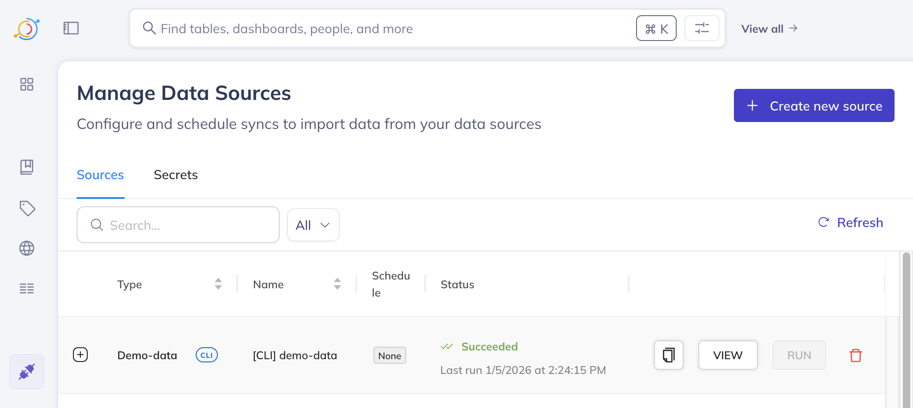
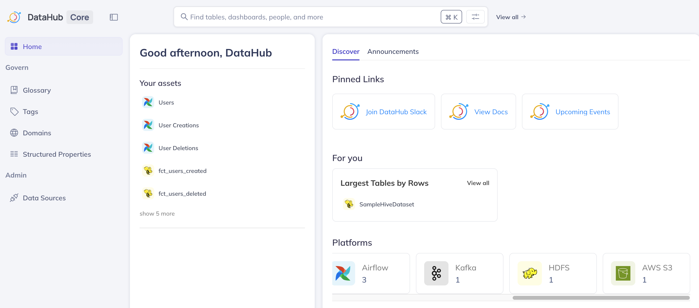

## 메타데이터 수집이란?

DataHub에서 **수집(ingestion)**은 다양한 데이터 소스에서 메타데이터를 수집하여 DataHub에 로드하는 프로세스입니다. 이 프로세스는 데이터 검색, 관측성 및 거버넌스에 필요한 정보로 DataHub를 채우기 때문에 유용한 데이터 카탈로그의 기반입니다.

메타데이터를 수집하면 다음을 수행할 수 있습니다:
- 데이터셋, 대시보드, 파이프라인 등을 검색.
- 데이터 자산 간의 종속성을 이해하기 위해 데이터 계보(lineage)를 시각화.
- 데이터 플랫폼의 상태와 품질을 모니터링.
- 데이터 자산에 소유권 및 문서를 추가.

**DataHub CLI**는 이 수집을 수행할 수 있는 강력한 명령줄 도구입니다. "레시피(recipe)"라고 하는 간단한 YAML 기반 구성 파일을 사용하여 데이터 소스에 연결하고 메타데이터를 수집합니다. 이 가이드에서는 CLI를 사용하여 샘플 데이터를 수집하는 방법을 안내합니다.


## 사전 요구 사항

- **DataHub on EKS**: [인프라 설정 가이드](./infra.md)를 따라 DataHub 인프라를 배포해야 합니다.
- **로컬 도구**: 로컬 머신에 다음 명령줄 도구가 설치되어 있어야 합니다:
  - `kubectl`: EKS 클러스터와 상호 작용하기 위해.
  - `aws-cli`: AWS 자격 증명을 구성하기 위해.
  - `wget`: 파일 다운로드에 사용됩니다.
  - `uv`: 빠른 Python 패키지 설치 프로그램.

## 1단계: 개인 액세스 토큰 생성

메타데이터를 수집하려면 DataHub CLI가 DataHub 인스턴스에 인증해야 합니다. 개인 액세스 토큰을 사용하여 이 작업을 수행합니다.

1.  **DataHub UI에 액세스**

    먼저 DataHub 프론트엔드 서비스에 연결해야 합니다. `kubectl`을 사용하여 서비스를 로컬 머신으로 포트 포워딩합니다.

    ```bash
    kubectl port-forward svc/datahub-datahub-frontend -n datahub 9002:9002
    ```

2.  **로그인**

    웹 브라우저를 열고 [http://localhost:9002](http://localhost:9002) 로 이동합니다. 기본 자격 증명으로 로그인합니다:
    - **사용자명:** `datahub`
    - **비밀번호:** `datahub`

3.  **토큰 생성**

    - 오른쪽 상단에서 **톱니바퀴 아이콘 (⚙️)**을 클릭하여 설정 메뉴를 엽니다.
    - 드롭다운에서 **Access Tokens**를 선택합니다.
    - **Generate New Token**을 클릭합니다.
    - 토큰에 이름(예: `cli-ingestion-token`)을 지정하고 **Generate**를 클릭합니다.
    - **생성된 토큰을 복사**하고 안전한 곳에 저장합니다. 다시 볼 수 없습니다.

:::caution 토큰 보안
액세스 토큰은 DataHub 인스턴스에 대한 전체 권한을 부여합니다. 비밀번호처럼 취급하고 안전하게 저장하세요.
:::

### 수집 명령 실행

DataHub CLI가 `${VAR_NAME}` 형식의 환경 변수를 자동으로 대체합니다. 그러나 이 비프로덕션 배포에 대한 프로세스를 단순화하기 위해 레시피 파일에서 토큰을 직접 교체합니다. 401 Unauthorized 오류는 토큰이 올바르게 전달되지 않거나 서버 엔드포인트가 잘못된 경우 발생합니다. CLI는 프론트엔드 UI의 `9002` 포트가 아닌 DataHub GMS(General Metadata Service)의 `8080` 포트에 연결해야 합니다.

1.  **GMS 서비스 포트 포워딩**

    **새 터미널 창**에서 다음 명령을 실행하여 GMS 서비스를 로컬 포트 `8080`으로 포워딩합니다. 이 터미널을 계속 실행 상태로 유지합니다.

    ```bash
    kubectl port-forward svc/datahub-datahub-gms -n datahub 8080:8080
    ```

2.  **토큰으로 레시피 파일 업데이트**

    편집기에서 `data-stacks/datahub-on-eks/examples/demo-data-recipes.yaml` 파일을 열고 `${TOKEN}`을 1단계에서 생성한 개인 액세스 토큰으로 교체합니다.

    ```yaml
    # 업데이트된 sink 섹션의 예시:
    sink:
      type: "datahub-rest"
      config:
        server: "http://localhost:8080"
        token: "your-copied-token-goes-here" # 실제 토큰으로 교체
    ```
    이 변경을 수행한 후 파일을 저장하는 것을 잊지 마세요.

    :::danger 토큰을 커밋하지 마세요
    하드코딩된 토큰이 포함된 `demo-data-recipes.yaml` 파일을 Git 저장소에 커밋하지 않도록 주의하세요.
    :::

3.  **수집 CLI 실행**

    이제 수집 명령을 실행합니다.

    ```bash
    uvx --from acryl-datahub datahub ingest run -c data-stacks/datahub-on-eks/examples/demo-data-recipes.yaml
    ```

    터미널에 수집이 성공했음을 나타내는 출력이 표시되고 "CLI Ingestion finished" 메시지로 끝납니다.

## 3단계: DataHub UI에서 수집된 데이터 검사

수집이 성공하면 DataHub UI에서 새 메타데이터를 확인할 수 있습니다.

1.  **프론트엔드 포트 포워딩 다시 설정 (필요한 경우)**

    DataHub 프론트엔드 서비스를 포트 포워딩하던 터미널(포트 `9002`)을 닫았다면 새 터미널에서 **1단계**의 명령을 다시 실행합니다:

    ```bash
    kubectl port-forward svc/datahub-datahub-frontend -n datahub 9002:9002
    ```

2.  **DataHub UI에 액세스**

    웹 브라우저를 열고 [http://localhost:9002](http://localhost:9002) 로 이동합니다.

3.  **데이터 소스 확인**

    - 왼쪽 탐색 바에서 **"Data Sources" 아이콘**(보라색 플러그 🔌로 표시)을 클릭합니다.
    - `[CLI] demo-data`라는 항목이 표시됩니다. 이는 데모 데이터 소스가 성공적으로 등록되었음을 확인합니다.

    

4.  **수집된 자산 검사**

    - 왼쪽 탐색 바에서 **"Home" 아이콘**(DataHub 로고 바로 아래에 있는 네 개의 사각형이 있는 그리드 모양의 아이콘)을 클릭하여 메인 대시보드로 돌아갑니다.

    

    - 이제 `hadoop`, `Airflow`, `Kafka`, `AWS S3`와 같은 다양한 플랫폼별로 분류된 더 많은 자산이 나열되어 있음을 알 수 있습니다. 이는 이러한 다양한 시뮬레이션된 소스의 메타데이터가 수집되었음을 나타냅니다.
    - 자산 목록에서 **"AWS S3"** 플랫폼을 클릭합니다.
    - 이 플랫폼 아래에 S3 데이터 자산을 나타내는 하나의 항목이 표시됩니다.
    - 화면 오른쪽의 **"Documentation"** 섹션에 `s3 backup of logging events`라고 표시됩니다.
    - 또한 S3 데이터 자산의 스키마에 대한 세부 정보를 제공하는 이 항목에 사용 가능한 **columns**가 나열되어 있어야 합니다.
    - **"Lineage"** 탭을 클릭합니다. 여기에서 이 S3 데이터 자산이 `hadoop` 테이블에서 유래했음을 보여주는 시각적 표현이 표시되어 데이터 흐름을 보여줍니다.

## 정리

이 가이드에서는 새 인프라를 생성하지 않았습니다. 정리하려면 실행 중인 터미널 창에서 `Ctrl+C`를 눌러 `kubectl port-forward` 프로세스를 중지하면 됩니다.

DataHub 사용을 완전히 끝낸 경우 [정리 가이드](./infra.md#cleanup)를 따라 모든 인프라를 파괴할 수 있습니다.

## 다음 단계

축하합니다. DataHub에 첫 번째 메타데이터를 성공적으로 수집했습니다! 여기서부터:

- UI에서 다양한 수집된 자산을 탐색합니다.
- 다른 소스에 대한 자체 수집 레시피를 작성해 봅니다.
- Glossary Terms, Tags 및 Domains와 같은 DataHub의 기능에 대해 자세히 알아봅니다.
