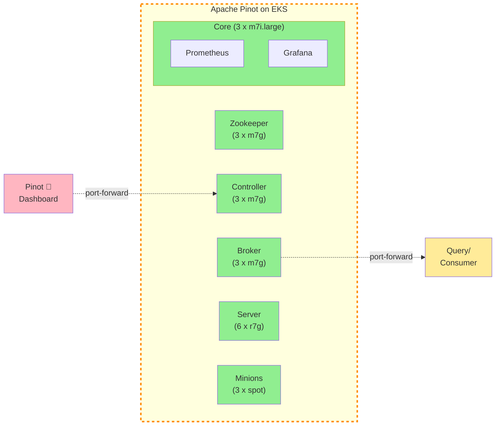
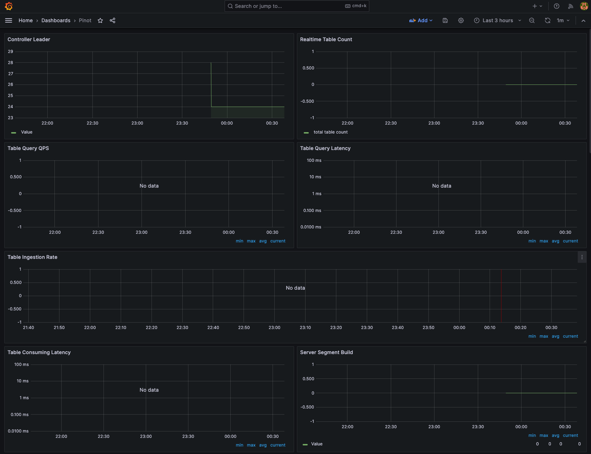

## EKS에 Apache Pinot 배포하기

[Apache Pinot](https://pinot.apache.org/)은 저지연 및 고처리량 분석을 위해 특별히 설계된 실시간 분산 OLAP 데이터스토어입니다. Pinot을 사용하여 Apache Kafka, Amazon Kinesis Data Streams, Amazon S3 등의 스트리밍 또는 배치 데이터 소스에서 데이터를 수집하고 즉시 쿼리할 수 있습니다.

Apache Pinot의 주요 특징:

- **초저지연** 분석, 매우 높은 처리량에서도 유지.
- 여러 스마트 인덱싱 및 사전 집계 기술을 갖춘 **컬럼형 데이터 저장소**.
- 상한 없이 **스케일 업** 및 **스케일 아웃**.
- 클러스터 크기 및 예상 초당 쿼리(QPS) 임계값을 기반으로 한 **일관된 성능**.

사용자 대면 실시간 분석 및 내부 대시보드, 이상 감지, 임시 데이터 탐색을 포함한 기타 분석 사용 사례에 완벽한 솔루션입니다. Apache Pinot 및 해당 컴포넌트에 대한 자세한 내용은 [문서](https://docs.pinot.apache.org/)에서 확인할 수 있습니다.

이 스택에서는 Elastic Kubernetes Service(EKS)로 관리되는 Kubernetes 클러스터에 Apache Pinot을 배포합니다. EKS 클러스터에 Apache Pinot을 배포할 때의 이점:

- Kubernetes를 사용하여 Apache Pinot 클러스터 관리
- 각 레이어를 독립적으로 확장
- 단일 장애 지점 없음
- 자동 복구

## 아키텍처



이 설정에서는 2개의 가용 영역에 걸쳐 프라이빗 서브넷에 모든 Apache Pinot 컴포넌트를 배포합니다. 이를 통해 더 큰 유연성과 복원력이 가능합니다. 아키텍처는 다음을 사용합니다:

- **Controllers & Brokers**: m7g.2xlarge 온디맨드 인스턴스 (8 vCPU, 32 GiB RAM, Graviton3)
- **Servers**: r7g.2xlarge 온디맨드 인스턴스 (8 vCPU, 64 GiB RAM, 데이터 서빙에 최적화된 메모리)
- **Minions**: 가능한 경우 Spot 인스턴스 (스테이트리스 백그라운드 작업)
- **Zookeeper**: 클러스터 조정을 위한 3노드 앙상블 (영구 스토리지가 있는 m7g 인스턴스)

### 컴포넌트 세부 정보

**Zookeeper 클러스터**
- 고가용성을 위해 3개의 레플리카가 있는 StatefulSet으로 배포
- 클러스터 메타데이터, 리더 선출 및 분산 조정 관리
- 파드가 다른 노드에서 실행되도록 보장하는 pod anti-affinity와 함께 영구 볼륨(10Gi 데이터 + datalog) 사용
- 대형 Pinot 테이블 스키마 및 세그먼트 메타데이터를 처리하기 위해 `jute.maxbuffer=4000000`으로 구성

:::note
Bitnami Zookeeper 차트가 더 이상 사용되지 않으므로 Bitnami Helm 차트 서브차트 대신 사용자 정의 StatefulSet 매니페스트를 사용하여 Zookeeper를 배포합니다. 이 접근 방식은 Zookeeper 구성에 대한 완전한 제어를 제공하고 장기적인 유지보수성을 보장합니다.
:::

**스토리지 구성**
- 서버 세그먼트: 서버 파드당 100Gi gp3 EBS 볼륨
- Zookeeper: 데이터 및 트랜잭션 로그용 10Gi gp3 EBS 볼륨
- 스토리지 클래스: gp3 (AWS 기본값)
- **DeepStore**: 세그먼트 백업 및 복구를 위한 S3 버킷 (데이터 스택 간 공유)

**메트릭 및 모니터링**
- 모든 컴포넌트에서 포트 8008의 JMX Prometheus 익스포터 활성화
- Prometheus 스크래핑을 위해 구성된 ServiceMonitor 리소스 (30초 간격)
- 컨트롤러, 브로커 및 서버에 대한 메트릭 노출

**S3 DeepStore 통합**
- 세그먼트는 생성 후 자동으로 S3에 백업
- 세그먼트를 재구축하지 않고 더 빠른 복구 및 파드 교체 가능
- 로컬 EBS 스토리지에 대한 종속성 감소
- 인프라 수준에서 구성 (테이블별 구성 불필요)

Controller 및 Broker 컴포넌트에 대한 액세스는 kubectl 포트 포워딩을 통해 이루어집니다.

:::tip
실시간 데이터 수집으로 Pinot을 실제로 작동시켜 보려면 Kafka에서 Pinot 테이블로 데이터를 스트리밍하는 것을 보여주는 [Kafka 통합](./kafka-integration) 예제를 확인하세요.
:::


> 참고: 사용 사례에 따라 클러스터 크기와 구성을 더 적합하게 업데이트해야 합니다. Apache Pinot 용량 계획에 대한 자세한 내용은 [여기](https://startree.ai/blog/capacity-planning-in-apache-pinot-part-1)와 [여기](https://startree.ai/blog/capacity-planning-in-apache-pinot-part-2)에서 확인할 수 있습니다.

## S3 DeepStore 구성

이 배포에는 세그먼트 백업 및 복구를 위한 S3 DeepStore가 포함되어 있습니다. DeepStore는 다음을 제공합니다:

- **재해 복구**: 모든 서버 파드가 삭제되어도 세그먼트가 S3에 유지
- **더 빠른 스케일링**: 새 서버가 재구축하는 대신 S3에서 사전 구축된 세그먼트 다운로드
- **운영 유연성**: 데이터 손실 없이 안전하게 파드 삭제/재생성

인프라는 자동으로 구성합니다:
- 모든 데이터 스택용 공유 S3 버킷 (접두사 기반 구성)
- EKS Pod Identity를 통한 IAM 권한
- 컨트롤러 및 서버 컴포넌트의 S3PinotFS 플러그인
- 세그먼트 완료 시 S3로 서버 측 업로드

테이블은 추가 구성 없이 자동으로 DeepStore를 사용합니다. 실제 동작을 보려면 [Kafka 통합](./kafka-integration) 예제를 참조하세요.

## 사전 요구 사항 📝

머신에 다음 도구가 설치되어 있는지 확인하세요.

1. [aws cli](https://docs.aws.amazon.com/cli/latest/userguide/install-cliv2.html)
2. [kubectl](https://Kubernetes.io/docs/tasks/tools/)
3. [terraform](https://learn.hashicorp.com/tutorials/terraform/install-cli)

## 배포 ⚙️

### Apache Pinot으로 EKS 클러스터 배포

## 1단계: 저장소 복제 및 이동

먼저 저장소를 복제합니다. apache pinot 폴더로 이동합니다.

```bash
git clone https://github.com/awslabs/data-on-eks.git
cd data-on-eks/data-stacks/pinot-on-eks
```

## 2단계: 스택 커스터마이징
필요한 경우 설정을 커스터마이징하려면 `terraform/data-stack.tfvars` 파일을 편집합니다. 예를 들어 `vi`, `nano` 또는 다른 텍스트 편집기로 열 수 있습니다.

## 3단계: 인프라 배포

배포 스크립트를 실행합니다:

```bash
./deploy.sh
```

:::note

**배포 실패 시:**
- 동일한 명령을 다시 실행: `./deploy.sh`
- 여전히 실패하면 kubectl 명령을 사용하여 디버그하거나 [이슈를 등록](https://github.com/awslabs/data-on-eks/issues)하세요

:::

:::info

**예상 배포 시간:** 15-20분

:::


### 배포 확인

Amazon EKS 클러스터 확인

```bash
aws eks describe-cluster --name pinot-on-eks
```

kubernetes 클러스터에 액세스할 수 있도록 로컬 kubeconfig를 업데이트합니다.

```bash
export KUBECONFIG=kubeconfig.yaml
```

모든 파드가 실행 중인지 확인합니다.

```bash
kubectl get pods -n pinot
```
#### 출력
```bash
NAME                                                   READY   STATUS      RESTARTS   AGE
pinot-broker-0                                         1/1     Running     0          11d
pinot-broker-1                                         1/1     Running     0          11d
pinot-broker-2                                         1/1     Running     0          11d
pinot-controller-0                                     1/1     Running     0          11d
pinot-controller-1                                     1/1     Running     0          11d
pinot-controller-2                                     1/1     Running     0          11d
pinot-minion-stateless-86cf65f89-rlpwn                 1/1     Running     0          12d
pinot-minion-stateless-86cf65f89-tkbjf                 1/1     Running     0          12d
pinot-minion-stateless-86cf65f89-twp8n                 1/1     Running     0          12d
pinot-server-0                                         1/1     Running     0          11d
pinot-server-1                                         1/1     Running     0          11d
pinot-server-2                                         1/1     Running     0          11d
pinot-zookeeper-0                                      1/1     Running     0          12d
pinot-zookeeper-1                                      1/1     Running     0          12d
pinot-zookeeper-2                                      1/1     Running     0          12d
```

`monitoring` 네임스페이스 아래에 `prometheus`와 `grafana`도 배포했습니다. `monitoring`의 모든 파드도 실행 중인지 확인하세요.

```bash
kubectl get pods -n kube-prometheus-stack
```
#### 출력
```bash
prometheus-grafana-85b4584dbf-4l72l                    3/3     Running   0          12d
prometheus-kube-prometheus-operator-84dcddccfc-pv8nv   1/1     Running   0          12d
prometheus-kube-state-metrics-57f6b6b4fd-txjtb         1/1     Running   0          12d
prometheus-prometheus-kube-prometheus-prometheus-0     2/2     Running   0          4d3h
prometheus-prometheus-node-exporter-4jh8q              1/1     Running   0          12d
prometheus-prometheus-node-exporter-f5znb              1/1     Running   0          12d
prometheus-prometheus-node-exporter-f9xrz              1/1     Running   0          12d
```


이제 아래 명령을 사용하여 Apache Pinot Console에 액세스해 봅시다. 콘솔은 **Cluster Manager**, **Query Explorer**, **Zookeeper Browser** 및 **Swagger REST API Explorer**로 구성됩니다.

```bash
kubectl port-forward service/pinot-controller 9000:9000 -n pinot
```

이를 통해 [http://localhost:9000](http://localhost:9000) 을 사용하여 아래와 같은 Apache Pinot Console에 액세스할 수 있습니다.


Apache Pinot은 Apache Pinot 도커 이미지에 패키징된 Prometheus JMX 익스포터를 사용하여 메트릭 내보내기를 지원합니다. ServiceMonitor 리소스는 30초마다 포트 8008에서 컨트롤러, 브로커 및 서버 컴포넌트의 메트릭을 스크래핑하도록 구성됩니다.

모든 Apache Pinot 컴포넌트의 메트릭이 Prometheus에 게시되고 있는지 확인해 봅시다:

```bash
kubectl port-forward service/prometheus-kube-prometheus-prometheus 9090:9090 -n kube-prometheus-stack
```

[http://localhost:9090](http://localhost:9090) 에서 prometheus UI로 이동하여 검색 상자에 `pinot`을 입력하면 모든 메트릭을 볼 수 있습니다.


다음으로 Grafana를 사용하여 Apache Pinot 메트릭을 시각화해 봅시다. Grafana에 액세스하려면 Kubernetes 시크릿에서 grafana 비밀번호를 가져와야 합니다:

```bash
kubectl get secret grafana-admin-secret -n kube-prometheus-stack -o jsonpath="{.data.admin-password}" | base64 --decode
```

이제 포트 포워딩을 사용하여 포트 `8080`에서 Grafana에 액세스합니다:

```bash
kubectl port-forward service/prometheus-grafana 8080:80 -n kube-prometheus-stack
```

`admin`과 이전 단계에서 검색한 비밀번호를 사용하여 grafana 대시보드에 로그인합니다. Dashboard → New → Import로 이동합니다.

[Apache Pinot 문서](https://docs.pinot.apache.org/operators/tutorials/monitor-pinot-using-prometheus-and-grafana#configure-pinot-dashboard)에서 공식 Pinot 대시보드 JSON을 다운로드합니다. 이것은 프로덕션 용도로 커스터마이징해야 하는 시작 대시보드입니다.



Prometheus 및 Grafana를 사용한 Apache Pinot 모니터링에 대한 자세한 내용은 [공식 가이드](https://docs.pinot.apache.org/operators/tutorials/monitor-pinot-using-prometheus-and-grafana)를 참조하세요.


## 다음 단계

- [Kafka 통합](/data-on-eks/docs/datastacks/databases/pinot-on-eks/kafka-integration)


## 정리 🧹

이 스택의 일부로 프로비저닝된 모든 컴포넌트를 삭제하려면 다음 명령을 사용하여 모든 리소스를 파괴합니다.

```bash
./cleanup.sh
```

:::caution

AWS 계정에 원하지 않는 비용이 발생하지 않도록 이 배포 중에 생성된 모든 AWS 리소스를 삭제하세요.

:::
