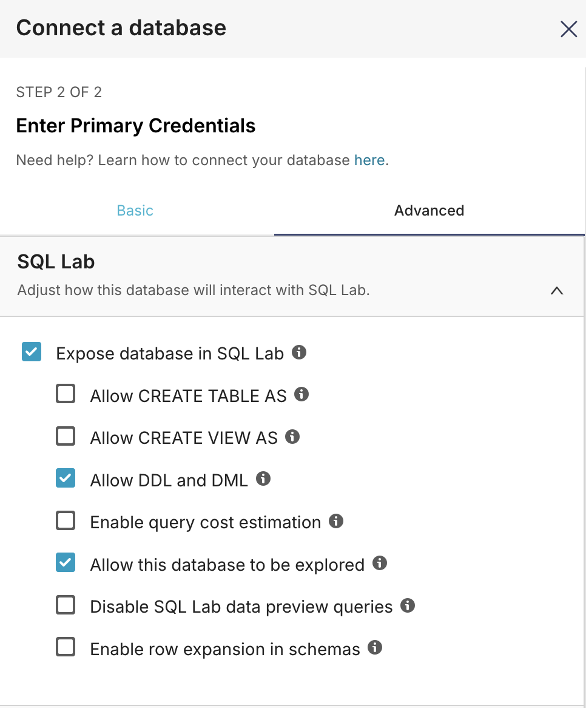

## Superset과 Trino를 사용한 데이터 시각화

## 소개

이 가이드는 Apache Superset을 Trino와 함께 사용하여 Amazon S3에 저장된 데이터를 쿼리하고 시각화하는 방법을 보여줍니다. 이 연습에서는 Superset을 Trino 데이터베이스에 연결하고, S3 버킷의 데이터에서 새 테이블을 생성하고, 계산된 열로 데이터를 강화하고, 인터랙티브 차트와 대시보드를 구축합니다.

Superset은 Trino와 동일한 EKS 클러스터에 배포되며, Trino는 S3의 데이터에 안전하게 액세스하기 위해 Pod Identity를 사용하도록 구성됩니다.

## 사전 요구 사항

- EKS에 Superset 인프라 배포: [인프라 설정](./infra.md)
- 로컬 머신에 다음 도구 설치:
  - `kubectl`
  - `aws-cli`
  - `wget`


## 예제 데이터 획득 및 업로드

이 예제에서는 NYC 택시 데이터를 사용합니다.

환경 설정:

```bash
export SUPERSET_DIR=$(git rev-parse --show-toplevel)/data-stacks/superset-on-eks
export S3_BUCKET=$(terraform -chdir=$SUPERSET_DIR/terraform/_local output -raw s3_bucket_id_spark_history_server)
```

데이터 가져오기:

```bash
wget https://d37ci6vzurychx.cloudfront.net/trip-data/yellow_tripdata_2025-01.parquet
```

데이터 복사:

```bash
aws s3 cp yellow_tripdata_2025-01.parquet s3://${S3_BUCKET}/example-data/
```

## Superset 구성에 로그인

### UI에 로그인

```bash
kubectl port-forward svc/superset 8088:8088 -n superset
```

다음으로 로그인:
  -  사용자명: `admin`
  -  비밀번호: `admin`


### 데이터베이스 연결 설정

Apache Superset은 모든 SQL 지원 데이터스토어 또는 데이터 엔진의 데이터에 연결됩니다. 이 가이드에서는 하나 이상의 이기종 데이터 소스에 분산된 대규모 데이터셋을 쿼리하도록 설계된 분산 SQL 쿼리 엔진인 Trino에 연결합니다.

먼저 EKS 클러스터에서 실행 중인 Trino 데이터베이스에 연결을 설정해 보겠습니다.

1.  Superset UI에서 **Settings** -> **Database Connections**로 이동합니다.
2.  오른쪽 상단의 **+ Database** 버튼을 클릭합니다.
3.  지원되는 데이터베이스 드롭다운 메뉴에서 **Trino**를 선택합니다.
4.  다음 SQLAlchemy URI를 입력합니다:

    ```
    trino://superset@trino.trino.svc.cluster.local:8080/hive
    ```

    

5.  **Advanced** 탭으로 이동합니다.
6.  **Allow DDL and DML** 체크박스를 선택합니다.
7.  **Finish**를 클릭합니다.

    

### `ny_taxi` 테이블 생성

테이블을 생성하기 전에 Superset이 Trino에 연결하고 사용 가능한 스키마를 볼 수 있는지 확인해 보겠습니다.

1.  Superset에서 **SQL** -> **SQL Lab**으로 이동합니다.
2.  Trino 데이터베이스가 선택되어 있는지 확인합니다.
3.  다음 쿼리를 실행하여 사용 가능한 스키마를 확인합니다:

    ```sql
    SHOW SCHEMAS FROM hive;
    ```

    이것은 사용 가능한 스키마 중 하나로 `data_on_eks`를 반환해야 합니다.

이제 S3 데이터를 가리키는 Trino에서 외부 테이블을 생성해 보겠습니다.

1.  SQL Editor에서 다음 `CREATE TABLE` 문을 실행합니다.

    :::info
    `external_location` 매개변수에서 `${YOUR_BUCKET_NAME}`을 이전에 내보낸 S3 버킷 이름으로 교체하세요. `echo $S3_BUCKET`을 실행하여 찾을 수 있습니다.
    :::

    ```sql
    CREATE TABLE hive.data_on_eks.ny_taxi (
           VendorID INTEGER,
           tpep_pickup_datetime TIMESTAMP,
           tpep_dropoff_datetime TIMESTAMP,
           passenger_count BIGINT,
           trip_distance DOUBLE,
           RatecodeID BIGINT,
           store_and_fwd_flag VARCHAR,
           PULocationID INTEGER,
           DOLocationID INTEGER,
           payment_type BIGINT,
           fare_amount DOUBLE,
           extra DOUBLE,
           mta_tax DOUBLE,
           tip_amount DOUBLE,
           tolls_amount DOUBLE,
           improvement_surcharge DOUBLE,
           total_amount DOUBLE,
           congestion_surcharge DOUBLE,
           Airport_fee DOUBLE,
           cbd_congestion_fee DOUBLE
       )
       WITH (
           format = 'PARQUET',
           external_location = 's3://${YOUR_BUCKET_NAME}/example-data/'
       );
    ```

2.  테이블이 생성되면 다음을 실행하여 데이터를 읽을 수 있는지 확인합니다:

    ```sql
    SELECT * FROM hive.data_on_eks.ny_taxi;
    ```


### 데이터셋 생성

Superset에서 **데이터셋**은 쿼리할 수 있는 테이블 또는 뷰의 가상 표현입니다. 데이터셋은 차트와 대시보드 생성의 기반이 됩니다. 기본 데이터베이스 테이블을 변경하지 않고 데이터를 강화하는 사용자 정의 차원 및 메트릭을 정의할 수 있습니다.

새 `ny_taxi` 테이블에서 데이터셋을 생성해 보겠습니다.

1.  **Datasets** 탭으로 이동하여 **+ Dataset**을 클릭합니다.
2.  Trino 데이터베이스(`trino`)를 선택합니다.
3.  `data_on_eks` 스키마를 선택합니다.
4.  `ny_taxi` 테이블을 선택합니다.
5.  **Create dataset and create chart**를 클릭합니다.


데이터를 더 쉽게 분석할 수 있도록 사용자 정의 **계산된 열**과 **메트릭**을 생성할 수 있습니다.

-   **계산된 열(Calculated Columns)**을 사용하면 기존 열에 SQL 함수를 적용하여 새 열을 생성할 수 있습니다(예: 타임스탬프에서 요일 추출).
-   **메트릭(Metrics)**은 차트에서 사용할 수 있는 사용자 정의 SQL 집계입니다(예: `AVG(total_amount)`).

이를 통해 데이터베이스에서 `ALTER TABLE` 명령을 실행하지 않고도 시각화를 위해 데이터셋을 강화할 수 있습니다.

평균 여행 비용에 대한 메트릭과 시간 및 요일에 대한 계산된 열을 추가해 보겠습니다.

1.  **Datasets** 탭으로 이동하여 `ny_taxi` 데이터셋을 찾고 **Edit** 아이콘을 클릭합니다.
2.  **Metrics** 탭을 선택하고 **+ Add item**을 클릭합니다.
3.  다음 세부 정보로 새 메트릭을 구성합니다:
    *   **Metric:** `avg_total_amount`
    *   **SQL Expression:** `AVG(total_amount)`
    *   **Description:** `Average total fare amount per trip`
    *   **D3 Format:** `$,.2f`
4.  이제 **Calculated Columns** 탭을 선택하고 **+ Add item**을 클릭합니다.
5.  `day_of_week` 열 생성:
    *   **Column Name:** `day_of_week`
    *   **SQL Expression:** `date_format(tpep_pickup_datetime, '%W')`
6.  **+ Add item**을 다시 클릭하여 `hour_of_day` 열 생성:
    *   **Column Name:** `hour_of_day`
    *   **SQL Expression:** `hour(tpep_pickup_datetime)`
7.  **Save**를 클릭하여 데이터셋에 변경 사항을 적용합니다.


### 차트 생성

이제 데이터셋이 강화되었으므로 택시 여행 데이터를 탐색하기 위한 몇 가지 차트를 생성해 보겠습니다.

#### 차트 1: 요일 및 시간별 여행 히트맵

이 차트는 "주중 택시 이용이 가장 많은 절대적인 시간대는 언제인가?"라는 질문에 답하는 데 도움이 됩니다.

1.  **Charts** 탭으로 이동하여 **+ Chart**를 클릭합니다.
2.  `ny_taxi` 데이터셋을 선택합니다.
3.  **Heatmap** 차트 유형을 선택합니다.
4.  **X-Axis**를 `hour_of_day`로 설정합니다.
5.  **Y-Axis**를 `day_of_week`로 설정합니다.
6.  **Metric**을 `COUNT(*)`로 설정합니다.
7.  **Create new chart**를 클릭합니다.
8.  차트에 이름을 지정하고(예: "요일 및 시간별 여행 히트맵") 저장합니다.

#### 차트 2: 시간대별 평균 여행 요금

이 차트는 특정 시간대의 여행이 더 수익성이 있는지 보여주어 "심야 여행이 평균적으로 낮 시간대 여행보다 더 비싼가?"라는 질문에 답할 수 있습니다.

1.  `ny_taxi` 데이터셋을 사용하여 다른 새 차트를 생성합니다.
2.  **Line Chart** 또는 **Bar Chart** 유형을 선택합니다.
3.  **Dimension / X-Axis**를 `hour_of_day`로 설정합니다.
4.  **Metric**을 이전에 생성한 `avg_total_amount` 메트릭으로 설정합니다.
5.  **Create new chart**를 클릭합니다.
6.  차트에 이름을 지정하고(예: "시간대별 평균 여행 요금") 저장합니다.


### 대시보드 생성

마지막으로 차트를 단일 대시보드로 결합해 보겠습니다.

1.  **Dashboards** 탭으로 이동하여 **+ Dashboard**를 클릭합니다.
2.  새 대시보드에 "NYC Taxi Insights"와 같은 이름을 지정합니다.
3.  대시보드 편집기로 이동합니다. 오른쪽 "Charts" 패널에서 생성한 두 차트를 대시보드 캔버스로 드래그합니다.
4.  원하는 대로 차트 크기를 조정하고 배치합니다.
5.  **Save**를 클릭합니다.

이제 택시 데이터를 탐색하기 위한 인터랙티브 대시보드가 완성되었습니다. 분석을 계속하기 위해 더 많은 차트를 만들고 대시보드에 추가해 보세요.


## 정리

AWS 계정에 원하지 않는 비용이 발생하지 않도록 이 배포 중에 생성된 모든 AWS 리소스를 삭제하는 것이 중요합니다.

`data-stacks/superset-on-eks` 디렉토리의 `cleanup.sh` 스크립트는 생성된 모든 리소스를 삭제합니다.

```bash
cd $(git rev-parse --show-toplevel)/data-stacks/superset-on-eks
./cleanup.sh
```

:::caution
이 명령은 EKS 클러스터와 모든 관련 리소스를 영구적으로 삭제합니다.
:::
