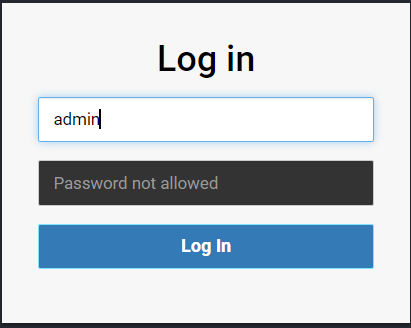
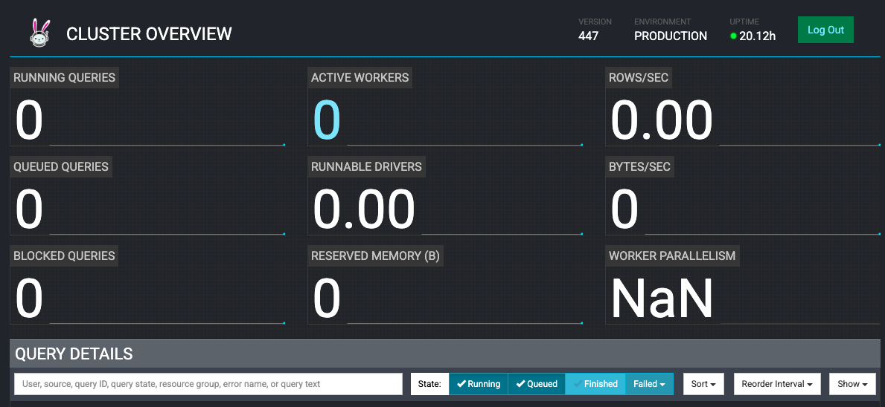
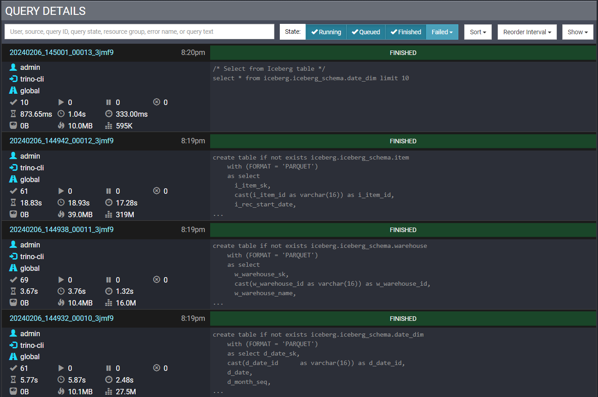

# Trino on EKS 인프라

Amazon EKS에 KEDA 오토스케일링, 장애 허용 및 비용 최적화를 갖춘 프로덕션 준비 완료 Trino 클러스터를 배포하세요.

## 아키텍처

이 스택은 탄력적인 노드 프로비저닝을 위한 Karpenter와 쿼리 기반 오토스케일링을 위한 KEDA를 사용하여 EKS에 Trino를 배포합니다. 아키텍처는 비용 최적화를 위한 제로 스케일(scale-to-zero)과 신뢰성을 위한 장애 허용 실행을 지원합니다.

**주요 컴포넌트:**
- **Coordinator** - 쿼리 계획 및 워커 관리를 위한 단일 코디네이터
- **Workers** - 쿼리 수요에 따라 자동 스케일링되는 워커 (0 ~ N)
- **Karpenter** - 코디네이터용 온디맨드 노드, 워커용 Spot 프로비저닝
- **KEDA** - 대기열 및 실행 중인 쿼리 기반으로 워커 스케일링
- **S3 Exchange Manager** - S3에 중간 데이터를 저장하는 장애 허용 실행

## 사전 요구 사항

배포하기 전에 다음 도구가 설치되어 있는지 확인하세요:

- **AWS CLI** - [설치 가이드](https://docs.aws.amazon.com/cli/latest/userguide/getting-started-install.html)
- **Terraform** (>= 1.0) - [설치 가이드](https://developer.hashicorp.com/terraform/install)
- **kubectl** - [설치 가이드](https://kubernetes.io/docs/tasks/tools/)
- **Helm** (>= 3.0) - [설치 가이드](https://helm.sh/docs/intro/install/)
- **Trino CLI** - [설치 가이드](https://trino.io/docs/current/client/cli.html)
- **AWS 자격 증명 구성됨** - `aws configure` 실행 또는 IAM 역할 사용

<details>
<summary>Trino CLI 설치</summary>

```bash
# Trino CLI 다운로드
wget https://repo1.maven.org/maven2/io/trino/trino-cli/427/trino-cli-427-executable.jar
mv trino-cli-427-executable.jar trino
chmod +x trino

# 설치 확인
./trino --version
```
</details>

## 1단계: 저장소 복제 및 이동

```bash
git clone https://github.com/awslabs/data-on-eks.git
cd data-on-eks/data-stacks/trino-on-eks
```

## 2단계: 스택 구성 커스터마이징

배포를 커스터마이징하려면 스택 구성 파일을 편집합니다:

```bash
vi terraform/data-stack.tfvars
```

구성을 검토하고 커스터마이징합니다:

```hcl title="terraform/data-stack.tfvars"
name   = "trino-v2"
region = "us-west-2"

# 핵심 Trino 컴포넌트
enable_trino           = true
enable_trino_keda      = true

# 선택 사항: 추가 데이터 플랫폼 컴포넌트
enable_spark_operator       = true   # Trino만 필요한 경우 false로 설정
enable_spark_history_server = true   # Trino만 필요한 경우 false로 설정
enable_yunikorn             = true   # 고급 스케줄링
enable_jupyterhub           = true   # 데이터 탐색용 노트북
enable_flink                = true   # 스트림 처리
enable_kafka                = true   # 이벤트 스트리밍
enable_superset             = true   # BI 대시보드
enable_ingress_nginx        = true   # Ingress 컨트롤러
```

:::tip 최소 Trino 배포

Trino 전용 배포의 경우 모든 선택적 컴포넌트를 `false`로 설정:

```hcl
enable_trino      = true
enable_trino_keda = true

enable_spark_operator       = false
enable_spark_history_server = false
enable_yunikorn             = false
enable_jupyterhub           = false
enable_flink                = false
enable_kafka                = false
enable_superset             = false
```

이렇게 하면 배포 시간과 비용이 ~60% 감소합니다.

:::

## 배포되는 항목

Trino가 활성화된 스택을 배포하면 다음 컴포넌트가 프로비저닝됩니다:

### Trino 컴포넌트

| 컴포넌트 | 용도 | 인스턴스 타입 |
|-----------|---------|---------------|
| **Trino Coordinator** | 쿼리 파싱, 계획, 워커 관리 | r8g.4xlarge (구성 가능) |
| **Trino Workers** | 태스크 실행 및 데이터 처리 | r8g.4xlarge (오토스케일링) |
| **KEDA ScaledObject** | 쿼리 기반 오토스케일링 (0 ~ 10 워커) | N/A |
| **S3 Exchange Bucket** | 장애 허용 실행 중간 스토리지 | N/A |
| **S3 Data Bucket** | Hive/Iceberg 테이블 스토리지 | N/A |

### KEDA 오토스케일링 구성

Trino 워커는 쿼리 수요에 따라 자동으로 스케일링됩니다:

**스케일링 트리거:**
- **대기열 쿼리** - 대기열 쿼리 > 5개 임계값 초과 시 스케일 업
- **실행 중인 쿼리** - 실행 중인 쿼리 > 10개 임계값 초과 시 스케일 업
- **쿨다운 기간** - 스케일 다운 전 300초 (5분)
- **최소 레플리카** - 1 (제로 스케일의 경우 0으로 변경 가능)
- **최대 레플리카** - 10 (구성 가능)

**메트릭 소스:** Prometheus (`kube-prometheus-stack`에서)

### 구성된 커넥터

즉시 사용 가능한 사전 구성된 커넥터:

| 커넥터 | 카탈로그 | 데이터 소스 |
|-----------|---------|-------------|
| **Hive** | `hive` | AWS Glue 메타스토어 + S3 스토리지 |
| **Iceberg** | `iceberg` | AWS Glue 카탈로그 + S3 테이블 |
| **TPCDS** | `tpcds` | 내장 벤치마크 데이터 생성기 |
| **TPCH** | `tpch` | 내장 벤치마크 데이터 생성기 |

## 3단계: 인프라 배포

배포 스크립트를 실행합니다:

```bash
./deploy.sh
```

:::info

**예상 배포 시간:** 15-20분

EKS 클러스터, 모든 플랫폼 애드온 및 Trino 컴포넌트가 포함됩니다.

:::

## 4단계: 배포 확인

배포 스크립트는 자동으로 kubectl을 구성합니다. 클러스터와 Trino 컴포넌트를 확인합니다:

```bash
# kubeconfig 설정 (deploy.sh에서 자동으로 완료됨)
export KUBECONFIG=kubeconfig.yaml

# Trino 파드 확인
kubectl get pods -n trino
```

### 예상 출력

```bash
NAME                                 READY   STATUS    RESTARTS   AGE
trino-coordinator-5b888ddfd4-sqwcg   2/2     Running   0          5m
trino-worker-0                       2/2     Running   0          5m
```

:::info 클러스터 이름

EKS 클러스터 이름은 **`trino-v2`**입니다 (`data-stack.tfvars`에서).

확인하려면:
```bash
aws eks describe-cluster --name trino-v2 --region us-west-2
```

:::

### KEDA 오토스케일링 확인

```bash
# KEDA ScaledObject 확인
kubectl get scaledobject -n trino
```

**예상 출력:**
```bash
NAME                  MIN   MAX   TRIGGERS     READY   ACTIVE   AGE
trino-worker-scaler   1     10    prometheus   True    False    6m
```

### Karpenter 노드 확인

Trino용으로 Karpenter가 프로비저닝한 노드 확인:

```bash
kubectl get nodes -L karpenter.sh/capacity-type -L node.kubernetes.io/instance-type -L topology.kubernetes.io/zone
```

**예상 출력:**
```bash
NAME                                        CAPACITY-TYPE   INSTANCE-TYPE   ZONE
ip-100-64-19-118.us-west-2.compute.internal on-demand       r8g.4xlarge     us-west-2a
```

:::info 단일 AZ 배포

Trino와 같은 분산 쿼리 엔진의 경우 단일 AZ에 배포하면 높은 AZ 간 데이터 전송 비용을 피할 수 있습니다. Karpenter NodePools는 모든 Trino 노드를 동일한 가용 영역에서 시작하도록 구성됩니다.

:::

## 5단계: Trino UI 액세스

Trino 서비스를 포트 포워딩하여 웹 UI에 액세스합니다:

```bash
kubectl -n trino port-forward service/trino 8080:8080
```

브라우저에서 [http://localhost:8080](http://localhost:8080) 을 열고 사용자명 **`admin`**으로 로그인합니다 (비밀번호 필요 없음).



처음에는 활성 워커가 0개로 표시됩니다 (KEDA가 쿼리가 도착하면 워커를 스케일링합니다):



## 6단계: 예제로 배포 테스트

### 예제 1: Hive 커넥터 사용

NYC 택시 데이터셋으로 AWS Glue를 사용하여 Hive 메타스토어 설정:

#### 설정

```bash
# 예제 디렉토리로 이동
cd examples/

# Hive 설정 스크립트 실행 (S3 버킷 생성, 데이터 로드, Glue 테이블 생성)
./hive-setup.sh
```

설정이 성공적으로 완료되면 Glue 테이블 이름이 **`hive`**로 표시됩니다.

#### 쿼리 실행

새 터미널을 열고 Trino CLI로 연결합니다:

```bash
# Trino 서비스 포트 포워딩 (아직 실행 중이 아닌 경우)
kubectl -n trino port-forward service/trino 8080:8080
```

다른 터미널에서 Trino CLI 실행:

```bash
./trino http://127.0.0.1:8080 --user admin
```

:::tip 첫 번째 쿼리가 오토스케일링을 트리거합니다

첫 번째 쿼리는 KEDA가 워커를 0에서 1로 스케일링하도록 트리거하며, 노드 프로비저닝 및 파드 시작에 ~60-90초가 소요됩니다.

:::

**카탈로그 표시:**
```sql
SHOW CATALOGS;
```

**출력:**
```
 Catalog
---------
 hive
 iceberg
 system
 tpcds
 tpch
(5 rows)
```

**Hive 카탈로그의 스키마 표시:**
```sql
SHOW SCHEMAS FROM hive;
```

**출력:**
```
  Schema
--------------------
 information_schema
 taxi_hive_database
(2 rows)
```

**Hive 테이블 쿼리:**
```sql
USE hive.taxi_hive_database;
SHOW TABLES;
SELECT * FROM hive LIMIT 5;
```

**출력:**
```
vendorid |  tpep_pickup_datetime   |  tpep_dropoff_datetime  | passenger_count | trip_distance | ...
---------+-------------------------+-------------------------+-----------------+---------------+-----
       1 | 2022-09-01 00:28:12.000 | 2022-09-01 00:36:22.000 |             1.0 |           2.1 | ...
       1 | 2022-11-01 00:24:49.000 | 2022-11-01 00:31:04.000 |             2.0 |           1.0 | ...
```

#### Hive 리소스 정리

```bash
# Trino CLI 종료
exit

# 정리 스크립트 실행
cd examples/
./hive-cleanup.sh
```

### 예제 2: Iceberg 커넥터 사용

TPCDS 벤치마크 데이터셋의 데이터로 Iceberg 테이블을 생성합니다.

#### S3 데이터 버킷 찾기

```bash
cd terraform/_local
export S3_BUCKET=$(terraform output -raw s3_bucket_id_trino_data)
echo $S3_BUCKET
```

**출력:**
```
trino-v2-data-bucket-20240215180855515400000001
```

#### Iceberg 스키마 및 테이블 생성

예제 SQL 파일은 다음을 생성합니다:
- `iceberg_schema`라는 Iceberg 스키마
- 4개의 테이블: `warehouse`, `item`, `inventory`, `date_dim`
- TPCDS sf10000 데이터셋에서 채워진 테이블

```bash
# SQL 파일에서 S3 버킷 대체
envsubst < examples/trino_sf10000_tpcds_to_iceberg.sql > examples/iceberg.sql

# SQL 명령 실행
./trino --file 'examples/iceberg.sql' --server http://localhost:8080 --user admin --ignore-errors
```

이렇게 하면 수백만 개의 행이 있는 테이블이 생성되어 워커 오토스케일링이 트리거됩니다.

#### KEDA 오토스케일링 모니터링

다른 터미널에서 KEDA 워커 스케일링 확인:

```bash
kubectl get hpa -n trino -w
```

**출력:**
```
NAME                                REFERENCE                 TARGETS                MINPODS   MAXPODS   REPLICAS
keda-hpa-keda-scaler-trino-worker   Deployment/trino-worker   0/1, 1/1 + 1 more...   1         15        1
keda-hpa-keda-scaler-trino-worker   Deployment/trino-worker   0/1, 0/1 + 1 more...   1         15        2
```

Trino Web UI에서 쿼리 실행 확인:



부하에 따른 워커 스케일링 확인:


#### Iceberg 리소스 정리

```bash
# Trino CLI에 연결
./trino http://127.0.0.1:8080 --user admin
```

```sql
-- 테이블 및 스키마 삭제
DROP TABLE iceberg.iceberg_schema.warehouse;
DROP TABLE iceberg.iceberg_schema.item;
DROP TABLE iceberg.iceberg_schema.inventory;
DROP TABLE iceberg.iceberg_schema.date_dim;
DROP SCHEMA iceberg.iceberg_schema;

-- 종료
exit
```

### 예제 3: 장애 허용 실행

EKS의 Trino는 S3를 교환 관리자로 사용하는 [장애 허용 실행](https://trino.io/docs/current/admin/fault-tolerant-execution.html)으로 구성됩니다. 이를 통해 워커 노드가 실패해도 쿼리가 완료될 수 있습니다.

#### 장애 허용 구성 확인

코디네이터 구성 확인:

```bash
# 코디네이터 파드 이름 가져오기
COORDINATOR_POD=$(kubectl get pods -l "app.kubernetes.io/instance=trino,app.kubernetes.io/component=coordinator" -o name -n trino)

# config.properties 보기
kubectl exec --stdin --tty $COORDINATOR_POD -n trino -- /bin/bash
cat /etc/trino/config.properties
```

**출력:**
```properties
coordinator=true
node-scheduler.include-coordinator=false
http-server.http.port=8080
query.max-memory=280GB
query.max-memory-per-node=22GB
discovery.uri=http://localhost:8080
retry-policy=TASK
exchange.compression-enabled=true
query.low-memory-killer.delay=0s
query.remote-task.max-error-duration=1m
```

교환 관리자 구성 확인:

```bash
cat /etc/trino/exchange-manager.properties
exit
```

**출력:**
```properties
exchange-manager.name=filesystem
exchange.base-directories=s3://trino-exchange-bucket-20240215180855570800000004
exchange.s3.region=us-west-2
exchange.s3.iam-role=arn:aws:iam::123456789012:role/trino-sa-role
```

#### 장애 허용 테스트

쿼리를 실행하고 실행 중에 워커를 종료하여 장애 허용을 확인합니다:

```bash
# 백그라운드에서 쿼리 실행
./trino --file 'examples/trino_select_query_iceberg.sql' --server http://localhost:8080 --user admin --ignore-errors
```

**쿼리 시작 직후** 다른 터미널을 엽니다:

```bash
# 워커를 1로 스케일 다운 (노드 장애 시뮬레이션)
kubectl scale deployment trino-worker -n trino --replicas=1
```

**예상 동작:**
1. 종료된 워커로 인해 일부 태스크 실패
2. 교환 관리자가 중간 데이터를 S3에 저장
3. 남은 워커가 실패한 태스크 재시도
4. 장애에도 불구하고 쿼리가 성공적으로 완료

Trino UI에서 종료된 워커 확인:


스풀링된 데이터를 위한 S3 교환 관리자 버킷 확인:


실패한 태스크(빨간색 원)가 있는 완료된 쿼리 확인:


:::info 재시도 정책

- **TASK 재시도 정책** - 대규모 배치 쿼리에 권장 (이 배포에서 사용)
- **QUERY 재시도 정책** - 많은 소규모 쿼리에 더 적합

`config.properties`의 `retry-policy`를 통해 구성합니다.

:::

## 모범 사례

### EKS에서 대규모 Trino 실행

프로덕션 배포 및 오픈소스 커뮤니티 학습을 기반으로:

:::tip 중요: 1-Pod-Per-Node 패턴

**Trino/Starburst 공식 권장 사항**: Kubernetes 노드당 정확히 **하나의 Trino 워커 파드**를 배포합니다.

이는 일반적인 Kubernetes 수평 스케일링 패턴과 크게 다르며 최적의 Trino 성능에 필수적입니다.

**왜 중요한가:**
- Trino는 노드 CPU 및 메모리 리소스에 **독점적 액세스**가 필요
- 다른 파드와의 리소스 공유는 **예측 불가능한 쿼리 성능** 및 실패 유발
- 모든 워커에서 **균일한 리소스 할당**을 위해 설계됨
- 오토스케일링은 파드만이 아닌 **전체 노드**를 추가/제거

**구현:**
- 전용 NodePools와 taints/tolerations 사용
- Pod anti-affinity 규칙 구성
- Karpenter가 워커 파드당 하나의 노드 프로비저닝
- Trino 워커와 다른 워크로드 혼합 금지

**참조:** [Starburst Kubernetes 모범 사례](https://docs.starburst.io/latest/k8s/requirements.html#resource-allocation)

:::

#### 코디네이터 구성

**워크로드에 맞는 크기 조정:**
- 코디네이터는 데이터 처리가 아닌 쿼리 계획 및 워커 오케스트레이션 처리
- 소규모-중규모 클러스터 (< 50 워커): 4-8 vCPU, 16-32GB RAM 충분
- 대규모 클러스터 (50-100 워커): 8-16 vCPU, 32-64GB RAM 권장
- 초대규모 클러스터 (100+ 워커): 16+ vCPU와 비례적 메모리
- 코어 컴퓨팅 인스턴스 (m6a, m6i) 사용 - 일반적으로 메모리 최적화 인스턴스 불필요
- 고가용성을 위해 항상 온디맨드 인스턴스에서 실행

**왜 중요한가:** 단일 코디네이터가 수백 개의 워커를 관리할 수 있습니다. 데이터 볼륨이 아닌 쿼리 동시성 및 클러스터 상태 관리 요구 사항에 따라 크기 조정.

#### 워커 구성

**1-Pod-Per-Node 패턴 설명:**

효율성을 위해 노드당 여러 파드를 패킹하는 일반적인 Kubernetes 배포와 달리, Trino 워커는 전용 노드 리소스가 필요합니다. 이것은 최적화가 아닌 근본적인 아키텍처 요구 사항입니다.

**메모리 가이드라인:**
- 노드 메모리의 70-85%를 JVM 힙에 할당
- JVM 힙을 워커당 256GB 미만으로 유지 (JVM 가비지 컬렉션 제한)
- `query.max-memory-per-node`를 JVM 힙의 ~80%로 구성
- OS 및 비쿼리 작업을 위해 10-15% 메모리 여유 공간 유지

**인스턴스 선택:**
- 데이터 집약적 분석에 메모리 최적화 인스턴스 (r6i, r8g)
- Graviton 인스턴스 (ARM64)가 우수한 가격 대비 성능 제공
- 워커당 오버헤드를 줄이기 위해 더 큰 인스턴스 선호 (많은 소규모 대신 적은 대규모 워커)

#### 오토스케일링 전략

**KEDA를 사용한 제로 스케일:**
- 유휴 워커 비용 제거를 위해 `minReplicaCount: 0` 구성
- 쿼리 도착 시 60-90초 내에 워커 프로비저닝
- Prometheus 메트릭 사용: 대기열 쿼리 및 실행 중인 쿼리
- 빠른 스케일링 진동 방지를 위해 쿨다운 기간 설정 (300초 권장)
- Karpenter가 1-pod-per-node 패턴에 따라 전체 노드 프로비저닝/종료 (파드만이 아님)

**프로덕션 튜닝:**
- 코디네이터 용량에 따라 쿼리 대기열 임계값 설정
- 최소/최대 레플리카 수 최적화를 위해 워커 활용 패턴 모니터링
- 필요한 경우 다양한 쿼리 워크로드 유형에 대해 별도의 NodePools 사용
- 기억: 워커 스케일링 = 노드 스케일링 (1:1 관계)

#### 네트워크 및 데이터 지역성

**단일 AZ 배포:**
- 모든 Trino 노드를 동일한 가용 영역에 배포
- 코디네이터와 워커 간 네트워크 지연 감소
- 분산 쿼리 처리를 위한 AZ 간 데이터 전송 비용 제거
- `topology.kubernetes.io/zone` 제약 조건으로 Karpenter NodePools 구성

**10Gb+ 네트워킹:**
- 인스턴스 타입이 충분한 네트워크 대역폭 지원하는지 확인
- 분산 SQL 엔진은 셔플 작업 중 네트워크 집약적
- 최신 인스턴스는 기본적으로 10-25Gb 네트워크 제공

#### 장애 허용 실행

**Exchange Manager 구성:**
- 중간 쿼리 데이터를 위한 S3 기반 교환 관리자 활성화
- 대규모 배치 쿼리에 TASK 재시도 정책 사용
- 많은 소규모, 단시간 실행 쿼리에 QUERY 재시도 정책 사용
- Spot 인스턴스와 잘 결합됨 - 워커 종료에도 쿼리 생존

**활성화 시기:**
- 재시작 비용이 높은 장시간 실행 쿼리 (> 5분)
- 비용 최적화를 위해 Spot 인스턴스를 사용하는 클러스터
- 높은 신뢰성 보장이 필요한 워크로드

#### 리소스 관리

**쿼리 동시성:**
- 코디네이터에서 동시 쿼리 제한 (일반적으로 40-60)
- 리소스 그룹을 사용하여 다양한 워크로드 우선순위 분리
- 쿼리당 및 노드당 메모리 제한 구성
- 높은 동시성에서 코디네이터 잠금 경합 모니터링

**스토리지 고려 사항:**
- Trino는 주로 인메모리 - 최소 디스크 사용
- OS 및 로그를 위해 노드당 50-100GB EBS 충분
- 쿼리가 메모리 제한을 초과하는 경우에만 디스크로 스필링 활성화
- 고성능 스필링을 위해 NVMe 인스턴스 스토리지 고려

#### 커넥터 모범 사례

**S3의 Hive/Iceberg:**
- 서버리스 메타데이터 관리를 위해 AWS Glue를 메타스토어로 사용
- 고처리량 쿼리를 위한 S3 요청 속도 최적화 활성화
- 쿼리 프루닝을 위해 대형 테이블 적절히 파티셔닝
- 프레디케이트 푸시다운이 있는 컬럼형 형식 (Parquet, ORC) 사용

**다중 소스 쿼리:**
- 커넥터 간 데이터 이동 패턴 이해
- `EXPLAIN`을 사용하여 비용이 많이 드는 크로스 커넥터 조인 식별
- 연합 소스 조인 시 데이터 지역성 고려
- 오버헤드 감소를 위해 자주 액세스하는 메타데이터 캐싱

#### 모니터링 및 관측성

**추적할 주요 메트릭:**
- 코디네이터 메모리 및 CPU 활용도
- 워커 수 및 리소스 활용도
- 쿼리 대기열 깊이 및 실행 시간
- 실패한 쿼리 및 태스크 재시도 횟수
- 워커 간 네트워크 처리량
- S3 API 요청 속도 및 오류

**통합:**
- 네이티브 메트릭 수집을 위해 Prometheus ServiceMonitor 사용
- Trino 전용 시각화를 위해 Grafana 대시보드 배포
- 오토스케일링 동작을 위해 KEDA ScaledObject 모니터링
- Karpenter 노드 프로비저닝 시간 및 효율성 추적

## 문제 해결

### 워커가 스케일링되지 않음

**문제:** 쿼리 도착 시 KEDA가 워커를 스케일링하지 않음

```bash
# KEDA ScaledObject 상태 확인
kubectl describe scaledobject trino-worker-scaler -n trino

# KEDA 연산자 로그 확인
kubectl logs -n keda -l app.kubernetes.io/name=keda-operator

# Prometheus 메트릭 확인
kubectl port-forward -n kube-prometheus svc/kube-prometheus-kube-prome-prometheus 9090:9090
# http://localhost:9090 열고 쿼리: trino_execution_QueryManager_QueuedQueries
```

**해결책:**
- Prometheus가 실행 중이고 Trino 메트릭을 스크래핑하는지 확인
- KEDA ScaledObject의 `serverAddress`가 Prometheus 서비스와 일치하는지 확인
- 메트릭 쿼리가 데이터를 반환하는지 확인

### 메모리 부족으로 쿼리 실패

**문제:** 쿼리가 "Query exceeded per-node memory limit"으로 실패

```bash
# query.max-memory-per-node 설정 확인
kubectl exec -it $COORDINATOR_POD -n trino -- cat /etc/trino/config.properties | grep memory
```

**해결책:**
- 코디네이터 구성에서 `query.max-memory-per-node` 증가
- 더 큰 워커 인스턴스 사용 (r8g.8xlarge, r8g.12xlarge)
- 디스크로 스필링 활성화 (성능 대신 안정성)

### 코디네이터에 연결할 수 없음

**문제:** Trino 코디네이터에 연결할 수 없음

```bash
# 코디네이터 파드 상태 확인
kubectl get pods -n trino -l app.kubernetes.io/component=coordinator

# 코디네이터 로그 보기
kubectl logs -n trino -l app.kubernetes.io/component=coordinator
```

**해결책:**
- 파드가 Running 및 Ready (2/2) 상태인지 확인
- 서비스 존재 확인: `kubectl get svc -n trino`
- 포트 포워딩 명령이 올바른지 확인

## 정리

모든 리소스를 제거하려면:

```bash
cd data-on-eks/data-stacks/trino-on-eks
./cleanup.sh
```

:::warning

다음을 포함한 모든 리소스가 삭제됩니다:
- EKS 클러스터 및 모든 워크로드
- S3 버킷 (데이터, 교환 관리자, 로그)
- Glue 데이터베이스 및 테이블
- VPC 및 네트워킹 리소스

정리 전에 중요한 데이터를 백업했는지 확인하세요.

:::

:::caution 추가 수동 정리

`cleanup.sh` 실행 후 다음 리소스가 삭제되었는지 확인:
- `trino-*` 접두사가 있는 S3 버킷
- 리전의 Glue 데이터베이스
- CloudWatch 로그 그룹

:::

## 다음 단계

Trino가 배포되면 추가 사용 사례를 탐색하세요:

- **다중 소스 쿼리** - S3 데이터와 RDS PostgreSQL 조인
- **스트리밍 분석** - S3 데이터 레이크와 함께 Kafka 토픽 쿼리
- **머신 러닝** - 데이터 준비를 위해 JupyterHub와 함께 Trino 사용
- **BI 통합** - Superset 또는 Tableau를 Trino에 연결

## 리소스

- [Trino 공식 문서](https://trino.io/docs/current/)
- [Starburst Kubernetes 가이드](https://docs.starburst.io/latest/k8s.html)
- [KEDA 오토스케일링](https://keda.sh/)
- [AWS Glue 커넥터](https://trino.io/docs/current/connector/hive.html)
- [S3의 Iceberg](https://trino.io/docs/current/connector/iceberg.html)
