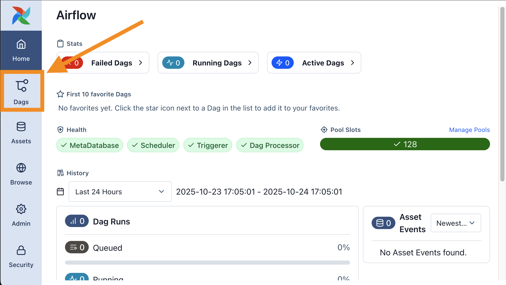
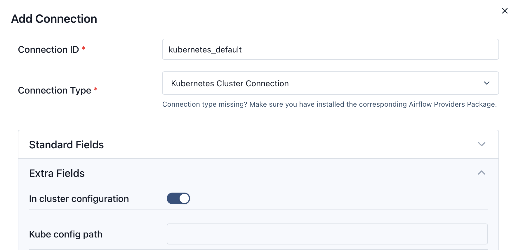

## Airflow로 Spark 작업 오케스트레이션

## 소개

이 가이드는 EKS에 자체 관리형 [Apache Airflow](https://airflow.apache.org/docs/apache-airflow/stable/) 배포를 사용하여 [Apache Spark](https://spark.apache.org/) 작업을 오케스트레이션하는 방법을 보여줍니다. 이전 단계에서 배포한 Airflow 인스턴스를 사용하여 샘플 PySpark 애플리케이션을 실행합니다.

**아키텍처**


## 사전 요구 사항

- EKS에 Airflow 인프라 배포: [인프라 설정](./infra.md)


### Airflow Web UI 로그인

```bash
kubectl port-forward svc/airflow-api-server 8080:8080 -n airflow
```

다음으로 로그인:
  -  사용자명: `admin`
  -  비밀번호: `admin`


### 샘플 Airflow 작업 실행

Airflow 설치가 올바르게 작동하는지 확인하려면 포함된 예제 DAG를 트리거할 수 있습니다.



1.  메인 메뉴에서 **Dags** 페이지로 이동합니다. [DAG Bundles](https://airflow.apache.org/docs/apache-airflow/stable/administration-and-deployment/dag-bundles.html) 기능을 통해 사전 로드된 DAG 목록이 표시됩니다.
2.  `simple_example_dag`을 찾아 **Trigger** 버튼 (▶)을 클릭하여 새 DAG 실행을 시작합니다.
3.  목록에서 새 DAG 실행을 클릭하여 진행 상황을 확인합니다.
4.  **Code** 탭을 클릭하여 DAG의 소스 코드를 볼 수 있습니다. 이 예제는 Bash 명령과 Python 코드를 모두 실행하는 간단한 DAG입니다.
5.  1분 후 DAG 실행이 **Success**로 표시되어야 합니다.
6.  특정 태스크의 로그를 검사하려면 **Task Instances** 탭으로 이동하여 태스크 ID를 클릭합니다.

이 스택에서 로그는 원격 로깅 기능을 사용하여 S3에 저장됩니다. Amazon CloudWatch와 같은 다른 서비스에도 로그를 작성할 수 있습니다.

### DAG가 Bundles를 통해 로드되는 방법

이 스택은 Airflow 3.0.0에서 도입된 **DAG Bundles** 기능을 사용하여 예제 DAG를 로드합니다. 이 방법을 사용하면 외부 소스에서 DAG를 동적으로 로드할 수 있습니다.

**퍼블릭 Git 저장소에서 로드**

*   예제 DAG는 퍼블릭 `data-on-eks` GitHub 저장소에서 가져옵니다.
*   Airflow는 인증 없이 이 저장소를 복제하도록 구성됩니다.
*   **프라이빗 저장소의 경우:** Airflow Admin UI에서 **Git Connection**을 구성하고 필요한 자격 증명(예: 개인 액세스 토큰)을 제공하여 프라이빗 Git 저장소에 연결할 수 있습니다.

**S3 DAG Bundles에 대한 참고 사항**

*   Airflow는 Amazon S3에서 DAG 번들 가져오기도 지원하지만, 이 기능은 Airflow 버전 3.1.0에서 알려진 문제가 있으며 향후 릴리스에서 수정될 예정입니다.
*   이 스택에는 이미 DAG Processor가 S3에 액세스하는 데 필요한 IAM 역할 및 Kubernetes 구성 (ServiceAccount, RBAC 및 Pod Identity)이 포함되어 있어 Airflow에서 기능이 패치되면 바로 사용할 수 있습니다.


### Karpenter를 사용한 EKS에서 Spark 애플리케이션 실행


이 Airflow 스택은 클러스터 오토스케일러로 [Karpenter](https://karpenter.sh/)를 사용하여 EKS에서 Spark 작업을 매우 효율적으로 실행하도록 구성되어 있습니다. 이 접근 방식은 기존 EKS Managed Node Groups 및 Cluster Autoscaler를 사용하는 것에 비해 여러 장점을 제공합니다.

**Spark 워크로드를 위한 주요 Karpenter 기능:**

*   **효율적인 스케일링:** Karpenter는 워크로드 수요에 따라 직접 노드를 시작 및 종료하여 표준 Cluster Autoscaler보다 더 빠르고 효율적인 스케일링을 제공합니다.
*   **제로로 스케일:** 노드는 필요할 때만 프로비저닝되고 유휴 상태일 때 제거되어 리소스 낭비를 제거함으로써 비용을 크게 절감합니다.
*   **유연한 노드 프로비저닝:** Karpenter는 Spark 작업의 특정 요구 사항(예: 컴퓨팅 최적화, 메모리 최적화)에 따라 다양한 인스턴스 유형(Spot 및 온디맨드 포함)을 프로비저닝할 수 있습니다. 이는 유연한 `NodePools`를 통해 관리됩니다.
*   **대상 지정 스케줄링:** Spark 애플리케이션 매니페스트에서 노드 선택기 및 톨러레이션을 사용하여 드라이버 및 익스큐터 파드가 가장 적절하고 비용 효율적인 인스턴스 유형에 배치되도록 할 수 있습니다.

이 튜토리얼에서는 메모리 최적화 인스턴스용으로 구성된 Karpenter `NodePool`을 활용하는 Spark 작업을 실행합니다.

Spark 파드가 올바르게 스케줄링되도록 하려면 Spark 애플리케이션 매니페스트에 특정 `nodeSelector` 필드를 추가해야 합니다. 이를 통해 드라이버 및 익스큐터 파드가 어떤 노드에 배치되는지 제어할 수 있습니다. 예를 들어, 드라이버는 안정적인 온디맨드 인스턴스에서 실행하고 익스큐터는 비용 효율적인 Spot 인스턴스를 사용하도록 할 수 있습니다.

**예시 `nodeSelector`:**

다음 스니펫은 특정 `NodePool` 및 용량 유형을 대상으로 하는 방법을 보여줍니다. 이것은 Spark 애플리케이션의 파드 구성 내에 배치됩니다.

```yaml
    # 특정 Karpenter NodePool을 대상으로 하는 예시 nodeSelector
    nodeSelector:
      NodeGroupType: "SparkComputeOptimized"
      karpenter.sh/capacity-type: "on-demand"
```

### Airflow Web UI에서 Kubernetes 기본 연결 생성

이 단계는 Airflow가 EKS 클러스터에 연결하기 위해 중요합니다.

- ALB URL을 사용하여 `admin` 및 비밀번호 `admin`으로 Airflow WebUI에 로그인
- `Admin` 드롭다운을 선택하고 `Connections` 클릭
- "+" 버튼을 클릭하여 새 레코드 추가
- Connection Id를 `kubernetes_default`, Connection Type을 `Kubernetes Cluster Connection`으로 입력하고 **In cluster configuration** 체크박스 선택
- Save 버튼 클릭




### Spark 예제 DAG 실행

이제 PySpark 애플리케이션을 실행하는 메인 예제 DAG를 트리거할 준비가 되었습니다.

1.  Airflow UI에서 **Dags** 페이지로 돌아갑니다.
2.  `pyspark-pi` DAG를 찾아 **Trigger** 버튼 (▶)을 클릭하여 실행을 시작합니다.
3.  새 실행을 클릭하여 진행 상황을 모니터링합니다.

**DAG 태스크 이해**

이 DAG는 두 개의 메인 태스크로 구성됩니다:

*   **`run_spark_pi`**: 이 태스크는 `SparkKubernetesOperator`를 사용합니다. Airflow 워커 파드를 생성하고, 이는 다시 Spark Operator에게 `SparkApplication`을 생성하도록 지시합니다. 그러면 Spark Operator가 `spark-team-a` 네임스페이스에서 Spark 드라이버 및 익스큐터 파드를 시작하여 PySpark 작업을 실행합니다.
*   **`monitor_spark_pi`**: 이 태스크는 `SparkKubernetesSensor`를 사용하여 `SparkApplication`을 모니터링하고 완료될 때까지 대기합니다.

몇 분 후 두 태스크 모두 Airflow UI에서 **Success** 상태로 표시되어야 합니다.

### Spark 애플리케이션 확인

명령줄에서 직접 Spark 애플리케이션이 생성되고 성공적으로 실행되었는지 확인할 수도 있습니다.

```bash
kubectl get sparkapplications -n spark-team-a
```

상태가 `RUNNING`인 `spark-pi-*`라는 애플리케이션이 표시되어야 합니다.

**예상 출력:**
```
NAME       STATUS      ATTEMPTS   START TIME           FINISH TIME          AGE
spark-pi   RUNNING   1          2025-10-26T15:30:00Z   2025-10-26T15:32:00Z   2m
```

확인 후 S3에 원격으로 저장된 Airflow UI의 모든 태스크에 대한 로그를 검사할 수 있습니다.


## 정리

EKS 인프라의 Airflow에서 정리 단계를 참조하세요: [인프라 설정](./infra.md)


:::caution
AWS 계정에 원하지 않는 비용이 발생하지 않도록 정리 단계를 따라 이 배포 중에 생성된 모든 AWS 리소스를 삭제하세요.
:::
