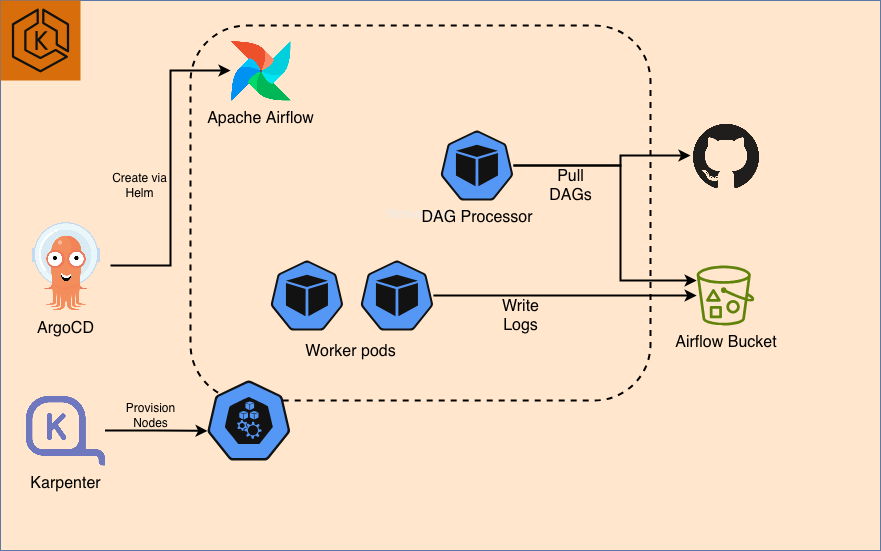

## **Apache Airflow on EKS 인프라**

GitOps, 자동 스케일링 및 관측성을 갖춘 Amazon EKS에 Apache Airflow 플랫폼을 배포합니다.

### 아키텍처

이 스택은 탄력적인 노드 프로비저닝을 위한 Karpenter와 GitOps 기반 애플리케이션 관리를 위한 ArgoCD와 함께 EKS에 Airflow를 배포합니다.



### 사전 요구 사항

배포하기 전에 다음 도구가 설치되어 있는지 확인하세요:

- **AWS CLI** - [설치 가이드](https://docs.aws.amazon.com/cli/latest/userguide/getting-started-install.html)
- **Terraform** (>= 1.0) - [설치 가이드](https://developer.hashicorp.com/terraform/install)
- **kubectl** - [설치 가이드](https://kubernetes.io/docs/tasks/tools/)
- **Helm** (>= 3.0) - [설치 가이드](https://helm.sh/docs/intro/install/)
- **AWS 자격 증명 구성됨** - `aws configure` 실행 또는 IAM 역할 사용

## 1단계: 저장소 복제 및 이동

```bash
git clone https://github.com/awslabs/data-on-eks.git
cd data-on-eks/data-stacks/airflow-on-eks
```

## 2단계: 스택 커스터마이징
필요한 경우 설정을 커스터마이징하려면 `terraform/data-stack.tfvars` 파일을 편집합니다. 예를 들어 `vi`, `nano` 또는 다른 텍스트 편집기로 열 수 있습니다.

## 3단계: 인프라 배포

배포 스크립트를 실행합니다:

```bash
./deploy.sh
```

:::note

**배포 실패 시:**
- 동일한 명령을 다시 실행: `./deploy.sh`
- 여전히 실패하면 kubectl 명령을 사용하여 디버그하거나 [이슈를 등록](https://github.com/awslabs/data-on-eks/issues)하세요

:::

:::info

**예상 배포 시간:** 15-20분

:::

## 4단계: 배포 확인

배포 스크립트는 자동으로 kubectl을 구성합니다. 클러스터가 준비되었는지 확인합니다:

```bash
# kubeconfig 설정
export KUBECONFIG=kubeconfig.yaml

# 클러스터 노드 확인
kubectl get nodes

# 모든 네임스페이스 확인
kubectl get namespaces

# ArgoCD 애플리케이션 확인
kubectl get applications -n argocd
```

:::tip 빠른 확인

성공적인 배포를 확인하려면 다음 명령을 실행하세요:

```bash
# 1. 노드가 준비되었는지 확인
kubectl get nodes
# 예상: 4-5개의 노드가 STATUS=Ready 상태

# 2. ArgoCD 애플리케이션이 동기화되었는지 확인
kubectl get applications -n argocd
# 예상: 모든 앱이 "Synced" 및 "Healthy" 표시

# 5. Karpenter NodePools 준비 확인
kubectl get nodepools

```

:::

<details>
<summary><b>예상 출력 예시</b></summary>

**노드:**
```
NAME                                          STATUS   ROLES    AGE     VERSION
ip-100-64-112-7.us-west-2.compute.internal    Ready    <none>   6h16m   v1.33.5-eks-113cf36
ip-100-64-113-62.us-west-2.compute.internal   Ready    <none>   6h16m   v1.33.5-eks-113cf36
ip-100-64-12-166.us-west-2.compute.internal   Ready    <none>   6h10m   v1.33.5-eks-113cf36

```

**ArgoCD 애플리케이션:**
```
NAME                           SYNC STATUS   HEALTH STATUS
airflow                        Scyned        Healthy
argo-events                    Synced        Healthy
argo-workflows                 Synced        Healthy
aws-for-fluentbit              Synced        Healthy
...
```

**Karpenter NodePools:**
```
NAME                              TYPE          CAPACITY    ZONE         NODE                                          READY   AGE
general-purpose-d2mrg             m7g.4xlarge   spot        us-west-2a   ip-100-64-12-166.us-west-2.compute.internal   True    6h12m
general-purpose-d5mgm             m7g.4xlarge   spot        us-west-2a   ip-100-64-50-67.us-west-2.compute.internal    True    6h15m
memory-optimized-graviton-xkn5x   r8g.4xlarge   on-demand   us-west-2a   ip-100-64-59-123.us-west-2.compute.internal   True    6h14m
```

</details>

## 5단계: ArgoCD UI 액세스

배포 스크립트는 마지막에 ArgoCD 자격 증명을 표시합니다. UI에 액세스합니다:

```bash
# ArgoCD 서버 포트 포워딩
kubectl port-forward svc/argocd-server -n argocd 8080:443
```

브라우저에서 https://localhost:8080 을 엽니다:
- **사용자명:** `admin`
- **비밀번호:** `deploy.sh` 출력 끝에 표시됨

:::info
모든 애플리케이션이 **Synced** 및 **Healthy** 상태로 표시되기까지 추가로 ~5분이 걸릴 수 있습니다.
:::


## 문제 해결

### 일반적인 문제

**Pending 상태에서 멈춘 Pod:**
```bash
# 노드 용량 확인
kubectl describe nodes

# Karpenter 로그 확인
kubectl logs -n karpenter -l app.kubernetes.io/name=karpenter
```

**ArgoCD 애플리케이션이 동기화되지 않음:**

```bash
# ArgoCD 애플리케이션 상태 확인
kubectl get applications -n argocd

# 특정 애플리케이션 확인
kubectl describe application Airflow-operator -n argocd
```

**ArgoCD에서 애플리케이션 새로 고침 및 동기화 시도**


## 다음 단계

인프라가 배포되면 이제 모든 Airflow 예제를 실행할 수 있습니다:

- [Airflow DAG를 사용한 Spark 애플리케이션](/data-on-eks/docs/datastacks/orchestration/airflow-on-eks/airflow)


## 정리

모든 리소스를 제거하려면 전용 정리 스크립트를 사용합니다:

```bash
# 스택 디렉토리로 이동
cd data-on-eks/data-stacks/airflow-on-eks

# 정리 스크립트 실행
./cleanup.sh
```

:::warning

이 명령은 모든 리소스와 데이터를 삭제합니다. 먼저 중요한 데이터를 백업했는지 확인하세요.

:::


:::note

**정리 실패 시:**
- 동일한 명령을 다시 실행: `./cleanup.sh`
- 모든 리소스가 삭제될 때까지 계속 다시 실행
- 일부 AWS 리소스는 여러 번의 정리 시도가 필요한 종속성이 있을 수 있습니다

:::
