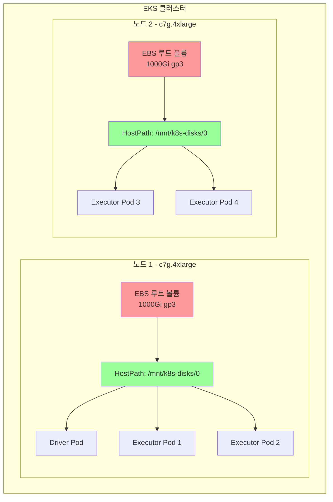

# EBS Hostpath 스토리지를 사용한 EMR Spark

이 예제는 셔플 데이터를 위해 EBS hostpath 스토리지를 사용하여 EMR on EKS에서 Spark 작업을 실행하는 방법을 보여줍니다. 이는 추가 스토리지를 프로비저닝하지 않고 노드의 루트 EBS 볼륨을 사용하므로 가장 비용 효율적인 스토리지 옵션입니다.

## 학습 내용

- 셔플 작업에 EBS hostpath 스토리지를 사용하도록 Spark 구성하는 방법
- hostpath 스토리지, 동적 PVC 또는 NVMe SSD를 사용하는 시기
- 커스텀 Pod 템플릿으로 EMR Spark 작업을 제출하는 방법
- 작업 실행을 모니터링하고 스토리지 구성을 확인하는 방법

## 이 예제 사용 시기

**적합한 경우:**
- ✅ 개발 및 테스트 환경
- ✅ 스토리지 성능이 중요하지 않은 비용 민감 워크로드
- ✅ 소규모에서 중규모 셔플 작업 (Executor당 &lt;100GB)
- ✅ 중간 정도의 I/O 지연 시간을 허용할 수 있는 작업 (1-3ms)

**권장하지 않는 경우:**
- ❌ 보장된 IOPS가 필요한 프로덕션 워크로드
- ❌ 대용량 데이터 볼륨의 셔플 집약적 작업
- ❌ 낮은 지연 시간 요구 사항 (&lt;1ms)
- ❌ Executor 간 스토리지 격리가 필요한 워크로드

## 아키텍처: 공유 노드 스토리지



**주요 이점:**
- 💰 **비용 효율적**: Pod별 PVC 대비 약 70% 비용 절감
- 🚀 **간편한 설정**: PVC 프로비저닝 또는 관리 불필요
- ⚡ **빠른 접근**: 직접 hostpath 마운트, CSI 오버헤드 없음
- 📊 **공유 스토리지**: 여러 Pod가 동일한 노드 볼륨 공유

**트레이드오프:**
- ⚠️ **노이지 네이버(Noisy Neighbor)**: 동일 노드의 Pod들이 I/O 경쟁
- 🔄 **이식성 없음**: 데이터가 특정 노드에 종속
- 🗑️ **수동 정리**: 작업 완료 후 셔플 데이터 지속

## 전제 조건

- EMR on EKS 인프라 배포: [인프라 설정](./infra.md)
- 대용량 루트 EBS 볼륨(1000Gi 권장)으로 구성된 **Karpenter**

## Spark의 셔플 스토리지(Shuffle Storage)란?

**셔플 스토리지**는 `groupBy`, `join`, `reduceByKey`와 같은 Spark 작업 중 중간 데이터를 보관합니다. 데이터가 Executor 간에 재분배될 때 후속 단계에서 읽히기 전에 임시로 저장됩니다.

## Spark 셔플 스토리지 비교

| 스토리지 유형 | 성능 | 비용 | 격리 | 사용 사례 |
|-------------|------|------|-----|----------|
| **EBS Hostpath** | 📊 중간 | 💵 낮음 | ⚠️ 공유 | **비용 최적화 워크로드** |
| **EBS 동적 PVC** | ⚡ 높음 | 💰 중간 | ✅ 격리 | 프로덕션 장애 허용 |
| **NVMe SSD** | 🔥 매우 높음 | 💰 높음 | ✅ 격리 | 최대 성능 |

### EBS Hostpath 사용 시기

- ✅ 비용 민감 워크로드
- ✅ 비중요 배치 작업
- ✅ 예측 가능한 I/O 패턴의 워크로드
- ✅ 단일 테넌트 노드 (노드당 하나의 Spark 작업)

### 피해야 할 경우

- ❌ 혼합 워크로드가 있는 멀티테넌트 클러스터
- ❌ I/O 집약적 셔플 작업
- ❌ 노드 장애 시 데이터 지속성이 필요한 작업

## 예제 구성

### Pod 템플릿

Executor Pod 템플릿은 hostpath 스토리지를 구성합니다:

```yaml
# EMR on EKS Executor Pod 템플릿 - EBS Hostpath 스토리지 (Graviton)
# Spark 셔플 데이터에 EBS 루트 볼륨 사용
apiVersion: v1
kind: Pod
metadata:
  name: emr-executor
  namespace: emr-data-team-a
spec:
  volumes:
    - name: spark-local-dir-1
      hostPath:
        path: /mnt/k8s-disks/0  # 루트 볼륨의 EBS Hostpath
        type: DirectoryOrCreate

  nodeSelector:
    # 컴퓨팅 최적화 Graviton 노드풀 사용
    NodeGroupType: SparkGravitonComputeOptimized
    node.kubernetes.io/arch: arm64

  affinity:
    nodeAffinity:
      requiredDuringSchedulingIgnoredDuringExecution:
        nodeSelectorTerms:
        - matchExpressions:
          # SSD가 아닌 인스턴스 패밀리만 (c6g, c7g)
          - key: karpenter.k8s.aws/instance-family
            operator: In
            values: ["c6g", "c7g"]

  initContainers:
    - name: volume-permission
      image: public.ecr.aws/docker/library/busybox
      # hadoop 사용자에게 볼륨 접근 권한 부여 (UID 999, GID 1000)
      command: ['sh', '-c', 'mkdir -p /data1; chown -R 999:1000 /data1']
      volumeMounts:
        - name: spark-local-dir-1
          mountPath: /data1

  containers:
    - name: spark-kubernetes-executor
      volumeMounts:
        - name: spark-local-dir-1
          mountPath: /data1
          readOnly: false
```

### Spark 구성

hostpath 스토리지를 위한 주요 Spark 속성:

```json
{
  "spark.local.dir": "/data1",
  "spark.driver.cores": "2",
  "spark.executor.cores": "4",
  "spark.driver.memory": "8g",
  "spark.executor.memory": "16g",
  "spark.dynamicAllocation.enabled": "true",
  "spark.dynamicAllocation.shuffleTracking.enabled": "true",
  "spark.dynamicAllocation.minExecutors": "2",
  "spark.dynamicAllocation.maxExecutors": "10"
}
```

## 예제 실행

### 1. kubectl 접근 구성

먼저 EMR on EKS 클러스터에 대한 kubectl 접근 권한이 있는지 확인합니다:

```bash
# terraform 디렉토리로 이동
cd data-stacks/emr-on-eks/terraform/_local

# kubectl 구성 명령어 가져오기
terraform output configure_kubectl

# 출력 명령어 실행 (예시):
aws eks --region us-west-2 update-kubeconfig --name emr-on-eks

# 접근 확인
kubectl get nodes
```

### 2. 예제 디렉토리로 이동

```bash
cd ../../examples/ebs-hostpath
```

### 3. 구성 검토

예제에 포함된 항목:
- `execute_emr_eks_job.sh` - 작업 제출 스크립트
- `driver-pod-template.yaml` - Driver Pod 구성
- `executor-pod-template.yaml` - hostpath 볼륨이 포함된 Executor Pod 구성
- `pyspark-taxi-trip.py` - NYC 택시 데이터를 분석하는 샘플 PySpark 애플리케이션

### 4. Spark 작업 제출

```bash
./execute_emr_eks_job.sh
```

이 스크립트는 다음을 수행합니다:
1. EMR 가상 클러스터 세부 정보를 위한 Terraform 출력 읽기
2. Pod 템플릿 및 PySpark 스크립트를 S3에 업로드
3. NYC 택시 데이터셋 다운로드 (parquet 파일 11개, 약 500MB)
4. hostpath 스토리지 구성으로 EMR Spark 작업 제출

예상 출력:
```
Starting EMR on EKS job submission...
Virtual Cluster ID: hclg71zute4fm4fpm3m2cobv0
Job submitted successfully!
Job ID: 000000036udlljfol9o
```

### 5. 작업 모니터링

```bash
# 실시간으로 Pod 확인
kubectl get pods -n emr-data-team-a -w

# 다른 터미널에서 작업 상태 확인
aws emr-containers list-job-runs \
  --virtual-cluster-id $EMR_VIRTUAL_CLUSTER_ID_TEAM_A \
  --region us-west-2

# 작업 로그 확인
kubectl logs -f <driver-pod-name> -n emr-data-team-a
```

### 6. 스토리지 구성 확인

Executor가 hostpath 스토리지를 사용하는지 확인:

```bash
# Executor Pod 설명
kubectl describe pod taxidata-ebs-hostpath-exec-1 -n emr-data-team-a | grep -A5 "Volumes:"

# 예상 출력:
# Volumes:
#   spark-local-dir-1:
#     Type:          HostPath (bare host directory volume)
#     Path:          /mnt/k8s-disks/0
#     HostPathType:  DirectoryOrCreate
```

### 7. 노드에서 셔플 데이터 확인

셔플 데이터가 hostpath에 작성되었는지 확인:

```bash
# Executor가 실행 중인 노드 이름 가져오기
NODE=$(kubectl get pod taxidata-ebs-hostpath-exec-1 -n emr-data-team-a \
  -o jsonpath='{.spec.nodeName}')

# 디스크 사용량 확인
kubectl debug node/$NODE -it --image=ubuntu -- \
  df -h /mnt/k8s-disks/0

# 셔플 파일 목록
kubectl debug node/$NODE -it --image=ubuntu -- \
  ls -lh /mnt/k8s-disks/0/spark-*
```

## 성능 특성

### 처리량

- **순차 읽기**: ~250 MB/s (gp3 기본값)
- **순차 쓰기**: ~250 MB/s (gp3 기본값)
- **IOPS**: 3,000-16,000 (gp3로 구성 가능)

### 지연 시간

- **평균**: 1-3ms
- **P99**: 5-10ms

### 비용 분석

1시간 동안 10개 Executor 실행 예시:

| 스토리지 유형 | 볼륨 크기 | 시간당 비용 | 총 비용 |
|-------------|----------|-----------|--------|
| **EBS Hostpath (2개 노드)** | 2 × 1000Gi | $0.16 | **$0.32** |
| **EBS PVC (10개 볼륨)** | 10 × 100Gi | $0.80 | **$0.80** |
| **절감액** | - | - | **60%** |

:::info 비용 계산
us-west-2의 gp3 가격 기준: $0.08/GB-월. 실제 절감액은 노드 통합 및 작업 기간에 따라 달라집니다.
:::

## Karpenter 구성

Karpenter EC2NodeClass에 대용량 루트 볼륨이 있는지 확인:

```yaml
apiVersion: karpenter.k8s.aws/v1
kind: EC2NodeClass
metadata:
  name: ebs-gp3-1000gi-6000iops-1000tp
spec:
  amiFamily: AL2023
  blockDeviceMappings:
    - deviceName: /dev/xvda
      ebs:
        volumeSize: 1000Gi  # 셔플을 위한 대용량 루트 볼륨
        volumeType: gp3
        iops: 6000
        throughput: 1000
        encrypted: true
        deleteOnTermination: true
```

## 문제 해결

### Pod가 Pending 상태에서 멈춤

노드에 충분한 디스크 공간이 있는지 확인:

```bash
kubectl get nodeclaims
kubectl describe nodeclaim <nodeclaim-name>
```

### 권한 거부 오류

init 컨테이너가 올바른 권한을 설정하는지 확인:

```bash
kubectl logs taxidata-ebs-hostpath-exec-1 -n emr-data-team-a -c volume-permission
```

### 디스크 가득 참 오류

노드의 디스크 사용량 확인:

```bash
kubectl top nodes
```

오래된 셔플 데이터 정리:

```bash
# 노드에 SSH 접속하여 정리
kubectl debug node/$NODE -it --image=ubuntu -- \
  rm -rf /mnt/k8s-disks/0/spark-*
```

### 노이지 네이버 문제

I/O 경합이 발생하는 경우:

1. 노드당 Executor 수 줄이기
2. 노드 어피니티를 사용하여 Executor 분산
3. EBS PVC 또는 NVMe SSD 스토리지로 업그레이드 고려

## 모범 사례

### 1. 루트 볼륨 적절히 크기 조정

```yaml
# 권장: 셔플 집약적 워크로드에 1000Gi
volumeSize: 1000Gi
```

### 2. 동적 할당 활성화

```json
{
  "spark.dynamicAllocation.enabled": "true",
  "spark.dynamicAllocation.shuffleTracking.enabled": "true"
}
```

### 3. 디스크 사용량 모니터링

디스크 사용률에 대한 CloudWatch 알람 설정:

```bash
aws cloudwatch put-metric-alarm \
  --alarm-name eks-node-disk-usage \
  --metric-name disk_used_percent \
  --threshold 80
```

### 4. 셔플 데이터 정리

오래된 셔플 데이터를 제거하는 정리 작업 추가:

```bash
# 24시간 이상 된 셔플 데이터를 정리하는 Cron 작업
kubectl create cronjob shuffle-cleanup \
  --image=ubuntu \
  --schedule="0 */6 * * *" \
  -- find /mnt/k8s-disks/0 -type d -name "spark-*" -mtime +1 -exec rm -rf {} +
```

## 다른 스토리지 옵션과 비교

### EBS 동적 PVC와 비교

| 기능 | EBS Hostpath | EBS PVC |
|------|-------------|---------|
| **비용** | ✅ 낮음 | ❌ 높음 |
| **격리** | ❌ 공유 | ✅ 격리 |
| **프로비저닝** | ✅ 즉시 | ⏱️ 30-60초 |
| **장애 허용** | ❌ 노드 종속 | ✅ 이식 가능 |

### NVMe SSD와 비교

| 기능 | EBS Hostpath | NVMe SSD |
|------|-------------|----------|
| **비용** | ✅ 낮음 | ❌ 높음 |
| **성능** | 📊 중간 | 🔥 매우 높음 |
| **가용성** | ✅ 모든 인스턴스 | ⚠️ SSD 인스턴스만 |
| **내구성** | ✅ EBS 지원 | ⚠️ 임시 |

## 다음 단계

- [EBS PVC 스토리지](./ebs-pvc.md) - 동적 프로비저닝이 포함된 격리된 스토리지
- [NVMe SSD 스토리지](./nvme-ssd.md) - 최대 I/O 성능
- [인프라 가이드](./infra.md) - 배포 커스터마이징

## 추가 리소스

- [EMR on EKS 모범 사례](https://docs.aws.amazon.com/emr/latest/EMR-on-EKS-DevelopmentGuide/best-practices.html)
- [Spark 구성 가이드](https://spark.apache.org/docs/latest/configuration.html)
- [Karpenter 노드 템플릿](https://karpenter.sh/docs/concepts/nodepools/)
