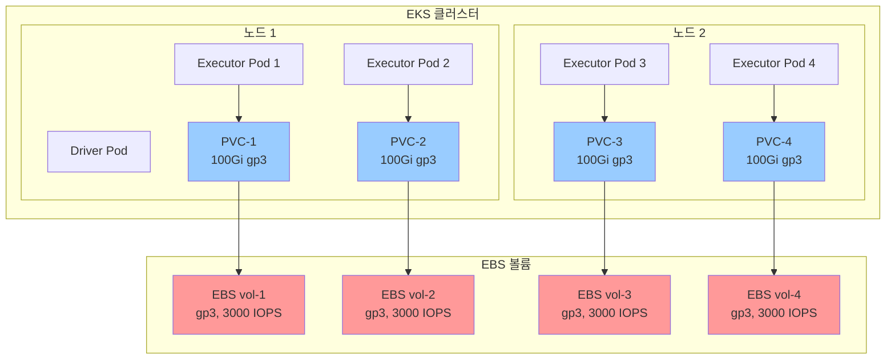

# EBS PVC 스토리지를 사용한 EMR Spark

이 예제는 동적으로 프로비저닝된 EBS 볼륨에 Persistent Volume Claims (PVC)를 사용하여 EMR on EKS에서 Spark 작업을 실행하는 방법을 보여줍니다. 이 접근 방식은 격리된 스토리지, 장애 허용, 프로덕션 환경에서 일관된 성능을 제공합니다.

## 학습 내용

- Spark 셔플 스토리지를 위해 동적 EBS PVC를 구성하는 방법
- PVC 스토리지를 위한 StorageClass 및 provisioner 설정
- 적절한 EBS 볼륨 유형 및 크기 선택 방법
- 볼륨 프로비저닝 모니터링 및 문제 해결 방법

## 이 예제 사용 시기

**적합한 경우:**
- ✅ 격리된 스토리지가 필요한 프로덕션 워크로드
- ✅ 보장된 IOPS가 필요한 성능 민감 작업
- ✅ 컴플라이언스 요구 사항을 위한 멀티테넌트 환경
- ✅ 노드 장애 시 데이터 지속성이 필요한 작업

**권장하지 않는 경우:**
- ❌ 추가 비용을 정당화할 수 없는 개발/테스트 환경
- ❌ 볼륨 프로비저닝 시간을 허용할 수 없는 매우 짧은 작업
- ❌ 이미 NVMe SSD 인스턴스를 사용 중인 경우
- ❌ 잦은 자동 확장으로 많은 짧은 수명의 Executor가 있는 경우

## 아키텍처: 격리된 Executor 스토리지



**주요 이점:**
- ✅ **격리된 성능**: Executor당 보장된 IOPS
- ✅ **장애 허용**: 볼륨이 노드 장애에서 생존
- ✅ **일관된 지연 시간**: 노이지 네이버 효과 없음
- ✅ **동적 프로비저닝**: 자동 볼륨 생성/삭제

**트레이드오프:**
- ⏱️ **프로비저닝 시간**: 30-60초 볼륨 연결 지연
- 💰 **높은 비용**: Executor당 별도 볼륨
- 🔄 **AZ 친화성**: 볼륨이 특정 AZ에 종속

## 전제 조건

- EMR on EKS 인프라 배포: [인프라 설정](./infra.md)
- gp3 StorageClass로 구성된 **Amazon EBS CSI 드라이버**

## Spark 셔플 스토리지 비교

| 스토리지 유형 | 성능 | 비용 | 격리 | 사용 사례 |
|-------------|------|------|-----|----------|
| **EBS Hostpath** | 📊 중간 | 💵 낮음 | ⚠️ 공유 | 비용 최적화 워크로드 |
| **EBS 동적 PVC** | ⚡ 높음 | 💰 중간 | ✅ 격리 | **프로덕션 장애 허용** |
| **NVMe SSD** | 🔥 매우 높음 | 💰 높음 | ✅ 격리 | 최대 성능 |

### EBS PVC 사용 시기

- ✅ 보장된 성능이 필요한 프로덕션 워크로드
- ✅ 스토리지 격리 요구 사항이 있는 멀티테넌트 클러스터
- ✅ 셔플 데이터에 대한 컴플라이언스 요구 사항
- ✅ 노드 장애 시 데이터 지속성 필요

### 피해야 할 경우

- ❌ 비용 민감 개발/테스트 환경
- ❌ 프로비저닝 시간을 허용할 수 없는 짧은 작업
- ❌ 높은 빈도의 자동 확장

## StorageClass 구성

EBS CSI 드라이버는 gp3 StorageClass를 제공해야 합니다:

```yaml
apiVersion: storage.k8s.io/v1
kind: StorageClass
metadata:
  name: gp3
provisioner: ebs.csi.aws.com
parameters:
  type: gp3
  fsType: ext4
  encrypted: "true"
reclaimPolicy: Delete
volumeBindingMode: WaitForFirstConsumer
allowVolumeExpansion: true
```

## 예제 구성

### Pod 템플릿

동적 PVC 프로비저닝을 위한 Executor Pod 템플릿:

```yaml
# EMR on EKS Executor Pod 템플릿 - EBS PVC 스토리지 (Graviton)
# Spark 셔플 데이터에 동적 PVC 사용
apiVersion: v1
kind: Pod
metadata:
  name: emr-executor
  namespace: emr-data-team-a
spec:
  volumes:
    - name: spark-local-dir-1
      ephemeral:
        volumeClaimTemplate:
          spec:
            accessModes: ["ReadWriteOnce"]
            storageClassName: "gp3"
            resources:
              requests:
                storage: 100Gi

  nodeSelector:
    # 컴퓨팅 최적화 Graviton 노드풀 사용
    NodeGroupType: SparkGravitonComputeOptimized
    node.kubernetes.io/arch: arm64

  affinity:
    nodeAffinity:
      requiredDuringSchedulingIgnoredDuringExecution:
        nodeSelectorTerms:
        - matchExpressions:
          # SSD가 아닌 인스턴스 패밀리만 (c6g, c7g)
          - key: karpenter.k8s.aws/instance-family
            operator: In
            values: ["c6g", "c7g"]

  initContainers:
    - name: volume-permission
      image: public.ecr.aws/docker/library/busybox
      # hadoop 사용자에게 볼륨 접근 권한 부여 (UID 999, GID 1000)
      command: ['sh', '-c', 'mkdir -p /data1; chown -R 999:1000 /data1']
      volumeMounts:
        - name: spark-local-dir-1
          mountPath: /data1

  containers:
    - name: spark-kubernetes-executor
      volumeMounts:
        - name: spark-local-dir-1
          mountPath: /data1
          readOnly: false
```

### Spark 구성

PVC 스토리지를 위한 주요 Spark 속성:

```json
{
  "spark.local.dir": "/data1",
  "spark.driver.cores": "2",
  "spark.executor.cores": "4",
  "spark.driver.memory": "8g",
  "spark.executor.memory": "16g",
  "spark.dynamicAllocation.enabled": "true",
  "spark.dynamicAllocation.shuffleTracking.enabled": "true",
  "spark.dynamicAllocation.minExecutors": "2",
  "spark.dynamicAllocation.maxExecutors": "10"
}
```

## 예제 실행

### 1. kubectl 접근 구성

```bash
cd data-stacks/emr-on-eks/terraform/_local
terraform output configure_kubectl
# 출력 명령어 실행
kubectl get nodes
```

### 2. 예제 디렉토리로 이동

```bash
cd ../../examples/ebs-pvc
```

### 3. Spark 작업 제출

```bash
./execute_emr_eks_job.sh
```

### 4. PVC 프로비저닝 모니터링

```bash
# PVC가 실시간으로 생성되는 것 확인
kubectl get pvc -n emr-data-team-a -w

# 예상 출력:
# NAME                                STATUS   VOLUME                                     CAPACITY   ACCESS MODES   STORAGECLASS   AGE
# spark-local-dir-1-exec-1-xxx        Bound    pvc-a1b2c3d4-e5f6-...                      100Gi      RWO            gp3            30s
# spark-local-dir-1-exec-2-xxx        Bound    pvc-f7g8h9i0-j1k2-...                      100Gi      RWO            gp3            30s
```

### 5. 볼륨 연결 확인

```bash
# Executor Pod 설명
kubectl describe pod taxidata-ebs-pvc-exec-1 -n emr-data-team-a | grep -A10 "Volumes:"

# 예상 출력:
# Volumes:
#   spark-local-dir-1:
#     Type:       PersistentVolumeClaim (a reference to a PersistentVolumeClaim in the same namespace)
#     ClaimName:  spark-local-dir-1-taxidata-ebs-pvc-exec-1-xxx
#     ReadOnly:   false
```

### 6. EBS 볼륨 확인

AWS CLI를 사용하여 EBS 볼륨 확인:

```bash
aws ec2 describe-volumes \
  --filters "Name=tag:kubernetes.io/created-for/pvc/namespace,Values=emr-data-team-a" \
  --query 'Volumes[*].[VolumeId,Size,VolumeType,State]' \
  --output table
```

## 성능 특성

### 처리량 (gp3)

- **기본 처리량**: 125 MB/s
- **최대 처리량**: 1,000 MB/s (프로비저닝됨)
- **기본 IOPS**: 3,000
- **최대 IOPS**: 16,000 (프로비저닝됨)

### 지연 시간

- **평균**: 1-2ms
- **P99**: 3-5ms

### 비용 분석

1시간 동안 10개 Executor 실행 예시:

| 스토리지 유형 | 볼륨 크기 | 시간당 비용 | 총 비용 |
|-------------|----------|-----------|--------|
| **EBS Hostpath (2개 노드)** | 2 × 1000Gi | $0.16 | $0.32 |
| **EBS PVC (10개 볼륨)** | 10 × 100Gi | $0.80 | **$0.80** |
| **추가 비용** | - | - | **150%** |

:::note 비용 대 이점
EBS PVC는 더 비싸지만 다음을 제공합니다:
- Executor당 보장된 IOPS
- 스토리지 격리
- 컴플라이언스를 위한 추적 가능성
- 노드 장애 시 데이터 지속성
:::

## 볼륨 유형 권장 사항

### gp3 (권장)

```yaml
storageClassName: "gp3"
resources:
  requests:
    storage: 100Gi
```

**장점:**
- 비용 효율적인 기본 성능
- 조정 가능한 IOPS 및 처리량
- 대부분의 워크로드에 적합

### io2 (고성능)

```yaml
storageClassName: "io2"
resources:
  requests:
    storage: 100Gi
```

**장점:**
- 최대 64,000 IOPS
- 99.999% 내구성
- 미션 크리티컬 워크로드에 적합

## 문제 해결

### PVC가 Pending 상태에서 멈춤

EBS CSI 드라이버가 실행 중인지 확인:

```bash
kubectl get pods -n kube-system -l app=ebs-csi-controller
```

StorageClass가 존재하는지 확인:

```bash
kubectl get storageclass gp3
```

### 볼륨 연결 실패

노드의 EBS 볼륨 제한 확인:

```bash
kubectl describe node <node-name> | grep -A5 "Attachable volumes"
```

### 프로비저닝 시간 초과

CSI 드라이버 로그 확인:

```bash
kubectl logs -n kube-system -l app=ebs-csi-controller -c ebs-plugin
```

### 스토리지 제한 초과

적절한 볼륨 크기 조정:

```yaml
resources:
  requests:
    storage: 200Gi  # 더 큰 셔플 작업을 위해 증가
```

## 모범 사례

### 1. 적절한 볼륨 크기 조정

```yaml
# Executor당 볼륨 크기 권장
# 소규모 작업: 50Gi
# 중규모 작업: 100Gi
# 대규모 작업: 200Gi
resources:
  requests:
    storage: 100Gi
```

### 2. 프로비저닝됨 IOPS 사용 (고성능)

```yaml
apiVersion: storage.k8s.io/v1
kind: StorageClass
metadata:
  name: gp3-high-iops
provisioner: ebs.csi.aws.com
parameters:
  type: gp3
  iops: "10000"
  throughput: "500"
```

### 3. AZ 친화성 구성

```yaml
volumeBindingMode: WaitForFirstConsumer
```

이는 볼륨이 Pod와 동일한 AZ에 생성되도록 보장합니다.

### 4. 정리 정책 설정

```yaml
reclaimPolicy: Delete  # 작업 완료 후 볼륨 자동 삭제
```

## 다음 단계

- [NVMe SSD 스토리지](./nvme-ssd.md) - 최대 I/O 성능
- [EBS Hostpath 스토리지](./ebs-hostpath.md) - 비용 최적화
- [인프라 가이드](./infra.md) - 배포 커스터마이징

## 추가 리소스

- [Amazon EBS CSI 드라이버](https://docs.aws.amazon.com/eks/latest/userguide/ebs-csi.html)
- [EBS 볼륨 유형](https://docs.aws.amazon.com/AWSEC2/latest/UserGuide/ebs-volume-types.html)
- [Kubernetes 영구 볼륨](https://kubernetes.io/docs/concepts/storage/persistent-volumes/)
