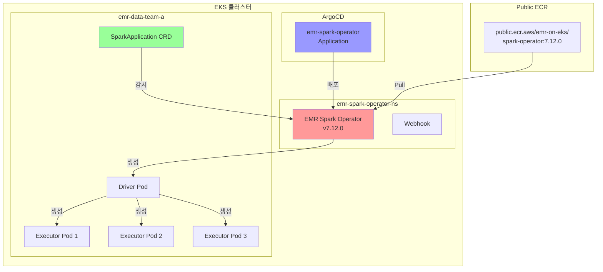

# EMR Spark Operator

이 예제는 선언적 작업 관리를 위해 AWS EMR Spark Operator를 사용하여 EMR on EKS에서 Spark 작업을 실행하는 방법을 보여줍니다. Operator는 사용자 정의 리소스를 사용하여 Spark 애플리케이션을 제출하고 관리하는 Kubernetes 네이티브 방법을 제공합니다.

## 학습 내용

- EMR Spark Operator v7.12.0 활성화 및 배포 방법
- SparkApplication CRD를 사용하여 선언적으로 Spark 작업을 제출하는 방법
- Kubernetes를 통해 Spark 작업을 모니터링하고 관리하는 방법
- EMR Spark Operator와 EMR Virtual Cluster 사용 시기

## 이 예제 사용 시기

**적합한 경우:**
- ✅ 선언적 작업 정의가 포함된 GitOps 워크플로
- ✅ Kubernetes 네이티브 Spark 작업 관리
- ✅ Kubernetes Operator에 익숙한 팀
- ✅ YAML 매니페스트로 Spark 작업을 배포하는 CI/CD 파이프라인

**권장하지 않는 경우:**
- ❌ 단순 일회성 작업 제출 (대신 `start-job-run` 사용)
- ❌ Kubernetes 개념에 익숙하지 않은 팀
- ❌ EMR Studio 통합이 필요한 워크플로

## 아키텍처: EMR Spark Operator



**주요 이점:**
- 🎯 **선언적**: Spark 작업을 Kubernetes 리소스로 정의
- 🔄 **GitOps 지원**: Spark 작업 정의를 버전 관리
- 📊 **네이티브 모니터링**: kubectl을 사용하여 작업 상태 모니터링
- 🚀 **EMR 최적화**: EMRFS 및 최적화가 포함된 EMR 런타임 사용

**트레이드오프:**
- ⚠️ **학습 곡선**: Kubernetes 지식 필요
- 🔧 **더 복잡함**: 관리할 추가 Operator
- 📝 **YAML 중심**: 단순 작업 제출보다 장황함

## 전제 조건

### 1. EMR on EKS 인프라 배포

먼저 EMR on EKS 인프라가 배포되어 있는지 확인합니다. 자세한 내용은 [인프라 설정](./infra.md)을 참조하세요.

### 2. EMR Spark Operator 활성화

`data-stack.tfvars` 파일을 편집합니다:

```hcl
# EMR Spark Operator 활성화
enable_emr_spark_operator = true
```

### 3. 스택 배포

```bash
cd data-stacks/emr-on-eks
./deploy.sh
```

이 명령은 다음을 수행합니다:
1. ArgoCD를 통해 EMR Spark Operator v7.12.0 배포
2. `public.ecr.aws/emr-on-eks/spark-operator:7.12.0`에서 공개 이미지 사용
3. Operator 네임스페이스 `emr-spark-operator-ns` 생성
4. SparkApplication 검증을 위한 Webhook 구성

예상 배포 시간: 약 2-3분

### 4. Operator 배포 확인

```bash
# kubeconfig 설정
export KUBECONFIG=$(pwd)/kubeconfig.yaml

# ArgoCD 애플리케이션 상태 확인
kubectl get application emr-spark-operator -n argocd

# 예상 출력:
# NAME                 SYNC STATUS   HEALTH STATUS
# emr-spark-operator   Synced        Healthy

# Operator Pod 확인
kubectl get pods -n emr-spark-operator-ns

# 예상 출력:
# NAME                                    READY   STATUS      RESTARTS   AGE
# emr-spark-operator-c9ff4d9c7-xxxxx      1/1     Running     0          2m
# emr-spark-operator-webhook-init-xxxxx   0/1     Completed   0          2m
```

## EMR Spark Operator vs. Virtual Cluster

| 기능 | EMR Spark Operator | EMR Virtual Cluster |
|------|-------------------|---------------------|
| **작업 제출** | Kubernetes CRD | AWS CLI/SDK |
| **관리** | kubectl | AWS 콘솔/CLI |
| **GitOps** | ✅ 네이티브 | ⚠️ 래퍼 필요 |
| **모니터링** | kubectl/K8s 도구 | CloudWatch/EMR 콘솔 |
| **학습 곡선** | Kubernetes | AWS EMR |
| **EMR Studio** | ❌ 미지원 | ✅ 지원 |

## SparkApplication 사용자 정의 리소스

EMR Spark Operator는 `SparkApplication` CRD를 사용하여 Spark 작업을 정의합니다:

```yaml
apiVersion: "sparkoperator.k8s.io/v1beta2"
kind: SparkApplication
metadata:
  name: spark-pi-operator
  namespace: emr-data-team-a
spec:
  type: Scala
  mode: cluster

  # EMR 최적화 런타임 이미지
  image: "895885662937.dkr.ecr.us-west-2.amazonaws.com/spark/emr-7.12.0:latest"
  imagePullPolicy: Always

  # 메인 애플리케이션
  mainClass: org.apache.spark.examples.SparkPi
  mainApplicationFile: local:///usr/lib/spark/examples/jars/spark-examples.jar

  arguments:
    - "1000"

  # Spark 구성
  sparkConf:
    spark.kubernetes.driver.pod.name: driver-spark-pi-operator

  sparkVersion: "3.3.1"

  restartPolicy:
    type: Never

  # Driver 구성
  driver:
    cores: 2
    memory: "8g"
    # EMR 가상 클러스터 모듈에서 생성한 서비스 계정
    # 실제 이름 확인: kubectl get sa -n emr-data-team-a | grep driver
    serviceAccount: emr-containers-sa-spark-driver-<deployment-id>

    nodeSelector:
      NodeGroupType: "SparkGravitonComputeOptimized"

    labels:
      app: spark-pi-operator
      role: driver

  # Executor 구성
  executor:
    cores: 4
    instances: 3
    memory: "16g"
    # EMR 가상 클러스터 모듈에서 생성한 서비스 계정
    # 실제 이름 확인: kubectl get sa -n emr-data-team-a | grep executor
    serviceAccount: emr-containers-sa-spark-executor-<deployment-id>

    nodeSelector:
      NodeGroupType: "SparkGravitonComputeOptimized"

    labels:
      app: spark-pi-operator
      role: executor
```

## 예제 실행

### 1. kubectl 접근 구성

```bash
# terraform 디렉토리로 이동
cd data-stacks/emr-on-eks/terraform/_local

# kubectl 구성 명령어 가져오기
terraform output configure_kubectl

# 출력 명령어 실행 (예시):
aws eks --region us-west-2 update-kubeconfig --name emr-on-eks

# 접근 확인
kubectl get nodes
```

### 2. 예제 디렉토리로 이동

```bash
cd ../../examples/emr-spark-operator
```

### 3. 서비스 계정 이름 가져오기

EMR 가상 클러스터 모듈은 AWS 계정 ID와 배포 ID를 기반으로 동적 이름으로 서비스 계정을 생성합니다. 실제 이름을 가져와야 합니다:

```bash
# kubeconfig 설정
export KUBECONFIG=../../kubeconfig.yaml

# Driver 서비스 계정 이름 가져오기
DRIVER_SA=$(kubectl get sa -n emr-data-team-a | grep driver | awk '{print $1}')
echo "Driver SA: $DRIVER_SA"

# Executor 서비스 계정 이름 가져오기
EXECUTOR_SA=$(kubectl get sa -n emr-data-team-a | grep executor | awk '{print $1}')
echo "Executor SA: $EXECUTOR_SA"

# 예상 출력:
# Driver SA: emr-containers-sa-spark-driver-123456789012-abcdefghijklmnopqrstuvwxyz1234567890abcd
# Executor SA: emr-containers-sa-spark-executor-123456789012-abcdefghijklmnopqrstuvwxyz1234567890abcd
```

### 4. SparkApplication YAML 업데이트

YAML 파일에서 서비스 계정 이름을 업데이트합니다:

```bash
# 자동으로 서비스 계정 이름 업데이트
sed -i.bak "s/serviceAccount: emr-containers-sa-spark-driver-.*/serviceAccount: $DRIVER_SA/" taxi-trip-spark-operator.yaml
sed -i.bak "s/serviceAccount: emr-containers-sa-spark-executor-.*/serviceAccount: $EXECUTOR_SA/" taxi-trip-spark-operator.yaml
```

또는 `taxi-trip-spark-operator.yaml`을 수동으로 편집하여 서비스 계정 이름을 교체합니다.

### 5. SparkApplication 검토

예제에 포함된 항목:
- `taxi-trip-spark-operator.yaml` - Spark Pi 계산을 위한 SparkApplication 매니페스트
- `README.md` - 빠른 참조 가이드

주요 구성:
- EMR 7.12.0 런타임 이미지 사용
- Spark Pi 예제 실행 (몬테카를로 방법으로 π 계산)
- Graviton 컴퓨팅 최적화 노드용으로 구성됨
- S3 접근이 가능한 EMR 서비스 계정 사용

### 6. Spark 작업 제출

```bash
# SparkApplication 적용
kubectl apply -f taxi-trip-spark-operator.yaml

# 예상 출력:
# sparkapplication.sparkoperator.k8s.io/spark-pi-operator created
```

### 7. 작업 모니터링

```bash
# SparkApplication 상태 확인
kubectl get sparkapplication spark-pi-operator -n emr-data-team-a -w

# 예상 진행 상황:
# NAME                STATUS      ATTEMPTS   START                  FINISH
# spark-pi-operator   SUBMITTED   1          2026-01-18T01:49:09Z   <no value>
# spark-pi-operator   RUNNING     1          2026-01-18T01:49:09Z   <no value>
# spark-pi-operator   COMPLETED   1          2026-01-18T01:49:09Z   2026-01-18T01:51:40Z

# 실시간으로 Pod 확인
kubectl get pods -n emr-data-team-a -l app=spark-pi-operator -w

# 예상 출력:
# NAME                               READY   STATUS    RESTARTS   AGE
# driver-spark-pi-operator           1/1     Running   0          30s
# spark-pi-c992669bcecb9646-exec-1   1/1     Running   0          20s
# spark-pi-c992669bcecb9646-exec-2   1/1     Running   0          20s
# spark-pi-c992669bcecb9646-exec-3   1/1     Running   0          20s
```

### 8. 작업 로그 보기

```bash
# Driver 로그 보기
kubectl logs driver-spark-pi-operator -n emr-data-team-a

# Executor 로그 보기
kubectl logs spark-pi-c992669bcecb9646-exec-1 -n emr-data-team-a
```

### 9. 결과 확인

```bash
# 계산된 Pi 값 확인
kubectl logs driver-spark-pi-operator -n emr-data-team-a | grep "Pi is roughly"

# 예상 출력:
# Pi is roughly 3.141532511415325
```

### 10. 작업 세부 정보 확인

```bash
# 상세한 SparkApplication 상태 가져오기
kubectl describe sparkapplication spark-pi-operator -n emr-data-team-a

# 애플리케이션 이벤트 보기
kubectl get events -n emr-data-team-a --sort-by='.lastTimestamp' | grep spark-pi
```

## 작업 라이프사이클

### 상태 진행

1. **SUBMITTED** - Operator가 작업을 수락, Driver Pod 생성 중
2. **RUNNING** - Driver Pod 실행 중, Executor 생성 중
3. **COMPLETED** - 작업 성공적으로 완료
4. **FAILED** - 작업 실패 (오류 로그 확인)

### 자동 정리

Operator는 `restartPolicy`에 따라 완료된 작업을 자동으로 정리합니다:

```yaml
restartPolicy:
  type: Never  # 완료 시 재시작하지 않음
```

완료 후 자동 정리:

```yaml
spec:
  timeToLiveSeconds: 3600  # 1시간 후 삭제
```

## 고급 구성

### 1. 동적 할당

Spark 동적 할당 활성화:

```yaml
sparkConf:
  spark.dynamicAllocation.enabled: "true"
  spark.dynamicAllocation.shuffleTracking.enabled: "true"
  spark.dynamicAllocation.minExecutors: "2"
  spark.dynamicAllocation.maxExecutors: "10"
  spark.dynamicAllocation.initialExecutors: "3"
```

### 2. S3에 이벤트 로깅

Spark History Server 통합 활성화:

```yaml
sparkConf:
  spark.eventLog.enabled: "true"
  spark.eventLog.dir: "s3://your-bucket/spark-event-logs/"
```

### 3. 사용자 정의 EMR 구성

EMRFS 및 EMR 최적화 사용:

```yaml
hadoopConf:
  fs.s3.customAWSCredentialsProvider: com.amazonaws.auth.WebIdentityTokenCredentialsProvider
  fs.s3.impl: com.amazon.ws.emr.hadoop.fs.EmrFileSystem
  fs.AbstractFileSystem.s3.impl: org.apache.hadoop.fs.s3.EMRFSDelegate

sparkConf:
  spark.sql.parquet.output.committer.class: com.amazon.emr.committer.EmrOptimizedSparkSqlParquetOutputCommitter
  spark.sql.parquet.fs.optimized.committer.optimization-enabled: "true"
  spark.sql.emr.internal.extensions: com.amazonaws.emr.spark.EmrSparkSessionExtensions
```

### 4. 모니터링 및 관측성

Prometheus 메트릭 추가:

```yaml
sparkConf:
  spark.ui.prometheus.enabled: "true"
  spark.executor.processTreeMetrics.enabled: "true"
  spark.metrics.conf.*.sink.prometheusServlet.class: org.apache.spark.metrics.sink.PrometheusServlet
  spark.metrics.conf.*.sink.prometheusServlet.path: /metrics/prometheus
```

## 문제 해결

### 작업이 SUBMITTED에서 멈춤

Operator 로그 확인:

```bash
kubectl logs -n emr-spark-operator-ns -l app.kubernetes.io/name=spark-operator
```

일반적인 문제:
- 서비스 계정이 존재하지 않음
- 이미지 Pull 오류
- 리소스 부족

### Driver Pod가 Pending

Pod 이벤트 확인:

```bash
kubectl describe pod driver-spark-pi-operator -n emr-data-team-a
```

일반적인 문제:
- nodeSelector와 일치하는 노드 없음
- CPU/메모리 부족
- 이미지 Pull 실패

### 권한 오류

서비스 계정에 올바른 IAM 역할이 있는지 확인:

```bash
# Driver 서비스 계정 확인
kubectl get sa emr-containers-sa-spark-driver-* -n emr-data-team-a -o yaml

# IAM 역할 어노테이션 확인
kubectl get sa emr-containers-sa-spark-driver-* -n emr-data-team-a \
  -o jsonpath='{.metadata.annotations.eks\.amazonaws\.com/role-arn}'
```

### 작업 실패

오류에 대한 Driver 로그 확인:

```bash
kubectl logs driver-spark-pi-operator -n emr-data-team-a --tail=100
```

일반적인 문제:
- S3 접근 거부
- 잘못된 Spark 구성
- 애플리케이션 코드 오류

## 모범 사례

### 1. 버전 관리 사용

SparkApplication 매니페스트를 Git에 저장:

```bash
git add taxi-trip-spark-operator.yaml
git commit -m "Add Spark Pi job"
git push
```

### 2. ConfigMap으로 매개변수화

환경별 값에 ConfigMap 사용:

```yaml
apiVersion: v1
kind: ConfigMap
metadata:
  name: spark-config
  namespace: emr-data-team-a
data:
  s3_bucket: "my-spark-bucket"
  log_level: "INFO"
---
apiVersion: sparkoperator.k8s.io/v1beta2
kind: SparkApplication
spec:
  sparkConf:
    spark.eventLog.dir: "s3://$(S3_BUCKET)/logs/"
  driver:
    envFrom:
      - configMapRef:
          name: spark-config
```

### 3. 리소스 제한 설정

리소스 고갈 방지:

```yaml
driver:
  cores: 2
  coreLimit: "2000m"
  memory: "8g"
  memoryOverhead: "1g"

executor:
  cores: 4
  coreLimit: "4000m"
  memory: "16g"
  memoryOverhead: "2g"
```

### 4. 모니터링 활성화

모니터링을 위한 레이블 추가:

```yaml
metadata:
  labels:
    app: spark-jobs
    team: data-engineering
    environment: production
```

### 5. 완료된 작업 정리

자동 정리를 위한 TTL 설정:

```yaml
spec:
  timeToLiveSeconds: 86400  # 24시간 후 삭제
```

## 다른 제출 방법과 비교

### vs. EMR Virtual Cluster (start-job-run)

| 기능 | Spark Operator | start-job-run |
|------|---------------|---------------|
| **제출** | kubectl apply | AWS CLI |
| **모니터링** | kubectl get | AWS 콘솔 |
| **GitOps** | ✅ 네이티브 | ⚠️ 래퍼 필요 |
| **복잡도** | 높음 | 낮음 |
| **EMR Studio** | ❌ | ✅ |

### vs. Spark Operator (Kubeflow)

| 기능 | EMR Spark Operator | Kubeflow Spark Operator |
|------|-------------------|------------------------|
| **런타임** | EMR 최적화 | 오픈소스 Spark |
| **EMRFS** | ✅ 기본 제공 | ❌ 미포함 |
| **지원** | AWS 지원 | 커뮤니티 |
| **기능** | EMR 확장 | 표준 Spark |

## 다음 단계

- [NVMe SSD 스토리지](./nvme-ssd.md) - 고성능 셔플 스토리지
- [EBS Hostpath 스토리지](./ebs-hostpath.md) - 비용 효율적인 공유 스토리지
- [인프라 가이드](./infra.md) - 배포 커스터마이징

## 추가 리소스

- [EMR Spark Operator 문서](https://docs.aws.amazon.com/emr/latest/EMR-on-EKS-DevelopmentGuide/spark-operator-gs.html)
- [SparkApplication API 참조](https://github.com/kubeflow/spark-operator/blob/master/docs/api-docs.md)
- [EMR on EKS 모범 사례](https://aws.github.io/aws-emr-containers-best-practices/)
