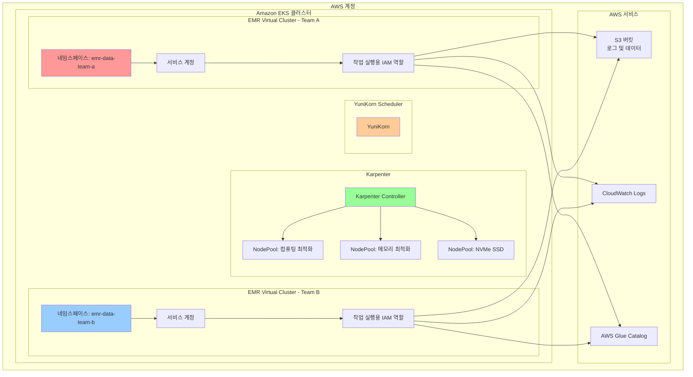

# EMR on EKS 인프라 배포

가상 클러스터, IAM 역할, Karpenter 오토스케일링이 포함된 프로덕션 준비 Amazon EMR on EKS 클러스터를 배포합니다.

## 아키텍처 개요



## 전제 조건

- 적절한 자격 증명으로 구성된 AWS CLI
- kubectl 설치
- Terraform >= 1.0
- jq (JSON 출력 파싱용)

## 배포 단계

### 1. 저장소 복제

```bash
git clone https://github.com/awslabs/data-on-eks.git
cd data-on-eks
```

### 2. EMR on EKS 스택으로 이동

```bash
cd data-stacks/emr-on-eks
```

### 3. 구성 검토

배포를 커스터마이징하려면 `terraform/data-stack.tfvars`를 편집합니다:

```hcl
# EMR on EKS 데이터 스택 구성
name                 = "emr-on-eks"
region               = "us-west-2"
deployment_id        = "your-unique-id"

# EMR on EKS Virtual Cluster 활성화
enable_emr_on_eks    = true

# 선택 사항: 추가 애드온 활성화
enable_ingress_nginx = true
enable_ipv6          = false
```

### 4. 인프라 배포

```bash
./deploy.sh
```

이 스크립트는 다음을 수행합니다:
1. Terraform 초기화
2. VPC 및 네트워킹 생성 (존재하지 않는 경우)
3. 관리형 노드 그룹이 포함된 EKS 클러스터 배포
4. 오토스케일링을 위한 Karpenter 설치
5. YuniKorn 스케줄러 설치
6. Team A 및 Team B용 EMR 가상 클러스터 생성
7. IAM 역할 및 서비스 계정 구성
8. 로그 및 데이터용 S3 버킷 설정

:::info 배포 시간
초기 배포는 약 **30-40분** 소요됩니다. 이후 업데이트는 더 빠릅니다.
:::

### 5. Terraform 출력 확인

배포가 완료되면 인프라 세부 정보를 확인합니다:

```bash
cd terraform/_local
terraform output
```

다음과 유사한 출력이 표시됩니다:

```hcl
cluster_arn = "arn:aws:eks:us-west-2:123456789:cluster/emr-on-eks"
cluster_name = "emr-on-eks"
configure_kubectl = "aws eks --region us-west-2 update-kubeconfig --name emr-on-eks"
deployment_id = "abcdefg"
emr_on_eks = {
  "emr-data-team-a" = {
    "cloudwatch_log_group_name" = "/emr-on-eks-logs/emr-on-eks/emr-data-team-a"
    "job_execution_role_arn" = "arn:aws:iam::123456789:role/emr-on-eks-emr-data-team-a"
    "virtual_cluster_id" = "hclg71zute4fm4fpm3m2cobv0"
  }
  "emr-data-team-b" = {
    "cloudwatch_log_group_name" = "/emr-on-eks-logs/emr-on-eks/emr-data-team-b"
    "job_execution_role_arn" = "arn:aws:iam::123456789:role/emr-on-eks-emr-data-team-b"
    "virtual_cluster_id" = "cqt781jwn4vq1wh4jlqdhpj5h"
  }
}
emr_s3_bucket_name = "emr-on-eks-spark-logs-123456789"
region = "us-west-2"
```

### 6. kubectl 접근 구성

`configure_kubectl` 출력을 사용하여 클러스터에 인증합니다:

```bash
# terraform 출력의 명령어 실행
aws eks --region us-west-2 update-kubeconfig --name emr-on-eks

# 클러스터 접근 확인
kubectl get nodes

# EMR 네임스페이스 확인
kubectl get namespaces | grep emr-data

# 예상 출력:
# emr-data-team-a   Active   5m
# emr-data-team-b   Active   5m
```

### 7. Karpenter 및 YuniKorn 확인

```bash
# Karpenter NodePool 확인
kubectl get nodepool

# YuniKorn 스케줄러 확인
kubectl get pods -n yunikorn-system

# Karpenter 로그 확인
kubectl logs -n karpenter -l app.kubernetes.io/name=karpenter --tail=20
```

## 배포되는 항목

### EKS 클러스터 구성 요소

| 구성 요소 | 설명 |
|----------|------|
| **VPC** | 퍼블릭 및 프라이빗 서브넷이 있는 멀티 AZ VPC |
| **EKS 클러스터** | 관리형 컨트롤 플레인이 있는 Kubernetes 1.31+ |
| **Karpenter** | 여러 노드 풀이 있는 노드 오토스케일링 |
| **YuniKorn** | 배치 워크로드를 위한 고급 Kubernetes 스케줄러 |
| **EBS CSI 드라이버** | 동적 EBS 볼륨 프로비저닝용 |
| **AWS Load Balancer Controller** | Ingress 및 서비스 로드 밸런싱용 |
| **Fluent Bit** | CloudWatch로 로그 전달 |

### EMR on EKS 리소스

| 리소스 | 설명 |
|--------|------|
| **Virtual Cluster (Team A)** | `emr-data-team-a` 네임스페이스의 EMR 가상 클러스터 |
| **Virtual Cluster (Team B)** | `emr-data-team-b` 네임스페이스의 EMR 가상 클러스터 |
| **IAM 역할** | S3, Glue, CloudWatch 권한이 있는 작업 실행 역할 |
| **서비스 계정** | IRSA가 있는 Kubernetes 서비스 계정 |
| **S3 버킷** | Spark 로그, 셔플 데이터, 결과용 |
| **CloudWatch 로그 그룹** | EMR 작업 로그용 |

### Karpenter 노드 풀

| 노드 풀 | 인스턴스 유형 | 사용 사례 |
|--------|-------------|----------|
| **컴퓨팅 최적화 (Graviton)** | c6g, c7g, c8g | 일반 Spark 워크로드 |
| **메모리 최적화 (Graviton)** | r6g, r7g, r8g | 메모리 집약적 작업 |
| **NVMe SSD (Graviton)** | c6gd, c7gd, m6gd, r6gd | 고 I/O 셔플 작업 |

## 구성 옵션

### 추가 기능 활성화

선택적 기능을 활성화하려면 `terraform/data-stack.tfvars`를 편집합니다:

```hcl
# Spark History Server 활성화
enable_spark_history_server = true

# JupyterHub 활성화
enable_jupyterhub = true

# Prometheus & Grafana 활성화
enable_kube_prometheus_stack = true

# Argo Workflows 활성화
enable_argo_workflows = true
```

### 노드 풀 커스터마이징

Karpenter 노드 풀을 수정하려면 오버레이 파일을 생성합니다:

```bash
# 사용자 정의 노드 풀 구성 생성
cp infra/terraform/manifests/karpenter/nodepool-compute-optimized-graviton.yaml \
   terraform/manifests/karpenter/nodepool-compute-optimized-graviton.yaml

# 파일을 편집하여 인스턴스 유형, 제한 등을 커스터마이징
```

### EMR Virtual Cluster 커스터마이징

더 많은 가상 클러스터를 추가하거나 기존 클러스터를 수정하려면 `terraform/emr-on-eks.tf`를 편집합니다:

```hcl
# 새 가상 클러스터 추가
module "emr_on_eks_team_c" {
  source = "../../infra/terraform/modules/emr-on-eks"

  cluster_name      = var.cluster_name
  namespace         = "emr-data-team-c"
  virtual_cluster_name = "emr-data-team-c"

  # 추가 구성...
}
```

## 클러스터 접근

### kubectl 사용

```bash
export KUBECONFIG=kubeconfig.yaml
kubectl get pods -n emr-data-team-a
```

### AWS CLI 사용

```bash
# EMR 가상 클러스터 목록
aws emr-containers list-virtual-clusters --region us-west-2

# 가상 클러스터 설명
aws emr-containers describe-virtual-cluster \
  --id $EMR_VIRTUAL_CLUSTER_ID_TEAM_A \
  --region us-west-2
```

## 모니터링 및 관측성

### CloudWatch Logs

EMR 작업 로그는 CloudWatch로 자동 전달됩니다:

```bash
# CloudWatch에서 로그 보기
aws logs tail $CLOUDWATCH_LOG_GROUP_TEAM_A --follow
```

### Spark History Server

활성화된 경우 Spark History Server에 접근:

```bash
# Spark History Server URL 가져오기
kubectl get ingress -n spark-history-server
```

### Prometheus & Grafana

활성화된 경우 Grafana 대시보드에 접근:

```bash
# Grafana로 포트 포워드
kubectl port-forward -n kube-prometheus-stack \
  svc/kube-prometheus-stack-grafana 3000:80

# http://localhost:3000 에서 접근
# 기본 자격 증명: admin / prom-operator
```

## 문제 해결

### Karpenter 로그 확인

```bash
kubectl logs -n karpenter -l app.kubernetes.io/name=karpenter --tail=100
```

### YuniKorn 스케줄러 확인

```bash
kubectl logs -n yunikorn-system -l app=yunikorn --tail=100
```

### IAM 역할 확인

```bash
# 서비스 계정 어노테이션 확인
kubectl describe sa emr-containers-sa-spark-driver-* -n emr-data-team-a
```

### 노드 프로비저닝 확인

```bash
# NodeClaim 목록
kubectl get nodeclaims

# NodeClaim 설명
kubectl describe nodeclaim <nodeclaim-name>
```

## 정리

모든 리소스를 삭제하려면:

```bash
./cleanup.sh
```

:::warning 정리 시간
정리가 완료되는 데 약 **20-30분** 소요됩니다. 정리 전에 모든 EMR 작업이 종료되었는지 확인하세요.
:::

## 다음 단계

- [EBS Hostpath 스토리지 예제](./ebs-hostpath.md) - 비용 효율적인 공유 노드 스토리지
- [EBS PVC 스토리지 예제](./ebs-pvc.md) - 동적 볼륨 프로비저닝
- [NVMe SSD 스토리지 예제](./nvme-ssd.md) - 최대 I/O 성능

## 추가 리소스

- [EMR on EKS 문서](https://docs.aws.amazon.com/emr/latest/EMR-on-EKS-DevelopmentGuide/emr-eks.html)
- [Karpenter 문서](https://karpenter.sh/)
- [YuniKorn 문서](https://yunikorn.apache.org/)
