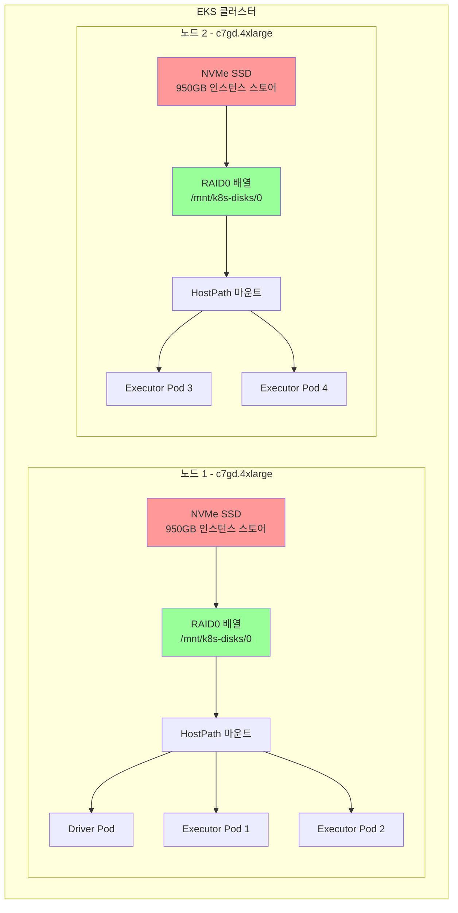

# NVMe SSD 스토리지를 사용한 EMR Spark

이 예제는 셔플 스토리지를 위해 NVMe 인스턴스 스토어 SSD를 사용하여 EMR on EKS에서 Spark 작업을 실행하는 방법을 보여줍니다. 이는 밀리초 미만의 지연 시간으로 최고의 I/O 성능을 제공하며, Graviton 인스턴스에서 셔플 집약적 워크로드에 이상적입니다.

## 학습 내용

- 셔플 작업에 NVMe SSD 인스턴스 스토어를 사용하도록 Spark 구성하는 방법
- Karpenter가 NVMe SSD가 있는 노드를 프로비저닝하고 RAID0을 구성하는 방법
- NVMe 스토리지와 EBS hostpath 또는 동적 PVC 사용 시기
- NVMe 스토리지가 마운트되고 사용되는지 확인하는 방법

## 이 예제 사용 시기

**적합한 경우:**
- ✅ 셔플 집약적 워크로드 (대규모 조인, 집계, 정렬)
- ✅ 초저지연 요구 사항 (&lt;1ms)
- ✅ 고처리량 데이터 처리 (드라이브당 2.5 GB/s)
- ✅ Graviton 인스턴스를 통한 비용-성능 최적화

**권장하지 않는 경우:**
- ❌ 데이터 지속성이 필요한 워크로드 (NVMe는 임시 스토리지)
- ❌ 노드 장애에 민감한 장시간 실행 작업
- ❌ NVMe SSD 인스턴스가 가용하지 않은 리전
- ❌ 셔플 작업이 최소인 워크로드

## 아키텍처: 로컬 NVMe SSD



**주요 이점:**
- 🔥 **초고성능**: 드라이브당 최대 2.5 GB/s 처리량
- ⚡ **저지연**: I/O 작업에 대해 밀리초 미만 지연 시간
- 💰 **비용 효율적**: 인스턴스 가격에 포함, 추가 스토리지 비용 없음
- 🚀 **Graviton 성능**: 우수한 가격 대비 성능의 ARM64 프로세서

**트레이드오프:**
- ⚠️ **임시 스토리지**: 인스턴스 종료 시 데이터 손실
- 🔄 **제한된 가용성**: SSD 인스턴스 유형에서만 사용 가능 (c6gd, c7gd, m6gd, r6gd 등)
- 📊 **노드 종속**: 데이터가 특정 노드에 종속

## 전제 조건

- EMR on EKS 인프라 배포: [인프라 설정](./infra.md)
- NVMe SSD 인스턴스 유형으로 구성된 **Karpenter**
- **Graviton 호환** EMR 런타임 (ARM64)

## Spark의 셔플 스토리지(Shuffle Storage)란?

**셔플 스토리지**는 `groupBy`, `join`, `reduceByKey`와 같은 Spark 작업 중 중간 데이터를 보관합니다. 데이터가 Executor 간에 재분배될 때 후속 단계에서 읽히기 전에 임시로 저장됩니다.

## Spark 셔플 스토리지 비교

| 스토리지 유형 | 성능 | 비용 | 지연 시간 | 사용 사례 |
|-------------|------|------|---------|----------|
| **NVMe SSD** | 🔥 매우 높음 | 💰 중간 | ⚡ &lt;1ms | **최대 성능** |
| **EBS 동적 PVC** | ⚡ 높음 | 💰 중간 | 📊 1-3ms | 프로덕션 격리 |
| **EBS Hostpath** | 📊 중간 | 💵 낮음 | 📊 1-3ms | 비용 최적화 |

### NVMe SSD 사용 시기

- ✅ 셔플 집약적 워크로드 (조인, 집계)
- ✅ 저지연 요구 사항
- ✅ 고처리량 데이터 처리
- ✅ Graviton을 통한 비용-성능 최적화

### 피해야 할 경우

- ❌ 데이터 지속성이 필요한 워크로드
- ❌ 노드 장애가 있는 장시간 실행 작업
- ❌ SSD 인스턴스가 가용하지 않은 리전

## NVMe 인스턴스 유형

### Graviton (ARM64) - 권장

| 인스턴스 유형 | vCPU | 메모리 | NVMe 스토리지 | 처리량 |
|------------|------|-------|-------------|-------|
| **c6gd.xlarge** | 4 | 8 GiB | 237 GB | 2.5 GB/s |
| **c6gd.2xlarge** | 8 | 16 GiB | 474 GB | 2.5 GB/s |
| **c6gd.4xlarge** | 16 | 32 GiB | 950 GB | 2.5 GB/s |
| **c7gd.4xlarge** | 16 | 32 GiB | 950 GB | 2.5 GB/s |
| **m6gd.4xlarge** | 16 | 64 GiB | 950 GB | 2.5 GB/s |
| **r6gd.4xlarge** | 16 | 128 GiB | 950 GB | 2.5 GB/s |

### x86 (Intel/AMD)

| 인스턴스 유형 | vCPU | 메모리 | NVMe 스토리지 | 처리량 |
|------------|------|-------|-------------|-------|
| **c5d.4xlarge** | 16 | 32 GiB | 400 GB | 2.0 GB/s |
| **c6id.4xlarge** | 16 | 32 GiB | 950 GB | 2.5 GB/s |
| **m5d.4xlarge** | 16 | 64 GiB | 600 GB | 2.0 GB/s |

:::tip Graviton 장점
Graviton 인스턴스는 x86 인스턴스 대비 최대 40% 더 나은 가격 대비 성능을 제공합니다.
:::

## 예제 구성

### Pod 템플릿

Executor Pod 템플릿은 NVMe hostpath 스토리지를 구성합니다:

```yaml
# EMR on EKS Executor Pod 템플릿 - NVMe SSD 스토리지 (Graviton)
# 고성능 셔플을 위해 NVMe SSD가 있는 Graviton 인스턴스 사용
apiVersion: v1
kind: Pod
metadata:
  name: emr-executor
  namespace: emr-data-team-a
spec:
  volumes:
    # NVMe SSD 스토리지 - Karpenter가 /mnt/k8s-disks/0 아래에 RAID0 구성
    - name: spark-local-dir-1
      hostPath:
        path: /mnt/k8s-disks/0
        type: DirectoryOrCreate

  nodeSelector:
    # SSD가 있는 메모리 최적화 Graviton 노드풀 사용
    NodeGroupType: SparkGravitonMemoryOptimized
    node.kubernetes.io/arch: arm64

  affinity:
    nodeAffinity:
      requiredDuringSchedulingIgnoredDuringExecution:
        nodeSelectorTerms:
        - matchExpressions:
          # Graviton SSD 인스턴스 패밀리만 ('d' 접미사 포함)
          - key: karpenter.k8s.aws/instance-family
            operator: In
            values: ["c6gd", "c7gd", "c8gd", "m6gd", "m7gd", "m8gd", "r6gd", "r7gd", "r8gd"]

  tolerations:
    - key: spark-executor
      operator: Equal
      value: "true"
      effect: NoSchedule

  initContainers:
    - name: volume-permission
      image: public.ecr.aws/docker/library/busybox
      # hadoop 사용자에게 볼륨 접근 권한 부여
      command: ['sh', '-c', 'mkdir -p /data1; chown -R 999:1000 /data1']
      volumeMounts:
        - name: spark-local-dir-1
          mountPath: /data1

  containers:
    - name: spark-kubernetes-executor
      volumeMounts:
        - name: spark-local-dir-1
          mountPath: /data1
          readOnly: false
```

### Spark 구성

NVMe 스토리지를 위한 주요 Spark 속성:

```json
{
  "spark.local.dir": "/data1",
  "spark.driver.cores": "2",
  "spark.executor.cores": "4",
  "spark.driver.memory": "8g",
  "spark.executor.memory": "16g",
  "spark.dynamicAllocation.enabled": "true",
  "spark.dynamicAllocation.shuffleTracking.enabled": "true",
  "spark.dynamicAllocation.minExecutors": "2",
  "spark.dynamicAllocation.maxExecutors": "10",
  "spark.sql.adaptive.enabled": "true",
  "spark.sql.adaptive.coalescePartitions.enabled": "true",
  "spark.sql.adaptive.skewJoin.enabled": "true"
}
```

## 예제 실행

### 1. kubectl 접근 구성

먼저 EMR on EKS 클러스터에 대한 kubectl 접근 권한이 있는지 확인합니다:

```bash
# terraform 디렉토리로 이동
cd data-stacks/emr-on-eks/terraform/_local

# kubectl 구성 명령어 가져오기
terraform output configure_kubectl

# 출력 명령어 실행 (예시):
aws eks --region us-west-2 update-kubeconfig --name emr-on-eks

# 접근 확인
kubectl get nodes
```

### 2. 예제 디렉토리로 이동

```bash
cd ../../examples/nvme-ssd
```

### 3. 구성 검토

예제에 포함된 항목:
- `execute_emr_eks_job.sh` - 작업 제출 스크립트
- `driver-pod-template.yaml` - Driver Pod 구성
- `executor-pod-template.yaml` - NVMe 친화성이 포함된 Executor Pod 구성
- `pyspark-taxi-trip.py` - NYC 택시 데이터를 분석하는 샘플 PySpark 애플리케이션

Executor Pod 템플릿의 주요 구성:
- SSD가 있는 Graviton 인스턴스용 노드 셀렉터
- NVMe 인스턴스 패밀리(c6gd, c7gd, m6gd, r6gd 등)에 대한 친화성 규칙
- `/mnt/k8s-disks/0` (Karpenter RAID0 배열)에 대한 HostPath 볼륨 마운트

### 4. Spark 작업 제출

```bash
./execute_emr_eks_job.sh
```

이 스크립트는 다음을 수행합니다:
1. EMR 가상 클러스터 세부 정보를 위한 Terraform 출력 읽기
2. Pod 템플릿 및 PySpark 스크립트를 S3에 업로드
3. NYC 택시 데이터셋 다운로드 (parquet 파일 11개, 약 500MB)
4. NVMe SSD 구성으로 EMR Spark 작업 제출

예상 출력:
```
Starting EMR on EKS job submission...
Virtual Cluster ID: hclg71zute4fm4fpm3m2cobv0
Job submitted successfully!
Job ID: 000000036udo0ghs1mq
```

### 5. 작업 모니터링

```bash
# 실시간으로 Pod 확인
kubectl get pods -n emr-data-team-a -w

# 다른 터미널에서 작업 상태 확인
aws emr-containers list-job-runs \
  --virtual-cluster-id $EMR_VIRTUAL_CLUSTER_ID_TEAM_A \
  --region us-west-2

# 작업 로그 보기
kubectl logs -f <driver-pod-name> -n emr-data-team-a
```

### 6. NVMe 인스턴스 프로비저닝 확인

Karpenter가 NVMe SSD 인스턴스를 프로비저닝했는지 확인합니다:

```bash
# Executor Pod 설명
kubectl describe pod taxidata-nvme-ssd-exec-1 -n emr-data-team-a | grep -A10 "Node-Selectors"

# 예상 출력:
# Node-Selectors: NodeGroupType=SparkGravitonMemoryOptimized
#                 node.kubernetes.io/arch=arm64
# Affinity:
#   karpenter.k8s.aws/instance-family In [c6gd c7gd c8gd m6gd m7gd m8gd r6gd r7gd r8gd]
```

### 7. 노드 인스턴스 유형 확인

노드가 NVMe SSD 인스턴스를 사용하는지 확인합니다:

```bash
# Executor가 실행 중인 노드 이름 가져오기
NODE=$(kubectl get pod taxidata-nvme-ssd-exec-1 -n emr-data-team-a \
  -o jsonpath='{.spec.nodeName}')

# 인스턴스 유형 확인 (SSD를 위한 'd' 접미사가 있어야 함)
kubectl get node $NODE -o jsonpath='{.metadata.labels.node\.kubernetes\.io/instance-type}'

# 예상 출력: c7gd.4xlarge, m6gd.4xlarge, r6gd.4xlarge 등
```

### 8. NVMe RAID0 마운트 확인

Karpenter가 NVMe 스토리지를 RAID0으로 구성했는지 확인합니다:

```bash
# RAID 구성 확인
kubectl debug node/$NODE -it --image=ubuntu -- cat /proc/mdstat

# RAID0을 보여주는 예상 출력:
# md0 : active raid0 nvme1n1[1] nvme0n1[0]
#       1875385344 blocks super 1.2 512k chunks

# 마운트 포인트 확인
kubectl debug node/$NODE -it --image=ubuntu -- df -h /mnt/k8s-disks/0

# 예상 출력:
# Filesystem      Size  Used Avail Use% Mounted on
# /dev/md0        900G   10G  890G   2% /mnt/k8s-disks/0
```

## 성능 특성

### 처리량

- **순차 읽기**: 드라이브당 최대 2.5 GB/s
- **순차 쓰기**: 드라이브당 최대 2.5 GB/s
- **랜덤 읽기**: 최대 400,000 IOPS
- **랜덤 쓰기**: 최대 400,000 IOPS

### 지연 시간

- **평균**: &lt;1ms
- **P99**: &lt;2ms
- **P99.9**: &lt;5ms

### 비용 분석

c7gd.4xlarge에서 10개 Executor가 1시간 실행 예시:

| 구성 요소 | 인스턴스 유형 | 시간당 비용 | 수량 | 총 비용 |
|----------|------------|-----------|------|--------|
| **컴퓨팅 + NVMe** | c7gd.4xlarge | $0.69 | 3개 노드 | **$2.07** |
| **EBS (비교용)** | c7g.4xlarge + EBS | $0.58 + $0.40 | 3개 노드 | **$2.94** |
| **절감액** | - | - | - | **30%** |

:::info 비용 계산
NVMe 스토리지는 인스턴스 가격에 포함됩니다. 절감액은 별도 EBS 볼륨을 피하고 더 나은 성능에서 발생합니다.
:::

## Karpenter 구성

### NVMe용 EC2NodeClass

Karpenter는 NVMe 드라이브에 대해 자동으로 RAID0을 구성합니다:

```yaml
apiVersion: karpenter.k8s.aws/v1
kind: EC2NodeClass
metadata:
  name: ephemeral-nvme-local-provisioner
spec:
  amiFamily: AL2023
  role: karpenter-node-role

  # NVMe 드라이브에 대한 RAID0 구성
  instanceStorePolicy: RAID0

  # 사용자 데이터가 검색을 위한 심볼릭 링크 생성
  userData: |
    #!/bin/bash
    cat <<EOF > /etc/udev/rules.d/90-kubernetes-discovery.rules
    # 인스턴스 스토리지 디스크 검색
    KERNEL=="nvme[0-9]*n[0-9]*", ENV{DEVTYPE}=="disk", \
      ATTRS{model}=="Amazon EC2 NVMe Instance Storage", \
      ATTRS{serial}=="?*", \
      SYMLINK+="disk/kubernetes/nvme-\$attr{model}_\$attr{serial}"
    EOF
    udevadm control --reload && udevadm trigger
```

### NVMe 인스턴스용 NodePool

```yaml
apiVersion: karpenter.sh/v1
kind: NodePool
metadata:
  name: nvme-ssd-graviton
spec:
  template:
    spec:
      nodeClassRef:
        name: ephemeral-nvme-local-provisioner
      requirements:
        - key: karpenter.k8s.aws/instance-family
          operator: In
          values: ["c6gd", "c7gd", "m6gd", "r6gd"]
        - key: kubernetes.io/arch
          operator: In
          values: ["arm64"]
```

## 성능 튜닝

### 1. Spark 셔플 최적화

```json
{
  "spark.shuffle.file.buffer": "1m",
  "spark.shuffle.unsafe.file.output.buffer": "5m",
  "spark.io.compression.codec": "lz4",
  "spark.shuffle.compress": "true"
}
```

### 2. 병렬 처리 증가

```json
{
  "spark.sql.shuffle.partitions": "200",
  "spark.default.parallelism": "200"
}
```

### 3. 적응형 쿼리 실행 활성화

```json
{
  "spark.sql.adaptive.enabled": "true",
  "spark.sql.adaptive.coalescePartitions.enabled": "true",
  "spark.sql.adaptive.skewJoin.enabled": "true"
}
```

## 문제 해결

### Pod가 Pending에서 멈춤

NVMe 인스턴스 유형이 가용한지 확인:

```bash
kubectl get nodeclaims
kubectl describe nodeclaim <nodeclaim-name>
```

일반적인 문제:
- AZ에서 NVMe 인스턴스 불가용
- 인스턴스 유형이 Karpenter NodePool에 없음
- 용량 부족

### NVMe가 마운트되지 않음

Karpenter 로그 확인:

```bash
kubectl logs -n karpenter -l app.kubernetes.io/name=karpenter --tail=100
```

RAID0 구성 확인:

```bash
kubectl debug node/$NODE -it --image=ubuntu -- \
  cat /proc/mdstat
```

### 권한 거부 오류

init 컨테이너 권한 확인:

```bash
kubectl logs taxidata-nvme-ssd-exec-1 -n emr-data-team-a -c volume-permission
```

### 지원되지 않는 인스턴스 유형

더 많은 인스턴스 패밀리를 포함하도록 Pod 템플릿 업데이트:

```yaml
affinity:
  nodeAffinity:
    requiredDuringSchedulingIgnoredDuringExecution:
      nodeSelectorTerms:
      - matchExpressions:
        - key: karpenter.k8s.aws/instance-family
          operator: In
          values: ["c6gd", "c7gd", "c8gd", "m6gd", "m7gd", "r6gd", "r7gd"]
```

## 모범 사례

### 1. Graviton 인스턴스 사용

Graviton 인스턴스는 더 나은 가격 대비 성능을 제공합니다:

```yaml
nodeSelector:
  node.kubernetes.io/arch: arm64
```

### 2. 동적 할당 활성화

```json
{
  "spark.dynamicAllocation.enabled": "true",
  "spark.dynamicAllocation.shuffleTracking.enabled": "true"
}
```

### 3. NVMe 상태 모니터링

디스크 메트릭에 대한 CloudWatch 알람 설정:

```bash
aws cloudwatch put-metric-alarm \
  --alarm-name nvme-disk-usage \
  --metric-name disk_used_percent \
  --threshold 80
```

### 4. 노드 장애를 우아하게 처리

동적 할당을 위한 셔플 추적 활성화:

```json
{
  "spark.dynamicAllocation.shuffleTracking.enabled": "true",
  "spark.dynamicAllocation.shuffleTracking.timeout": "60s"
}
```

### 5. 셔플 데이터 정리

NVMe 데이터는 임시이지만 작업 간에 정리:

```bash
# 노드에서 셔플 데이터 정리
kubectl debug node/$NODE -it --image=ubuntu -- \
  rm -rf /mnt/k8s-disks/0/spark-*
```

## 다른 스토리지 옵션과 비교

### vs. EBS 동적 PVC

| 기능 | NVMe SSD | EBS PVC |
|------|----------|---------|
| **성능** | 🔥 매우 높음 | ⚡ 높음 |
| **지연 시간** | ⚡ &lt;1ms | 📊 1-3ms |
| **비용** | ✅ 포함 | 💰 추가 |
| **내구성** | ⚠️ 임시 | ✅ 지속 |

### vs. EBS Hostpath

| 기능 | NVMe SSD | EBS Hostpath |
|------|----------|--------------|
| **성능** | 🔥 매우 높음 | 📊 중간 |
| **처리량** | 2.5 GB/s | 250 MB/s |
| **IOPS** | 400K | 3K-16K |
| **가용성** | ⚠️ SSD 인스턴스 | ✅ 모든 인스턴스 |

## 다음 단계

- [EBS Hostpath 스토리지](./ebs-hostpath.md) - 비용 효율적인 공유 스토리지
- [EBS PVC 스토리지](./ebs-pvc.md) - 동적 볼륨 프로비저닝
- [인프라 가이드](./infra.md) - 배포 커스터마이징

## 추가 리소스

- [AWS Graviton 성능](https://aws.amazon.com/ec2/graviton/)
- [NVMe 인스턴스 스토어](https://docs.aws.amazon.com/AWSEC2/latest/UserGuide/InstanceStorage.html)
- [Spark 성능 튜닝](https://spark.apache.org/docs/latest/tuning.html)
