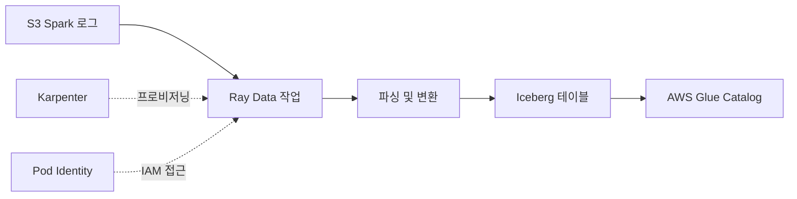

# Ray Data와 Iceberg로 Spark 로그 처리

이 가이드는 Ray Data를 사용하여 S3에서 Apache Spark 애플리케이션 로그를 처리하고 AWS Glue 카탈로그를 사용하여 Apache Iceberg 형식으로 저장하는 방법을 보여줍니다.

## 개요

이 예제는 다음을 위한 프로덕션 준비 패턴을 보여줍니다:
- S3에서 대용량 Spark 이벤트 로그 읽기
- Ray Data로 병렬 로그 처리
- Apache Iceberg 테이블에 결과 쓰기
- Iceberg 카탈로그로 AWS Glue 사용
- 자동 노드 확장을 위한 Karpenter 활용

## 아키텍처



## 전제 조건

### 1. Ray on EKS 인프라 배포

먼저 KubeRay Operator가 포함된 Ray on EKS 스택을 배포합니다:

**[인프라 배포 가이드](infra)** 를 따라:
- Karpenter 오토스케일링이 포함된 EKS 클러스터 프로비저닝
- KubeRay Operator 배포 (`enable_raydata = true` 설정)
- AWS 접근을 위한 Pod Identity 구성
- Prometheus 및 Grafana로 모니터링 설정

**배포 확인:**
```bash
kubectl get pods -n kuberay-operator
kubectl get pods -n raydata
```

### 2. Spark 애플리케이션 로그 생성

처리할 로그를 생성하기 위해 Spark 작업을 실행합니다. Spark Operator는 Ray on EKS 배포에 포함되어 있습니다.

:::info
Spark 애플리케이션은 Fluent Bit를 통해 구조화된 JSON 로그를 S3에 씁니다. 각 로그 라인은 로그 메타데이터와 메시지 내용을 포함하는 JSON 객체입니다.
:::

### Spark 로그 생성

처리할 Spark 애플리케이션 로그를 생성하려면 샘플 Spark 작업을 실행합니다:

**옵션 1: 간단한 PVC 스토리지 예제**

Spark on EKS 예제로 이동하여 PVC 스토리지로 작업 실행:

```bash
cd data-stacks/spark-on-eks/examples/ebs-pvc-storage
```

[PVC 스토리지 예제 가이드](/data-on-eks/docs/datastacks/processing/spark-on-eks/ebs-pvc-storage) 를 따라:
1. Spark 데이터용 영구 볼륨 생성
2. 이벤트 로그를 생성하는 샘플 Spark 작업 실행
3. 로그가 S3에 작성되었는지 확인

**옵션 2: 기타 Spark 예제**

`data-stacks/spark-on-eks/examples/` 디렉토리의 모든 Spark 예제를 실행할 수 있습니다:
- `taxi-trip` - NYC 택시 데이터 처리
- `benchmark` - TPC-DS 벤치마크
- `gluten-velox` - 성능 최적화된 Spark

각 작업은 자동으로 이벤트 로그를 다음 위치에 씁니다:
```
s3://<bucket-name>/<cluster-name>/spark-application-logs/spark-team-a/
```

**S3에서 로그 확인**

Spark 작업을 실행한 후 Fluent Bit가 로그를 S3로 전송했는지 확인:

```bash
# Terraform 출력에서 버킷 이름 가져오기
cd data-stacks/ray-on-eks/terraform/_local
BUCKET=$(terraform output -raw s3_bucket_id_spark_history_server)

# Spark 애플리케이션 로그 나열 (Fluent Bit의 JSON 형식)
aws s3 ls s3://${BUCKET}/spark-on-eks/spark-application-logs/spark-team-a/ --recursive
```

**예상 출력** - spark-app-selector별로 구성된 JSON 로그 파일:
```
spark-on-eks/spark-application-logs/spark-team-a/spark-1b3b78e281664cefb74ca64a1ed5a2d9/taxi-trip-ebs-pvc/taxi-trip-ebs-pvc_230728_veVAzLFN.json
spark-on-eks/spark-application-logs/spark-team-a/spark-1b3b78e281664cefb74ca64a1ed5a2d9/taxi-trip-ebs-pvc-exec-1/taxi-trip-ebs-pvc-exec-1_230915_8kTnRfkj.json
spark-on-eks/spark-application-logs/spark-team-a/spark-1b3b78e281664cefb74ca64a1ed5a2d9/taxi-trip-ebs-pvc-exec-2/taxi-trip-ebs-pvc-exec-2_230916_j5NsRfkj.json
```

각 JSON 파일에는 Spark Pod(Driver 및 Executor)의 구조화된 로그 항목이 포함되어 있습니다.

## 예제 파일

모든 파일은 `data-stacks/ray-on-eks/examples/raydata-sparklogs-processing-job/`에 있습니다:

- `rayjob.yaml` - RayJob CRD 정의
- `configmap.yaml` - Python 처리 코드
- `execute-rayjob.sh` - 배포 스크립트
- `verify-iceberg-data.sh` - 검증 스크립트
- `iceberg_verification.py` - Python 검증

## 구성

### 단계 1: 인프라 값 가져오기

**Ray on EKS** 배포에서 S3 버킷 이름과 구성 검색:

```bash
cd data-stacks/ray-on-eks/terraform/_local

# S3 버킷 이름 가져오기
terraform output s3_bucket_id_spark_history_server

# 클러스터 이름 가져오기
terraform output cluster_name

# 리전 가져오기
terraform output region
```

**예제 출력:**
```
s3_bucket_id_spark_history_server = "ray-on-eks-logs-20241022xxxxx"
cluster_name = "ray-on-eks"
region = "us-west-2"
```

### 단계 2: Ray 작업 구성 업데이트

Ray Data 예제 디렉토리로 이동:

```bash
cd data-stacks/ray-on-eks/examples/raydata-sparklogs-processing-job
```

`execute-rayjob.sh`를 편집하고 다음 값 업데이트:

```bash
# Ray Worker 확장 (로그 볼륨에 따라 조정)
MIN_WORKERS="2"
MAX_WORKERS="10"
INITIAL_WORKERS="2"

# 처리 배치 크기 (성능에 맞게 튜닝)
BATCH_SIZE="10000"
```

### 단계 3: RayJob 이해

`rayjob.yaml`은 Ray 클러스터 구성과 Python 종속성을 정의합니다.

**런타임 종속성:**
```yaml
runtimeEnvYAML: |
  pip:
    - boto3==1.34.131
    - pyiceberg[glue,s3fs]==0.10.0
    - ray[data]==2.47.1
    - pyarrow==21.0.0         # 네이티브 Pod Identity 지원
    - s3fs==2025.9.0
    - fsspec==2025.9.0
```

:::tip PyArrow 21.0.0 Pod Identity 지원
PyArrow 21.0.0+는 `AWS_CONTAINER_CREDENTIALS_FULL_URI`를 통해 EKS Pod Identity를 네이티브로 지원하여 수동 자격 증명 구성이 필요 없습니다. 모든 Ray Pod는 S3 접근에 자동으로 Pod Identity를 사용합니다.
:::

**Submitter 구성:**
```yaml
submitterPodTemplate:
  spec:
    serviceAccountName: raydata  # IAM용 Pod Identity
    containers:
      - name: rayjob-submitter
        image: rayproject/ray:2.47.1-py310
        env:
          - name: S3_BUCKET
            value: "$S3_BUCKET"
          - name: ICEBERG_DATABASE
            value: "raydata_spark_logs"
```

**Ray 클러스터 스펙:**
```yaml
headGroupSpec:
  rayStartParams:
    dashboard-host: "0.0.0.0"
    num-cpus: "2"
    object-store-memory: "1000000000"
  template:
    spec:
      serviceAccountName: raydata
      containers:
        - name: ray-head
          image: rayproject/ray:2.47.1-py310
          resources:
            requests:
              cpu: "2"
              memory: "4Gi"
            limits:
              cpu: "4"
              memory: "8Gi"
```

**Worker 구성:**
```yaml
workerGroupSpecs:
  - groupName: log-processor-workers
    replicas: $INITIAL_WORKERS
    minReplicas: $MIN_WORKERS
    maxReplicas: $MAX_WORKERS
    template:
      spec:
        containers:
          - name: ray-worker
            resources:
              requests:
                cpu: "4"
                memory: "8Gi"
              limits:
                cpu: "8"
                memory: "16Gi"
```

## 배포

### 작업 배포

```bash
export S3_BUCKET="<S3_BUCKET>"
export CLUSTER_NAME="ray-on-eks"
export AWS_REGION="<REGION>"

cd data-stacks/ray-on-eks/examples/raydata-sparklogs-processing-job/

# 스크립트 실행 권한 부여
chmod +x execute-rayjob.sh

# 작업 배포
./execute-rayjob.sh deploy
```

스크립트는 다음을 수행합니다:
1. 전제 조건 검증 (네임스페이스, 서비스 계정, Pod Identity)
2. 구성 검증 (S3 버킷, 경로, 자격 증명)
3. 처리 코드가 포함된 ConfigMap 적용
4. RayJob 배포
5. 배포 상태 및 대시보드 접근 표시

**예상 출력:**
```
==== Validating Prerequisites ====
[INFO] ✅ Prerequisites validated
[INFO] ✅ Terraform module infrastructure detected
[INFO] ✅ Ray service account found

==== Current Configuration ====
AWS Region: us-west-2
Namespace: raydata
Iceberg Database: raydata_spark_logs
Iceberg Table: spark_logs
Iceberg Warehouse: s3://bucket-name/iceberg-warehouse
S3 Logs Path: s3://bucket-name/spark-application-logs/spark-team-a
Workers: 2-10 (initial: 2)

==== Deploying Ray Job Components ====
[INFO] 1. Deploying ConfigMap...
[INFO] 2. Deploying RayJob...
[INFO] ✅ Ray job components deployed successfully
```

### 작업 실행 모니터링

**빠른 상태 확인:**
```bash
# 작업 상태 확인
./execute-rayjob.sh status

# 실시간으로 작업 진행 상황 확인
./execute-rayjob.sh monitor
```

**수동 모니터링:**
```bash
# 작업 상태 확인
kubectl get rayjobs -n raydata -w

# 예상 출력:
# NAME                       JOB STATUS   DEPLOYMENT STATUS   START TIME             END TIME
# spark-log-processing-job   RUNNING      Running             2025-10-22T23:47:12Z

# Pod 상태 가져오기
kubectl get pods -n raydata

# 예상 출력:
# NAME                                                              READY   STATUS
# spark-log-processing-job-2t8h9-head-2bgdd                         2/2     Running
# spark-log-processing-job-2t8h9-log-processor-worke-worker-vckb4   1/1     Running
# spark-log-processing-job-2t8h9-log-processor-worke-worker-z2hgd   1/1     Running
# spark-log-processing-job-cjgff                                    1/1     Running
```

### 작업 로그 보기

**스크립트 사용:**
```bash
# 작업 로그 팔로우
./execute-rayjob.sh logs
```

**수동 로그 보기:**
```bash
# Submitter Pod 이름 가져오기
SUBMITTER_POD=$(kubectl get pods -n raydata --no-headers | grep spark-log-processing-job | grep -v head | grep -v worker | awk '{print $1}')

# Submitter 로그 팔로우
kubectl logs $SUBMITTER_POD -n raydata -f
```

**예상 로그 출력:**
```
2025-10-22 16:48:08,808 - spark-log-processor - INFO - ✅ Using EKS Pod Identity credentials from http://169.254.170.23/v1/credentials
2025-10-22 16:48:08,808 - spark-log-processor - INFO - ✅ PyArrow 19.0.1+ will automatically use Pod Identity for S3 access
2025-10-22 16:48:15,003 - spark-log-processor - INFO - ✅ Iceberg catalog initialized: glue
2025-10-22 16:48:16,801 - spark-log-processor - INFO - ✅ Created new data table: raydata_spark_logs.spark_logs
2025-10-22 16:48:17,523 - spark-log-processor - INFO - ✅ Created new metadata table: raydata_spark_logs.spark_logs_processing_metadata
2025-10-22 16:48:18,676 - spark-log-processor - INFO - 🔍 Starting intelligent folder discovery with metadata tracking...
2025-10-22 16:48:19,142 - spark-log-processor - INFO - 🔄 Processing folder: spark-1b3b78e281664cefb74ca64a1ed5a2d9

Running Dataset: dataset_1_0. Active & requested resources: 2/10 CPU, 244.5KB/2.3GB object store
- ReadText->SplitBlocks(7): 33%|███▎ | 295/885 [00:08<00:03, 164 row/s]

2025-10-22 16:48:34,742 - spark-log-processor - INFO - 🎯 Processing Summary:
2025-10-22 16:48:34,742 - spark-log-processor - INFO -   📊 Total records processed: 647
2025-10-22 16:48:34,742 - spark-log-processor - INFO -   ✅ Successful folders: 1
2025-10-22 16:48:34,742 - spark-log-processor - INFO -   ❌ Failed folders: 0
2025-10-22 16:48:39,154 - SUCC - Job 'spark-log-processing-job' succeeded
```

### Ray Dashboard 접근

**스크립트 사용:**
```bash
# 대시보드 접근 지침 표시
./execute-rayjob.sh dashboard
```

**수동 설정:**
```bash
# Ray Head 서비스 이름 가져오기
RAY_HEAD_SVC=$(kubectl get svc -n raydata --no-headers | grep head-svc | awk '{print $1}')

# Ray Dashboard로 포트 포워드
kubectl port-forward -n raydata service/$RAY_HEAD_SVC 8265:8265

# 브라우저에서 http://localhost:8265 열기
```

**Ray Dashboard 기능:**
- 작업 실행 타임라인
- 리소스 사용률 (CPU, 메모리, Object Store)
- 태스크 분석 및 성능
- Worker 노드 상태
- 로그 집계

### Karpenter 노드 프로비저닝 확인

```bash
# Karpenter 로그 보기
kubectl logs -n karpenter -l app.kubernetes.io/name=karpenter -f

# 노드 생성 확인
kubectl get nodes -l karpenter.sh/initialized=true -w

# 노드 용량 유형 확인 (스팟 vs 온디맨드)
kubectl get nodes -L karpenter.sh/capacity-type
```

## 처리 로직

작업은 지능형 메타데이터 기반 증분 처리를 수행합니다:

### 1. Spark 애플리케이션 탐색

```python
# S3에서 모든 spark-app-selector 폴더 나열
folders = s3.list_folders(f"s3://{bucket}/{prefix}/")

# 이미 처리된 폴더에 대한 메타데이터 테이블 쿼리
processed = catalog.load_table('spark_logs_processing_metadata').scan()

# 처리할 새 폴더 식별
new_folders = [f for f in folders if f not in processed['spark_app_selector']]
```

### 2. Ray Data로 JSON 로그 읽기

```python
import ray

# Ray 초기화 (PyArrow 21.0.0+는 자동으로 Pod Identity 사용)
ray.init()

# Fluent Bit 출력에서 JSON 로그 파일 읽기
ds = ray.data.read_text(
    f"s3://{bucket}/{prefix}/{spark_app_selector}/**/*.json"
)
```

### 3. 로그 파싱 및 보강

```python
def parse_log_line(line):
    """Fluent Bit JSON 로그 형식 파싱"""
    log = json.loads(line)
    return {
        'timestamp': log.get('timestamp'),
        'log_level': log.get('log_level'),
        'message': log.get('message'),
        'pod_name': log.get('kubernetes', {}).get('pod_name'),
        'spark_app_selector': log.get('kubernetes', {}).get('labels', {}).get('spark-app-selector'),
        # ... 추가 Kubernetes 메타데이터
    }

# 파싱 적용
ds = ds.map(parse_log_line).filter(lambda x: x is not None)
```

### 4. 메타데이터 추적과 함께 Iceberg에 쓰기

```python
from pyiceberg.catalog import load_catalog

# AWS Glue 카탈로그 로드 (Pod Identity 사용)
catalog = load_catalog('glue', warehouse=f"s3://{bucket}/iceberg-warehouse/")

# Iceberg 테이블에 로그 데이터 쓰기
table = catalog.load_table('raydata_spark_logs.spark_logs')
table.append(ds.to_arrow())

# 증분 처리를 위한 메타데이터 테이블 업데이트
metadata_table = catalog.load_table('raydata_spark_logs.spark_logs_processing_metadata')
metadata_table.append({
    'spark_app_selector': spark_app_selector,
    'status': 'SUCCESS',
    'records_processed': ds.count(),
    'processing_end_time': datetime.now()
})
```

## IAM 권한

작업은 Pod Identity를 사용합니다 (`infra/terraform/ray-operator.tf`에서 구성):

**S3 권한:**
```json
{
  "Effect": "Allow",
  "Action": [
    "s3:GetObject",
    "s3:PutObject",
    "s3:ListBucket"
  ],
  "Resource": [
    "arn:aws:s3:::bucket-name/spark-application-logs/*",
    "arn:aws:s3:::bucket-name/iceberg-warehouse/*"
  ]
}
```

**Glue 권한:**
```json
{
  "Effect": "Allow",
  "Action": [
    "glue:GetDatabase",
    "glue:GetTable",
    "glue:CreateTable",
    "glue:UpdateTable",
    "glue:GetPartitions",
    "glue:BatchCreatePartition"
  ],
  "Resource": "*"
}
```

## 결과 확인

### 작업 완료 확인

```bash
# 최종 작업 상태 확인
kubectl get rayjob spark-log-processing-job -n raydata

# 예상 출력:
# NAME                       JOB STATUS   DEPLOYMENT STATUS   START TIME             END TIME               AGE
# spark-log-processing-job   SUCCEEDED    Complete            2025-10-22T23:47:12Z   2025-10-22T23:48:42Z   2m51s
```

### Iceberg 테이블 생성 확인

**AWS Glue Catalog 확인:**
```bash
# Glue에 테이블 존재 여부 확인
aws glue get-table \
  --database-name raydata_spark_logs \
  --name spark_logs \
  --region us-west-2 \
  --output json | jq '.Table | {Name, Location: .StorageDescriptor.Location, Columns: .StorageDescriptor.Columns | length}'

# 예상 출력:
# {
#   "Name": "spark_logs",
#   "Location": "s3://bucket-name/iceberg-warehouse/raydata_spark_logs.db/spark_logs",
#   "Columns": 14
# }
```

**S3 데이터 파일 확인:**
```bash
# Iceberg 데이터 및 메타데이터 파일 나열
aws s3 ls s3://your-bucket/iceberg-warehouse/raydata_spark_logs.db/spark_logs/ --recursive

# 예상 출력:
# iceberg-warehouse/raydata_spark_logs.db/spark_logs/data/00000-0-592550cf-a900-45c7-adf8-c5ab577236ad.parquet
# iceberg-warehouse/raydata_spark_logs.db/spark_logs/metadata/00001-ba180b06-2e59-4133-9ea9-a2af29bb393b.metadata.json
# iceberg-warehouse/raydata_spark_logs.db/spark_logs/metadata/592550cf-a900-45c7-adf8-c5ab577236ad-m0.avro
```

### 데이터 처리 확인

**처리 요약 확인:**
```bash
# Submitter Pod 로그 가져오기
SUBMITTER_POD=$(kubectl get pods -n raydata --no-headers | grep spark-log-processing-job | grep -v head | grep -v worker | awk '{print $1}')

# 처리 요약 보기
kubectl logs $SUBMITTER_POD -n raydata | grep -A5 "Processing Summary"

# 예상 출력:
# 🎯 Processing Summary:
#   📊 Total records processed: 647
#   ✅ Successful folders: 1
#   ❌ Failed folders: 0
#   ✅ Successfully processed: ['spark-1b3b78e281664cefb74ca64a1ed5a2d9']
```

### Iceberg 테이블 쿼리

**옵션 1: AWS Athena 사용**

1. AWS Athena 콘솔 열기
2. 데이터베이스 선택: `raydata_spark_logs`
3. 쿼리 실행:

```sql
-- 행 수 확인
SELECT COUNT(*) as total_records
FROM spark_logs;

-- 샘플 데이터 보기
SELECT
    timestamp,
    log_level,
    pod_name,
    spark_app_selector,
    message
FROM spark_logs
LIMIT 10;

-- 로그 레벨 분석
SELECT
    log_level,
    COUNT(*) as count
FROM spark_logs
WHERE log_level IS NOT NULL
GROUP BY log_level
ORDER BY count DESC;

-- Spark 애플리케이션별 로그 보기
SELECT
    spark_app_selector,
    spark_app_name,
    COUNT(*) as log_count
FROM spark_logs
WHERE spark_app_selector IS NOT NULL
GROUP BY spark_app_selector, spark_app_name
ORDER BY log_count DESC;
```

**예상 결과:**
```
total_records: 647

log_level    | count
-------------|------
INFO         | 520
WARN         | 85
ERROR        | 42

spark_app_selector                       | spark_app_name        | log_count
-----------------------------------------|----------------------|----------
spark-1b3b78e281664cefb74ca64a1ed5a2d9   | taxi-trip-ebs-pvc    | 647
```

**옵션 2: PyIceberg 사용**

검증 스크립트 생성:

```python
#!/usr/bin/env python3
"""PyIceberg를 사용한 Iceberg 테이블 데이터 검증."""

from pyiceberg.catalog import load_catalog
import pyarrow.compute as pc

# Glue 카탈로그 로드
catalog = load_catalog(
    'glue',
    **{
        'type': 'glue',
        'glue.region': 'us-west-2',
        'warehouse': 's3://your-bucket/iceberg-warehouse'
    }
)

# 테이블 로드
table = catalog.load_table('raydata_spark_logs.spark_logs')

# 테이블 메타데이터 가져오기
print(f"Table: {table.name()}")
print(f"Location: {table.location()}")
print(f"Schema: {table.schema()}")
print(f"Snapshots: {len(table.snapshots())}")

# 스캔 및 PyArrow로 변환
arrow_table = table.scan().to_arrow()

print(f"\n📊 Total Records: {len(arrow_table)}")
print(f"📋 Columns: {arrow_table.num_columns}")
print(f"💾 Size: {arrow_table.nbytes / 1024:.2f} KB")

# 로그 레벨 분포 표시
if 'log_level' in arrow_table.column_names:
    log_levels = pc.value_counts(arrow_table['log_level'])
    print(f"\n📈 Log Level Distribution:")
    for level in log_levels.to_pylist():
        print(f"  {level['values']}: {level['counts']}")

# 샘플 데이터 표시
print(f"\n📝 Sample Records (first 5):")
print(arrow_table.select(['timestamp', 'log_level', 'pod_name', 'message']).slice(0, 5).to_pandas())
```

스크립트 실행:
```bash
python verify_iceberg_data.py
```

**옵션 3: DuckDB 사용**

```python
import duckdb
from pyiceberg.catalog import load_catalog

# 카탈로그 및 테이블 로드
catalog = load_catalog('glue', warehouse='s3://bucket/iceberg-warehouse/')
table = catalog.load_table('raydata_spark_logs.spark_logs')

# Arrow로 변환 및 DuckDB로 쿼리
con = duckdb.connect()
arrow_table = table.scan().to_arrow()

# DuckDB 테이블로 등록
con.register('spark_logs', arrow_table)

# SQL 쿼리 실행
result = con.execute("""
    SELECT
        log_level,
        COUNT(*) as count,
        COUNT(DISTINCT pod_name) as unique_pods
    FROM spark_logs
    WHERE log_level IS NOT NULL
    GROUP BY log_level
    ORDER BY count DESC
""").fetchdf()

print(result)
```

### Pod Identity 사용 확인

```bash
# Pod Identity 자격 증명 사용 확인
kubectl logs $SUBMITTER_POD -n raydata | grep "Pod Identity\|AWS credentials"

# 예상 출력:
# ✅ Using EKS Pod Identity credentials from http://169.254.170.23/v1/credentials
# ✅ PyArrow 19.0.1+ will automatically use Pod Identity for S3 access
```

### 메타데이터 테이블 확인

작업은 처리 상태를 추적하기 위한 메타데이터 테이블도 생성합니다:

```bash
# Athena로 메타데이터 테이블 쿼리
SELECT
    spark_app_selector,
    status,
    records_processed,
    processing_start_time,
    processing_end_time,
    updated_at
FROM raydata_spark_logs.spark_logs_processing_metadata
ORDER BY updated_at DESC;

# 예상 출력:
# spark_app_selector                       | status    | records_processed | processing_start_time      | processing_end_time
# -----------------------------------------|-----------|-------------------|---------------------------|---------------------
# spark-1b3b78e281664cefb74ca64a1ed5a2d9   | SUCCESS   | 647               | 2025-10-22 16:48:19       | 2025-10-22 16:48:34
```

이 메타데이터는 증분 처리를 가능하게 합니다 - 후속 실행은 이미 처리된 폴더를 건너뜁니다.

## 성능 튜닝

### Worker 수 조정

```bash
# 더 빠른 처리를 위해 더 많은 Worker
MIN_WORKERS="5"
MAX_WORKERS="20"
INITIAL_WORKERS="5"
```

### 배치 크기 튜닝

```bash
# 더 큰 배치 = 더 좋은 처리량, 더 많은 메모리
BATCH_SIZE="50000"

# 더 작은 배치 = 더 적은 메모리, 더 많은 오버헤드
BATCH_SIZE="5000"
```

### 리소스 할당

`rayjob.yaml` 수정:

```yaml
# 메모리 집약적 워크로드용
resources:
  requests:
    cpu: "8"
    memory: "32Gi"
  limits:
    cpu: "16"
    memory: "64Gi"
```

### Karpenter 인스턴스 유형

컴퓨팅 최적화 인스턴스용 NodePool 생성:

```yaml
apiVersion: karpenter.sh/v1beta1
kind: NodePool
metadata:
  name: ray-compute-optimized
spec:
  template:
    spec:
      requirements:
        - key: karpenter.sh/capacity-type
          operator: In
          values: ["spot"]
        - key: node.kubernetes.io/instance-type
          operator: In
          values: ["c5.4xlarge", "c6i.4xlarge", "c7i.4xlarge"]
```

## 문제 해결

### 작업이 시작되지 않음

```bash
# RayJob 상태 확인
kubectl describe rayjob spark-log-processing-job -n raydata

# Operator 확인
kubectl logs -n kuberay-operator deployment/kuberay-operator
```

### Worker Pod가 Pending

```bash
# Karpenter 확인
kubectl logs -n karpenter -l app.kubernetes.io/name=karpenter --tail=100

# 노드 용량 확인
kubectl get nodes
kubectl describe node <node-name>
```

### S3 접근 오류

```bash
# Pod Identity 확인
kubectl describe sa raydata -n raydata

# Pod에서 S3 접근 테스트
kubectl run -it --rm debug --image=amazon/aws-cli --serviceaccount=raydata -n raydata -- \
  s3 ls s3://your-bucket/spark-application-logs/
```

### Iceberg 쓰기 실패

일반적인 문제:
- **타임스탬프 정밀도**: `downcast-ns-timestamp-to-us-on-write`로 이미 처리됨
- **스키마 불일치**: 쓰기 간 일관된 스키마 보장
- **카탈로그 잠금**: 동일 테이블 파티션에 대한 동시 쓰기 방지

## 정리

작업은 완료 후 자동으로 정리됩니다:

```yaml
shutdownAfterJobFinishes: true
ttlSecondsAfterFinished: 600
```

수동 정리:

```bash
# RayJob 삭제
kubectl delete rayjob spark-log-processing-job -n raydata

# ConfigMap 삭제
kubectl delete configmap spark-log-processor-code -n raydata
```

## 다음 단계

- **처리 스케줄링**: 주기적 실행을 위해 Kubernetes CronJob 사용
- **모니터링 추가**: 실패에 대한 Prometheus 알람 구성
- **파티셔닝 최적화**: 더 나은 쿼리를 위해 날짜 또는 app_id로 파티션
- **증분 처리**: 재처리를 피하기 위해 처리된 파일 추적

## 추가 리소스

- [Ray Data 문서](https://docs.ray.io/en/latest/data/data.html)
- [Apache Iceberg](https://iceberg.apache.org/)
- [AWS Glue Catalog](https://docs.aws.amazon.com/glue/latest/dg/catalog-and-crawler.html)
- [Karpenter](https://karpenter.sh/)
