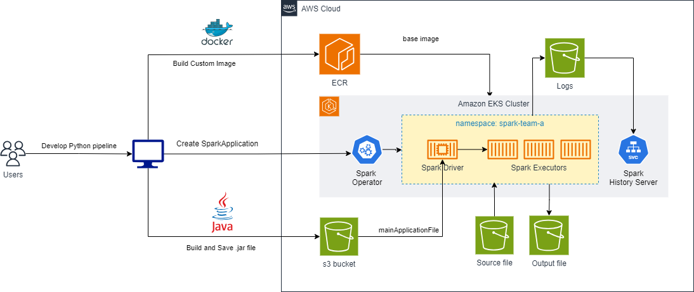

import CollapsibleContent from '@site/src/components/CollapsibleContent';

# Spark/EKS에서 Apache Beam 파이프라인

## 개요

[Apache Beam](https://beam.apache.org/)은 이식 가능한 배치 및 스트리밍 데이터 파이프라인을 구축하기 위한 통합 프로그래밍 모델을 제공합니다. Beam의 주요 장점은 Apache Spark, Apache Flink, Google Cloud Dataflow, Direct Runner를 포함한 여러 실행 엔진(러너)에서 **한 번 작성하면 어디서나 실행** 가능한 이식성입니다.

**Spark/EKS에서 Beam을 사용하는 이유:**
- **이식성**: 파이프라인을 한 번 작성하면 오늘은 Spark에서, 내일은 Flink에서 실행 가능
- **통합 모델**: 배치와 스트리밍을 위한 동일한 API (Beam의 윈도우 모델)
- **에코시스템 통합**: Kubernetes에서 Spark의 성숙한 에코시스템 활용
- **Kubernetes 네이티브**: EKS를 통한 자동 확장, 장애 허용, 리소스 관리



## Apache Beam 기초

### 프로그래밍 모델

Beam 파이프라인은 다음으로 구성됩니다:
1. **PCollection**: 불변 분산 데이터셋 (Spark RDD/DataFrame과 유사)
2. **PTransform**: 데이터 변환 (ParDo, GroupByKey, CoGroupByKey)
3. **Pipeline**: PCollection과 PTransform의 DAG
4. **Runner**: 실행 엔진 (이 경우 SparkRunner)

### Beam vs 네이티브 Spark

| 기능 | Apache Beam | 네이티브 Spark |
|---------|-------------|--------------|
| **이식성** | Spark/Flink/Dataflow에서 실행 | Spark 전용 |
| **스트리밍 모델** | 이벤트 시간 윈도우 | 마이크로 배치/구조적 스트리밍 |
| **API** | Beam SDK (Java/Python/Go) | Spark API (Scala/Java/Python/R) |
| **성능** | 변환 오버헤드 | 네이티브 최적화 |
| **사용 사례** | 멀티 클라우드/이식 가능 파이프라인 | Spark 최적화 워크로드 |

## 전제 조건

:::info
진행하기 전에 [인프라 설정 가이드](/data-on-eks/docs/datastacks/processing/spark-on-eks/infra)를 따라 Spark on EKS 인프라를 배포했는지 확인하세요.
:::

**필수 사항:**
- Spark on EKS 인프라 배포됨
- Spark History Server 활성화됨 (모니터링용)
- 아티팩트 및 이벤트 로그용 S3 버킷
- Python 3.11+ (파이프라인 개발용)
- Docker (Beam SDK가 포함된 커스텀 Spark 이미지 빌드용)

## Spark/EKS에 Beam 파이프라인 배포

### 단계 1: Beam SDK가 포함된 커스텀 Docker 이미지 빌드

Beam 파이프라인은 Beam SDK가 사전 설치된 Spark 런타임이 필요합니다. Beam SparkRunner는 SDK가 Spark Executor JVM 내에서 실행되는 **PROCESS** 환경을 사용합니다.

**Dockerfile 검토:**

```dockerfile
# Data on EKS의 기본 Spark 이미지
FROM public.ecr.aws/data-on-eks/spark:3.5.3-scala2.12-java17-python3-ubuntu

USER root

# Python 3.11 설치 및 가상 환경 생성
RUN apt-get update && apt-get install -y python3.11 python3.11-venv && \
    python3.11 -m venv /opt/apache/beam && \
    /opt/apache/beam/bin/pip install --upgrade pip

# Spark extras가 포함된 Apache Beam SDK 설치
RUN /opt/apache/beam/bin/pip install apache-beam[gcp,aws]==2.58.0 && \
    /opt/apache/beam/bin/pip install s3fs boto3

# Beam PROCESS 환경을 위한 부트 스크립트 생성
RUN echo '#!/opt/apache/beam/bin/python' > /opt/apache/beam/boot && \
    chmod +x /opt/apache/beam/boot

USER 185
```

**이미지 빌드 및 푸시:**

```bash
cd data-stacks/spark-on-eks/examples/beam

# AWS 계정 및 리전 설정
export ACCOUNT_ID=$(aws sts get-caller-identity --query Account --output text)
export REGION=us-west-2

# ECR 리포지토리 생성
aws ecr create-repository \
  --repository-name beam-spark \
  --region ${REGION}

# 멀티 아키텍처 이미지 빌드
docker buildx build --platform linux/amd64,linux/arm64 \
  -t ${ACCOUNT_ID}.dkr.ecr.${REGION}.amazonaws.com/beam-spark:2.58.0 \
  -f Dockerfile \
  --push .
```

**주요 구성:**
- `apache-beam[gcp,aws]`: 클라우드 I/O 커넥터가 포함된 Beam SDK
- `/opt/apache/beam/boot`: Beam의 PROCESS 환경 진입점
- 멀티 아키텍처 빌드: x86 (c5) 및 ARM (Graviton) 인스턴스 모두 지원

### 단계 2: Beam 파이프라인 개발 및 패키징

**Python 가상 환경 생성:**

```bash
python3.11 -m venv beam-dev
source beam-dev/bin/activate
pip install --upgrade pip
pip install apache-beam[aws]==2.58.0 s3fs boto3
```

**WordCount 예제 파이프라인 다운로드:**

```bash
# 클래식 Beam 예제: 단어 빈도 계산
curl -O https://raw.githubusercontent.com/apache/beam/master/sdks/python/apache_beam/examples/wordcount.py

# 샘플 입력 텍스트 (셰익스피어의 King Lear)
curl -O https://raw.githubusercontent.com/cs109/2015/master/Lectures/Lecture15b/sparklect/shakes/kinglear.txt
```

**파이프라인 코드 검사:**

```python
# wordcount.py 핵심 구성 요소:

# 1. 텍스트 파일에서 라인 읽기
lines = pipeline | 'Read' >> ReadFromText(input_file)

# 2. 라인을 단어로 분리 (ParDo 변환)
words = lines | 'Split' >> beam.FlatMap(lambda line: line.split())

# 3. 단어 발생 횟수 계산 (GroupByKey + CombinePerKey)
word_counts = (words
  | 'PairWithOne' >> beam.Map(lambda word: (word, 1))
  | 'GroupAndSum' >> beam.CombinePerKey(sum))

# 4. 출력 파일에 결과 쓰기
output = word_counts | 'Format' >> beam.Map(format_result)
output | 'Write' >> WriteToText(output_file)
```

**입력 데이터 업로드:**

```bash
# 인프라에서 S3 버킷 가져오기
export S3_BUCKET=$(kubectl get cm -n spark-team-a spark-config \
  -o jsonpath='{.data.s3_bucket}' 2>/dev/null || echo "your-bucket-name")

aws s3 cp kinglear.txt s3://${S3_BUCKET}/beam/input/
```

### 단계 3: 이식 가능한 Beam JAR 생성

Spark에서 Beam을 실행하려면 모든 종속성이 포함된 자체 포함 JAR로 파이프라인을 패키징해야 합니다:

```bash
python3 wordcount.py \
  --output_executable_path=./wordcount-beam.jar \
  --runner=SparkRunner \
  --environment_type=PROCESS \
  --environment_config='{"command":"/opt/apache/beam/boot"}' \
  --input=s3://${S3_BUCKET}/beam/input/kinglear.txt \
  --output=s3://${S3_BUCKET}/beam/output/wordcount \
  --spark_submit_uber_jar
```

**주요 매개변수:**
- `--runner=SparkRunner`: Spark에서 실행 (DirectRunner/FlinkRunner 대신)
- `--environment_type=PROCESS`: Spark Executor JVM에서 Beam SDK 실행
- `--environment_config`: 컨테이너 내 Beam 부트 스크립트 경로
- `--output_executable_path`: 실행 없이 이식 가능한 JAR 생성
- `--spark_submit_uber_jar`: 모든 종속성 번들 (uber JAR)

**S3에 JAR 업로드:**

```bash
aws s3 cp wordcount-beam.jar s3://${S3_BUCKET}/beam/jars/
```

### 단계 4: SparkApplication 매니페스트 생성

Beam 파이프라인을 Spark 애플리케이션으로 제출하기 위한 `beam-wordcount.yaml` 생성:

```yaml
apiVersion: sparkoperator.k8s.io/v1beta2
kind: SparkApplication
metadata:
  name: beam-wordcount
  namespace: spark-team-a
spec:
  type: Java
  mode: cluster
  image: "${ACCOUNT_ID}.dkr.ecr.${REGION}.amazonaws.com/beam-spark:2.58.0"
  imagePullPolicy: IfNotPresent

  # Beam uber JAR 위치
  mainApplicationFile: "s3a://${S3_BUCKET}/beam/jars/wordcount-beam.jar"
  mainClass: "org.apache.beam.runners.spark.SparkPipelineRunner"

  sparkVersion: "3.5.3"
  restartPolicy:
    type: Never

  sparkConf:
    # Beam 특정 구성
    "spark.beam.version": "2.58.0"
    "spark.executor.instances": "2"

    # History Server용 이벤트 로깅
    "spark.eventLog.enabled": "true"
    "spark.eventLog.dir": "s3a://${S3_BUCKET}/spark-event-logs"

    # Pod Identity를 사용한 S3 접근 (AWS SDK V2)
    "spark.hadoop.fs.s3a.aws.credentials.provider.mapping": "com.amazonaws.auth.WebIdentityTokenCredentialsProvider=software.amazon.awssdk.auth.credentials.ContainerCredentialsProvider"
    "spark.hadoop.fs.s3a.aws.credentials.provider": "software.amazon.awssdk.auth.credentials.ContainerCredentialsProvider"
    "spark.hadoop.fs.s3.impl": "org.apache.hadoop.fs.s3a.S3AFileSystem"

  driver:
    cores: 1
    memory: "2g"
    serviceAccount: spark-team-a
    labels:
      version: "3.5.3"
      app: "beam-wordcount"
    nodeSelector:
      NodeGroupType: "SparkComputeOptimized"
      karpenter.sh/capacity-type: "on-demand"
    tolerations:
      - key: "spark-compute-optimized"
        operator: "Exists"
        effect: "NoSchedule"

  executor:
    cores: 2
    instances: 2
    memory: "4g"
    serviceAccount: spark-team-a
    labels:
      version: "3.5.3"
      app: "beam-wordcount"
    nodeSelector:
      NodeGroupType: "SparkComputeOptimized"
    tolerations:
      - key: "spark-compute-optimized"
        operator: "Exists"
        effect: "NoSchedule"
```

**매니페스트 적용:**

```bash
# 환경 변수 대체
envsubst < beam-wordcount.yaml > beam-wordcount-final.yaml

# Beam 파이프라인 제출
kubectl apply -f beam-wordcount-final.yaml
```

### 단계 5: 파이프라인 실행 모니터링

**Spark Application 상태 확인:**

```bash
# SparkApplication 리소스 확인
kubectl get sparkapplication -n spark-team-a -w

# Driver Pod 로그 확인
kubectl logs -n spark-team-a beam-wordcount-driver -f
```

**Spark History Server 접근:**

```bash
# History Server로 포트 포워드
kubectl port-forward -n spark-history-server \
  svc/spark-history-server 18080:80

# http://localhost:18080 열기
```

**예상 실행 흐름:**
1. Spark Driver가 Beam 파이프라인 JAR 로드
2. Beam의 SparkRunner가 Beam 변환을 Spark RDD로 변환
3. Spark Executor가 데이터 변환 처리
4. S3 출력 경로에 결과 쓰기

### 단계 6: 파이프라인 결과 확인

**출력 파일 다운로드:**

```bash
# Beam은 샤딩된 파일로 출력
mkdir -p beam-output
aws s3 sync s3://${S3_BUCKET}/beam/output/ beam-output/ \
  --exclude "*" --include "wordcount-*"
```

**단어 카운트 검사:**

```bash
# 모든 출력 샤드 결합
cat beam-output/wordcount-* | head -20
```

**예상 출력:**

```text
particular: 3
wish: 2
Either: 3
benison: 2
Duke: 30
Contending: 1
...
```

## Spark에서 고급 Beam 패턴

### 윈도우 집계 (스트리밍)

Beam의 윈도우 모델은 Spark Structured Streaming에서 원활하게 작동합니다:

```python
windowed_counts = (
  events
  | 'Window' >> beam.WindowInto(
      beam.window.FixedWindows(60)  # 1분 윈도우
    )
  | 'Count' >> beam.CombinePerKey(sum)
)
```

**SparkRunner 변환:**
- Beam 윈도우 -> Spark의 `window()` 함수
- 이벤트 시간 처리 -> Structured Streaming의 워터마크

### 사이드 입력 (브로드캐스트 변수)

```python
# Beam 사이드 입력 패턴
lookup_data = pipeline | 'Read Lookup' >> ReadFromText('s3://...')
side_input = beam.pvalue.AsList(lookup_data)

enriched = main_data | 'Enrich' >> beam.ParDo(
  EnrichFn(), lookup=side_input
)
```

**Spark 동등:**
- Beam 사이드 입력 -> Spark 브로드캐스트 변수
- 작은 참조 데이터에 효율적

### 상태 및 타이머

```python
# Beam을 사용한 상태 있는 처리
class StatefulDoFn(beam.DoFn):
  STATE = beam.DoFn.StateParam(beam.transforms.userstate.CombiningValueStateSpec(
    'count', beam.coders.VarIntCoder(), sum
  ))

  def process(self, element, state=STATE):
    current = state.read()
    state.add(1)
    yield (element, current + 1)
```

**성능 참고:** 상태 있는 Beam 변환은 네이티브 Spark `mapGroupsWithState`에 비해 SparkRunner에서 오버헤드가 있을 수 있습니다.

## 프로덕션 모범 사례

### 리소스 튜닝

```yaml
sparkConf:
  # 대규모 Beam 파이프라인을 위한 병렬 처리 증가
  "spark.default.parallelism": "200"
  "spark.sql.shuffle.partitions": "200"

  # Beam SDK를 위한 메모리 오버헤드
  "spark.executor.memoryOverhead": "1g"

  # 가변 워크로드를 위한 동적 할당
  "spark.dynamicAllocation.enabled": "true"
  "spark.dynamicAllocation.minExecutors": "2"
  "spark.dynamicAllocation.maxExecutors": "20"
```

### Spark에서 Beam 최적화

**1. 과도한 셔플 피하기:**
```python
# 나쁜 예: 여러 GroupByKey가 셔플 생성
data | beam.GroupByKey() | beam.GroupByKey()

# 좋은 예: 복합 키를 사용한 단일 GroupByKey
data | beam.Map(lambda x: ((key1, key2), x)) | beam.GroupByKey()
```

**2. 집계에 CombineFn 사용:**
```python
# GroupByKey + reduce보다 효율적
data | beam.CombinePerKey(sum)  # vs GroupByKey + Map
```

**3. Beam SQL (Calcite) 활용:**
```python
# Apache Calcite를 통한 SQL 최적화
result = data | beam.SqlTransform("""
  SELECT product, SUM(revenue) as total
  FROM PCOLLECTION
  GROUP BY product
""")
```

### 모니터링 및 디버깅

**Beam 메트릭 활성화:**

```python
from apache_beam.metrics import Metrics

class CountMetrics(beam.DoFn):
  def __init__(self):
    self.counter = Metrics.counter('beam', 'processed_records')

  def process(self, element):
    self.counter.inc()
    yield element
```

**메트릭은 Spark UI**의 커스텀 어큐뮬레이터 아래에 표시됩니다.

## 문제 해결

### ClassNotFoundException으로 파이프라인 실패

**원인:** Beam 종속성이 Executor 클래스패스에 없음

**해결:** JAR 생성 시 `--spark_submit_uber_jar`가 사용되었는지 확인

### 네이티브 Spark 대비 느린 성능

**원인:** Beam 변환 오버헤드 및 PCollection 구체화

**해결:**
- 이식성을 위해 Beam 사용; 성능이 중요한 파이프라인에는 네이티브 Spark 사용
- Spark UI로 병목 현상 프로파일링
- Beam의 실험적 `use_fast_avro` 플래그 고려

### PROCESS 환경 부트 오류

**원인:** 잘못된 `environment_config` 경로

**해결:** Docker 이미지에 `/opt/apache/beam/boot`가 있는지 확인

```bash
kubectl exec -it beam-wordcount-driver -- ls -la /opt/apache/beam/boot
```

## Beam on Spark vs 네이티브 Spark 사용 시기

**Apache Beam 사용 시:**
- Spark/Flink/Dataflow 간 이식성이 필요한 경우
- Google Cloud Dataflow에서 EKS로 마이그레이션하는 경우
- 일관된 API로 배치 + 스트리밍 통합이 필요한 경우
- Beam I/O 커넥터 (Kafka, BigQuery 등)를 많이 사용하는 경우

**네이티브 Spark 사용 시:**
- Spark 전용 배포 (멀티 러너 요구 사항 없음)
- 성능이 중요한 경우 (변환 오버헤드 방지)
- Spark 특정 기능 (MLlib, GraphX) 활용 시
- 대규모 SQL 워크로드 (Catalyst 옵티마이저)

<CollapsibleContent header={<h2><span>정리</span></h2>}>

### Beam 리소스 삭제

```bash
# SparkApplication 삭제
kubectl delete sparkapplication beam-wordcount -n spark-team-a

# S3 아티팩트 제거
aws s3 rm s3://${S3_BUCKET}/beam/ --recursive

# ECR 리포지토리 삭제
aws ecr delete-repository \
  --repository-name beam-spark \
  --region ${REGION} \
  --force
```

### EKS 인프라 삭제

```bash
cd data-stacks/spark-on-eks
./cleanup.sh
```

</CollapsibleContent>

## 관련 리소스

- [Apache Beam 문서](https://beam.apache.org/documentation/)
- [Beam SparkRunner 기능 매트릭스](https://beam.apache.org/documentation/runners/spark/)
- [Beam 프로그래밍 가이드](https://beam.apache.org/documentation/programming-guide/)
- [인프라 설정 가이드](/data-on-eks/docs/datastacks/processing/spark-on-eks/infra)
- [Spark 관측성](/data-on-eks/docs/datastacks/processing/spark-on-eks/observability)
