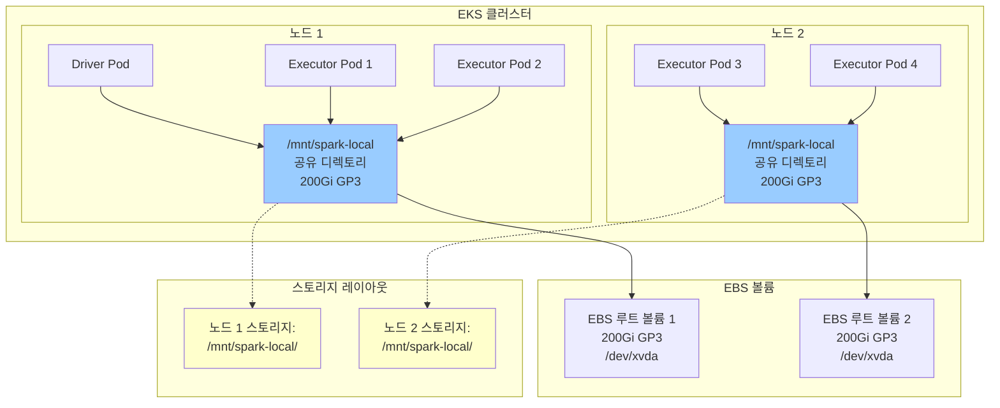

# EBS 노드 수준 스토리지를 사용한 Spark

Spark 셔플 스토리지를 위해 노드당 공유 EBS 볼륨을 사용하는 방법을 알아봅니다 - Pod별 PVC에 대한 비용 효율적인 대안입니다.

## 전제 조건

- Spark on EKS 인프라 배포: [인프라 설정](./infra.md)
- **기존 EBS 볼륨** (200Gi GP3)을 전용 Spark 디렉토리와 함께 사용

:::warning 노드 스토리지 고려 사항
이 접근 방식은 노드당 하나의 EBS 볼륨을 모든 Spark Pod 간에 공유합니다. 비용 효율적이지만 여러 워크로드가 동일한 스토리지를 경쟁할 때 **노이지 네이버 문제**가 발생할 수 있습니다.
:::

## 아키텍처: 노드당 공유 EBS 볼륨



**주요 이점:**
- **비용 효율적**: Pod당이 아닌 노드당 하나의 EBS 볼륨
- **높은 성능**: 직접 노드 스토리지 접근
- **간소화된 관리**: PVC 라이프사이클 복잡성 없음
- **트레이드오프**: 잠재적인 노이지 네이버 문제

## Spark에서 셔플 스토리지란?

**셔플 스토리지**는 `groupBy`, `join`, `reduceByKey`와 같은 Spark 작업 중 중간 데이터를 보관합니다. 데이터가 Executor 간에 재분배될 때 후속 스테이지에서 읽기 전에 임시로 저장됩니다.

## Spark 셔플 스토리지 옵션

| 스토리지 유형 | 성능 | 비용 | 사용 사례 |
|-------------|-------------|------|----------|
| **NVMe SSD 인스턴스** | 매우 높음 | 높음 | 최대 성능 워크로드 |
| **EBS 노드 스토리지** | 높음 | 중간 | **추천 - 비용 효율적인 공유 스토리지** |
| **EBS 동적 PVC** | 중간 | 중간 | Pod별 격리 및 장애 허용 |
| **FSx for Lustre** | 중간 | 낮음 | HPC용 병렬 파일 시스템 |
| **S3 Express + Mountpoint** | 중간 | 낮음 | 매우 큰 데이터셋 |
| **원격 셔플 (Celeborn)** | 높음 | 중간 | 리소스 분리 |

### 이점: 성능 및 비용

- **EBS 노드 스토리지**: 공유 볼륨으로 성능과 비용의 균형
- **더 높은 처리량**: Kubernetes 볼륨 오버헤드 없이 직접 접근
- **비용 최적화**: Pod별 접근 방식보다 적은 EBS 볼륨

## 예제 코드

전체 구성 보기:

import CodeBlock from '@theme/CodeBlock';
import NodeStorageConfig from '!!raw-loader!@site/../data-stacks/spark-on-eks/examples/ebs-node-storage.yaml';

<details>
<summary><strong>전체 EBS 노드 스토리지 구성</strong></summary>

<CodeBlock language="yaml" title="examples/ebs-node-storage.yaml" showLineNumbers>
{NodeStorageConfig}
</CodeBlock>

</details>

## EBS 노드 스토리지 구성

**공유 노드 수준 스토리지를 위한 주요 구성:**

```yaml title="필수 노드 스토리지 설정"
sparkConf:
  # 노드 수준 EBS 볼륨 - Driver
  "spark.kubernetes.driver.volumes.hostPath.spark-local-dir-1.options.path": "/mnt/spark-local"
  "spark.kubernetes.driver.volumes.hostPath.spark-local-dir-1.options.type": "Directory"
  "spark.kubernetes.driver.volumes.hostPath.spark-local-dir-1.mount.path": "/data1"
  "spark.kubernetes.driver.volumes.hostPath.spark-local-dir-1.mount.readOnly": "false"

  # 노드 수준 EBS 볼륨 - Executor
  "spark.kubernetes.executor.volumes.hostPath.spark-local-dir-1.options.path": "/mnt/spark-local"
  "spark.kubernetes.executor.volumes.hostPath.spark-local-dir-1.options.type": "Directory"
  "spark.kubernetes.executor.volumes.hostPath.spark-local-dir-1.mount.path": "/data1"
  "spark.kubernetes.executor.volumes.hostPath.spark-local-dir-1.mount.readOnly": "false"
```

**기능:**
- `hostPath`: 루트 볼륨의 노드 수준 디렉토리 사용
- `/mnt/spark-local`: 노드당 공유 디렉토리 (200Gi GP3 루트 볼륨)
- `Directory`: 노드에 디렉토리가 존재하는지 확인
- 동일 노드의 모든 Pod가 스토리지 공유

## 테스트 데이터 생성 및 예제 실행

공유 볼륨으로 EBS 노드 수준 스토리지를 시연하기 위해 NYC 택시 데이터를 처리합니다.

### 1. 테스트 데이터 준비

```bash
cd data-stacks/spark-on-eks/terraform/_local/

# Terraform 출력에서 S3 버킷 및 리전 내보내기
export S3_BUCKET=$(terraform output -raw s3_bucket_id_spark_history_server)
export REGION=$(terraform output -raw region)

# 스크립트 디렉토리로 이동하고 테스트 데이터 생성
cd ../../scripts/
./taxi-trip-execute.sh $S3_BUCKET $REGION
```

*NYC 택시 데이터(총 1.1GB)를 다운로드하고 S3에 업로드*

### 2. Spark 작업 실행

```bash
# 예제 디렉토리로 이동
cd ../examples/

# EBS 노드 스토리지 작업 제출
envsubst < ebs-node-storage.yaml | kubectl apply -f -

# 작업 진행 상황 모니터링
kubectl get sparkapplications -n spark-team-a --watch
```

**예상 출력:**
```bash
NAME       STATUS    ATTEMPTS   START                  FINISH                 AGE
taxi-trip  COMPLETED 1          2025-09-28T17:03:31Z   2025-09-28T17:08:15Z   4m44s
```

## 데이터 및 스토리지 확인

### 노드 스토리지 사용량 모니터링
```bash
# Spark Pod가 있는 노드 확인
kubectl get pods -n spark-team-a -o wide

# 노드에 SSH 접속하여 스토리지 사용량 확인 (필요한 경우)
kubectl debug node/<node-name> -it --image=busybox -- df -h /host/

# 노드의 디렉토리 구조 확인
kubectl debug node/<node-name> -it --image=busybox -- ls -la /host/mnt/spark-local/
```

### Pod 상태 및 스토리지 확인
```bash
# Driver 및 Executor Pod 확인
kubectl get pods -n spark-team-a -l app=taxi-trip

# 노드 스토리지가 올바르게 마운트되었는지 확인 (/dev/nvme0n1p1 at /data1)
kubectl exec -n spark-team-a taxi-trip-exec-1 -- df -h

# 예상 출력:
# /dev/nvme0n1p1  200G  7.9G  193G   4% /data1

# Spark 셔플 데이터 디렉토리 확인 (노드당 여러 blockmgr)
kubectl exec -n spark-team-a taxi-trip-exec-1 -- ls -la /data1/

# 예상 출력 - 여러 블록 관리자가 있는 공유 스토리지:
# drwxr-xr-x. 22 spark spark 16384 Sep 28 22:09 blockmgr-7c0ac908-26a3-4395-8a8f-2221b4d5d7c3
# drwxr-xr-x. 13 spark spark   116 Sep 28 22:09 blockmgr-9ed9c2fd-53e1-4337-8a68-9a48e1e63d5f
# drwxr-xr-x. 13 spark spark   116 Sep 28 22:09 blockmgr-ecc9fa35-a82e-4486-85fe-c8ef963d6eb7

# 동일 노드의 Pod 간 공유 스토리지 확인
kubectl exec -n spark-team-a taxi-trip-driver -- ls -la /data1/

# Spark 애플리케이션 로그 보기
kubectl logs -n spark-team-a -l spark-role=driver --follow
```

### 출력 데이터 확인
```bash
# S3에서 처리된 출력 확인
aws s3 ls s3://$S3_BUCKET/taxi-trip/output/

# 이벤트 로그 확인
aws s3 ls s3://$S3_BUCKET/spark-event-logs/
```

## 노드 스토리지 고려 사항

### 장점
- **비용 절감**: Pod별 PVC 대비 약 70% 비용 절감
- **높은 성능**: 직접 노드 스토리지 접근
- **간소화된 운영**: PVC 관리 오버헤드 없음
- **더 나은 리소스 활용**: 노드당 공유 스토리지 풀

### 단점 및 완화
- **노이지 네이버**: 여러 Pod가 동일한 스토리지 I/O를 경쟁
  - *완화*: 더 높은 IOPS의 컴퓨팅 최적화 인스턴스 사용
- **격리 없음**: Pod가 서로의 임시 데이터를 볼 수 있음
  - *완화*: 적절한 디렉토리 권한 구성
- **스토리지 크기 조정**: 노드의 모든 워크로드를 위해 미리 크기 조정 필요
  - *완화*: 사용량 모니터링 및 볼륨 크기 조정

### 노드 스토리지 사용 시기
**좋은 경우:**
- 비용에 민감한 워크로드
- 예측 가능한 I/O 패턴
- 신뢰할 수 있는 멀티테넌트 환경
- 개발/테스트 환경

**피해야 하는 경우:**
- 격리가 필요한 보안 민감 워크로드
- 예측할 수 없는 I/O 버스트
- 보장이 필요한 중요 프로덕션 워크로드

## 스토리지 클래스 옵션

```yaml
# GP3 - 더 나은 가격 대비 성능 (기본)
volumeType: gp3

# IO1 - 높은 IOPS 워크로드
volumeType: io1

# ST1 - 처리량 최적화
volumeType: st1
```

## 정리

```bash
# Spark 애플리케이션 삭제
kubectl delete sparkapplication taxi-trip -n spark-team-a

# 노드 스토리지는 노드 종료 시까지 유지
# 노드가 교체될 때 데이터가 자동으로 정리됨
```

## 다음 단계

- [EBS 동적 PVC 스토리지](./ebs-pvc-storage) - Pod별 스토리지 격리
- [NVMe 인스턴스 스토리지](./nvme-storage) - 고성능 로컬 SSD
- [인프라 설정](./infra.md) - 기본 인프라 배포
