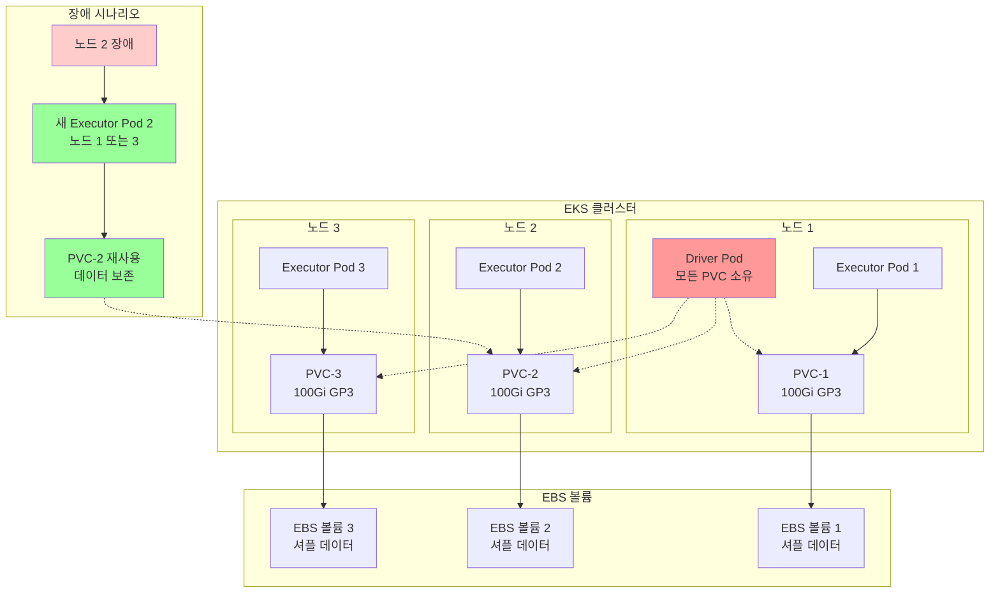
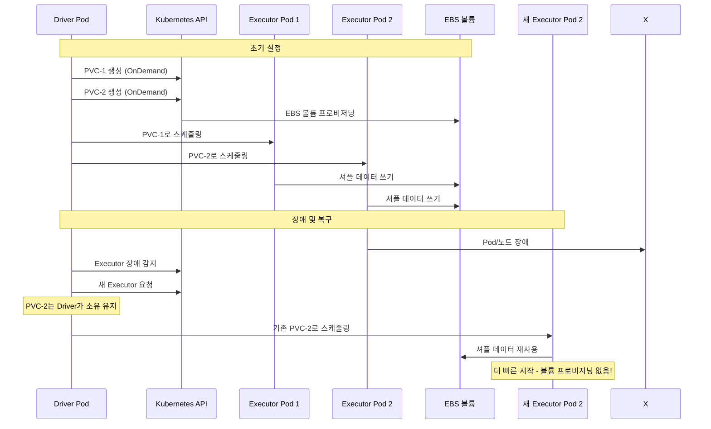

# EBS 동적 PVC 스토리지를 사용한 Spark

자동 프로비저닝 및 데이터 복구 기능이 있는 EBS 동적 PVC를 Spark 셔플 스토리지에 사용하는 방법을 알아봅니다.

## 아키텍처: PVC 재사용 및 장애 허용



**주요 이점:**
- **Driver 소유**: Driver Pod가 중앙 집중식 관리를 위해 모든 PVC 소유
- **PVC 재사용**: 실패한 Executor가 보존된 셔플 데이터가 있는 기존 PVC 재사용
- **더 빠른 복구**: Executor 재시작 시 볼륨 프로비저닝 지연 없음
- **비용 효율적**: 새로 생성하는 대신 EBS 볼륨 재사용

### PVC 재사용 흐름



## 전제 조건

- Spark on EKS 인프라 배포: [인프라 설정](./infra.md)
- 동적 볼륨 생성을 위한 `gp2` 또는 `gp3` 스토리지 클래스가 있는 **EBS CSI 컨트롤러** 실행 중

:::warning EBS CSI 요구 사항
이 예제는 Spark 작업을 위해 동적으로 볼륨을 생성하는 EBS CSI 드라이버가 필요합니다. 클러스터에 적절한 스토리지 클래스가 있는 EBS CSI 컨트롤러가 배포되어 있는지 확인하세요.
:::

## Spark에서 셔플 스토리지란?

**셔플 스토리지**는 `groupBy`, `join`, `reduceByKey`와 같은 Spark 작업 중 중간 데이터를 보관합니다. 데이터가 Executor 간에 재분배될 때 후속 스테이지에서 읽기 전에 임시로 저장됩니다.

## Spark 셔플 스토리지 옵션

| 스토리지 유형 | 성능 | 비용 | 사용 사례 |
|-------------|-------------|------|----------|
| **NVMe SSD 인스턴스** | 매우 높음 | 높음 | 최대 성능 워크로드 |
| **EBS 동적 PVC** | 높음 | 중간 | **추천 - 프로덕션 장애 허용** |
| **EBS 노드 스토리지** | 중간 | 중간 | 노드당 공유 볼륨 |
| **FSx for Lustre** | 중간 | 낮음 | HPC용 병렬 파일 시스템 |
| **S3 Express + Mountpoint** | 중간 | 낮음 | 매우 큰 데이터셋 |
| **원격 셔플 (Celeborn)** | 높음 | 중간 | 리소스 분리 |

### 이점: 성능 및 비용

- **NVMe**: 가장 빠른 로컬 SSD 스토리지, GB당 최고 비용
- **EBS 동적 PVC**: 장애 허용과 함께 성능과 비용의 균형
- **EBS 노드 스토리지**: 비용 효율적인 공유 볼륨
- **FSx/S3 Express**: 대규모 처리를 위한 비용 최적화

## 예제 코드

전체 구성 보기:

import CodeBlock from '@theme/CodeBlock';
import EBSConfig from '!!raw-loader!@site/../data-stacks/spark-on-eks/examples/ebs-storage-dynamic-pvc.yaml';

<details>
<summary><strong>전체 EBS 동적 PVC 구성</strong></summary>

<CodeBlock language="yaml" title="examples/ebs-storage-dynamic-pvc.yaml" showLineNumbers>
{EBSConfig}
</CodeBlock>

</details>

## EBS 동적 PVC 구성

**동적 PVC 프로비저닝을 위한 주요 구성:**

```yaml title="필수 동적 PVC 설정"
sparkConf:
  # 동적 PVC 생성 - Driver
  "spark.kubernetes.driver.volumes.persistentVolumeClaim.spark-local-dir-1.options.claimName": "OnDemand"
  "spark.kubernetes.driver.volumes.persistentVolumeClaim.spark-local-dir-1.options.storageClass": "gp3"
  "spark.kubernetes.driver.volumes.persistentVolumeClaim.spark-local-dir-1.options.sizeLimit": "100Gi"
  "spark.kubernetes.driver.volumes.persistentVolumeClaim.spark-local-dir-1.mount.path": "/data1"

  # 동적 PVC 생성 - Executor
  "spark.kubernetes.executor.volumes.persistentVolumeClaim.spark-local-dir-1.options.claimName": "OnDemand"
  "spark.kubernetes.executor.volumes.persistentVolumeClaim.spark-local-dir-1.options.storageClass": "gp3"
  "spark.kubernetes.executor.volumes.persistentVolumeClaim.spark-local-dir-1.options.sizeLimit": "100Gi"
  "spark.kubernetes.executor.volumes.persistentVolumeClaim.spark-local-dir-1.mount.path": "/data1"

  # 장애 허용을 위한 PVC 소유권 및 재사용
  "spark.kubernetes.driver.ownPersistentVolumeClaim": "true"
  "spark.kubernetes.driver.reusePersistentVolumeClaim": "true"
```

**기능:**
- `OnDemand`: Pod당 PVC 자동 생성
- `gp3`: EBS GP3 스토리지 클래스 (기본, GP2보다 더 나은 가격 대비 성능)
- `100Gi`: 볼륨당 스토리지 크기 (예제 워크로드에 최적화)
- Driver 소유권으로 장애 허용을 위한 PVC 재사용 활성화

## 테스트 데이터 생성 및 예제 실행

셔플 작업을 통해 EBS 동적 PVC를 시연하기 위해 NYC 택시 데이터를 처리합니다.

### 1. 테스트 데이터 준비

```bash
cd data-stacks/spark-on-eks/terraform/_local/

# Terraform 출력에서 S3 버킷 및 리전 내보내기
export S3_BUCKET=$(terraform output -raw s3_bucket_id_spark_history_server)
export REGION=$(terraform output -raw region)

# 스크립트 디렉토리로 이동하고 테스트 데이터 생성
cd ../../scripts/
./taxi-trip-execute.sh $S3_BUCKET $REGION
```

*NYC 택시 데이터(총 1.1GB)를 다운로드하고 S3에 업로드*

### 2. Spark 작업 실행

```bash
# 예제 디렉토리로 이동
cd ../examples/

# EBS 동적 PVC 작업 제출
envsubst < ebs-storage-dynamic-pvc.yaml | kubectl apply -f -

# 작업 진행 상황 모니터링
kubectl get sparkapplications -n spark-team-a --watch
```

**예상 출력:**
```bash
NAME       STATUS    ATTEMPTS   START                  FINISH                 AGE
taxi-trip  COMPLETED 1          2025-09-28T17:03:31Z   2025-09-28T17:08:15Z   4m44s
```

## 데이터 및 Pod 확인

### PVC 생성 모니터링
```bash
# 실시간으로 PVC 생성 확인
kubectl get pvc -n spark-team-a --watch

# 예상 PVC
NAME                                      STATUS   VOLUME                                     CAPACITY   ACCESS MODES   STORAGECLASS   VOLUMEATTRIBUTESCLASS   AGE
taxi-trip-b64d669992344315-driver-pvc-0   Bound    pvc-e891b472-249f-44d9-a9ce-6ab4c3a9a488   100Gi      RWO            gp3            <unset>                 3m34s
taxi-trip-exec-1-pvc-0                    Bound    pvc-ae09b08b-8a5a-4892-a9ab-9d6ff2ceb6df   100Gi      RWO            gp3            <unset>                 114s
taxi-trip-exec-2-pvc-0                    Bound    pvc-7a2b4e76-5ab6-435e-989e-2978618a2877   100Gi      RWO            gp3            <unset>                 114s
```

### Pod 상태 및 스토리지 확인
```bash
# Driver 및 Executor Pod 확인
kubectl get pods -n spark-team-a -l app=taxi-trip

# Pod 내부에서 볼륨 사용량 확인
kubectl exec -n spark-team-a taxi-trip-driver -- df -h /data1

# Spark 애플리케이션 로그 보기
kubectl logs -n spark-team-a -l spark-role=driver --follow
```

### 출력 데이터 확인
```bash
# S3에서 처리된 출력 확인
aws s3 ls s3://$S3_BUCKET/taxi-trip/output/

# 이벤트 로그 확인
aws s3 ls s3://$S3_BUCKET/spark-event-logs/
```

## 정리

```bash
# Spark 애플리케이션 삭제
kubectl delete sparkapplication taxi-trip -n spark-team-a

# PVC가 유지되는지 확인 (재사용을 위해)
kubectl get pvc -n spark-team-a

# 선택 사항: 더 이상 필요하지 않은 경우 PVC 삭제
kubectl delete pvc -n spark-team-a --all
```

## 이점

- **자동 PVC 관리**: 수동 볼륨 생성 불필요
- **장애 허용**: Executor 재시작에도 셔플 데이터 유지
- **비용 최적화**: 동적 크기 조정 및 재사용
- **성능**: PVC 재사용으로 더 빠른 시작

## 스토리지 클래스 옵션

```yaml
# GP3 - 더 나은 가격 대비 성능
storageClass: "gp3"

# IO1 - 높은 IOPS 워크로드
storageClass: "io1"
```

## 다음 단계

- [NVMe 인스턴스 스토리지](./nvme-storage) - 고성능 로컬 SSD
