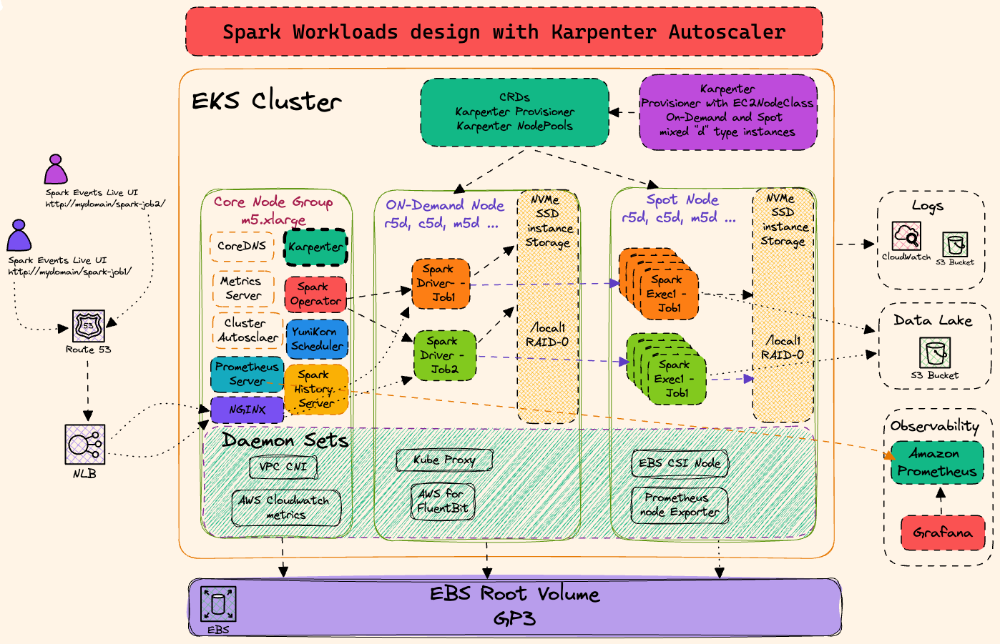

# Spark on EKS 인프라

GitOps, 자동 확장, 관측성이 포함된 프로덕션 준비 Apache Spark 플랫폼을 Amazon EKS에 배포합니다.

## 아키텍처

이 스택은 탄력적 노드 프로비저닝을 위한 Karpenter와 GitOps 기반 애플리케이션 관리를 위한 ArgoCD와 함께 EKS에 Spark Operator를 배포합니다.



## 전제 조건

배포하기 전에 다음 도구가 설치되어 있는지 확인하세요:

- **AWS CLI** - [설치 가이드](https://docs.aws.amazon.com/cli/latest/userguide/getting-started-install.html)
- **Terraform** (>= 1.0) - [설치 가이드](https://developer.hashicorp.com/terraform/install)
- **kubectl** - [설치 가이드](https://kubernetes.io/docs/tasks/tools/)
- **Helm** (>= 3.0) - [설치 가이드](https://helm.sh/docs/intro/install/)
- **AWS 자격 증명 구성** - `aws configure` 실행 또는 IAM 역할 사용

## 단계 1: 저장소 복제 및 이동

```bash
git clone https://github.com/awslabs/data-on-eks.git
cd data-on-eks/data-stacks/spark-on-eks
```

## 단계 2: 스택 커스터마이징

스택 구성 파일을 편집하여 애드온 및 설정을 커스터마이징합니다:

```bash
# 구성 파일 편집
vi terraform/data-stack.tfvars
```

## 배포되는 항목

이 스택은 GitOps(ArgoCD)를 통해 자동으로 **30개 이상의 구성 요소**가 포함된 완전한 데이터 플랫폼을 배포합니다.

### EKS 관리형 애드온

AWS EKS에서 배포 및 관리:

| 구성 요소 | 목적 | 관리자 |
|----------|------|-------|
| `coredns` | DNS 해석 | EKS |
| `kube-proxy` | 네트워크 프록시 | EKS |
| `vpc-cni` | 접두사 위임이 포함된 Pod 네트워킹 | EKS |
| `eks-pod-identity-agent` | 서비스 계정용 IAM 역할 | EKS |
| `aws-ebs-csi-driver` | 영구 블록 스토리지 | EKS |
| `aws-mountpoint-s3-csi-driver` | 볼륨으로서의 S3 | EKS |
| `metrics-server` | 리소스 메트릭 API | EKS |
| `eks-node-monitoring-agent` | 노드 수준 모니터링 | EKS |

### 핵심 플랫폼 애드온

ArgoCD를 통해 배포되는 인프라 구성 요소:

| 구성 요소 | 목적 | 카테고리 |
|----------|------|---------|
| **Karpenter** | 노드 오토스케일링 및 빈 패킹 | 컴퓨팅 |
| **ArgoCD** | GitOps 애플리케이션 배포 | 플랫폼 |
| **cert-manager** | TLS 인증서 자동화 | 보안 |
| **external-secrets** | AWS Secrets Manager 통합 | 보안 |
| **ingress-nginx** | Ingress 컨트롤러 | 네트워킹 |
| **aws-load-balancer-controller** | ALB/NLB 통합 | 네트워킹 |
| **kube-prometheus-stack** | Prometheus + Grafana 모니터링 | 관측성 |
| **aws-for-fluentbit** | CloudWatch로 로그 집계 | 관측성 |

### 데이터 플랫폼 애드온

데이터 처리 및 분석 도구:

| 구성 요소 | 목적 | 사용 사례 |
|----------|------|----------|
| **spark-operator** | Kubernetes의 Apache Spark | 배치 처리 |
| **spark-history-server** | Spark 작업 히스토리 및 메트릭 | 관측성 |
| **yunikorn** | 배치 작업용 Gang 스케줄링 | 스케줄링 |
| **jupyterhub** | 대화형 노트북 (Python/Scala) | 데이터 사이언스 |
| **flink-operator** | 스트림 처리 프레임워크 | 실시간 분석 |
| **strimzi-kafka** | 이벤트 스트리밍 플랫폼 | 이벤트 스트리밍 |
| **trino** | 분산 SQL 쿼리 엔진 | 데이터 레이크하우스 |
| **argo-workflows** | 워크플로 오케스트레이션 (DAG) | 오케스트레이션 |
| **argo-events** | 이벤트 기반 워크플로 트리거 | 이벤트 처리 |
| **keda** | 이벤트 기반 Pod 오토스케일링 | 오토스케일링 |

### 선택적 애드온
`terraform/data-stack.tfvars`에서 구성:

```hcl title="terraform/data-stack.tfvars"
name   = "spark-on-eks"
region = "us-west-2"

# 선택 사항 - 필요하지 않으면 비활성화
enable_ingress_nginx = true      # Ingress 컨트롤러 (기본: true)
enable_jupyterhub    = true      # 노트북 (기본: true)

# 선택 사항 - 특정 사용 사례에 활성화
enable_celeborn      = false     # 원격 셔플 서비스
enable_datahub       = false     # 메타데이터 관리
enable_superset      = false     # 데이터 시각화
enable_raydata       = false     # 분산 ML/AI
enable_amazon_prometheus = false # 관리형 Prometheus
```

:::info 커스터마이징
모든 사용 가능한 옵션을 보려면 [`infra/terraform/variables.tf`](https://github.com/awslabs/data-on-eks/blob/main/infra/terraform/variables.tf) 를 확인하세요
:::

## 단계 3: 인프라 배포

배포 스크립트 실행:

```bash
./deploy.sh
```

:::note

**배포 실패 시:**
- 동일한 명령어 재실행: `./deploy.sh`
- 여전히 실패하면 kubectl 명령어로 디버깅하거나 [이슈 생성](https://github.com/awslabs/data-on-eks/issues)

:::

:::info

**예상 배포 시간:** 15-20분

:::

## 단계 4: 배포 확인

배포 스크립트가 자동으로 kubectl을 구성합니다. 클러스터가 준비되었는지 확인:

```bash
# kubeconfig 설정 (deploy.sh에서 자동으로 수행됨)
export KUBECONFIG=kubeconfig.yaml

# 클러스터 노드 확인
kubectl get nodes

# 모든 네임스페이스 확인
kubectl get namespaces

# ArgoCD 애플리케이션 확인
kubectl get applications -n argocd
```

:::tip 빠른 확인

성공적인 배포를 확인하려면 다음 명령어 실행:

```bash
# 1. 노드가 준비되었는지 확인
kubectl get nodes
# 예상: STATUS=Ready인 4-5개 노드

# 2. Spark Operator가 실행 중인지 확인
kubectl get pods -n spark-operator
# 예상: spark-operator-controller 및 webhook Pod가 Running

# 3. ArgoCD 애플리케이션이 동기화되었는지 확인
kubectl get applications -n argocd
# 예상: 모든 앱이 "Synced" 및 "Healthy" 표시

# 4. Spark CRD가 설치되었는지 확인
kubectl get crds | grep spark
# 예상: sparkapplications.sparkoperator.k8s.io

# 5. Karpenter NodePool이 준비되었는지 확인
kubectl get nodepools
# 예상: READY=True인 5개 풀
```

:::

<details>
<summary><b>예상 출력 예제</b></summary>

**노드:**
```
NAME                                           STATUS   ROLES    AGE     VERSION
ip-100-64-106-144.us-west-2.compute.internal   Ready    <none>   5m44s   v1.33.5-eks-113cf36
ip-100-64-37-76.us-west-2.compute.internal     Ready    <none>   5m43s   v1.33.5-eks-113cf36
...
```

**Spark Operator:**
```
NAME                                         READY   STATUS    RESTARTS   AGE
spark-operator-controller-6bc54d4658-hg2qd   1/1     Running   0          6m20s
spark-operator-webhook-5b5f58597d-hh6b2      1/1     Running   0          6m20s
```

**ArgoCD 애플리케이션:**
```
NAME                           SYNC STATUS   HEALTH STATUS
spark-operator                 Synced        Healthy
spark-history-server           Synced        Healthy
kube-prometheus-stack          Synced        Healthy
karpenter                      Synced        Healthy
cert-manager                   Synced        Healthy
...
```

**Karpenter NodePool:**
```
NAME                         NODECLASS   NODES   READY   AGE
general-purpose              default     0       True    13m
compute-optimized-x86        default     0       True    13m
compute-optimized-graviton   default     0       True    13m
memory-optimized-x86         default     0       True    13m
memory-optimized-graviton    default     0       True    13m
```

</details>

## 단계 5: ArgoCD UI 접근

배포 스크립트 마지막에 ArgoCD 자격 증명이 표시됩니다. UI에 접근:

```bash
# ArgoCD 서버로 포트 포워드
kubectl port-forward svc/argocd-server -n argocd 8080:443
```

브라우저에서 https://localhost:8080 열기:
- **사용자명:** `admin`
- **비밀번호:** `deploy.sh` 출력 끝에 표시됨

:::info
모든 애플리케이션이 **Synced** 및 **Healthy** 상태여야 합니다.
:::


## 단계 6: 테스트 Spark 작업 실행

샘플 PySpark 작업으로 배포 검증:

```bash
# Spark 로그용 S3 버킷 가져오기
cd terraform/_local
export S3_BUCKET=$(terraform output -raw s3_bucket_id_spark_history_server)

# 테스트 작업 제출
cd ../../examples
envsubst < pyspark-pi-job.yaml | kubectl apply -f -

# 작업 상태 확인
kubectl get sparkapplications -n spark-team-a -w
```

**진행 과정:**
1. **Karpenter가 노드 프로비저닝** - 컴퓨팅 최적화 인스턴스 시작에 약 60초 소요
2. **Driver Pod 시작** - Spark 작업 실행 조정
3. **Executor Pod 실행** - 병렬로 Pi 계산 수행
4. **작업 완료** - 결과: `Pi is roughly 3.141640`
5. **S3에 로그 저장** - Spark History Server를 통해 접근 가능

**예상 출력:**
```
NAME                   STATUS      ATTEMPTS   START                  FINISH                 DURATION
pyspark-pi-karpenter   COMPLETED   1          2025-10-21T20:08:52Z   2025-10-21T20:11:49Z   ~3 min
```

:::tip 작업 세부 정보 보기
```bash
# 실시간으로 작업 상태 확인
kubectl get sparkapplications -n spark-team-a -w

# Driver 로그 보기 (Pi 계산 결과 표시)
kubectl logs -n spark-team-a pyspark-pi-karpenter-driver

# 상세 작업 상태 확인
kubectl describe sparkapplication pyspark-pi-karpenter -n spark-team-a
```
:::


## 문제 해결

### 일반적인 문제

**Pod가 Pending에서 멈춤:**
```bash
# 노드 용량 확인
kubectl describe nodes

# Karpenter 로그 확인
kubectl logs -n karpenter -l app.kubernetes.io/name=karpenter
```

**ArgoCD 애플리케이션이 동기화되지 않음:**
```bash
# ArgoCD 애플리케이션 상태 확인
kubectl get applications -n argocd

# 특정 애플리케이션 확인
kubectl describe application spark-operator -n argocd
```

## 다음 단계

인프라가 배포되면 모든 Spark 예제를 실행할 수 있습니다:

- [EBS PVC 스토리지](/data-on-eks/docs/datastacks/processing/spark-on-eks/ebs-pvc-storage)
- [NVMe 스토리지](/data-on-eks/docs/datastacks/processing/spark-on-eks/nvme-storage)
- [Graviton NVMe 스토리지](/data-on-eks/docs/datastacks/processing/spark-on-eks/nvme-storage-graviton)
- [YuniKorn Gang 스케줄링](/data-on-eks/docs/datastacks/processing/spark-on-eks/yunikorn-gang-scheduling)

## 정리

모든 리소스를 제거하려면 전용 정리 스크립트 사용:

```bash
# 스택 디렉토리로 이동
cd data-on-eks/data-stacks/spark-on-eks

# 정리 스크립트 실행
./cleanup.sh
```

:::note

**정리 실패 시:**
- 동일한 명령어 재실행: `./cleanup.sh`
- 모든 리소스가 삭제될 때까지 계속 재실행
- 일부 AWS 리소스는 여러 정리 시도가 필요한 종속성이 있을 수 있음

:::

:::warning

이 명령어는 모든 리소스와 데이터를 삭제합니다. 먼저 중요한 데이터를 백업하세요.

:::
