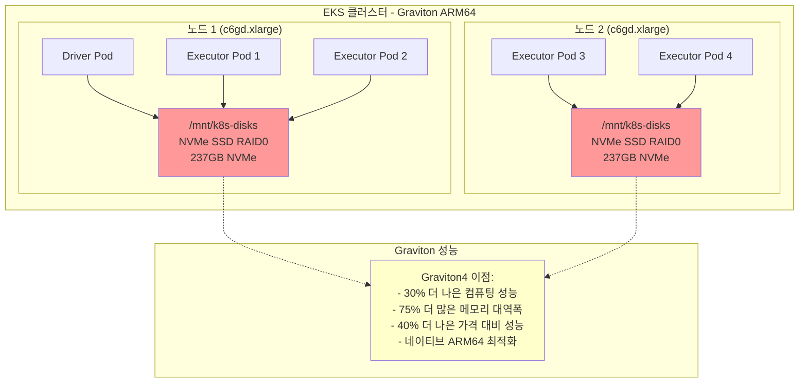

# Graviton NVMe 인스턴스 스토리지를 사용한 Spark

초저지연 셔플 작업을 위해 ARM64 Graviton 프로세서와 직접 NVMe SSD 스토리지를 사용하여 Apache Spark로 최대 성능을 달성합니다.

**권장:** Graviton 인스턴스는 x86 인스턴스 대비 최대 40% 더 나은 비용 효율성으로 우수한 가격 대비 성능을 제공합니다.

## 전제 조건

- Spark on EKS 인프라 배포: [인프라 설정](./infra.md)
- **NVMe 스토리지가 있는 최신 세대 Graviton 인스턴스** (c6gd, c7gd, r6gd, r7gd, m6gd, m7gd, i4g, im4gn 패밀리)
- **Karpenter RAID0 정책**이 사용 가능한 NVMe 스토리지를 자동으로 포맷하고 마운트

:::tip Graviton 성능 이점
AWS Graviton4 프로세서는 이전 세대 대비 최대 30% 더 나은 컴퓨팅 성능과 75% 더 많은 메모리 대역폭을 제공합니다. NVMe 스토리지와 결합하면 Spark 워크로드를 위한 최고 성능 옵션을 제공합니다.
:::

## 아키텍처: Graviton ARM64 + 직접 NVMe SSD 접근



**주요 이점:**
- **최대 성능**: Graviton4 + NVMe SSD 조합
- **최고 가격 대비 성능**: x86 대비 최대 40% 비용 절감
- **제로 네트워크 지연**: 직접 로컬 스토리지 접근
- **지속 가능**: 더 나은 에너지 효율의 ARM64 아키텍처

## Graviton 인스턴스 패밀리 및 NVMe 용량

| 인스턴스 패밀리 | NVMe 스토리지 | 메모리 범위 | vCPU 범위 | 사용 사례 |
|-----------------|-------------|--------------|------------|----------|
| **c6gd** | 118GB - 3.8TB | 8GB - 128GB | 2 - 32 | Graviton3 컴퓨팅 최적화 |
| **c7gd** | 118GB - 7.6TB | 8GB - 192GB | 2 - 48 | **권장 - Graviton3 최신** |
| **r6gd** | 118GB - 3.8TB | 16GB - 512GB | 2 - 32 | Graviton3 메모리 최적화 |
| **r7gd** | 118GB - 7.6TB | 16GB - 768GB | 2 - 48 | **권장 - Graviton3 최신** |
| **m6gd** | 118GB - 3.8TB | 8GB - 256GB | 2 - 32 | Graviton3 범용 |
| **m7gd** | 118GB - 7.6TB | 8GB - 384GB | 2 - 48 | **권장 - Graviton3 최신** |
| **i4g** | 468GB - 30TB | 12GB - 384GB | 2 - 48 | **최대 NVMe 스토리지** |

## 성능 벤치마크

상세한 Graviton 성능 벤치마크 및 비교:
[Graviton Spark 벤치마크](http://localhost:3000/data-on-eks/docs/benchmarks/spark-operator-benchmark/graviton-r-data)

## 예제 코드

전체 구성 보기:

import CodeBlock from '@theme/CodeBlock';
import GravitonNVMeConfig from '!!raw-loader!@site/../data-stacks/spark-on-eks/examples/nvme-storage-graviton.yaml';

<details>
<summary><strong>전체 Graviton NVMe 스토리지 구성</strong></summary>

<CodeBlock language="yaml" title="examples/nvme-storage-graviton.yaml" showLineNumbers>
{GravitonNVMeConfig}
</CodeBlock>

</details>

## Graviton NVMe 스토리지 구성

**직접 NVMe SSD 접근을 위한 ARM64 Graviton 주요 구성:**

```yaml title="필수 Graviton NVMe 설정"
sparkConf:
  # ARM64 NVMe 성능 최적화
  "spark.shuffle.spill.diskWriteBufferSize": "1048576"  # NVMe용 1MB 버퍼
  "spark.shuffle.file.buffer": "1m"  # 로컬 SSD용 더 큰 버퍼
  "spark.io.compression.codec": "lz4"  # ARM64에 최적화된 빠른 압축

  # 직접 NVMe SSD 접근 - Driver
  "spark.kubernetes.driver.volumes.hostPath.spark-local-dir-1.options.path": "/mnt/k8s-disks"
  "spark.kubernetes.driver.volumes.hostPath.spark-local-dir-1.mount.path": "/data1"

  # 직접 NVMe SSD 접근 - Executor
  "spark.kubernetes.executor.volumes.hostPath.spark-local-dir-1.options.path": "/mnt/k8s-disks"
  "spark.kubernetes.executor.volumes.hostPath.spark-local-dir-1.mount.path": "/data1"

# Graviton NVMe 노드 선택 - 특정 NVMe 인스턴스 대상
driver:
  nodeSelector:
    node.kubernetes.io/workload-type: "compute-optimized-graviton"
    karpenter.k8s.aws/instance-family: "c6gd"  # NVMe 인스턴스 보장
  initContainers:
    - name: volume-permissions
      image: busybox:1.36  # ARM64 지원을 위한 멀티 아키텍처 이미지
      command: ['sh', '-c', 'chown -R 185 /data1']

executor:
  nodeSelector:
    node.kubernetes.io/workload-type: "compute-optimized-graviton"
    karpenter.k8s.aws/instance-family: "c6gd"  # NVMe 인스턴스 보장
```

**기능:**
- **ARM64 아키텍처**: 네이티브 Graviton 최적화
- **자동 RAID0**: Karpenter가 여러 NVMe 드라이브에 대해 RAID0 자동 구성
- **최신 세대**: Graviton3 프로세서가 있는 c7gd, r7gd, m7gd 패밀리
- **제로 네트워크 I/O**: 로컬 SSD에 직접 접근

## 배포 및 테스트

### 1. 기존 Graviton NodePool 확인

```bash
# 기존 Graviton NodePool 확인 (이미 NVMe 인스턴스 포함)
kubectl get nodepools -n karpenter compute-optimized-graviton memory-optimized-graviton

# 이러한 NodePool에는 이미 포함되어 있음:
# - compute-optimized-graviton: c6gd, c7gd (컴퓨팅 + NVMe)
# - memory-optimized-graviton: r6gd, r7gd (메모리 + NVMe)
```

### 2. Graviton에서 Spark 작업 실행

```bash
cd data-stacks/spark-on-eks/terraform/_local/

# Terraform 출력에서 S3 버킷 및 리전 내보내기
export S3_BUCKET=$(terraform output -raw s3_bucket_id_spark_history_server)
export REGION=$(terraform output -raw region)

# 예제 디렉토리로 이동
cd ../../examples/

# Graviton NVMe 스토리지 작업 제출
envsubst < nvme-storage-graviton.yaml | kubectl apply -f -

# 노드 프로비저닝 모니터링 (Graviton 인스턴스: NVMe가 있는 c6gd/c7gd 표시)
kubectl get nodes -l node.kubernetes.io/workload-type=compute-optimized-graviton --watch

# 작업 진행 상황 모니터링
kubectl get sparkapplications -n spark-team-a --watch
```

**예상 출력:**
```bash
NAME                STATUS      ATTEMPTS   START                  FINISH                 AGE
taxi-trip-graviton  COMPLETED   1          2025-09-28T17:03:31Z   2025-09-28T17:08:15Z   4m44s
```

## 성능 비교

### 예상 성능 특성

| 메트릭 | Graviton + NVMe | x86 + NVMe | 개선 |
|--------|-----------------|------------|-------------|
| **가격 대비 성능** | **최고** | 좋음 | **40% 더 나음** |
| **컴퓨팅 성능** | **높음** | 높음 | **30% 더 나음** |
| **메모리 대역폭** | **매우 높음** | 높음 | **75% 더 많음** |
| **에너지 효율** | **우수** | 좋음 | **60% 더 나음** |

### Spark에 Graviton을 선택해야 하는 이유

**적합한 경우:**
- 비용에 민감한 프로덕션 워크로드
- 대규모 데이터 처리
- 메모리 집약적 분석
- 지속 가능한 컴퓨팅 이니셔티브

**Graviton 장점:**
- 최대 40% 더 나은 가격 대비 성능
- 인메모리 처리를 위한 더 높은 메모리 대역폭
- 더 나은 에너지 효율
- 네이티브 ARM64 에코시스템 지원

## 정리

```bash
# Spark 애플리케이션 삭제
kubectl delete sparkapplication taxi-trip-graviton -n spark-team-a

# NVMe 스토리지는 노드 종료 시 자동으로 정리됨
# 참고: Graviton NodePool은 공유되며 다른 워크로드를 위해 유지됨
```

## 다음 단계

- [Graviton 성능 벤치마크](http://localhost:3000/data-on-eks/docs/benchmarks/spark-operator-benchmark/graviton-r-data) - 상세 성능 분석
- [NVMe 인스턴스 스토리지 (x86)](./nvme-storage) - x86 NVMe 비교
- [EBS 동적 PVC 스토리지](./ebs-pvc-storage) - 프로덕션 장애 허용
- [인프라 설정](./infra.md) - 기본 인프라 배포
