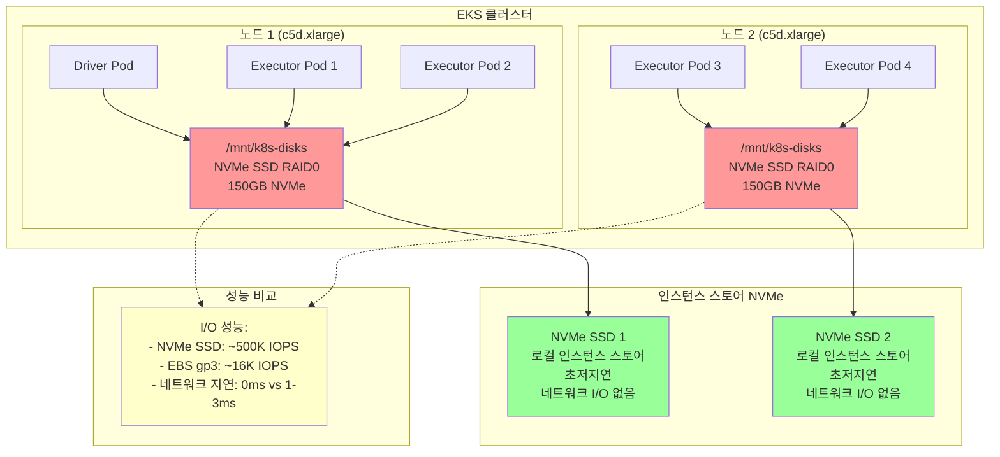

# NVMe 인스턴스 스토리지를 사용한 Spark

초저지연 셔플 작업을 위해 인스턴스에 연결된 직접 NVMe SSD 스토리지를 사용하여 Apache Spark로 최대 성능을 달성합니다.

네트워크 I/O 오버헤드가 없는 최고 성능 옵션인 직접 NVMe SSD 스토리지를 Spark 셔플 스토리지에 사용하는 방법을 알아봅니다.

## 전제 조건

- Spark on EKS 인프라 배포: [인프라 설정](./infra.md)
- **NVMe 스토리지가 있는 최신 세대 인스턴스** (c6id, c7id, r6id, r7id, m6id, m7id, i4i 패밀리)
- **Karpenter RAID0 정책**이 사용 가능한 NVMe 스토리지를 자동으로 포맷하고 마운트

:::tip 최대 성능
NVMe 인스턴스 스토리지는 인스턴스에 연결된 로컬 SSD에 직접 접근하여 Spark 워크로드에 가장 높은 I/O 성능을 제공합니다. 컴퓨팅과 스토리지 간에 네트워크 오버헤드가 없습니다.
:::

## 아키텍처: 직접 NVMe SSD 접근



**주요 이점:**
- **최대 성능**: 500K+ IOPS vs 16K IOPS (EBS gp3)
- **제로 네트워크 지연**: 직접 로컬 스토리지 접근
- **비용 포함**: 인스턴스 가격에 스토리지 비용 포함
- **자동 구성**: Karpenter RAID0 정책이 설정 처리

## Spark에서 셔플 스토리지란?

**셔플 스토리지**는 `groupBy`, `join`, `reduceByKey`와 같은 Spark 작업 중 중간 데이터를 보관합니다. 데이터가 Executor 간에 재분배될 때 후속 스테이지에서 읽기 전에 임시로 저장됩니다.

## Spark 셔플 스토리지 옵션

| 스토리지 유형 | 성능 | 비용 | 사용 사례 |
|-------------|-------------|------|----------|
| **NVMe SSD 인스턴스** | 매우 높음 | 높음 | **추천 - 최대 성능 워크로드** |
| **EBS 동적 PVC** | 높음 | 중간 | 프로덕션 장애 허용 |
| **EBS 노드 스토리지** | 중간 | 중간 | 비용 효율적인 공유 스토리지 |
| **FSx for Lustre** | 중간 | 낮음 | HPC용 병렬 파일 시스템 |
| **S3 Express + Mountpoint** | 중간 | 낮음 | 매우 큰 데이터셋 |
| **원격 셔플 (Celeborn)** | 높음 | 중간 | 리소스 분리 |

### 이점: 성능 및 비용

- **NVMe**: 가장 빠른 로컬 SSD 스토리지, 최고 IOPS, 제로 네트워크 지연
- **직접 접근**: 컴퓨팅과 스토리지 간 네트워크 오버헤드 없음
- **자동 프로비저닝**: Karpenter가 NVMe를 자동으로 감지하고 구성

## 예제 코드

전체 구성 보기:

import CodeBlock from '@theme/CodeBlock';
import NVMeConfig from '!!raw-loader!@site/../data-stacks/spark-on-eks/examples/nvme-storage.yaml';

<details>
<summary><strong>전체 NVMe 스토리지 구성</strong></summary>

<CodeBlock language="yaml" title="examples/nvme-storage.yaml" showLineNumbers>
{NVMeConfig}
</CodeBlock>

</details>

## NVMe 스토리지 구성

**직접 NVMe SSD 접근을 위한 주요 구성:**

```yaml title="필수 NVMe 스토리지 설정"
sparkConf:
  # 직접 NVMe SSD 접근 - Driver
  "spark.kubernetes.driver.volumes.hostPath.spark-local-dir-1.options.path": "/mnt/k8s-disks"
  "spark.kubernetes.driver.volumes.hostPath.spark-local-dir-1.options.type": "Directory"
  "spark.kubernetes.driver.volumes.hostPath.spark-local-dir-1.mount.path": "/data1"
  "spark.kubernetes.driver.volumes.hostPath.spark-local-dir-1.mount.readOnly": "false"

  # 직접 NVMe SSD 접근 - Executor
  "spark.kubernetes.executor.volumes.hostPath.spark-local-dir-1.options.path": "/mnt/k8s-disks"
  "spark.kubernetes.executor.volumes.hostPath.spark-local-dir-1.options.type": "Directory"
  "spark.kubernetes.executor.volumes.hostPath.spark-local-dir-1.mount.path": "/data1"
  "spark.kubernetes.executor.volumes.hostPath.spark-local-dir-1.mount.readOnly": "false"

# 노드 선택 - 기존 NodePool 사용
nodeSelector:
  node.kubernetes.io/workload-type: "compute-optimized-x86"  # c6id, c7id 인스턴스용
  # 대안: "memory-optimized-x86" - r6id, r7id 인스턴스용
```

**기능:**
- `hostPath`: Karpenter가 마운트한 `/mnt/k8s-disks`의 NVMe 스토리지 사용
- **자동 RAID0**: Karpenter가 여러 NVMe 드라이브에 대해 RAID0 자동 구성
- **최신 세대**: 고성능 NVMe가 있는 c6id, c7id, r6id, r7id, m6id, m7id, i4i 패밀리
- **제로 네트워크 I/O**: 로컬 SSD에 직접 접근

## 테스트 데이터 생성 및 예제 실행

직접 SSD 접근으로 NVMe 스토리지 성능을 시연하기 위해 NYC 택시 데이터를 처리합니다.

### 1. 기존 x86 NodePool 확인

```bash
# 기존 x86 NodePool 확인 (이미 NVMe 인스턴스 포함)
kubectl get nodepools -n karpenter compute-optimized-x86 memory-optimized-x86

# 이러한 NodePool에는 이미 포함되어 있음:
# - compute-optimized-x86: c6id, c7id (컴퓨팅 + NVMe)
# - memory-optimized-x86: r6id, r7id (메모리 + NVMe)
```

### 2. 테스트 데이터 준비

```bash
cd data-stacks/spark-on-eks/terraform/_local/

# Terraform 출력에서 S3 버킷 및 리전 내보내기
export S3_BUCKET=$(terraform output -raw s3_bucket_id_spark_history_server)
export REGION=$(terraform output -raw region)

# 스크립트 디렉토리로 이동하고 테스트 데이터 생성
cd ../../scripts/
./taxi-trip-execute.sh $S3_BUCKET $REGION
```

*NYC 택시 데이터(총 1.1GB)를 다운로드하고 S3에 업로드*

### 3. Spark 작업 실행

```bash
# 예제 디렉토리로 이동
cd ../examples/

# NVMe 스토리지 작업 제출
envsubst < nvme-storage.yaml | kubectl apply -f -

# 노드 프로비저닝 모니터링 (x86 인스턴스: NVMe가 있는 c6id/c7id 표시)
kubectl get nodes -l node.kubernetes.io/workload-type=compute-optimized-x86 --watch

# 작업 진행 상황 모니터링
kubectl get sparkapplications -n spark-team-a --watch
```

**예상 출력:**
```bash
NAME       STATUS    ATTEMPTS   START                  FINISH                 AGE
taxi-trip  COMPLETED 1          2025-09-28T17:03:31Z   2025-09-28T17:08:15Z   4m44s
```

## NVMe 스토리지 성능 확인

### NVMe 스토리지 사용량 모니터링
```bash
# Spark Pod가 있는 노드 확인
kubectl get pods -n spark-team-a -o wide

# NVMe 스토리지 마운팅 및 성능 확인
kubectl exec -n spark-team-a taxi-trip-exec-1 -- df -h

# 예상 출력 - /data1에 NVMe 마운트됨:
# /dev/md0        150G  1.2G  141G   1% /data1

# NVMe 스토리지 성능 특성 확인
kubectl exec -n spark-team-a taxi-trip-exec-1 -- lsblk

# 예상 출력 - NVMe 장치의 RAID0:
# md0       9:0    0  149G  0 raid0 /data1
# ├─nvme1n1 259:1   0  75G  0 disk
# └─nvme2n1 259:2   0  75G  0 disk
```

### NVMe로 Spark 성능 확인
```bash
# NVMe 스토리지에서 Spark 셔플 데이터 확인
kubectl exec -n spark-team-a taxi-trip-exec-1 -- ls -la /data1/

# 예상 출력 - 고성능 셔플 작업:
# drwxr-xr-x. 22 spark spark 16384 Sep 28 22:09 blockmgr-7c0ac908-26a3-4395-8a8f-2221b4d5d7c3
# drwxr-xr-x. 13 spark spark   116 Sep 28 22:09 blockmgr-9ed9c2fd-53e1-4337-8a8f-2221b4d5d7c3

# I/O 성능 모니터링 (매우 높은 IOPS 표시)
kubectl exec -n spark-team-a taxi-trip-exec-1 -- iostat -x 1 3

# 성능 메트릭을 위한 Spark 애플리케이션 로그 보기
kubectl logs -n spark-team-a -l spark-role=driver --follow
```

### 출력 데이터 확인
```bash
# S3에서 처리된 출력 확인
aws s3 ls s3://$S3_BUCKET/taxi-trip/output/

# 이벤트 로그 확인
aws s3 ls s3://$S3_BUCKET/spark-event-logs/
```

## 성능 비교

### 예상 I/O 성능

| 스토리지 유형 | IOPS | 지연 시간 | 대역폭 |
|-------------|------|---------|-----------|
| **NVMe c5d.xlarge** | 500,000+ | &lt;100us | 4+ GB/s |
| **EBS gp3** | 16,000 | 1-3ms | 1 GB/s |
| **EBS gp2** | 10,000 | 3-5ms | 250 MB/s |

### 최신 세대 인스턴스 패밀리 및 NVMe 용량

| 인스턴스 패밀리 | NVMe 스토리지 | 메모리 범위 | vCPU 범위 | 사용 사례 |
|-----------------|-------------|--------------|------------|----------|
| **c6id** | 118GB - 7.6TB | 8GB - 256GB | 2 - 64 | 최신 컴퓨팅 최적화 |
| **c7id** | 118GB - 14TB | 8GB - 384GB | 2 - 96 | **권장 - 최신 컴퓨팅** |
| **r6id** | 118GB - 7.6TB | 16GB - 1TB | 2 - 64 | 최신 메모리 최적화 |
| **r7id** | 118GB - 14TB | 16GB - 1.5TB | 2 - 96 | **권장 - 최신 메모리** |
| **m6id** | 118GB - 7.6TB | 8GB - 512GB | 2 - 64 | 최신 범용 |
| **m7id** | 118GB - 14TB | 8GB - 768GB | 2 - 96 | **권장 - 최신 범용** |
| **i4i** | 468GB - 30TB | 12GB - 768GB | 2 - 128 | **최대 NVMe 스토리지** |

## NVMe 스토리지 고려 사항

### 장점
- **최대 성능**: 500K+ IOPS vs 16K (EBS gp3)
- **제로 네트워크 지연**: 직접 로컬 스토리지 접근
- **비용 포함**: 인스턴스 가격에 스토리지 비용 포함
- **자동 구성**: Karpenter가 RAID0 설정 처리

### 단점 및 완화
- **임시 스토리지**: 인스턴스 종료 시 데이터 손실
  - *완화*: 영구 데이터에는 S3 사용, 셔플에만 NVMe 사용
- **고정 크기**: 시작 후 스토리지 크기 조정 불가
  - *완화*: 워크로드에 적합한 인스턴스 유형 선택
- **더 높은 인스턴스 비용**: NVMe 인스턴스는 10-20% 더 비쌈
  - *완화*: 성능 향상이 종종 비용 정당화

### NVMe 스토리지 사용 시기
**적합한 경우:**
- 성능이 중요한 Spark 워크로드
- 대규모 셔플 작업
- 실시간 분석
- 머신러닝 학습

**피해야 하는 경우:**
- 메모리에 맞는 작은 데이터셋
- 비용에 민감한 개발 워크로드
- 영구 스토리지가 필요한 작업

## 정리

```bash
# Spark 애플리케이션 삭제
kubectl delete sparkapplication taxi-trip -n spark-team-a

# NVMe 스토리지는 노드 종료 시 자동으로 정리됨
# 참고: x86 NodePool은 공유되며 다른 워크로드를 위해 유지됨
```

## 다음 단계

- [EBS 동적 PVC 스토리지](./ebs-pvc-storage) - 프로덕션 장애 허용
- [EBS 노드 스토리지](./ebs-node-storage) - 비용 효율적인 대안
- [인프라 설정](./infra.md) - 기본 인프라 배포
