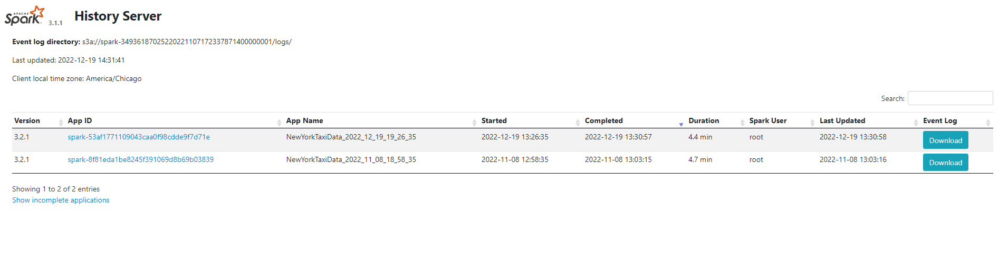

# EKS에서 Spark 관측성

## 개요

이 예제는 네이티브 Spark 메트릭 익스포터, 시계열 데이터 수집을 위한 Prometheus, 시각화를 위한 Grafana, 실행 후 분석을 위한 Spark History Server를 사용하여 Amazon EKS에서 Apache Spark를 위한 프로덕션급 관측성을 시연합니다.

**주요 구성 요소:**
- **Spark UI**: 실시간 애플리케이션 모니터링 (활성 작업만)
- **Spark History Server**: 과거 작업 분석 및 이벤트 로그 재생
- **PrometheusServlet**: Prometheus로 네이티브 Spark 메트릭 익스포터
- **Kube-Prometheus-Stack**: 메트릭 집계, 저장 및 알림
- **Grafana**: 운영 인사이트를 위한 커스터마이징 가능한 대시보드

## 전제 조건

:::info
진행하기 전에 [인프라 설정 가이드](/data-on-eks/docs/datastacks/processing/spark-on-eks/infra)를 따라 Spark on EKS 인프라를 배포했는지 확인하세요.
:::

**필수 구성 요소** (기본적으로 배포됨):
- `enable_spark_history_server = true`가 설정된 Spark on EKS 인프라
- Kube-Prometheus-Stack (Prometheus + Grafana + AlertManager)
- Spark 이벤트 로그용 S3 버킷
- 클러스터 접근을 위해 `kubectl` 구성됨

## Spark 메트릭 아키텍처

### PrometheusServlet 싱크

Apache Spark는 기본적으로 **PrometheusServlet 싱크**를 통해 메트릭 내보내기를 지원합니다. 이것은 Prometheus 형식으로 메트릭을 노출하는 HTTP 엔드포인트입니다. 외부 에이전트나 사이드카가 필요하지 않습니다.

**작동 방식:**
1. Spark가 `/metrics/driver/prometheus/` 및 `/metrics/executors/prometheus/` 엔드포인트 노출
2. Prometheus가 Kubernetes Pod 어노테이션을 통해 이러한 엔드포인트 스크래핑
3. 메트릭이 Prometheus 시계열 데이터베이스에 저장
4. Grafana가 시각화를 위해 Prometheus 쿼리

### 메트릭 구성

메트릭 내보내기를 활성화하려면 SparkApplication YAML에 다음 구성을 추가합니다:

```yaml
sparkConf:
  # Prometheus 메트릭 엔드포인트 활성화
  "spark.ui.prometheus.enabled": "true"
  "spark.executor.processTreeMetrics.enabled": "true"

  # PrometheusServlet 싱크 구성
  "spark.metrics.conf.*.sink.prometheusServlet.class": "org.apache.spark.metrics.sink.PrometheusServlet"
  "spark.metrics.conf.driver.sink.prometheusServlet.path": "/metrics/driver/prometheus/"
  "spark.metrics.conf.executor.sink.prometheusServlet.path": "/metrics/executors/prometheus/"
```

**주요 구성 매개변수:**
- `spark.ui.prometheus.enabled`: Spark UI에서 `/metrics/prometheus` 엔드포인트 활성화
- `spark.executor.processTreeMetrics.enabled`: 프로세스 수준 CPU/메모리 메트릭 수집
- `prometheusServlet.class`: 네이티브 Prometheus 싱크 구성
- `prometheusServlet.path`: 메트릭용 HTTP 엔드포인트 경로 정의

### 이벤트 로그 구성

Spark History Server는 S3에 저장된 이벤트 로그가 필요합니다:

```yaml
sparkConf:
  # History Server용 이벤트 로깅
  "spark.eventLog.enabled": "true"
  "spark.eventLog.dir": "s3a://<S3_BUCKET>/spark-event-logs"
  "spark.eventLog.rolling.enabled": "true"
  "spark.eventLog.rolling.maxFileSize": "64m"

  # Pod Identity를 사용한 S3 접근 (AWS SDK V2)
  "spark.hadoop.fs.s3a.aws.credentials.provider.mapping": "com.amazonaws.auth.WebIdentityTokenCredentialsProvider=software.amazon.awssdk.auth.credentials.ContainerCredentialsProvider"
  "spark.hadoop.fs.s3a.aws.credentials.provider": "software.amazon.awssdk.auth.credentials.ContainerCredentialsProvider"
  "spark.hadoop.fs.s3.impl": "org.apache.hadoop.fs.s3a.S3AFileSystem"
```

**중요:** IRSA/Pod Identity 인증을 위해 더 이상 사용되지 않는 `InstanceProfileCredentialsProvider` 대신 `ContainerCredentialsProvider` (AWS SDK V2)를 사용합니다.

## 실습: Spark 작업 배포 및 모니터링

### 단계 1: 샘플 Spark 작업 제출

관측성이 사전 구성된 참조 PySpark 작업 사용:

```bash
cd data-stacks/spark-on-eks/examples

# <S3_BUCKET>을 Terraform 출력의 버킷으로 교체
export S3_BUCKET=$(kubectl get cm -n spark-team-a spark-s3-config -o jsonpath='{.data.bucket}' 2>/dev/null || echo "your-s3-bucket-name")

# S3 버킷 플레이스홀더 업데이트
sed "s/\$S3_BUCKET/${S3_BUCKET}/g" pyspark-pi-job.yaml | kubectl apply -f -
```

**사용 가능한 예제 작업:**
- `pyspark-pi-job.yaml` - 메트릭이 포함된 간단한 Pi 계산
- `spark-app-graviton.yaml` - ARM 기반 Graviton 워크로드
- `data-stacks/spark-on-eks/examples/`의 추가 예제

### 단계 2: 실시간 Spark Web UI 접근

Spark의 네이티브 Web UI를 통해 활성 작업 모니터링:

```bash
# 실행 중인 Driver Pod 찾기
kubectl get pods -n spark-team-a -l spark-role=driver

# Driver Pod로 포트 포워드
kubectl port-forward -n spark-team-a <driver-pod-name> 4040:4040
```

[http://localhost:4040](http://localhost:4040) 을 열어 확인:
- **Jobs 탭**: DAG 시각화 및 스테이지 실행
- **Stages 탭**: 태스크 수준 메트릭 (셔플, I/O, GC)
- **Storage 탭**: RDD/DataFrame 캐싱 통계
- **Environment 탭**: Spark 구성 및 JVM 속성
- **Executors 탭**: Executor별 리소스 사용률

**제한 사항:** Spark UI는 SparkContext와 함께 종료됩니다. 실행 후 분석에는 Spark History Server를 사용합니다.

## Spark History Server

Spark History Server는 S3의 이벤트 로그를 재생하여 작업 완료 후에도 영구적인 UI 접근을 제공합니다.

### History Server 접근

```bash
# History Server 서비스로 포트 포워드
kubectl port-forward -n spark-history-server svc/spark-history-server 18080:80
```

[http://localhost:18080](http://localhost:18080) 을 열어 확인:
- 모든 완료된 Spark 애플리케이션
- 전체 작업 실행 타임라인 및 DAG
- 라이브 Spark UI와 동일한 UI로 이벤트 로그 재생
- 과거 리소스 사용률 추세



**이벤트 로그 보존:** S3 스토리지 비용을 관리하려면 `spark.history.fs.cleaner.enabled` 및 `spark.history.fs.cleaner.maxAge`를 구성합니다.

## Prometheus 메트릭 수집

### Prometheus 스크래핑 확인

Prometheus가 Spark 메트릭을 성공적으로 스크래핑하는지 확인:

```bash
# Prometheus로 포트 포워드
kubectl port-forward -n prometheus svc/kube-prometheus-stack-prometheus 9090:9090
```

[http://localhost:9090](http://localhost:9090) 으로 이동하여 쿼리:
```promql
# Spark Driver 메트릭 확인
spark_driver_jvm_heap_used{namespace="spark-team-a"}

# Executor 태스크 메트릭
spark_executor_completedTasks_total

# GC 시간 메트릭
rate(spark_driver_jvm_gc_time[5m])
```


### 내보내지는 주요 Spark 메트릭

**Driver 메트릭:**
- `spark_driver_jvm_heap_used` - JVM 힙 사용률
- `spark_driver_DAGScheduler_stage_failedStages` - 실패한 스테이지 수
- `spark_driver_BlockManager_memory_memUsed_MB` - 블록 관리자 메모리

**Executor 메트릭:**
- `spark_executor_completedTasks_total` - Executor당 완료된 태스크
- `spark_executor_runtime_jvm_heap_used` - Executor JVM 힙
- `spark_executor_filesystem_write_bytes` - 셔플/출력 쓰기 볼륨

**애플리케이션 메트릭:**
- `spark_app_stages` - 전체 스테이지
- `spark_app_tasks` - 전체 태스크
- `spark_app_executors` - 활성 Executor 수

## Grafana 대시보드

### Grafana 접근

```bash
# Grafana 관리자 비밀번호 가져오기
kubectl get secret -n grafana grafana -o jsonpath="{.data.admin-password}" | base64 -d && echo

# Grafana로 포트 포워드
kubectl port-forward -n grafana svc/grafana 3000:80
```

로그인: `admin` / `<password-from-secret>`

### Spark 대시보드 가져오기

커뮤니티 대시보드 **ID: 7890** (Spark Application Monitoring) 가져오기:

1. **Dashboards -> Import**로 이동
2. 대시보드 ID 입력: `7890`
3. Prometheus 데이터 소스 선택: `Prometheus`
4. **Import** 클릭


**대시보드 패널:**
- 활성/완료된 작업 타임라인
- Executor 리소스 사용률 (CPU, 메모리, 디스크)
- 셔플 읽기/쓰기 성능
- GC 오버헤드 및 일시 중지 시간
- 태스크 실행 분포

### 커스텀 메트릭 쿼리

PromQL로 커스텀 패널 생성:

```promql
# 스테이지별 평균 태스크 실행 시간
avg(spark_stage_executor_runTime) by (stage_id)

# 디스크로 셔플 스필 (성능 병목 지표)
sum(rate(spark_executor_shuffle_write_diskSpill_bytes[5m])) by (pod)

# Driver OOM 위험 지표
(spark_driver_jvm_heap_used / spark_driver_jvm_heap_max) * 100 > 85
```

## 프로덕션 모범 사례

### 이벤트 로그 최적화

```yaml
# 대용량 파일 방지를 위한 롤링 이벤트 로그
"spark.eventLog.rolling.enabled": "true"
"spark.eventLog.rolling.maxFileSize": "128m"  # 작업 크기에 따라 튜닝

# S3 스토리지 비용 절감을 위한 이벤트 로그 압축
"spark.eventLog.compress": "true"
```

### 메트릭 카디널리티 관리

```yaml
# Prometheus 과부하 방지를 위한 Executor 메트릭 제한
"spark.metrics.executorMetricsSource.enabled": "false"  # 필요하지 않으면 비활성화

# 메트릭 수집 샘플링 (오버헤드 감소)
"spark.metrics.staticSources.enabled": "false"
```

### 알림 규칙

중요 이벤트에 대한 Prometheus AlertManager 구성:

```yaml
# 예제: Spark 작업 실패 알림
- alert: SparkJobFailed
  expr: spark_driver_DAGScheduler_job_allJobs{status="failed"} > 0
  for: 1m
  annotations:
    summary: "Spark job {{ $labels.app_name }} failed"
```

## 문제 해결

### Prometheus에 메트릭이 나타나지 않음

**Pod 어노테이션 확인:**
```bash
kubectl get pods -n spark-team-a <driver-pod> -o yaml | grep -A5 annotations
```

예상 어노테이션:
```yaml
prometheus.io/scrape: "true"
prometheus.io/path: "/metrics/driver/prometheus/"
prometheus.io/port: "4040"
```

**Prometheus 타겟 확인:**
- [http://localhost:9090/targets](http://localhost:9090/targets) 로 이동
- `spark-team-a` 네임스페이스 검색
- 타겟이 `UP` 상태인지 확인

### History Server에 애플리케이션이 표시되지 않음

**이벤트 로그 권한 확인:**
```bash
# IRSA 역할에 S3 읽기 접근 권한이 있는지 확인
kubectl describe sa -n spark-team-a spark-team-a

# S3 이벤트 로그 경로 확인
aws s3 ls s3://<S3_BUCKET>/spark-event-logs/
```

### 높은 메트릭 카디널리티

**Executor 수준 메트릭 줄이기:**
```yaml
# Executor별 상세 메트릭 비활성화
"spark.metrics.conf.executor.sink.prometheusServlet.class": ""
```

## 관련 리소스

- [Spark 구성 참조](https://spark.apache.org/docs/latest/configuration.html)
- [Prometheus 메트릭 모범 사례](https://prometheus.io/docs/practices/naming/)
- [Spark 모니터링 문서](https://spark.apache.org/docs/latest/monitoring.html)
- [인프라 설정 가이드](/data-on-eks/docs/datastacks/processing/spark-on-eks/infra)
