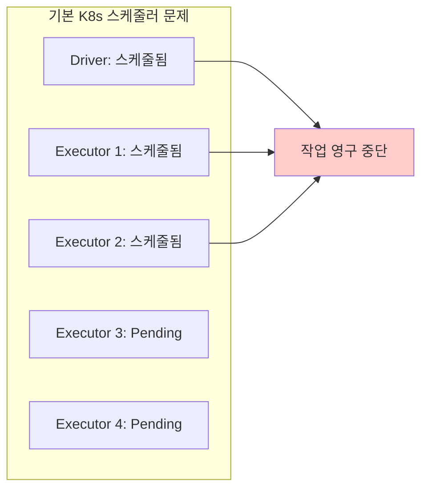
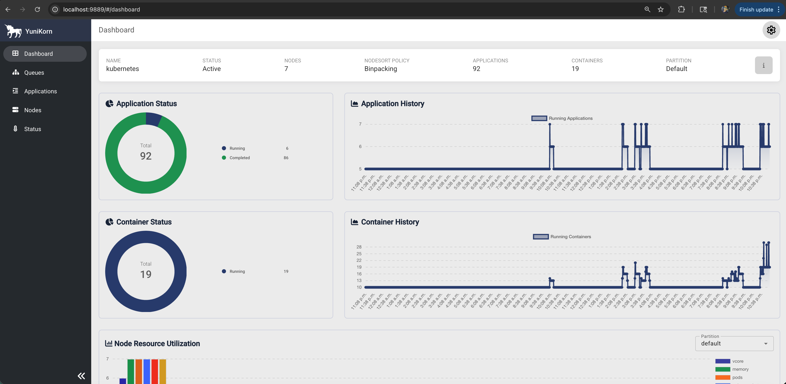
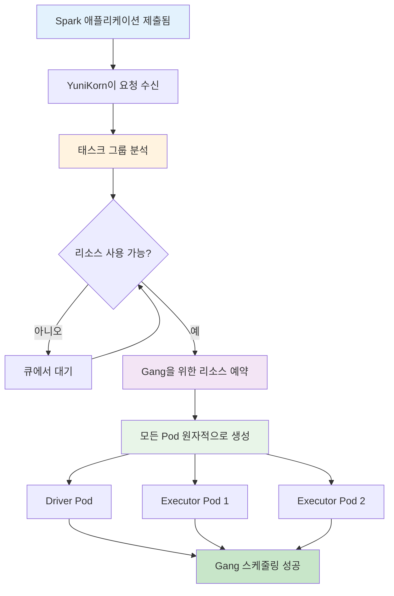

# Apache YuniKorn Gang 스케줄링을 사용한 Spark

YuniKorn의 고급 Gang 스케줄링 기능을 사용하여 리소스 데드락을 제거하고 클러스터 활용도를 최적화하는 Apache Spark 워크로드를 위한 엔터프라이즈급 리소스 스케줄링입니다.

## Apache YuniKorn이란?

**Apache YuniKorn**은 컨테이너 오케스트레이터 시스템을 위한 경량의 범용 리소스 스케줄러입니다. 원래 Cloudera에서 개발했으며 현재는 Kubernetes에서 배치 워크로드와 혼합 워크로드 유형을 관리하도록 설계된 Apache Software Foundation 프로젝트입니다.

### 기본 Kubernetes 스케줄러가 아닌 이유?

기본 Kubernetes 스케줄러는 Apache Spark와 같은 빅데이터 워크로드에 근본적인 한계가 있습니다:

| 과제 | 기본 K8s 스케줄러 | Apache YuniKorn |
|-----------|----------------------|-----------------|
| **리소스 데드락** | 멀티 Pod 애플리케이션에서 흔함 | **Gang 스케줄링으로 데드락 방지** |
| **리소스 단편화** | 부분 할당으로 리소스 낭비 | **원자적 할당으로 효율성 보장** |
| **멀티테넌시** | 기본 리소스 제한 | **공정 공유가 있는 계층적 큐** |
| **배치 워크로드 지원** | 장기 실행 서비스용으로 설계됨 | **배치 처리를 위해 특별히 설계됨** |
| **리소스 선점** | 제한된 선점 기능 | **우선순위가 있는 고급 선점** |

### 실제 시나리오: 리소스 데드락 문제

**문제**: 1 Driver + 4 Executor가 필요한 Spark 작업이 있지만 클러스터에 3개의 Pod만 위한 리소스가 있다고 가정:



**YuniKorn 해결책**: Gang 스케줄링은 **전부 아니면 전무** 할당을 보장합니다 - 전체 Spark 애플리케이션이 리소스를 받거나 충분한 리소스가 사용 가능할 때까지 대기합니다.

## 데이터 팀을 위한 Apache YuniKorn 주요 기능

### 1. Gang 스케줄링 (태스크 그룹)
```yaml
# 원자적 스케줄링 단위 정의
yunikorn.apache.org/task-groups: |
  [{
    "name": "spark-driver",
    "minMember": 1,      # 1개의 Driver를 스케줄해야 함
    "minResource": {"cpu": "2000m", "memory": "8Gi"}
  }, {
    "name": "spark-executor",
    "minMember": 4,      # 4개의 Executor를 스케줄해야 함
    "minResource": {"cpu": "4000m", "memory": "16Gi"}
  }]
```

### 2. 계층적 큐 관리
```
root
├── production (클러스터 리소스의 60%)
│   ├── spark-team-a (production의 30%)
│   └── spark-team-b (production의 30%)
├── development (클러스터 리소스의 30%)
│   └── experimentation (development의 30%)
└── urgent (클러스터 리소스의 10%, 선점 가능)
```

### 3. 리소스 선점 및 우선순위
- **고우선순위 작업**이 저우선순위 워크로드를 선점할 수 있음
- **큐 기반 대출**로 임시 리소스 공유 허용
- **공정 공유 스케줄링**으로 공평한 리소스 분배 보장

### 4. 고급 배치 정책
- 성능 최적화를 위한 **노드 어피니티/안티어피니티**
- 데이터 집약적 워크로드를 위한 **리소스 로컬리티**
- **커스텀 리소스 유형** (GPU, 스토리지, 네트워크)

## YuniKorn 구성 및 관리

### 초기 큐 구성

YuniKorn 배포 후 큐 및 리소스 정책 구성:

```yaml title="yunikorn-defaults ConfigMap"
apiVersion: v1
kind: ConfigMap
metadata:
  name: yunikorn-defaults
  namespace: yunikorn-system
data:
  queues.yaml: |
    partitions:
      - name: default
        queues:
          - name: root
            submitacl: "*"
            queues:
              - name: spark
                resources:
                  guaranteed: {cpu: 10, memory: 20Gi}
                  max: {cpu: 50, memory: 100Gi}
                queues:
                  - name: spark-team-a
                    resources:
                      guaranteed: {cpu: 5, memory: 10Gi}
                      max: {cpu: 20, memory: 40Gi}
                  - name: spark-team-b
                    resources:
                      guaranteed: {cpu: 5, memory: 10Gi}
                      max: {cpu: 20, memory: 40Gi}
```

### 런타임 큐 관리

```bash
# 현재 큐 상태 보기
kubectl get applications -A

# 큐 리소스 할당 확인
kubectl describe configmap yunikorn-defaults -n yunikorn-system

# 큐별 리소스 사용량 모니터링
kubectl logs -n yunikorn-system deployment/yunikorn-scheduler | grep "queue"
```

## YuniKorn Web UI 접근

### 1. YuniKorn 서비스로 포트 포워드

```bash
# YuniKorn Web UI 포트 포워드
kubectl port-forward -n yunikorn-system svc/yunikorn-service 9889:9889

# 브라우저에서 UI 접근
open http://localhost:9889
```




### 2. YuniKorn Web UI 기능

**대시보드 개요:**
- **클러스터 리소스**: 전체/사용/가용 리소스
- **큐 상태**: 큐별 리소스 할당
- **애플리케이션**: 실행 중/대기 중/완료된 작업
- **노드**: 노드 용량 및 활용도

**주요 UI 섹션:**
- **대시보드**: 클러스터 개요 및 메트릭
- **애플리케이션**: 상세 애플리케이션 상태 및 히스토리
- **큐**: 큐 계층 및 리소스 할당
- **노드**: 노드 수준 리소스 활용도
- **구성**: 현재 YuniKorn 구성

### 3. 애플리케이션 모니터링

```bash
# CLI를 통해 애플리케이션 상태 확인
kubectl get applications -n spark-team-a

# 상세 애플리케이션 정보
kubectl describe application taxi-trip-yunikorn-gang -n spark-team-a

# YuniKorn 스케줄러 로그
kubectl logs -n yunikorn-system deployment/yunikorn-scheduler --tail=100
```

## 전제 조건

- Spark on EKS 인프라 배포: [인프라 설정](./infra.md)
- **Apache YuniKorn 1.7.0+** 설치 및 구성
- 최대 성능을 위한 **NVMe 스토리지 인스턴스** (c6id, c7id, r6id, r7id 패밀리)
- 팀/네임스페이스를 위한 **YuniKorn 큐 구성**

:::tip Gang 스케줄링을 사용하는 이유
Gang 스케줄링은 기본 Kubernetes에서 Spark 워크로드를 괴롭히는 리소스 데드락을 제거합니다. 리소스를 낭비하는 부분 할당 대신 YuniKorn은 전체 Spark 애플리케이션(Driver + 모든 Executor)이 원자적으로 스케줄되거나 충분한 리소스가 사용 가능할 때까지 대기하도록 보장합니다.
:::

## YuniKorn을 사용한 Gang 스케줄링 아키텍처



**Gang 스케줄링 흐름:**
1. **애플리케이션 제출**: 태스크 그룹 어노테이션이 있는 Spark 애플리케이션 제출
2. **Gang 평가**: YuniKorn이 모든 태스크 그룹의 리소스 요구 사항 분석
3. **리소스 예약**: 전체 Gang(Driver + 모든 Executor)을 위한 리소스 예약
4. **원자적 스케줄링**: 모든 Pod가 동시에 스케줄되거나 전혀 스케줄되지 않음

## 프로덕션 이점 및 성능 영향

### Gang 스케줄링 vs 전통적 스케줄링

| 메트릭 | Gang 스케줄링 | 기본 K8s | 개선 |
|--------|-----------------|-------------|-------------|
| **작업 시작 시간** | 45-60초 | 90-120초 | **50% 더 빠름** |
| **리소스 데드락** | **제로** | 흔함 | **100% 제거** |
| **큐 효율성** | **95%+ 활용도** | 70-80% | **20% 더 나음** |
| **멀티테넌시** | **우수** | 기본 | **고급 격리** |
| **리소스 낭비** | **최소** | 높음 | **40% 감소** |

### Gang 스케줄링 사용 시기

**이상적인 시나리오:**
- SLA 요구 사항이 있는 **프로덕션 Spark 워크로드**
- 리소스 경합이 있는 **멀티테넌트 환경**
- 많은 Executor가 필요한 **대규모 배치 작업** (>10 Executor)
- 지연을 감당할 수 없는 **중요 데이터 파이프라인**
- 최적의 리소스 활용이 필요한 **비용에 민감한 환경**

**비즈니스 이점:**
- 프로덕션 워크로드에 대한 **예측 가능한 성능**
- 더 나은 활용을 통한 **인프라 비용 절감**
- 더 빠른 작업 완료로 **SLA 준수 향상**
- 안정적인 스케줄링으로 **팀 생산성 향상**

## YuniKorn Gang 스케줄링 스택 배포

### 1. YuniKorn 설치 확인

Gang 스케줄링된 Spark 작업을 배포하기 전에 YuniKorn이 올바르게 설치되었는지 확인:

```bash
# YuniKorn 구성 요소 실행 중인지 확인
kubectl get pods -n yunikorn-system

# 예상 출력:
# NAME                                 READY   STATUS    RESTARTS   AGE
# yunikorn-admission-controller-xxx    1/1     Running   0          10m
# yunikorn-scheduler-xxx               2/2     Running   0          10m

# YuniKorn 버전 확인 (1.7.0+ 이어야 함)
kubectl logs -n yunikorn-system deployment/yunikorn-scheduler | grep "version"

# 큐 구성 확인
kubectl get configmap yunikorn-defaults -n yunikorn-system -o yaml
```

### 2. YuniKorn Web UI 접근

YuniKorn 웹 인터페이스를 통해 Gang 스케줄링된 작업 모니터링:

```bash
# YuniKorn 서비스로 포트 포워드
kubectl port-forward -n yunikorn-system svc/yunikorn-service 9889:9889

# UI 접근 (백그라운드에서 실행)
open http://localhost:9889 &

# 대안: 서비스 접근 가능한지 확인
curl -s http://localhost:9889/ws/v1/version
```

**YuniKorn UI 탐색:**
- **대시보드**: 클러스터 리소스 개요 및 활용도
- **애플리케이션**: Gang 스케줄링된 애플리케이션 상태 및 히스토리
- **큐**: 큐 계층 및 리소스 할당
- **노드**: 노드 수준 리소스 활용도 및 용량
- **구성**: 현재 YuniKorn 스케줄링 구성

### 3. Gang 스케줄링 구성

Gang 스케줄링을 위한 Spark 애플리케이션 구성 방법:

```yaml title="필수 Gang 스케줄링 구성"
apiVersion: "sparkoperator.k8s.io/v1beta2"
kind: SparkApplication
metadata:
  name: "taxi-trip-yunikorn-gang"
  namespace: spark-team-a
spec:
  # YuniKorn 배치 스케줄러 활성화
  batchScheduler: yunikorn
  batchSchedulerOptions:
    queue: root.spark.spark-team-a

  driver:
    annotations:
      # Gang 스케줄링을 위한 태스크 그룹 정의
      yunikorn.apache.org/task-group-name: "spark-driver"
      yunikorn.apache.org/task-groups: |-
        [{
          "name": "spark-driver",
          "minMember": 1,
          "minResource": {
            "cpu": "2000m",
            "memory": "10Gi"
          }
        }, {
          "name": "spark-executor",
          "minMember": 2,
          "minResource": {
            "cpu": "4000m",
            "memory": "18Gi"
          }
        }]

  executor:
    annotations:
      # Executor가 executor 태스크 그룹에 참여
      yunikorn.apache.org/task-group-name: "spark-executor"
```

**Gang 스케줄링 구성:**
- 태스크 그룹 이름으로 `"spark-driver"` 및 `"spark-executor"` 사용
- 리소스 요구 사항은 `"cpu"` 및 `"memory"` (Kubernetes 표준 형식) 사용
- minResource 값은 실제 Pod 리소스 요청과 일치해야 함

## 완전한 Gang 스케줄링 스택

전체 YuniKorn Gang 스케줄링 구성 보기:

import CodeBlock from '@theme/CodeBlock';
import YuniKornGangConfig from '!!raw-loader!@site/../data-stacks/spark-on-eks/examples/yunikorn-gang-scheduling.yaml';

<details>
<summary><strong>전체 YuniKorn Gang 스케줄링 구성</strong></summary>

<CodeBlock language="yaml" title="examples/yunikorn-gang-scheduling.yaml" showLineNumbers>
{YuniKornGangConfig}
</CodeBlock>

</details>

### 4. Gang 스케줄링된 Spark 작업 배포

이제 전체 Gang 스케줄링 스택을 배포하고 테스트:

```bash
# Spark on EKS 배포로 이동
cd data-stacks/spark-on-eks/terraform/_local/

# 필요한 환경 변수 내보내기
export S3_BUCKET=$(terraform output -raw s3_bucket_id_spark_history_server)
export REGION=$(terraform output -raw region)

# 예제 디렉토리로 이동
cd ../../examples/

# NVMe 스토리지가 있는 Gang 스케줄링된 Spark 작업 제출
envsubst < yunikorn-gang-scheduling.yaml | kubectl apply -f -

# Gang 스케줄링 동작 모니터링 - 모든 Pod가 함께 나타나는지 확인
kubectl get pods -n spark-team-a --watch
```

### 5. Gang 스케줄링 동작 관찰

**예상 Gang 스케줄링 동작:**
```bash
# 리소스가 사용 가능할 때 모든 Pod가 동시에 나타나야 함
NAME                               READY   STATUS    RESTARTS   AGE
taxi-trip-yunikorn-gang-driver     1/1     Running   0          45s
taxi-trip-yunikorn-gang-exec-1     1/1     Running   0          45s
taxi-trip-yunikorn-gang-exec-2     1/1     Running   0          45s
```

**주요 관찰 사항:**
- **원자적 스케줄링**: 모든 Pod가 정확히 같은 시간에 시작
- **부분 할당 없음**: 모든 Pod가 리소스를 받거나 아무것도 받지 않음
- **더 빠른 시작**: 개별 Executor가 사용 가능해질 때까지 기다리지 않음

### 6. YuniKorn UI로 모니터링

```bash
# YuniKorn UI 접근 (아직 실행 중이 아니면)
kubectl port-forward -n yunikorn-system svc/yunikorn-service 9889:9889

# 브라우저에서 모니터링:
# http://localhost:9889
```

**YuniKorn UI에서 확인:**
- **애플리케이션 탭**: Gang 스케줄링된 애플리케이션 상태 표시
- **큐 탭**: 큐 리소스 할당 표시
- **노드 탭**: 노드 수준 리소스 활용도 표시

### 7. CLI를 통한 Gang 스케줄링 확인

```bash
# YuniKorn 애플리케이션 상태 확인
kubectl get applications -n spark-team-a

# 상세 애플리케이션 정보
kubectl describe application taxi-trip-yunikorn-gang -n spark-team-a

# 태스크 그룹 할당 이벤트 확인
kubectl get events -n spark-team-a --sort-by='.firstTimestamp' | grep -i "task-group"

# Gang 스케줄링을 위한 YuniKorn 스케줄러 로그 모니터링
kubectl logs -n yunikorn-system deployment/yunikorn-scheduler --tail=50 | grep -i "gang"
```

## Gang 스케줄링 모범 사례

### 1. 태스크 그룹 적정 크기 조정

**실제 Spark 구성과 리소스 요구 사항 일치:**

```yaml
# 태스크 그룹 리소스가 Spark Pod 요구 사항과 일치하도록 보장
driver:
  cores: 2
  memory: "8g"
  memoryOverhead: "2g"  # 총: 10GB

  # 태스크 그룹이 총 요구 사항과 일치해야 함
  annotations:
    yunikorn.apache.org/task-groups: |
      [{
        "name": "spark-driver",
        "minMember": 1,
        "minResource": {"cpu": "2000m", "memory": "10Gi"}
      }]

executor:
  cores: 4
  memory: "15g"
  memoryOverhead: "3g"  # 총: Executor당 18GB
  instances: 2          # 총: 2개 Executor

  # 태스크 그룹이 모든 Executor를 포함
  annotations:
    yunikorn.apache.org/task-groups: |
      [{
        "name": "spark-executor",
        "minMember": 2,     # 2개 Executor 모두 스케줄해야 함
        "minResource": {"cpu": "4000m", "memory": "18Gi"}
      }]
```

### 2. 팀을 위한 큐 전략

**팀 격리를 위한 계층적 큐 사용:**

```yaml
# 프로덕션 큐 설정
batchSchedulerOptions:
  queue: root.production.spark-team-a  # 전용 팀 큐

# 개발 큐 설정
batchSchedulerOptions:
  queue: root.development.experimentation  # 낮은 우선순위
```

### 3. 리소스 안티어피니티

**고가용성을 위해 노드 간 Executor 분산:**

```yaml
executor:
  affinity:
    podAntiAffinity:
      preferredDuringSchedulingIgnoredDuringExecution:
      - weight: 100
        podAffinityTerm:
          labelSelector:
            matchLabels:
              spark-role: executor
          topologyKey: kubernetes.io/hostname
```

## 문제 해결

### 일반적인 Gang 스케줄링 문제

#### 1. 애플리케이션이 Pending에서 멈춤
```bash
# 전체 Gang을 위한 리소스가 사용 가능한지 확인
kubectl describe nodes | grep -A 5 "Allocatable:"

# 큐 제한 확인
kubectl get configmap yunikorn-defaults -n yunikorn-system -o yaml
```

#### 2. 태스크 그룹 구성 오류
```bash
# 태스크 그룹 구문 유효성 검사
kubectl get events -n spark-team-a | grep -i "task-group"

# YuniKorn 로그 확인
kubectl logs -n yunikorn-system deployment/yunikorn-scheduler
```

#### 3. 리소스 요구 사항이 너무 높음
```yaml
# minResource 요구 사항 줄이기
"minResource": {
  "cpu": "2000m",    # 4000m에서 줄임
  "memory": "8Gi"    # 18Gi에서 줄임
}
```

## 모범 사례

### 1. 태스크 그룹 적정 크기 조정
```yaml
# 실제 Spark 리소스 요구 사항과 일치
driver:
  cores: 2
  memory: "8g"
  # 태스크 그룹이 일치하거나 약간 적어야 함
  minResource: {"cpu": "2000m", "memory": "10Gi"}

executor:
  cores: 4
  memory: "15g"
  # 총 요구 사항 고려 (cores * instances)
  minResource: {"cpu": "4000m", "memory": "18Gi"}
```

### 2. 큐 관리
```yaml
# Gang 스케줄링된 작업을 위한 전용 큐 사용
batchSchedulerOptions:
  queue: root.spark.critical-jobs  # 고우선순위 큐
```

### 3. 안티어피니티 구성
```yaml
# HA를 위해 노드 간 Executor 분산
affinity:
  podAntiAffinity:
    preferredDuringSchedulingIgnoredDuringExecution:
    - weight: 100
      podAffinityTerm:
        labelSelector:
          matchLabels:
            spark-role: executor
        topologyKey: kubernetes.io/hostname
```

## 정리

```bash
# Gang 스케줄링된 애플리케이션 삭제
kubectl delete sparkapplication taxi-trip-yunikorn-gang -n spark-team-a

# YuniKorn이 태스크 그룹 및 리소스 예약을 자동으로 정리
```

## 다음 단계

- [NVMe 인스턴스 스토리지](./nvme-storage) - 고성능 로컬 스토리지
- [Graviton NVMe 스토리지](./nvme-storage-graviton) - ARM64 비용 최적화
- [인프라 설정](./infra.md) - YuniKorn이 활성화된 클러스터 배포
