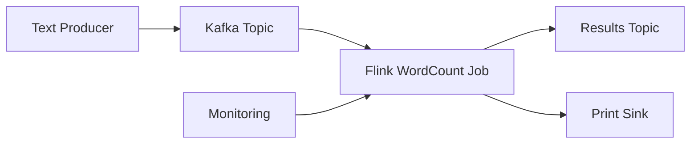

# 실시간 WordCount 스트리밍

Apache Flink를 사용한 Kafka 소스와 실시간 단어 수 집계의 클래식 스트리밍 예제입니다.

## 개요

이 예제는 완전한 실시간 스트리밍 파이프라인을 보여줍니다:
- Kafka 토픽에서 텍스트 데이터 읽기
- 실시간으로 단어 처리 및 계산
- 출력 싱크에 결과 쓰기
- 스트리밍 메트릭 및 성능 모니터링

## 사전 요구 사항

- Flink on EKS 인프라 배포됨
- Kafka 클러스터 실행 중
- Flink 스트리밍 개념에 대한 기본 이해

## 아키텍처



## Kafka 설정

### 입력 토픽 생성

```bash
# 입력 텍스트용 토픽 생성
kubectl exec -n kafka my-cluster-kafka-0 -- \
  bin/kafka-topics.sh --bootstrap-server localhost:9092 \
  --create --topic wordcount-input --partitions 4 --replication-factor 3

# 출력 결과용 토픽 생성
kubectl exec -n kafka my-cluster-kafka-0 -- \
  bin/kafka-topics.sh --bootstrap-server localhost:9092 \
  --create --topic wordcount-output --partitions 4 --replication-factor 3
```

### 토픽 확인

```bash
# 모든 토픽 나열
kubectl exec -n kafka my-cluster-kafka-0 -- \
  bin/kafka-topics.sh --bootstrap-server localhost:9092 --list
```

## Flink WordCount 작업

### 작업 구성

```yaml
apiVersion: flink.apache.org/v1beta1
kind: FlinkDeployment
metadata:
  name: wordcount-streaming
  namespace: flink-operator
spec:
  image: flink:1.18-java11
  flinkVersion: v1_18

  flinkConfiguration:
    # 체크포인트 구성
    execution.checkpointing.interval: 30000
    execution.checkpointing.mode: EXACTLY_ONCE
    state.backend: rocksdb
    state.checkpoints.dir: s3://your-bucket/checkpoints/wordcount

    # Kafka 구성
    kafka.bootstrap.servers: my-cluster-kafka-bootstrap.kafka.svc.cluster.local:9092

  serviceAccount: flink-service-account

  jobManager:
    replicas: 1
    resource:
      memory: "2048m"
      cpu: 1

  taskManager:
    replicas: 2
    resource:
      memory: "2048m"
      cpu: 1

  job:
    jarURI: local:///opt/flink/examples/streaming/WordCount.jar
    entryClass: org.apache.flink.streaming.examples.wordcount.WordCount
    args:
      - "--input"
      - "kafka"
      - "--kafka.bootstrap.servers"
      - "my-cluster-kafka-bootstrap.kafka.svc.cluster.local:9092"
      - "--kafka.topic"
      - "wordcount-input"
      - "--output"
      - "kafka"
      - "--kafka.output.topic"
      - "wordcount-output"
```

### 커스텀 WordCount 애플리케이션

```java
// WordCountStreaming.java
public class WordCountStreaming {

    public static void main(String[] args) throws Exception {

        StreamExecutionEnvironment env = StreamExecutionEnvironment.getExecutionEnvironment();

        // 체크포인트 구성
        env.enableCheckpointing(30000);
        env.getCheckpointConfig().setCheckpointingMode(CheckpointingMode.EXACTLY_ONCE);

        // Kafka 소스 구성
        KafkaSource<String> source = KafkaSource.<String>builder()
            .setBootstrapServers("my-cluster-kafka-bootstrap.kafka.svc.cluster.local:9092")
            .setTopics("wordcount-input")
            .setGroupId("wordcount-group")
            .setStartingOffsets(OffsetsInitializer.earliest())
            .setValueOnlyDeserializer(new SimpleStringSchema())
            .build();

        // Kafka 싱크 구성
        KafkaSink<String> sink = KafkaSink.<String>builder()
            .setBootstrapServers("my-cluster-kafka-bootstrap.kafka.svc.cluster.local:9092")
            .setRecordSerializer(KafkaRecordSerializationSchema.builder()
                .setTopic("wordcount-output")
                .setValueSerializationSchema(new SimpleStringSchema())
                .build())
            .build();

        // 처리 파이프라인
        env.fromSource(source, WatermarkStrategy.noWatermarks(), "Kafka Source")
            .flatMap(new LineSplitter())
            .keyBy(value -> value.f0)
            .window(TumblingProcessingTimeWindows.of(Time.seconds(10)))
            .sum(1)
            .map(tuple -> tuple.f0 + "," + tuple.f1)
            .sinkTo(sink);

        env.execute("WordCount Streaming");
    }

    public static final class LineSplitter implements FlatMapFunction<String, Tuple2<String, Integer>> {
        @Override
        public void flatMap(String line, Collector<Tuple2<String, Integer>> out) {
            for (String word : line.toLowerCase().split("\\W+")) {
                if (word.length() > 0) {
                    out.collect(new Tuple2<>(word, 1));
                }
            }
        }
    }
}
```

## 예제 실행

### 1. Flink 작업 배포

```bash
# Flink 작업 구성 적용
kubectl apply -f wordcount-streaming-job.yaml

# 작업 배포 모니터링
kubectl get flinkdeployment -n flink-operator -w
```

### 2. 데이터 프로듀서 시작

```bash
# 간단한 텍스트 프로듀서 생성
kubectl run kafka-producer --image=confluentinc/cp-kafka:latest --rm -it --restart=Never \
  -- bash -c "
echo 'hello world flink streaming example
apache flink is great for streaming
real time processing with flink
kafka and flink integration' | \
kafka-console-producer --bootstrap-server my-cluster-kafka-bootstrap.kafka.svc.cluster.local:9092 \
--topic wordcount-input"
```

### 3. 결과 모니터링

```bash
# 출력 토픽 확인
kubectl run kafka-consumer --image=confluentinc/cp-kafka:latest --rm -it --restart=Never \
  -- kafka-console-consumer --bootstrap-server my-cluster-kafka-bootstrap.kafka.svc.cluster.local:9092 \
  --topic wordcount-output --from-beginning

# 예상 출력:
# hello,1
# world,1
# flink,3
# streaming,2
# apache,1
# is,1
# great,1
# for,1
# real,1
# time,1
# processing,1
# with,1
# kafka,1
# and,1
# integration,1
```

### 4. Flink UI 액세스

```bash
# Flink JobManager UI로 포트 포워딩
kubectl port-forward -n flink-operator svc/wordcount-streaming-rest 8081:8081

# 브라우저에서 http://localhost:8081 열기
```

## 모니터링 및 메트릭

### Flink 작업 메트릭

```bash
# 작업 상태 확인
kubectl get flinkdeployment wordcount-streaming -n flink-operator -o yaml

# 작업 로그 보기
kubectl logs -n flink-operator deployment/wordcount-streaming-jobmanager

# TaskManager 로그 확인
kubectl logs -n flink-operator deployment/wordcount-streaming-taskmanager
```

### Kafka 메트릭

```bash
# 컨슈머 그룹 지연 확인
kubectl exec -n kafka my-cluster-kafka-0 -- \
  bin/kafka-consumer-groups.sh --bootstrap-server localhost:9092 \
  --describe --group wordcount-group
```

### Prometheus 메트릭

```bash
# Grafana 대시보드 액세스
kubectl port-forward -n kube-prometheus-stack svc/kube-prometheus-stack-grafana 3000:80

# Flink 대시보드로 이동:
# - Flink Job Overview
# - Flink TaskManager Metrics
# - Kafka Consumer Metrics
```

## 성능 튜닝

### 병렬성 구성

```yaml
# 처리량에 따라 병렬성 조정
flinkConfiguration:
  parallelism.default: 4
  taskmanager.numberOfTaskSlots: 2
```

### 메모리 튜닝

```yaml
# TaskManager 메모리 구성
taskManager:
  resource:
    memory: "4096m"
    cpu: 2
flinkConfiguration:
  taskmanager.memory.process.size: "4096m"
  taskmanager.memory.flink.size: "3200m"
```

### 체크포인트 최적화

```yaml
# 체크포인트 튜닝
flinkConfiguration:
  execution.checkpointing.interval: 60000
  execution.checkpointing.timeout: 300000
  state.checkpoints.num-retained: 3
```

## 문제 해결

### 작업이 시작되지 않음

```bash
# 작업 로그 확인
kubectl logs -n flink-operator deployment/wordcount-streaming-jobmanager

# 일반적인 문제:
# - Kafka 연결
# - 체크포인트용 S3 권한
# - 리소스 제약
```

### 높은 지연 시간

```bash
# 백프레셔 확인
# Flink UI에서: Job -> BackPressure 탭

# Kafka 컨슈머 지연 모니터링
kubectl exec -n kafka my-cluster-kafka-0 -- \
  bin/kafka-consumer-groups.sh --bootstrap-server localhost:9092 \
  --describe --group wordcount-group
```

### 체크포인트 실패

```bash
# S3 버킷 권한 확인
aws s3 ls s3://your-bucket/checkpoints/wordcount/

# 서비스 계정이 S3 액세스 권한을 가지고 있는지 확인
kubectl describe serviceaccount flink-service-account -n flink-operator
```

## 확장

### 수평 확장

```bash
# TaskManager 확장
kubectl patch flinkdeployment wordcount-streaming -n flink-operator --type='merge' \
  -p='{"spec":{"taskManager":{"replicas":4}}}'
```

### Karpenter를 사용한 자동 확장

```yaml
# Flink 워크로드용 Karpenter NodePool
apiVersion: karpenter.sh/v1beta1
kind: NodePool
metadata:
  name: flink-streaming
spec:
  template:
    metadata:
      labels:
        workload-type: flink-streaming
    spec:
      requirements:
        - key: node.kubernetes.io/instance-type
          operator: In
          values: ["c5.large", "c5.xlarge", "c5.2xlarge"]
```

## 모범 사례

### 리소스 관리
- 병렬성 요구 사항에 따라 TaskManager 크기 조정
- 메모리 사용량 및 가비지 컬렉션 모니터링
- 적절한 체크포인트 간격 사용
- 적절한 워터마크 전략 구성

### 오류 처리
- 적절한 재시작 전략 구현
- Kafka에서 포이즌 메시지 처리
- 작업 실패에 대한 알림 설정
- 작업 업데이트에 세이브포인트 사용

### 상태 관리
- 상태 크기 증가 모니터링
- 적절한 상태 TTL 사용
- 오래된 체크포인트 정리
- 복구 절차 테스트

## 정리

```bash
# 스트리밍 작업 중지
kubectl delete flinkdeployment wordcount-streaming -n flink-operator

# Kafka 토픽 정리
kubectl exec -n kafka my-cluster-kafka-0 -- \
  bin/kafka-topics.sh --bootstrap-server localhost:9092 \
  --delete --topic wordcount-input

kubectl exec -n kafka my-cluster-kafka-0 -- \
  bin/kafka-topics.sh --bootstrap-server localhost:9092 \
  --delete --topic wordcount-output
```

## 관련 예제

- [인프라 배포](./infra)
- [예제로 돌아가기](/data-on-eks/docs/datastacks/streaming/flink-on-eks/)
