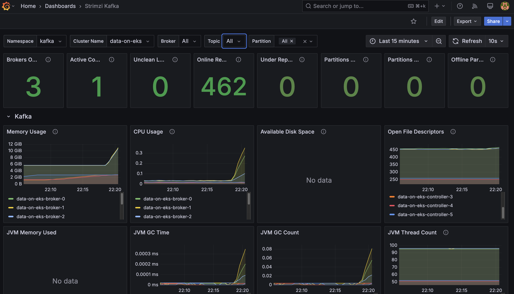

# Kafka on EKS - 인프라 배포

이 가이드는 KRaft 모드(ZooKeeper 없음)에서 Strimzi operator를 사용하여 Amazon EKS에 프로덕션 준비 완료 Apache Kafka 클러스터를 배포하는 과정을 안내합니다.

## 아키텍처 개요

이 배포는 KRaft 모드로 EKS에 프로덕션 준비 완료 Apache Kafka 클러스터를 프로비저닝하여 ZooKeeper 종속성을 제거하면서 고가용성, 자동 확장 및 포괄적인 모니터링을 제공합니다.

### 구성 요소

| 계층 | 구성 요소 | 목적 |
|-------|------------|---------|
| **AWS 인프라** | VPC, EKS v1.31+, EBS gp3 (브로커당 1000Gi), KMS | 네트워크 격리, 관리형 Kubernetes, 영구 스토리지, 암호화 |
| **플랫폼** | Karpenter, ArgoCD, Prometheus Stack, Grafana | 노드 자동 확장, GitOps 배포, 메트릭 수집, 시각화 |
| **Kafka 코어** | 3 브로커, 3 컨트롤러 (KRaft), Strimzi Operator v0.47.0 | 메시지 저장, 메타데이터 관리, Kubernetes 네이티브 오케스트레이션 |
| **Kafka 애드온** | Cruise Control, Entity Operator, Kafka Exporter | 파티션 리밸런싱, 토픽/사용자 관리, 메트릭 내보내기 |

### 주요 구성 요소 설명

<details>
<summary><strong>Kafka 브로커</strong></summary>

**역할**: 메시지 저장, 복제 및 클라이언트 요청을 처리하는 핵심 데이터 계층

- 프로듀서로부터 파티션 간에 메시지 수신 및 저장
- 구성 가능한 일관성으로 컨슈머에 메시지 제공 (내구성을 위해 acks=all)
- 내결함성을 위해 브로커 간 데이터 복제 (복제 팩터: 3)
- 각 브로커는 높은 처리량 워크로드를 위해 1000Gi의 영구 EBS 스토리지 관리

**구성**: 3개 레플리카, 브로커당 58Gi 메모리, 6 vCPU

</details>

<details>
<summary><strong>Kafka 컨트롤러 (KRaft)</strong></summary>

**역할**: ZooKeeper 없이 클러스터 메타데이터 관리

- 클러스터 상태, 파티션 할당 및 토픽 구성 유지
- 브로커 장애 시 파티션 리더 선출 처리
- ZooKeeper 기반 배포에 비해 더 빠른 메타데이터 작업 제공
- 모든 3개 컨트롤러에 걸쳐 복제된 로그에 메타데이터 저장

**이점**: 간소화된 아키텍처, 더 빠른 시작 시간, 대규모 클러스터에 대한 향상된 확장성

</details>

<details>
<summary><strong>Strimzi Operator</strong></summary>

**역할**: Kubernetes 네이티브 Kafka 수명 주기 관리

- Custom Resource Definitions (CRD)를 통해 Kafka 클러스터 생성, 업데이트 및 롤링 재시작 관리
- TLS 암호화를 위한 인증서 관리 자동화
- 노드 장애 또는 업그레이드 중 점진적 파드 교체 처리
- `Kafka`, `KafkaTopic` 및 `KafkaUser` 리소스를 통한 선언적 구성 제공

**배포**: GitOps 기반 운영을 위해 ArgoCD에서 관리

</details>

<details>
<summary><strong>Cruise Control</strong></summary>

**역할**: 자동화된 클러스터 리밸런싱 및 최적화

- 브로커 간 파티션 분포 모니터링
- 브로커 추가 또는 제거 시 자동으로 파티션 리밸런싱
- 디스크 사용량, 네트워크 처리량 및 CPU 사용률 최적화
- 온디맨드 리밸런싱 작업을 위한 REST API 제공

**사용 사례**: 데이터 및 트래픽 증가에 따른 클러스터 균형 유지에 필수적

</details>

<details>
<summary><strong>Entity Operator</strong></summary>

**역할**: Kubernetes 네이티브 토픽 및 사용자 관리

- **Topic Operator**: `KafkaTopic` CRD를 감시하고 Kafka 클러스터와 동기화
- **User Operator**: SASL/SCRAM 인증을 위한 `KafkaUser` CRD 관리
- 토픽/사용자가 버전 제어된 YAML 파일인 GitOps 워크플로우 활성화
- 구성 드리프트 자동 조정

**이점**: 명령형 CLI 명령 대신 선언적 토픽 관리

</details>

<details>
<summary><strong>Kafka Exporter</strong></summary>

**역할**: 모니터링을 위한 메트릭 추출

- 컨슈머 지연, 토픽 및 파티션 메트릭을 Prometheus에 노출
- 브로커 상태, 파티션 리더 상태 및 복제되지 않은 파티션 모니터링
- 컨슈머 그룹 지연 또는 브로커 장애에 대한 알림 데이터 제공
- 실시간 대시보드를 위해 Grafana와 통합

**메트릭 포트**: 9404

</details>

## 사전 요구 사항

- AWS CLI 구성됨
- kubectl 설치됨
- EKS, EC2 및 EBS에 대한 충분한 AWS 할당량

## 배포

### 1. 저장소 복제

```bash
git clone https://github.com/awslabs/data-on-eks.git
cd data-on-eks/data-stacks/kafka-on-eks
```

### 2. 구성 검토

배포는 `terraform/data-stack.tfvars`에서 최소 구성을 사용합니다:

```hcl
name = "kafka-on-eks"
region = "us-west-2"
enable_amazon_prometheus = true
```

**주요 기본값:**
- **클러스터 이름**: `kafka-on-eks`
- **Kafka 버전**: 3.9.0
- **Strimzi 버전**: 0.47.0
- **인스턴스 타입**: r8g.4xlarge (Graviton3 메모리 최적화)
- **스토리지**: 브로커당 1000Gi gp3
- **복제 팩터**: 3

### 3. 스택 배포

```bash
./deploy.sh
```

이 스크립트는 다음을 수행합니다:
1. VPC 및 EKS 클러스터 생성
2. 노드 자동 확장을 위한 Karpenter 배포
3. ArgoCD를 통해 Strimzi operator 설치
4. Amazon Managed Prometheus 워크스페이스 설정
5. 모니터링을 위한 kube-prometheus-stack 구성

**배포 시간**: ~20-25분

### 4. 배포 확인

```bash
# kubeconfig 업데이트
aws eks update-kubeconfig --region us-west-2 --name kafka-on-eks

# ArgoCD 애플리케이션 확인
kubectl get applications -n argocd

# Strimzi operator 확인
kubectl get pods -n strimzi-system

# Kafka 네임스페이스 확인
kubectl get all -n kafka
```

예상 출력 - 모든 파드가 Running 상태여야 합니다:
```
NAME                                           READY   STATUS
data-on-eks-broker-0                           1/1     Running
data-on-eks-broker-1                           1/1     Running
data-on-eks-broker-2                           1/1     Running
data-on-eks-controller-3                       1/1     Running
data-on-eks-controller-4                       1/1     Running
data-on-eks-controller-5                       1/1     Running
data-on-eks-cruise-control-xxx                 1/1     Running
data-on-eks-entity-operator-xxx                2/2     Running
data-on-eks-kafka-exporter-xxx                 1/1     Running
```

### 5. Kafka 클러스터 확인

```bash
# Kafka 클러스터 리소스 확인
kubectl get kafka -n kafka

# Kafka 클러스터 상세 정보
kubectl describe kafka data-on-eks -n kafka

# 노드 풀 확인
kubectl get kafkanodepool -n kafka
```

예상 출력:
```
NAME         CLUSTER       PARTITIONS   REPLICATION FACTOR   READY
data-on-eks  data-on-eks   -            -                    True
```

## 노드 구성

### Karpenter 노드 프로비저닝

Kafka 파드는 **r8g.4xlarge** 인스턴스(메모리 최적화 Graviton3)에서 실행됩니다:

- **vCPU**: 16
- **메모리**: 128 GiB
- **네트워크**: 최대 12.5 Gbps
- **EBS 대역폭**: 최대 10 Gbps

파드는 nodeAffinity를 사용하여 스케줄링됩니다:

```yaml
nodeSelector:
  karpenter.k8s.aws/instance-family: "r8g"
  karpenter.sh/capacity-type: on-demand
```

이를 통해 Kafka가 Trino와 같은 다른 데이터 워크로드와 메모리 최적화 노드풀을 공유할 수 있습니다.

### 노드 배치 확인

```bash
# Kafka 파드와 노드 확인
kubectl get pods -n kafka -o wide

# 인스턴스 타입 확인
kubectl get nodes -l karpenter.k8s.aws/instance-family=r8g -o custom-columns=NAME:.metadata.name,INSTANCE_TYPE:.metadata.labels.node\\.kubernetes\\.io/instance-type
```

## 배포 테스트

### 1. Kafka CLI 파드 생성

```bash
./helper.sh create-kafka-cli-pod
```

테스트를 위한 Kafka CLI 도구가 포함된 파드를 생성합니다.

### 2. 토픽 생성

예제 토픽 적용:

```bash
kubectl apply -f examples/kafka-topics.yaml
```

토픽 확인:

```bash
kubectl get kafkatopic -n kafka
```

예상 출력:
```
NAME                CLUSTER       PARTITIONS   REPLICATION FACTOR   READY
my-topic            data-on-eks   12           3                    True
my-topic-reversed   data-on-eks   12           3                    True
```

### 3. 프로듀서 및 컨슈머 배포

```bash
kubectl apply -f examples/kafka-producers-consumers.yaml
```

배포 내용:
- **프로듀서**: "Hello world" 메시지를 `my-topic`에 전송
- **Kafka Streams**: 텍스트 역순 변환
- **컨슈머**: `my-topic-reversed`에서 역순 메시지 읽기

### 4. 메시지 흐름 확인

```bash
# 프로듀서 로그 확인
kubectl logs -f deployment/java-kafka-producer -n kafka

# 컨슈머 로그 확인
kubectl logs -f deployment/java-kafka-consumer -n kafka
```

확인 가능한 내용:
- 프로듀서 전송: `"Hello world - 1"`
- 컨슈머 수신: `"1 - dlrow olleH"`

### 5. 성능 테스트 실행

성능 테스트 토픽 생성:

```bash
./examples/load-test.sh create-perf-test-topic
```

프로듀서 성능 테스트 실행:

```bash
./examples/load-test.sh run-producer-perf-test
```

예상 결과:
- **처리량**: 300K-400K 레코드/초
- **지연 시간**: ~600-800ms 평균

컨슈머 성능 테스트 실행:

```bash
./examples/load-test.sh run-consumer-perf-test
```

예상 결과:
- **처리량**: 1M+ 메시지/초
- **가져오기 속도**: 140+ MB/초

## 모니터링 설정

### Prometheus 메트릭 활성화

PodMonitor를 적용하여 Prometheus 스크래핑 활성화:

```bash
kubectl apply -f ../../data-stacks/kafka-on-eks/monitoring-manifests/
```

생성 내용:
- **kafka-resources-metrics**: 브로커/컨트롤러 JMX 메트릭 스크래핑
- **entity-operator-metrics**: 토픽/사용자 operator 메트릭 스크래핑
- **cluster-operator-metrics**: Strimzi operator 메트릭 스크래핑

### 메트릭 수집 확인

Prometheus로 포트 포워딩:

```bash
kubectl port-forward -n kube-prometheus-stack prometheus-kube-prometheus-stack-prometheus-0 9090:9090
```

[http://localhost:9090](http://localhost:9090) 을 열고 `kafka_` 메트릭을 검색합니다.

### Grafana 대시보드 액세스

Grafana로 포트 포워딩:

```bash
kubectl port-forward -n kube-prometheus-stack svc/kube-prometheus-stack-grafana 3000:80
```

[http://localhost:3000](http://localhost:3000) 을 열고 다음으로 이동합니다:
- **Strimzi Kafka Dashboard**: 브로커 메트릭, 처리량, 파티션 상태
- **Strimzi Operators Dashboard**: Operator 조정 활동
- **Strimzi Exporter Dashboard**: 컨슈머 지연, 토픽 메트릭




### Amazon Managed Prometheus

메트릭은 장기 저장을 위해 Amazon Managed Prometheus로 자동 전달됩니다. AMP 워크스페이스 확인:

```bash
aws amp list-workspaces --region us-west-2
```

## 헬퍼 명령

`helper.sh` 스크립트는 편리한 단축 명령을 제공합니다:

```bash
# Kafka 리소스
./helper.sh get-kafka-pods              # 모든 Kafka 파드 나열
./helper.sh get-kafka-topics            # 토픽 나열 (CRD)
./helper.sh describe-kafka-cluster      # 클러스터 상세 정보

# 토픽 관리
./helper.sh list-topics-via-cli         # CLI를 통해 토픽 나열
./helper.sh describe-topic my-topic     # 특정 토픽 상세 정보

# 모니터링
./helper.sh verify-kafka-producer       # 프로듀서 로그 확인
./helper.sh verify-kafka-consumer       # 컨슈머 로그 확인
./helper.sh debug-kafka-connectivity    # 연결 문제 디버그

# ArgoCD
./helper.sh get-argocd-apps            # ArgoCD 애플리케이션 나열
```

## 구성 세부 정보

### Kafka 클러스터 구성

`kafka-cluster.yaml`의 주요 설정:

```yaml
spec:
  kafka:
    version: 3.9.0
    replicas: 3
    config:
      offsets.topic.replication.factor: 3
      transaction.state.log.replication.factor: 3
      default.replication.factor: 3
      min.insync.replicas: 2
    resources:
      requests:
        memory: 58Gi
        cpu: "6"
      limits:
        memory: 64Gi
        cpu: "8"
```

### 스토리지 구성

각 브로커는 다음을 갖습니다:
- **볼륨 크기**: 1000Gi
- **스토리지 클래스**: gp3
- **IOPS**: 3000 (기본값)
- **처리량**: 125 MB/s (기본값)

<details>
<summary><h2>Kafka 자체 관리 시 스토리지 고려 사항</h2></summary>

Kafka 클러스터에서 가장 일반적인 리소스 병목 현상은 네트워크 처리량, 스토리지 처리량, 그리고 [Amazon Elastic Block Store (EBS)](https://aws.amazon.com/ebs/)와 같은 네트워크 연결 스토리지를 사용하는 브로커의 경우 브로커와 스토리지 백엔드 간의 네트워크 처리량입니다.

### EBS를 영구 스토리지 백엔드로 사용하는 장점

1. **향상된 유연성과 더 빠른 복구**: 내결함성은 일반적으로 클러스터 내 브로커(서버) 복제 및/또는 교차 AZ 또는 리전 레플리카 유지를 통해 달성됩니다. EBS 볼륨의 수명 주기는 Kafka 브로커와 독립적이므로 브로커가 실패하여 교체해야 하는 경우 실패한 브로커에 연결된 EBS 볼륨을 교체 브로커에 다시 연결할 수 있습니다. 교체 브로커에 대한 대부분의 복제 데이터는 이미 EBS 볼륨에서 사용 가능하며 다른 브로커에서 네트워크를 통해 복사할 필요가 없습니다. 이렇게 하면 교체 브로커를 현재 운영에 맞추는 데 필요한 대부분의 복제 트래픽을 피할 수 있습니다.

2. **적시 확장**: 사용 중에 EBS 볼륨의 특성을 수정할 수 있습니다. 브로커 스토리지는 피크를 위해 스토리지를 프로비저닝하거나 추가 브로커를 추가하는 대신 시간이 지남에 따라 자동으로 확장할 수 있습니다.

3. **자주 액세스하는 처리량 집약적 워크로드에 최적화**: st1과 같은 볼륨 유형은 비교적 저렴한 비용으로 제공되고, 1 MiB I/O 블록 크기를 지원하며, 볼륨당 최대 500 IOPS, TB당 최대 250 MB/s까지 버스트할 수 있고 TB당 40 MB/s의 기본 처리량과 볼륨당 최대 500 MB/s의 처리량을 포함하므로 좋은 선택이 될 수 있습니다.

### AWS에서 Kafka 자체 관리 시 어떤 EBS 볼륨을 사용해야 하나요?

- 균형 잡힌 가격과 성능을 가진 범용 SSD 볼륨 **gp3**가 널리 사용되며, 스토리지(최대 16TiB), IOPS(최대 16,000) 및 처리량(최대 1,000MiB/s)을 **독립적으로** 프로비저닝할 수 있습니다
- **st1**은 최대 500 IOPS 및 500 MiB/s로 자주 액세스하고 처리량 집약적인 워크로드를 위한 저비용 HDD 옵션입니다
- 중요한 애플리케이션의 경우 프로비저닝된 IOPS 볼륨(**io2 Block Express, io2**)이 더 높은 내구성을 제공합니다

### 성능을 위한 NVMe SSD 인스턴스 스토리지는 어떤가요?

EBS가 유연성과 관리 용이성을 제공하지만 일부 고성능 사용 사례에서는 로컬 NVMe SSD 인스턴스 스토리지를 사용하면 도움이 될 수 있습니다. 이 접근 방식은 상당한 성능 향상을 제공할 수 있지만 데이터 지속성과 운영 복잡성 측면에서 트레이드오프가 있습니다.

#### NVMe SSD 인스턴스 스토리지의 고려 사항 및 과제

1. **데이터 지속성**: 로컬 스토리지는 임시적입니다. 인스턴스가 실패하거나 종료되면 해당 스토리지의 데이터가 손실됩니다. 이를 위해서는 복제 전략과 재해 복구 계획을 신중하게 고려해야 하며, 특히 클러스터가 큰 경우(수백 TB의 데이터) 더욱 그렇습니다.

2. **클러스터 업그레이드**: Kafka 또는 EKS 업그레이드가 더 복잡해지며, 로컬 스토리지가 있는 노드를 변경하기 전에 데이터가 적절하게 마이그레이션되거나 복제되었는지 확인해야 합니다.

3. **확장 복잡성**: 클러스터 확장에는 데이터 리밸런싱이 필요할 수 있으며, 이는 네트워크 연결 스토리지를 사용하는 것에 비해 더 많은 시간과 리소스가 필요할 수 있습니다.

4. **인스턴스 타입 종속**: 적절한 로컬 스토리지 옵션이 있는 인스턴스를 선택해야 하므로 인스턴스 타입 선택이 더 제한됩니다.

#### 로컬 스토리지 사용을 고려해야 하는 경우

1. 지연 시간이 밀리초 단위로 중요한 매우 높은 성능 요구 사항의 경우
2. 사용 사례가 개별 노드 장애 시 잠재적인 데이터 손실을 허용할 수 있고 데이터 내구성을 위해 Kafka의 복제에 의존하는 경우

로컬 스토리지는 성능 이점을 제공할 수 있지만, 특히 EKS와 같은 동적 환경에서 운영상의 과제와 신중하게 비교해야 합니다. 대부분의 사용 사례에서 유연성과 쉬운 관리를 위해 EBS 스토리지로 시작하고, 트레이드오프가 정당화되는 특정 고성능 시나리오에서만 로컬 스토리지를 고려하는 것이 좋습니다.

</details>

## 문제 해결

### 파드가 스케줄링되지 않음

Kafka 파드가 Pending 상태인 경우:

```bash
# 파드 이벤트 확인
kubectl describe pod data-on-eks-broker-0 -n kafka

# Karpenter가 노드를 프로비저닝했는지 확인
kubectl get nodes -l karpenter.k8s.aws/instance-family=r8g
```

### 브로커 연결 문제

```bash
# kafka-cli 파드에서 연결 테스트
./helper.sh debug-kafka-connectivity
```

### ArgoCD 애플리케이션 문제

```bash
# 애플리케이션 상태 확인
kubectl get application strimzi-kafka-operator -n argocd

# 애플리케이션 세부 정보 보기
kubectl describe application strimzi-kafka-operator -n argocd
```

## 정리

모든 리소스를 삭제하려면:

```bash
./cleanup.sh
```

수행 내용:
1. Kafka 리소스 삭제
2. EKS 클러스터 제거
3. VPC 및 네트워킹 정리
4. AMP 워크스페이스 삭제

**경고**: 이 작업은 되돌릴 수 없으며 모든 데이터가 삭제됩니다.

## 추가 리소스

- [Strimzi 문서](https://strimzi.io/documentation/)
- [Apache Kafka 문서](https://kafka.apache.org/documentation/)
