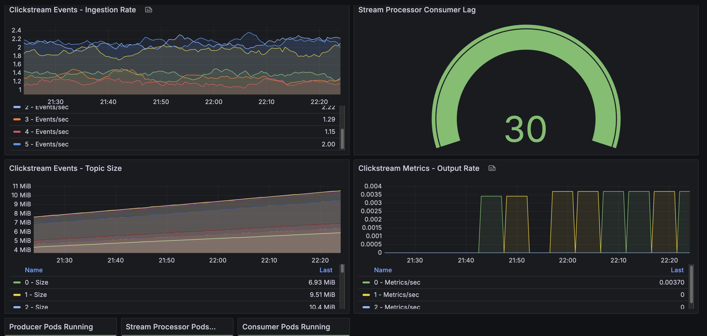

# Kafka와 Python Streams를 활용한 클릭스트림 분석

이 예제는 Amazon EKS에서 Apache Kafka와 Python 스트림 처리(kstreams 라이브러리)를 사용하여 사용자 클릭스트림 데이터를 실시간으로 처리하는 프로덕션 준비 완료 이벤트 스트리밍 파이프라인을 보여줍니다.

## 사용 사례

실시간 클릭스트림 분석은 사용자 행동을 이해하고, 전환 퍼널을 최적화하며, 사용자 경험을 개인화하는 데 필수적입니다. 이 파이프라인은 페이지 뷰, 클릭 및 구매와 같은 이벤트를 처리하여 즉각적인 인사이트를 생성합니다.

**실제 응용 사례**:
- 전자상거래: 쇼핑 행동, 장바구니 이탈, 구매 패턴 추적
- 미디어: 콘텐츠 참여도, 동영상 시청 시간, 스크롤 깊이 측정
- SaaS: 기능 사용, 사용자 플로우, 세션 분석 모니터링
- 마케팅: 캠페인 효과, 어트리뷰션, 리퍼러 성과 분석

## 아키텍처

파이프라인은 실시간 집계를 통한 클래식 이벤트 스트리밍 패턴을 구현합니다:

```
┌──────────┐      ┌───────────────┐      ┌─────────────┐      ┌───────────────┐      ┌──────────┐
│ Producer │ ───> │ Kafka Topic   │ ───> │   Python    │ ───> │ Kafka Topic   │ ───> │ Consumer │
│ (Events) │      │ (Raw Events)  │      │  Streams    │      │ (Metrics)     │      │ (Display)│
└──────────┘      └───────────────┘      │ (kstreams)  │      └───────────────┘      └──────────┘
                   6 파티션               └─────────────┘       3 파티션
                   24시간 보존             5분 윈도우            7일 보존
```

### 구성 요소

| 구성 요소 | 기술 | 목적 | 구성 |
|-----------|-----------|---------|---------------|
| **이벤트 프로듀서** | Python + kafka-python | 현실적인 클릭스트림 이벤트 생성 | 10 이벤트/초, 100명의 시뮬레이션 사용자 |
| **원시 이벤트 토픽** | Kafka | 수신 이벤트 저장 | 6 파티션, 3 레플리카, 24시간 보존 |
| **스트림 프로세서** | Python + kstreams | 실시간 윈도우 집계 | 5분 텀블링 윈도우, 비동기 처리 |
| **메트릭 토픽** | Kafka | 집계된 메트릭 저장 | 3 파티션, 3 레플리카, 7일 보존 |
| **메트릭 컨슈머** | Python + kafka-python | 실시간 대시보드 표시 | 자동 커밋이 있는 컨슈머 그룹 |

## 데이터 흐름

### 1. 이벤트 생성

프로듀서는 현실적인 클릭스트림 이벤트를 생성합니다:

```json
{
  "event_id": "550e8400-e29b-41d4-a716-446655440000",
  "timestamp": "2024-10-26T10:30:45.123Z",
  "user_id": "user_42",
  "session_id": "sess_abc123def456",
  "event_type": "page_view",
  "page_url": "/products/laptop",
  "page_category": "electronics",
  "referrer": "google.com",
  "device_type": "mobile",
  "country": "US",
  "duration_ms": 2500
}
```

**이벤트 유형**: page_view, click, add_to_cart, purchase, search
**파티셔닝**: `user_id`로 사용자별 이벤트 순서 유지
**속도**: 구성 가능 (기본값: 10 이벤트/초)

### 2. 스트림 처리

Python 스트림 프로세서는 **kstreams** 라이브러리를 사용하여 5분 텀블링 윈도우에서 이벤트를 처리하고 다음을 계산합니다:

- **볼륨 메트릭**: 총 이벤트, 고유 사용자, 고유 세션
- **이벤트 분류**: 이벤트 유형별 분포 (뷰, 클릭, 구매)
- **디바이스 분석**: 모바일 vs 데스크톱 vs 태블릿 사용
- **상위 리퍼러**: 트래픽 소스 (Google, X, Reddit, 직접, 이메일)
- **상위 페이지**: 가장 많이 방문한 URL
- **참여도**: 평균 페이지 체류 시간

**kstreams의 주요 기능**:
- 순수 Python 구현 (JVM 불필요)
- asyncio를 사용한 비동기 I/O
- 내결함성 소비를 위한 컨슈머 그룹
- 상태 저장 윈도우 집계
- 이해, 디버그 및 확장이 용이

### 3. 메트릭 출력

5분마다 게시되는 집계된 메트릭:

```json
{
  "window_start": "2024-10-26T10:30:00Z",
  "window_end": "2024-10-26T10:35:00Z",
  "total_events": 3000,
  "unique_users": 100,
  "unique_sessions": 684,
  "event_types": {
    "page_view": 582,
    "click": 659,
    "add_to_cart": 578,
    "search": 568,
    "purchase": 613
  },
  "devices": {
    "mobile": 1013,
    "desktop": 996,
    "tablet": 991
  },
  "top_referrers": {
    "google.com": 642,
    "x.com": 603,
    "email": 599
  },
  "top_pages": {
    "/products/laptop": 251,
    "/blog": 242,
    "/contact": 240
  },
  "avg_duration_ms": 5162
}
```

### 4. 시각화

컨슈머는 실시간 대시보드를 표시합니다:

```
================================================================================
📊 클릭스트림 메트릭
================================================================================
⏰ 윈도우: 2024-10-26T10:30:00Z → 2024-10-26T10:35:00Z

📈 개요:
   총 이벤트:     3,000
   고유 사용자:   100
   고유 세션:     684
   평균 체류시간: 5,162ms

🔹 이벤트 유형:
   click              659 ( 22.0%)
   purchase           613 ( 20.4%)
   page_view          582 ( 19.4%)
   add_to_cart        578 ( 19.3%)
   search             568 ( 18.9%)

📱 디바이스:
   mobile           1,013 ( 33.8%)
   desktop            996 ( 33.2%)
   tablet             991 ( 33.0%)

🔗 상위 리퍼러:
   google.com            642 ( 21.4%)
   x.com                 603 ( 20.1%)
   email                 599 ( 20.0%)

📄 상위 페이지:
   /products/laptop      251 (  8.4%)
   /blog                 242 (  8.1%)
   /contact              240 (  8.0%)
================================================================================
```

## 배포

### 사전 요구 사항

파이프라인 배포 전:

1. **Kafka on EKS 배포됨** - [인프라 배포](./infra.md) 완료
2. **kubectl 구성됨** - EKS 클러스터에 연결됨
3. **Kafka 클러스터 정상** - 모든 브로커 실행 중

```bash
# Kafka 클러스터 확인
kubectl get kafka -n kafka
# 예상: READY=True인 data-on-eks

# Kafka 파드 확인
kubectl get pods -n kafka | grep data-on-eks
# 예상: 모든 브로커와 컨트롤러 Running
```

### 파이프라인 배포

예제 디렉토리로 이동하여 설정 스크립트 실행:

```bash
cd data-stacks/kafka-on-eks/examples/pipeline
./setup.sh
```

스크립트 수행 내용:

1. **Kafka 토픽 생성**:
   - `clickstream-events`: 원시 이벤트 저장 (6 파티션, 24시간 보존)
   - `clickstream-metrics`: 집계된 메트릭 (3 파티션, 7일 보존)

2. **파이프라인 구성 요소 배포**:
   - 프로듀서: 클릭스트림 이벤트 생성
   - 스트림 프로세서: kstreams 라이브러리를 사용하는 Python 애플리케이션
   - 컨슈머: 집계된 메트릭 표시

**배포 시간**: ~2-3분

### 배포 확인

모든 구성 요소가 실행 중인지 확인:

```bash
# 파드 확인
kubectl get pods -n kafka | grep clickstream

# 예상 출력:
# clickstream-producer-xxx             1/1     Running
# clickstream-streams-processor-xxx    1/1     Running
# clickstream-consumer-xxx             1/1     Running
```

## 파이프라인 모니터링

### 실시간 메트릭 보기

집계된 메트릭을 보려면 컨슈머 출력을 확인합니다 (첫 윈도우까지 5-6분 대기):

```bash
kubectl logs -f deployment/clickstream-consumer -n kafka
```

새 윈도우가 완료될 때마다 5분마다 업데이트된 메트릭을 볼 수 있습니다.

### 프로듀서 모니터링

이벤트 생성 확인:

```bash
kubectl logs -f deployment/clickstream-producer -n kafka
```

예상 출력:
```
✓ Connected to Kafka: ['data-on-eks-kafka-bootstrap:9092']
🚀 Generating 10 events/second

📊 Sent 50 events | Rate: 10.2 events/sec | Partition: 3 | Offset: 1234
📊 Sent 100 events | Rate: 10.1 events/sec | Partition: 1 | Offset: 5678
```

### 스트림 처리 모니터링

스트림 프로세서 상태 확인:

```bash
kubectl logs -f deployment/clickstream-streams-processor -n kafka
```

예상 출력:
```
🚀 Starting Clickstream Analytics Processor
📥 Source: clickstream-events
📤 Sink: clickstream-metrics
⏱️  Window Size: 5 minutes

✅ Window completed: 2024-10-26T10:30:00 → 2024-10-26T10:35:00
   Events processed: 3000
   Unique users: 100
```

### Kafka 토픽 메트릭

토픽 활동 검사:

```bash
# kafka-cli 파드가 없으면 생성
kubectl run kafka-cli --image=confluentinc/cp-kafka:7.5.0 \
  --restart=Never -n kafka -- sleep infinity

# 원시 이벤트 보기
kubectl exec -it kafka-cli -n kafka -- kafka-console-consumer.sh \
  --bootstrap-server data-on-eks-kafka-bootstrap:9092 \
  --topic clickstream-events \
  --max-messages 5

# 집계된 메트릭 보기
kubectl exec -it kafka-cli -n kafka -- kafka-console-consumer.sh \
  --bootstrap-server data-on-eks-kafka-bootstrap:9092 \
  --topic clickstream-metrics \
  --from-beginning
```

### Grafana로 모니터링

파이프라인 메트릭을 모니터링하기 위해 Grafana에 액세스합니다 (설정은 [인프라 가이드](./infra.md#access-grafana-dashboards) 참조):

```bash
kubectl port-forward -n kube-prometheus-stack svc/kube-prometheus-stack-grafana 3000:80
```

[http://localhost:3000](http://localhost:3000) 을 열고 `monitoring/grafana-dashboard.json`에서 커스텀 대시보드를 가져옵니다.



**모니터링할 주요 메트릭**:
- **컨슈머 지연** (`clickstream-processor` 그룹): 100 메시지 미만으로 유지되어야 함
  - 스트림 프로세서가 최신 메시지에서 얼마나 뒤처져 있는지 측정
  - **지연 = 0**: 완벽하게 따라잡음, 실시간 처리
  - **지연 > 100**: 스트림 프로세서가 뒤처짐, 성능 조사 필요
- **토픽 처리량**:
  - `clickstream-events`: ~10 메시지/초 수집률
  - `clickstream-metrics`: 5분마다 1개 메시지 (윈도우 출력)
- **파드 상태**: 3개의 파이프라인 파드(프로듀서, 프로세서, 컨슈머) 모두 Running 상태여야 함
- **파티션 균형**: 6개 파티션 전체에 이벤트 분산

## 커스터마이징

### 이벤트 속도 조정

이벤트 생성을 늘리거나 줄이려면 프로듀서 배포를 편집합니다:

```yaml
# deploy/producer-deployment.yaml
producer.run(events_per_second=50)  # 기본값 10에서 변경
```

변경 사항 적용:
```bash
kubectl apply -f deploy/producer-deployment.yaml
kubectl rollout restart deployment/clickstream-producer -n kafka
```

### 윈도우 크기 변경

집계 윈도우를 수정하려면 스트림 프로세서를 편집합니다:

```yaml
# deploy/streams-deployment-python.yaml (ConfigMap에서)
WINDOW_SIZE_MINUTES = 1  # 기본값 5에서 변경
```

적용 및 재시작:
```bash
kubectl apply -f deploy/streams-deployment-python.yaml
kubectl rollout restart deployment/clickstream-streams-processor -n kafka
```

### 스트림 처리 확장

더 높은 처리량을 위해 레플리카 증가:

```bash
# 스트림 프로세서 확장 (최대 = 파티션 수)
kubectl scale deployment clickstream-streams-processor -n kafka --replicas=3
```

**참고**: 최대 레플리카 수는 파티션 수(clickstream-events 토픽의 경우 6)와 같습니다. 각 레플리카는 할당된 파티션의 이벤트를 처리합니다.

## 문제 해결

### 프로듀서가 이벤트를 전송하지 않음

```bash
# 프로듀서 로그에서 오류 확인
kubectl logs deployment/clickstream-producer -n kafka

# 프로듀서 파드에서 Kafka 연결 확인
kubectl exec deployment/clickstream-producer -n kafka -- \
  python -c "from kafka import KafkaProducer; \
  p = KafkaProducer(bootstrap_servers=['data-on-eks-kafka-bootstrap:9092']); \
  print('Connected successfully')"
```

### 스트림 프로세서가 처리하지 않음

```bash
# 프로세서 로그 확인
kubectl logs deployment/clickstream-streams-processor -n kafka

# 이벤트를 소비하는지 확인
kubectl get pods -n kafka | grep clickstream-streams-processor
# Running 상태여야 함 (CrashLoopBackOff이나 Completed 아님)
```

일반적인 문제:
- **파드가 계속 재시작**: Python 오류나 Kafka 연결 문제 로그 확인
- **윈도우 완료 메시지 없음**: 첫 윈도우 완료까지 5-6분 대기
- **연결 오류**: Kafka 부트스트랩 서버 주소 확인

### 컨슈머가 메트릭을 수신하지 않음

```bash
# 메트릭이 작성되고 있는지 확인
kubectl exec kafka-cli -n kafka -- kafka-console-consumer.sh \
  --bootstrap-server data-on-eks-kafka-bootstrap:9092 \
  --topic clickstream-metrics \
  --from-beginning

# 컨슈머 로그 확인
kubectl logs deployment/clickstream-consumer -n kafka
# 표시되어야 함: "🚀 Starting metrics consumer... ⏱️ Waiting for metrics"
```

**중요**: 컨슈머는 `auto_offset_reset='latest'`를 사용하므로 새 윈도우의 메트릭만 표시합니다. 다음 윈도우 완료까지 5분 대기하세요.

### 토픽 문제

```bash
# 토픽 상태 확인
kubectl get kafkatopic -n kafka | grep clickstream

# 토픽 세부 정보 보기
kubectl describe kafkatopic clickstream-events -n kafka
kubectl describe kafkatopic clickstream-metrics -n kafka
```

## 정리

모든 파이프라인 구성 요소를 제거하려면:

```bash
cd data-stacks/kafka-on-eks/examples/pipeline
./cleanup.sh
```

삭제 내용:
- 프로듀서, 스트림 프로세서, 컨슈머 배포
- Kafka 토픽 (`clickstream-events`, `clickstream-metrics`)

## 핵심 개념

### 이 아키텍처를 사용하는 이유?

**Kafka를 이벤트 백본으로**:
- 프로듀서와 컨슈머 분리
- 내구성 있고 복제된 이벤트 저장소 제공
- 동일한 이벤트에 대한 여러 컨슈머 지원
- 재처리를 위한 이벤트 재생 지원

**kstreams를 사용한 Python Streams**:
- 순수 Python 구현 (JVM 복잡성 없음)
- Python asyncio를 사용한 비동기 처리
- 내결함성을 위한 컨슈머 그룹
- 이해, 디버그 및 확장이 용이
- 표준 Python 도구와 함께 작동

**관심사의 분리**:
- 프로듀서는 이벤트 생성에 집중
- 스트림 프로세서는 집계 로직 처리
- 컨슈머는 프레젠테이션/시각화 처리
- 각 구성 요소가 독립적으로 확장

### 윈도우 설명

**텀블링 윈도우** (비중첩, 고정 크기):

```
시간:  10:00  10:05  10:10  10:15
       |---W1---|---W2---|---W3---|

윈도우 1: 10:00:00 - 10:04:59의 이벤트 → 10:05:00에 출력
윈도우 2: 10:05:00 - 10:09:59의 이벤트 → 10:10:00에 출력
윈도우 3: 10:10:00 - 10:14:59의 이벤트 → 10:15:00에 출력
```

- 각 이벤트는 정확히 하나의 윈도우에 속함
- 고정 기간(5분) 후 윈도우 닫힘
- 윈도우 완료 시 메트릭 출력
- 처리 시간 기반 (이벤트 시간 기반 아님)

### 프로덕션 고려 사항

**확장성**:
- **Kafka 파티션**: 더 많은 파티션 = 더 높은 처리량 (예: 6에서 12 파티션으로 증가)
- **스트림 프로세서 레플리카**: 파티션 수에 맞게 확장 (최대 레플리카 = 파티션 수)
- **프로듀서 레플리카**: 여러 프로듀서가 Kafka 브로커 간 부하 분산
- **컨슈머 레플리카**: 파티션 수까지; 동일 컨슈머 그룹이 자동으로 부하 균형

**내결함성**:
- **Kafka 복제**: 복제 팩터 3 (`min.insync.replicas=2`로 최대 2개 브로커 장애 허용)
- **컨슈머 그룹 오프셋**: Kafka에서 자동 추적; 재시작 후 마지막 커밋된 오프셋에서 재개
- **스트림 프로세서 상태**: 현재 구현은 인메모리 상태 사용 (재시작 시 손실)
  - **프로덕션 권장**: 상태 저장 복구를 위한 외부 상태 저장소(Redis, DynamoDB) 구현
- **파드 재시작**: Kubernetes가 실패한 파드 자동 재시작
- **데이터 내구성**: Kafka가 구성 가능한 보존 기간으로 모든 이벤트를 디스크에 저장

**모니터링**:
- **Grafana 대시보드** (Prometheus + Kafka Exporter로 사전 구성):
  - **Strimzi Kafka Dashboard**: 브로커 처리량, 파티션 상태, 리소스 사용량
  - **Strimzi Exporter Dashboard**: 그룹별 컨슈머 지연, 토픽 메트릭, 파티션 세부 정보
  - 액세스: `kubectl port-forward -n kube-prometheus-stack svc/kube-prometheus-stack-grafana 3000:80`
- **주요 Prometheus 메트릭**:
  - 브로커 처리량: `kafka_server_brokertopicmetrics_messagesin_total`
  - 컨슈머 지연: `kafka_consumergroup_lag` (`clickstream-processor` 그룹 모니터링)
  - 복제되지 않은 파티션: `kafka_server_replicamanager_underreplicatedpartitions`
- **스트림 프로세서 메트릭**:
  - 윈도우 완료율 (애플리케이션 로그에서)
  - 윈도우당 처리된 이벤트 (로그 출력: "✅ Window completed...")
  - 파드 상태 및 재시작 (Grafana의 Kubernetes 메트릭)
- **애플리케이션 로그**: `kubectl logs -f` 또는 중앙 집중식 로깅(CloudWatch Logs, ELK 스택) 사용
- **알림**: 컨슈머 지연, 브로커 장애, 파드 크래시에 대한 Prometheus Alertmanager 구성

**처리 보장**:
- **최소 한 번 전달**: 자동 커밋 오프셋을 사용한 현재 구현
- **멱등성**: 중복 방지를 위해 멱등 프로듀서 활성화 (`enable.idempotence=true`)
- **정확히 한 번**: 트랜잭션 프로듀서/컨슈머 필요 (이 예제에서는 구현되지 않음)

**데이터 보존**:
- **원시 이벤트**: 재처리 또는 디버깅을 위한 최근 이벤트 재생을 허용하는 24시간 보존
- **집계된 메트릭**: 트렌드 분석 및 이력 쿼리를 위한 7일 보존
- **장기 아카이브**: 데이터 레이크에 무기한 저장을 위해 Kafka Connect S3 Sink 사용

**보안** (이 예제에서는 구현되지 않음):
- **전송 중 암호화**: Kafka 브로커 연결에 TLS 활성화
- **인증**: 클라이언트 인증을 위한 SASL/SCRAM 또는 mTLS
- **인가**: 토픽 액세스 제한을 위한 Kafka ACL
- **네트워크 정책**: 구성 요소 격리를 위한 Kubernetes NetworkPolicies

**리소스 관리**:
- **CPU 제한**: 노이지 네이버 문제 방지를 위해 적절한 제한 설정
- **메모리 제한**: 윈도우 기간 및 이벤트 볼륨에 따라 크기 조정 (예: 스트림 프로세서에 512Mi-1Gi)
- **디스크 I/O**: Kafka 브로커는 빠른 스토리지 필요 (프로비저닝된 IOPS가 있는 gp3 EBS 볼륨)
- **네트워크 대역폭**: 브로커 간 및 클라이언트-브로커 트래픽 모니터링

## 리소스

- [예제 소스 코드](https://github.com/awslabs/data-on-eks/tree/main/data-stacks/kafka-on-eks/examples/pipeline)
- [Apache Kafka 문서](https://kafka.apache.org/documentation/)
- [kstreams GitHub 저장소](https://github.com/kpn/kstreams)
- [kstreams 문서](https://kpn.github.io/kstreams/)
- [Python asyncio 문서](https://docs.python.org/3/library/asyncio.html)
