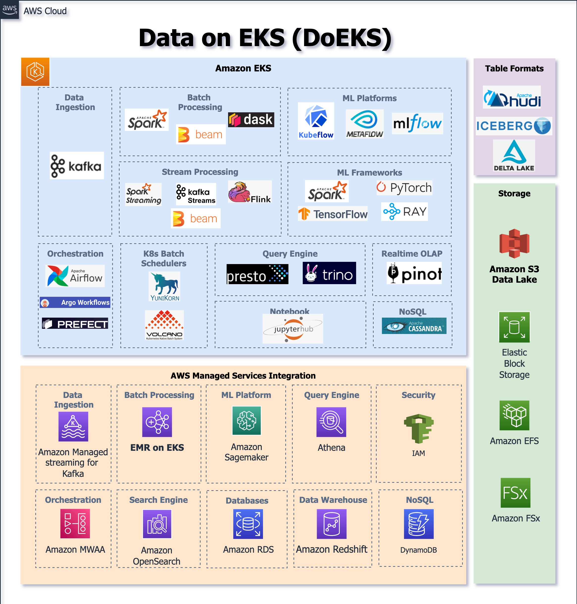

# 소개
Data on Amazon EKS (DoEKS) - [Amazon EKS](https://aws.amazon.com/eks/)에서 [AWS](https://aws.amazon.com/) 관리형 및 자체 관리형 확장 가능한 데이터 플랫폼을 구축하기 위한 도구입니다. DoEKS를 통해 다음에 접근할 수 있습니다:

1. [Terraform](https://www.terraform.io/) 및 [AWS CDK](https://aws.amazon.com/cdk/) 등을 사용한 강력한 배포 Infrastructure as Code (IaC) 템플릿
2. Amazon EKS에 데이터 솔루션 배포를 위한 모범 사례
3. 상세한 성능 벤치마크 리포트
4. [Apache Spark](https://spark.apache.org/)/[ML](https://aws.amazon.com/machine-learning/) 작업 및 다양한 프레임워크의 실습 샘플
5. 최신 정보를 제공하는 심층 참조 아키텍처 및 데이터 블로그

# 아키텍처
다이어그램은 DoEKS에서 다루는 Kubernetes에서 실행되는 오픈 소스 데이터 도구, Kubernetes 연산자 및 프레임워크를 보여줍니다. AWS 데이터 분석 관리형 서비스와 Data on EKS OSS 도구의 통합입니다.

# 주요 기능

🚀 [EMR on EKS](https://docs.aws.amazon.com/emr/latest/EMR-on-EKS-DevelopmentGuide/emr-eks.html)

🚀 [Open Source Spark on EKS](https://spark.apache.org/docs/latest/running-on-kubernetes.html)

🚀 커스텀 Kubernetes 스케줄러 (예: [Apache YuniKorn](https://yunikorn.apache.org/), [Volcano](https://volcano.sh/en/))

🚀 작업 스케줄러 (예: [Apache Airflow](https://airflow.apache.org/), [Argo Workflows](https://argoproj.github.io/argo-workflows/))

🚀 Kubernetes의 AI/ML (예: [KubeFlow](https://www.kubeflow.org/), [MLFlow](https://mlflow.org/), [Tensorflow](https://www.tensorflow.org/), [PyTorch](https://pytorch.org/) 등)

🚀 분산 데이터베이스 (예: [Cassandra](https://cassandra.apache.org/_/blog/Cassandra-on-Kubernetes-A-Beginners-Guide.html), [CockroachDB](https://github.com/cockroachdb/cockroach-operator), [MongoDB](https://github.com/mongodb/mongodb-kubernetes-operator) 등)

🚀 스트리밍 플랫폼 (예: [Apache Kafka](https://github.com/apache/kafka), [Apache Flink](https://github.com/apache/flink), Apache Beam 등)

# 시작하기

인프라 배포 및 샘플 Spark/ML 작업 실행에 대한 각 섹션의 문서를 확인하세요.
