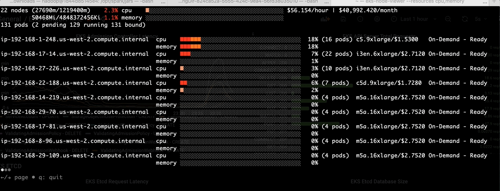
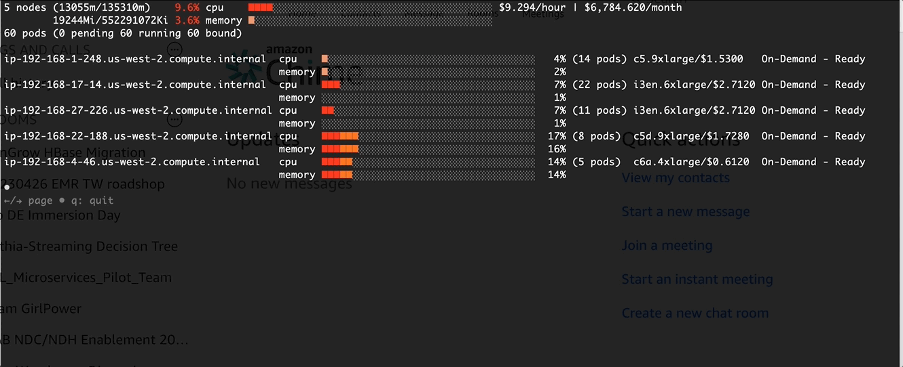
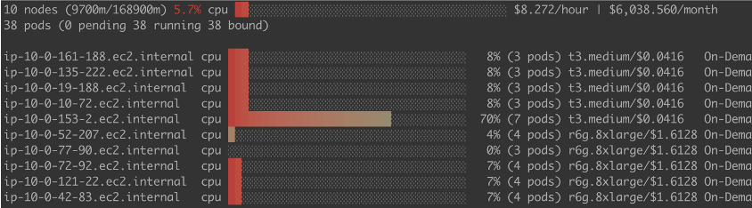

# Amazon EKS용 빈 패킹(Bin packing)

## 소개
이 게시물에서는 DoEKS, 특히 Spark on EKS(OSS Spark 및 EMR on EKS 포함)를 실행할 때 Amazon EKS에서 사용자 정의 스케줄러를 활성화하는 방법을 보여드립니다. 사용자 정의 스케줄러는 데이터 플레인에서 실행되는 ```MostAllocated``` 전략을 가진 사용자 정의 Kubernetes 스케줄러입니다.

### 빈 패킹을 사용하는 이유
기본적으로 [scheduling-plugin](https://kubernetes.io/docs/reference/scheduling/config/#scheduling-plugins) NodeResourcesFit은 점수 전략에 ```LeastAllocated```를 사용합니다. 장기 실행 워크로드의 경우 고가용성 때문에 좋습니다. 그러나 Spark 워크로드와 같은 배치 작업의 경우 이는 높은 비용으로 이어집니다. ```LeastAllocated```에서 ```MostAllocated```로 변경하면 실행 중인 모든 노드에 Pod를 분산시키는 것을 방지하여 더 높은 리소스 활용률과 더 나은 비용 효율성으로 이어집니다.

Spark와 같은 배치 작업은 제한된 또는 예측된 시간으로 온디맨드로 실행됩니다. ```MostAllocated``` 전략을 사용하면 Spark 익스큐터는 노드가 더 이상 Pod를 호스팅할 수 없을 때까지 항상 하나의 노드에 빈 패킹됩니다. 다음 그림에서 확인할 수 있습니다.

EMR on EKS에서의 ```MostAllocated```




EMR on EKS에서의 ```LeastAllocated```



### 장점
1) 노드 활용률 개선
2) 비용 절감

### 고려 사항
업그레이드 가이드, 지원 매트릭스 및 고가용성 설계를 제공했지만 데이터 플레인에서 사용자 정의 스케줄러를 유지 관리하려면 다음을 포함한 노력이 필요합니다:
1) 업그레이드 작업. 배치 작업과 함께 업그레이드를 계획하여 스케줄러가 원하는 대로 실행되는지 확인합니다.
2) 스케줄러 모니터링. 프로덕션 목적으로 모니터링 및 알림이 필요합니다.
3) 요구 사항에 따라 스케줄러 Pod 리소스 및 기타 사용자 정의 조정.

## 솔루션 배포

### 저장소 복제

```shell
git clone https://github.com/aws-samples/custom-scheduler-eks
cd custom-scheduler-eks
```

### 매니페스트

**Amazon EKS 1.24**

```shell
kubectl apply -f deploy/manifests/custom-scheduler/amazon-eks-1.24-custom-scheduler.yaml
```

**Amazon EKS 1.29**

```shell
kubectl apply -f deploy/manifests/custom-scheduler/amazon-eks-1.29-custom-scheduler.yaml
```

**다른 Amazon EKS 버전**

* 관련 이미지 URL 교체(https://gallery.ecr.aws/eks-distro/kubernetes/kube-scheduler)

자세한 내용은 [custom-scheduler](https://github.com/aws-samples/custom-scheduler-eks)를 참조하세요.

### Spark용 사용자 정의 스케줄러를 사용하도록 Pod 템플릿 설정
다음과 같이 Pod 템플릿에 사용자 정의 스케줄러 이름을 추가해야 합니다.
```bash
kind: Pod
spec:
  schedulerName: custom-k8s-scheduler
  volumes:
    - name: spark-local-dir-1
      hostPath:
        path: /local1
  initContainers:
  - name: volume-permission
    image: public.ecr.aws/docker/library/busybox
    # grant volume access to hadoop user
    command: ['sh', '-c', 'if [ ! -d /data1 ]; then mkdir /data1;fi; chown -R 999:1000 /data1']
    volumeMounts:
      - name: spark-local-dir-1
        mountPath: /data1
  containers:
  - name: spark-kubernetes-executor
    volumeMounts:
      - name: spark-local-dir-1
        mountPath: /data1
```


## [eks-node-viewer](https://github.com/awslabs/eks-node-viewer)를 통한 확인 및 모니터링

Pod 템플릿에 변경 사항을 적용하기 전


변경 후: Pod 스케줄 시간에 더 높은 CPU 사용량


## 결론

사용자 정의 스케줄러를 사용하면 노드 스케일 인을 트리거하여 비용을 절감할 수 있는 Spark 워크로드에 대한 노드 활용률을 완전히 개선할 수 있습니다.

Spark on EKS를 실행하는 사용자의 경우 Amazon EKS가 공식적으로 [kube-scheduler 사용자 정의](https://github.com/aws/containers-roadmap/issues/1468)를 지원하기 전까지 이 사용자 정의 스케줄러를 채택하는 것을 권장합니다.
