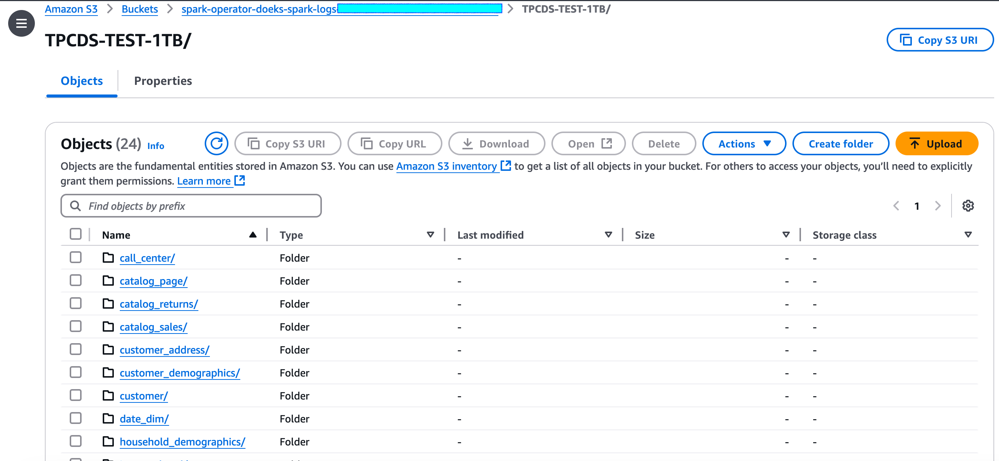

import Tabs from '@theme/Tabs';
import TabItem from '@theme/TabItem';
import ReplaceS3BucketPlaceholders from './_replace_s3_bucket_placeholders.mdx';
import CollapsibleContent from '../../../../../../src/components/CollapsibleContent';

# 在 Amazon EKS 上运行 Spark 基准测试的数据生成

以下指南提供了如何为运行 Spark 的 TPCDS 基准测试生成数据集的说明。

## 部署数据生成工具包

在此[示例](https://github.com/awslabs/data-on-eks/tree/main/analytics/terraform/spark-k8s-operator)中，您将配置运行带有开源 Spark Operator 的 Spark 作业所需的以下资源。

此示例将运行 Spark K8s Operator 的 EKS 集群部署到新的 VPC 中。

- 创建新的示例 VPC、2 个私有子网、2 个公有子网，以及 RFC6598 空间（100.64.0.0/10）中用于 EKS Pod 的 2 个子网。
- 为公有子网创建互联网网关，为私有子网创建 NAT 网关
- 创建具有公共端点的 EKS 集群控制平面（仅用于演示目的），具有用于基准测试和核心服务的托管节点组，以及用于 Spark 工作负载的 Karpenter NodePool。
- 部署 Metrics server、Spark-operator、Apache Yunikorn、Karpenter、Cluster Autoscaler、Grafana、AMP 和 Prometheus server。

### 先决条件

确保您已在计算机上安装了以下工具。

1. [aws cli](https://docs.aws.amazon.com/cli/latest/userguide/install-cliv2.html)
2. [kubectl](https://Kubernetes.io/docs/tasks/tools/)
3. [terraform](https://learn.hashicorp.com/tutorials/terraform/install-cli)

### 部署

克隆存储库。

```bash
git clone https://github.com/awslabs/data-on-eks.git
cd data-on-eks
export DOEKS_HOME=$(pwd)
```

如果 DOEKS_HOME 被取消设置，您始终可以从 data-on-eks 目录使用 `export DATA_ON_EKS=$(pwd)` 手动设置它。

导出以下环境变量以设置启用 SSD 的 `c5d12xlarge` 实例的最小和期望数量。在我们的测试中，我们根据数据集的大小将这两个值都设置为 `6`。请根据您的要求和计划运行的数据集大小调整实例数量。

```bash
export TF_VAR_spark_benchmark_ssd_min_size=6
export TF_VAR_spark_benchmark_ssd_desired_size=6
```

**注意：** 如果您无法访问 `c5d` 实例，请随时使用配备本地基于 NVMe 的 SSD 块级存储的其他 EC2 实例。启用基于 NVMe 的 SSD 实例存储的 EC2 实例非常适合运行 Spark 基准测试数据生成工具包。

导航到以下目录并运行 `install.sh` 脚本。

```bash
cd ${DOEKS_HOME}/analytics/terraform/spark-k8s-operator
chmod +x install.sh
./install.sh
```

现在创建一个 S3_BUCKET 变量，该变量保存在安装期间创建的存储桶的名称。此存储桶将在后续示例中用于存储输出数据。如果 S3_BUCKET 被取消设置，您可以再次运行以下命令。

```bash
export S3_BUCKET=$(terraform output -raw s3_bucket_id_spark_history_server)
echo $S3_BUCKET
```

## 为运行 TPCDS 基准测试生成测试数据集

为了为 TPCDS 基准测试生成数据集，您需要在数据生成清单中配置 S3 存储桶名称。

<!-- Docusaurus will not render the {props.filename} inside of a ```codeblock``` -->
<ReplaceS3BucketPlaceholders filename="./tpcds-benchmark-data-generation-1t.yaml" />
```bash
cd ${DOEKS_HOME}/analytics/terraform/spark-k8s-operator/examples/benchmark
sed -i.old s/\<S3_BUCKET\>/${S3_BUCKET}/g ./tpcds-benchmark-data-generation-1t.yaml
```

然后要开始数据生成，请执行以下命令

```bash

kubectl apply -f tpcds-benchmark-data-generation-1t.yaml
```

应用 `tpcds-benchmark-data-generation-1t.yaml` 清单后，您应该看到 driver 和 executor Pod 启动。执行测试数据生成脚本大约需要一个小时才能完成。执行完成后，您可以进入 AWS S3 控制台并验证存储桶大小。

导航到作为运行蓝图的一部分创建的 S3 存储桶。勾选名为 `TPCDS-TEST-1TB` 的文件夹旁边的复选框，然后单击 `Actions` 下拉菜单，然后单击 `Calculate total size` 选项，如下所示。


对于我们的数据集，总大小为 310 GB。


进入 `TPCDS-TEST-1TB` 文件夹后，您应该看到生成了许多子文件夹（如下所示）。


每个子文件夹内应该有一个包含生成数据的 .parquet 文件。



另外，检查 Spark driver Pod 执行状态和日志以查看是否有任何错误。

```bash
kubectl get pod -n spark-team-a
```

输出：

```text
NAME                               READY   STATUS      RESTARTS   AGE
tpcds-data-generation-1tb-driver   0/1     Completed   0          59m
```

`tpcds-data-generation-1tb-driver` Pod 的日志片段应如下所示

<CollapsibleContent header={<h2><span>Driver Pod 日志片段</span></h2>}>

```text
24/11/01 15:29:42 INFO FileFormatWriter: Start to commit write Job xxxx.
24/11/01 15:29:42 INFO FileFormatWriter: Write Job xxxx committed. Elapsed time: 158 ms.
24/11/01 15:29:42 INFO FileFormatWriter: Finished processing stats for write job xxxx.
Data generated at s3a://spark-operator-doeks-spark-logs-xxx/TPCDS-TEST-1TB
24/11/01 15:29:42 INFO SparkContext: SparkContext is stopping with exitCode 0.
24/11/01 15:29:42 INFO SparkUI: Stopped Spark web UI at http://tpcds-data-generation-1tb-yyyyy-driver-svc.spark-team-a.svc:4040
24/11/01 15:29:42 INFO KubernetesClusterSchedulerBackend: Shutting down all executors
24/11/01 15:29:42 INFO KubernetesClusterSchedulerBackend$KubernetesDriverEndpoint: Asking each executor to shut down
24/11/01 15:29:42 WARN ExecutorPodsWatchSnapshotSource: Kubernetes client has been closed.
24/11/01 15:29:42 INFO MapOutputTrackerMasterEndpoint: MapOutputTrackerMasterEndpoint stopped!
24/11/01 15:29:42 INFO MemoryStore: MemoryStore cleared
24/11/01 15:29:42 INFO BlockManager: BlockManager stopped
24/11/01 15:29:42 INFO BlockManagerMaster: BlockManagerMaster stopped
24/11/01 15:29:42 INFO OutputCommitCoordinator$OutputCommitCoordinatorEndpoint: OutputCommitCoordinator stopped!
24/11/01 15:29:42 INFO SparkContext: Successfully stopped SparkContext
```
</CollapsibleContent>

## 成本考虑

在使用 c5d 实例进行数据生成时，重要的是要考虑成本影响。这些具有本地 NVMe 存储的计算优化实例提供高性能，但可能比标准 c5 实例更昂贵。为了优化成本，仔细监控使用情况并适当扩展资源至关重要。本地 NVMe 存储提供快速 I/O，但不保证数据持久性，因此您应该考虑数据传输和备份解决方案的成本。Spot 实例可以为可中断的工作负载提供显著节省。此外，为长期、可预测的使用预留实例可以带来大幅折扣。另外，通过将节点组的最小和期望大小调整为 0，在不再需要这些实例时终止它们是至关重要的。这种做法有助于避免空闲资源产生的不必要成本。

:::caution
为避免对您的 AWS 账户产生不必要的费用，请删除在此部署期间创建的所有 AWS 资源
:::

此脚本将使用 `-target` 选项清理环境，以确保所有资源按正确顺序删除。

```bash
cd ${DOEKS_HOME}/analytics/terraform/spark-k8s-operator && chmod +x cleanup.sh
./cleanup.sh
```
