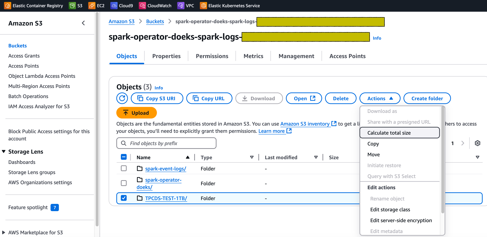

import Tabs from '@theme/Tabs';
import TabItem from '@theme/TabItem';
import CollapsibleContent from '../../../../../../src/components/CollapsibleContent';
import ReplaceS3BucketPlaceholders from '../../../../../../docs/benchmarks/spark-operator-benchmark/_replace_s3_bucket_placeholders.mdx';

# 在Amazon EKS上运行Spark基准测试的数据生成

以下指南提供了如何为Spark的TPCDS基准测试生成数据集的说明。

## 部署数据生成工具包

在这个[示例](https://github.com/awslabs/data-on-eks/tree/main/analytics/terraform/spark-k8s-operator)中，您将配置运行带有开源Spark Operator的Spark作业所需的以下资源。

此示例将运行Spark K8s Operator的EKS集群部署到新的VPC中。

- 创建一个新的示例VPC、2个私有子网、2个公共子网和RFC6598空间(100.64.0.0/10)中的2个子网，用于EKS Pod。
- 为公共子网创建互联网网关，为私有子网创建NAT网关
- 创建带有公共端点的EKS集群控制平面（仅用于演示目的），带有用于基准测试和核心服务的托管节点组，以及用于Spark工作负载的Karpenter NodePools。
- 部署Metrics server、Spark-operator、Apache Yunikorn、Karpenter、Cluster Autoscaler、Grafana、AMP和Prometheus服务器。
### 先决条件

确保您已在计算机上安装了以下工具。

1. [aws cli](https://docs.aws.amazon.com/cli/latest/userguide/install-cliv2.html)
2. [kubectl](https://Kubernetes.io/docs/tasks/tools/)
3. [terraform](https://learn.hashicorp.com/tutorials/terraform/install-cli)

### 部署

克隆仓库。

```bash
git clone https://github.com/awslabs/data-on-eks.git
cd data-on-eks
export DOEKS_HOME=$(pwd)
```

如果DOEKS_HOME变量被取消设置，您可以随时从data-on-eks目录使用`export
DATA_ON_EKS=$(pwd)`手动设置它。

导出以下环境变量，设置启用ssd的`c5d12xlarge`实例的最小和所需数量。在我们的测试中，根据数据集的大小，我们将这两个值都设置为`6`。请根据您的需求和计划运行的数据集大小调整实例数量。

```bash
export TF_VAR_spark_benchmark_ssd_min_size=6
export TF_VAR_spark_benchmark_ssd_desired_size=6
```

**注意：** 如果您无法访问`c5d`实例，可以使用配备本地基于NVMe的SSD块级存储的其他EC2实例。基于NVMe的SSD实例存储的EC2实例非常适合运行Spark基准数据生成工具包。

导航到以下目录并运行`install.sh`脚本。

```bash
cd ${DOEKS_HOME}/analytics/terraform/spark-k8s-operator
chmod +x install.sh
./install.sh
```

现在创建一个S3_BUCKET变量，保存安装期间创建的存储桶名称。此存储桶将在后续示例中用于存储输出数据。如果S3_BUCKET变量被取消设置，您可以再次运行以下命令。

```bash
export S3_BUCKET=$(terraform output -raw s3_bucket_id_spark_history_server)
echo $S3_BUCKET
```
## 生成运行TPCDS基准测试的测试数据集

为了生成TPCDS基准测试的数据集，您需要在数据生成清单中配置S3存储桶名称。

<!-- Docusaurus will not render the {props.filename} inside of a ```codeblock``` -->
<ReplaceS3BucketPlaceholders filename="./tpcds-benchmark-data-generation-1t.yaml" />
```bash
cd ${DOEKS_HOME}/analytics/terraform/spark-k8s-operator/examples/benchmark
sed -i.old s/\<S3_BUCKET\>/${S3_BUCKET}/g ./tpcds-benchmark-data-generation-1t.yaml
```

然后执行以下命令开始数据生成

```bash

kubectl apply -f tpcds-benchmark-data-generation-1t.yaml
```

应用`tpcds-benchmark-data-generation-1t.yaml`清单后，您应该会看到驱动程序和执行器Pod启动。测试数据生成脚本的执行大约需要一个小时才能完成。执行完成后，您可以进入AWS S3控制台并验证存储桶大小。

导航到作为运行蓝图的一部分创建的S3存储桶。勾选名为`TPCDS-TEST-1TB`的文件夹旁边的复选框，点击`Actions`下拉菜单，然后点击`Calculate total size`选项，如下所示。



对于我们的数据集，总大小为310 GB。


进入`TPCDS-TEST-1TB`文件夹后，您应该看到生成的许多子文件夹（如下所示）。


每个子文件夹内应该有一个.parquet文件，其中包含生成的数据。


此外，检查Spark驱动程序Pod的执行状态和日志，看是否有任何错误。

```bash
kubectl get pod -n spark-team-a
```

输出：

```text
NAME                               READY   STATUS      RESTARTS   AGE
tpcds-data-generation-1tb-driver   0/1     Completed   0          59m
```
`tpcds-data-generation-1tb-driver` pod的日志片段应如下所示

<CollapsibleContent header={<h2><span>驱动程序Pod日志片段</span></h2>}>

```text
24/11/01 15:29:42 INFO FileFormatWriter: Start to commit write Job xxxx.
24/11/01 15:29:42 INFO FileFormatWriter: Write Job xxxx committed. Elapsed time: 158 ms.
24/11/01 15:29:42 INFO FileFormatWriter: Finished processing stats for write job xxxx.
Data generated at s3a://spark-operator-doeks-spark-logs-xxx/TPCDS-TEST-1TB
24/11/01 15:29:42 INFO SparkContext: SparkContext is stopping with exitCode 0.
24/11/01 15:29:42 INFO SparkUI: Stopped Spark web UI at http://tpcds-data-generation-1tb-yyyyy-driver-svc.spark-team-a.svc:4040
24/11/01 15:29:42 INFO KubernetesClusterSchedulerBackend: Shutting down all executors
24/11/01 15:29:42 INFO KubernetesClusterSchedulerBackend$KubernetesDriverEndpoint: Asking each executor to shut down
24/11/01 15:29:42 WARN ExecutorPodsWatchSnapshotSource: Kubernetes client has been closed.
24/11/01 15:29:42 INFO MapOutputTrackerMasterEndpoint: MapOutputTrackerMasterEndpoint stopped!
24/11/01 15:29:42 INFO MemoryStore: MemoryStore cleared
24/11/01 15:29:42 INFO BlockManager: BlockManager stopped
24/11/01 15:29:42 INFO BlockManagerMaster: BlockManagerMaster stopped
24/11/01 15:29:42 INFO OutputCommitCoordinator$OutputCommitCoordinatorEndpoint: OutputCommitCoordinator stopped!
24/11/01 15:29:42 INFO SparkContext: Successfully stopped SparkContext
```
</CollapsibleContent>

## 成本考虑

在使用c5d实例进行数据生成时，重要的是要考虑成本影响。这些配备本地NVMe存储的计算优化实例提供高性能，但可能比标准c5实例更昂贵。为了优化成本，至关重要的是仔细监控使用情况并适当扩展资源。本地NVMe存储提供快速I/O，但数据持久性不能保证，因此您应该考虑数据传输和备份解决方案的成本。竞价实例可以为可中断工作负载提供显著节约。此外，为长期、可预测的使用预留实例可以带来大幅折扣。另外，当不再需要这些实例时，通过将节点组的最小和所需大小调整为0来终止它们是至关重要的。这种做法有助于避免闲置资源带来的不必要成本。

:::caution
为避免对您的AWS账户产生不必要的费用，请删除在此部署期间创建的所有AWS资源
:::

此脚本将使用`-target`选项清理环境，以确保所有资源按正确顺序删除。

```bash
cd ${DOEKS_HOME}/analytics/terraform/spark-k8s-operator && chmod +x cleanup.sh
./cleanup.sh
```
