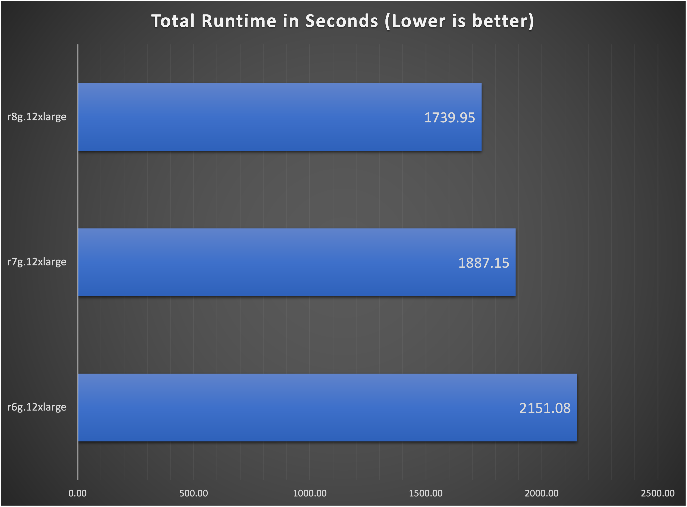
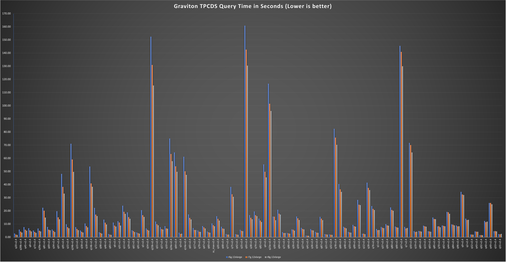

import Tabs from '@theme/Tabs';
import TabItem from '@theme/TabItem';
import CollapsibleContent from '../../../../../../src/components/CollapsibleContent';
import CodeBlock from '@theme/CodeBlock';

import RSeriesNodeGroup from '../../../../../../docs/benchmarks/spark-operator-benchmark/_r_series_nodegroup.md'
import RSeriesSparkApp from '../../../../../../docs/benchmarks/spark-operator-benchmark/_r_series_spark_app.md'
import RSeriesDockerfile from '../../../../../../docs/benchmarks/spark-operator-benchmark/_r_series_dockerfile.md'

# Graviton R6g、R7g和R8g的TPCDS Spark基准测试结果
本页包含我们对R系列Graviton实例的基准测试结果，展示了新一代实例的运行时间最多可提高1.6倍。

这些基准测试是使用[运行基准测试](./running-the-benchmark.md)部分中定义的步骤在1TB数据上执行的。我们对所有这些测试使用了相同的EKS集群、相同的数据集、相同数量的节点以及相同的附加组件和配置。我们只是更改了每次运行使用的实例类型。
完整的配置详情如下：

 要查看托管节点组配置，请点击切换内容！

<RSeriesNodeGroup />

 要查看Spark应用程序配置，请点击切换内容！

<RSeriesSparkApp />

 要查看Spark容器镜像的Dockerfile，请点击切换内容！

<RSeriesDockerfile />

## 结果
在查看TPCDS基准测试的结果时，我们关注的是Spark SQL查询完成所需的时间，这些查询完成得越快越好。
下图显示了我们测试的每种实例类型的所有查询的累计运行时间（以秒为单位）：

我们可以类似地显示每个实例的每个查询的时间，您可以看到新一代的运行时间改进：

在下表中，我们从3次查询迭代的基准测试中获取了每种实例类型的输出的中值时间，并计算了获得的性能。您可以在[这里的`raw_data`文件夹中查看原始输出数据](https://github.com/awslabs/data-on-eks/blob/main/website/docs/benchmarks/spark-operator-benchmark/raw_data)。

为了计算性能提升，我们计算查询时间的比率。例如，要确定r8g实例与r6g实例相比快多少：
- 找到对应于每个查询的时间，以`q20-v2.4`为例，r6g.12xlarge花费了`2.81s`，r8g.12xlarge花费了`1.69s`。
- 然后我们除以r5g.12xlarge/r8g.12xlarge，对于q20-v2.4，那是`2.81s/1.69s = 1.66`。因此，对于此查询，r8g.12xlarge能够以1.66倍的速度完成查询（或约66%的改进）

数据按最后一列排序，显示r8g.12xlarge相对于r6g.12xlarge的性能提升。

| 查询 | r6g.12xlarge | r7g.12xlarge | r8g.12xlarge |  | r7g比r6g快多少倍  | r8g比r7g快多少倍 | r8g比r6g快多少倍 |
| :---  | :----------- | :----------- | :----------- | :-- | :--------- | :--------- | :--------- |
| q20-v2.4 | 2.81 | 1.94 | 1.69 |  | 1.45 | 1.14 | 1.66 |
| q39b-v2.4 | 5.75 | 4.26 | 3.56 |  | 1.35 | 1.20 | 1.61 |
| q45-v2.4 | 7.66 | 5.69 | 4.92 |  | 1.35 | 1.15 | 1.56 |
| q8-v2.4 | 6.77 | 5.19 | 4.37 |  | 1.31 | 1.19 | 1.55 |
| q73-v2.4 | 5.08 | 3.96 | 3.31 |  | 1.28 | 1.20 | 1.54 |
| q39a-v2.4 | 6.60 | 4.84 | 4.36 |  | 1.36 | 1.11 | 1.51 |
| q81-v2.4 | 22.41 | 20.14 | 14.93 |  | 1.11 | 1.35 | 1.50 |
| q69-v2.4 | 7.81 | 5.74 | 5.26 |  | 1.36 | 1.09 | 1.48 |
| q34-v2.4 | 5.80 | 4.76 | 3.96 |  | 1.22 | 1.20 | 1.47 |
| q97-v2.4 | 19.76 | 15.13 | 13.60 |  | 1.31 | 1.11 | 1.45 |
| q95-v2.4 | 48.14 | 38.24 | 33.14 |  | 1.26 | 1.15 | 1.45 |
| q22-v2.4 | 9.79 | 7.57 | 6.81 |  | 1.29 | 1.11 | 1.44 |
| q24b-v2.4 | 71.09 | 59.12 | 49.64 |  | 1.20 | 1.19 | 1.43 |
| q15-v2.4 | 7.62 | 6.30 | 5.34 |  | 1.21 | 1.18 | 1.43 |
| q58-v2.4 | 5.05 | 4.12 | 3.57 |  | 1.22 | 1.16 | 1.41 |
| q18-v2.4 | 10.43 | 8.45 | 7.44 |  | 1.23 | 1.14 | 1.40 |
| q14b-v2.4 | 53.73 | 40.88 | 38.33 |  | 1.31 | 1.07 | 1.40 |
| q72-v2.4 | 22.29 | 17.19 | 16.08 |  | 1.30 | 1.07 | 1.39 |
| q98-v2.4 | 3.78 | 3.26 | 2.73 |  | 1.16 | 1.20 | 1.39 |
| q46-v2.4 | 13.37 | 11.00 | 9.65 |  | 1.21 | 1.14 | 1.39 |
| q83-v2.4 | 2.39 | 1.95 | 1.73 |  | 1.22 | 1.12 | 1.38 |
| q6-v2.4 | 11.11 | 8.83 | 8.08 |  | 1.26 | 1.09 | 1.37 |
| q31-v2.4 | 12.19 | 11.12 | 8.87 |  | 1.10 | 1.25 | 1.37 |
| q11-v2.4 | 23.95 | 19.30 | 17.72 |  | 1.24 | 1.09 | 1.35 |
| q29-v2.4 | 18.91 | 15.29 | 14.00 |  | 1.24 | 1.09 | 1.35 |
| q61-v2.4 | 5.26 | 4.62 | 3.92 |  | 1.14 | 1.18 | 1.34 |
| q91-v2.4 | 3.63 | 3.05 | 2.71 |  | 1.19 | 1.12 | 1.34 |
| q5-v2.4 | 20.57 | 16.72 | 15.42 |  | 1.23 | 1.08 | 1.33 |
| q54-v2.4 | 6.61 | 5.61 | 4.99 |  | 1.18 | 1.12 | 1.32 |
| q23b-v2.4 | 152.46 | 130.94 | 115.37 |  | 1.16 | 1.14 | 1.32 |
| q51-v2.4 | 11.90 | 9.90 | 9.06 |  | 1.20 | 1.09 | 1.31 |
| q57-v2.4 | 7.62 | 6.19 | 5.81 |  | 1.23 | 1.06 | 1.31 |
| q10-v2.4 | 8.38 | 6.70 | 6.41 |  | 1.25 | 1.05 | 1.31 |
| q24a-v2.4 | 75.07 | 63.24 | 57.78 |  | 1.19 | 1.09 | 1.30 |
| q64-v2.4 | 64.48 | 53.92 | 49.69 |  | 1.20 | 1.09 | 1.30 |
| q3-v2.4 | 3.39 | 2.44 | 2.62 |  | 1.39 | 0.93 | 1.29 |
| q14a-v2.4 | 61.18 | 50.12 | 47.37 |  | 1.22 | 1.06 | 1.29 |
| q65-v2.4 | 17.30 | 14.65 | 13.49 |  | 1.18 | 1.09 | 1.28 |
| q17-v2.4 | 6.95 | 5.54 | 5.44 |  | 1.25 | 1.02 | 1.28 |
| q79-v2.4 | 5.12 | 4.14 | 4.01 |  | 1.24 | 1.03 | 1.28 |
| q47-v2.4 | 8.45 | 7.56 | 6.62 |  | 1.12 | 1.14 | 1.28 |
| q60-v2.4 | 4.30 | 3.72 | 3.38 |  | 1.16 | 1.10 | 1.27 |
| ss_max-v2.4 | 10.48 | 9.13 | 8.29 |  | 1.15 | 1.10 | 1.26 |
| q35-v2.4 | 15.90 | 13.96 | 12.65 |  | 1.14 | 1.10 | 1.26 |
| q68-v2.4 | 7.93 | 6.64 | 6.32 |  | 1.19 | 1.05 | 1.25 |
| q77-v2.4 | 2.39 | 1.95 | 1.92 |  | 1.23 | 1.02 | 1.25 |
| q75-v2.4 | 38.27 | 32.63 | 30.71 |  | 1.17 | 1.06 | 1.25 |
| q42-v2.4 | 2.19 | 1.96 | 1.76 |  | 1.11 | 1.11 | 1.24 |
| q25-v2.4 | 5.64 | 4.84 | 4.55 |  | 1.17 | 1.06 | 1.24 |
| q93-v2.4 | 160.84 | 142.63 | 130.45 |  | 1.13 | 1.09 | 1.23 |
| q38-v2.4 | 16.80 | 14.77 | 13.66 |  | 1.14 | 1.08 | 1.23 |
| q74-v2.4 | 19.57 | 16.73 | 15.97 |  | 1.17 | 1.05 | 1.23 |
| q82-v2.4 | 14.10 | 12.66 | 11.55 |  | 1.11 | 1.10 | 1.22 |
| q4-v2.4 | 55.36 | 49.70 | 45.47 |  | 1.11 | 1.09 | 1.22 |
| q23a-v2.4 | 116.74 | 101.45 | 95.94 |  | 1.15 | 1.06 | 1.22 |
| q30-v2.4 | 15.69 | 15.56 | 12.91 |  | 1.01 | 1.21 | 1.22 |
| q94-v2.4 | 20.87 | 17.87 | 17.18 |  | 1.17 | 1.04 | 1.21 |
| q71-v2.4 | 3.83 | 3.08 | 3.16 |  | 1.24 | 0.98 | 1.21 |
| q86-v2.4 | 3.19 | 2.89 | 2.64 |  | 1.10 | 1.10 | 1.21 |
| q26-v2.4 | 5.94 | 5.67 | 4.91 |  | 1.05 | 1.15 | 1.21 |
| q59-v2.4 | 15.73 | 14.35 | 13.03 |  | 1.10 | 1.10 | 1.21 |
| q27-v2.4 | 7.15 | 6.26 | 5.93 |  | 1.14 | 1.06 | 1.21 |
| q41-v2.4 | 1.24 | 1.09 | 1.03 |  | 1.14 | 1.06 | 1.20 |
| q36-v2.4 | 6.15 | 5.27 | 5.11 |  | 1.17 | 1.03 | 1.20 |
| q56-v2.4 | 4.00 | 3.46 | 3.32 |  | 1.15 | 1.04 | 1.20 |
| q87-v2.4 | 15.46 | 14.13 | 12.96 |  | 1.09 | 1.09 | 1.19 |
| q21-v2.4 | 2.31 | 2.11 | 1.94 |  | 1.09 | 1.08 | 1.19 |
| q32-v2.4 | 2.04 | 1.83 | 1.73 |  | 1.11 | 1.06 | 1.18 |
| q78-v2.4 | 82.43 | 75.70 | 70.26 |  | 1.09 | 1.08 | 1.17 |
| q88-v2.4 | 40.39 | 36.38 | 34.44 |  | 1.11 | 1.06 | 1.17 |
| q48-v2.4 | 7.89 | 7.24 | 6.74 |  | 1.09 | 1.07 | 1.17 |
| q33-v2.4 | 4.06 | 3.67 | 3.47 |  | 1.11 | 1.06 | 1.17 |
| q99-v2.4 | 9.36 | 8.36 | 8.02 |  | 1.12 | 1.04 | 1.17 |
| q16-v2.4 | 28.35 | 24.72 | 24.41 |  | 1.15 | 1.01 | 1.16 |
| q12-v2.4 | 2.60 | 2.64 | 2.24 |  | 0.98 | 1.18 | 1.16 |
| q28-v2.4 | 41.47 | 37.51 | 35.84 |  | 1.11 | 1.05 | 1.16 |
| q76-v2.4 | 23.72 | 21.55 | 20.66 |  | 1.10 | 1.04 | 1.15 |
| q1-v2.4 | 6.24 | 5.33 | 5.43 |  | 1.17 | 0.98 | 1.15 |
| q37-v2.4 | 7.81 | 7.18 | 6.85 |  | 1.09 | 1.05 | 1.14 |
| q90-v2.4 | 9.91 | 8.97 | 8.77 |  | 1.10 | 1.02 | 1.13 |
| q80-v2.4 | 22.63 | 20.72 | 20.13 |  | 1.09 | 1.03 | 1.12 |
| q66-v2.4 | 8.09 | 7.54 | 7.23 |  | 1.07 | 1.04 | 1.12 |
| q67-v2.4 | 145.51 | 140.91 | 130.01 |  | 1.03 | 1.08 | 1.12 |
| q7-v2.4 | 7.82 | 6.61 | 7.00 |  | 1.18 | 0.94 | 1.12 |
| q50-v2.4 | 71.71 | 70.06 | 64.46 |  | 1.02 | 1.09 | 1.11 |
| q19-v2.4 | 4.61 | 3.98 | 4.16 |  | 1.16 | 0.96 | 1.11 |
| q89-v2.4 | 4.71 | 4.53 | 4.27 |  | 1.04 | 1.06 | 1.10 |
| q13-v2.4 | 8.75 | 8.30 | 7.98 |  | 1.05 | 1.04 | 1.10 |
| q63-v2.4 | 4.51 | 4.36 | 4.12 |  | 1.03 | 1.06 | 1.10 |
| q85-v2.4 | 14.98 | 13.86 | 13.72 |  | 1.08 | 1.01 | 1.09 |
| q70-v2.4 | 8.20 | 8.28 | 7.55 |  | 0.99 | 1.10 | 1.09 |
| q62-v2.4 | 8.97 | 8.60 | 8.28 |  | 1.04 | 1.04 | 1.08 |
| q44-v2.4 | 19.24 | 18.94 | 17.78 |  | 1.02 | 1.07 | 1.08 |
| q84-v2.4 | 9.72 | 9.51 | 9.01 |  | 1.02 | 1.05 | 1.08 |
| q96-v2.4 | 8.92 | 8.26 | 8.29 |  | 1.08 | 1.00 | 1.08 |
| q9-v2.4 | 34.46 | 32.49 | 32.07 |  | 1.06 | 1.01 | 1.07 |
| q2-v2.4 | 14.12 | 13.05 | 13.21 |  | 1.08 | 0.99 | 1.07 |
| q52-v2.4 | 2.00 | 1.97 | 1.87 |  | 1.01 | 1.05 | 1.07 |
| q43-v2.4 | 4.39 | 4.14 | 4.13 |  | 1.06 | 1.00 | 1.06 |
| q92-v2.4 | 1.53 | 1.56 | 1.46 |  | 0.98 | 1.07 | 1.05 |
| q40-v2.4 | 12.33 | 11.43 | 11.82 |  | 1.08 | 0.97 | 1.04 |
| q49-v2.4 | 26.01 | 26.02 | 25.04 |  | 1.00 | 1.04 | 1.04 |
| q53-v2.4 | 4.53 | 4.64 | 4.42 |  | 0.98 | 1.05 | 1.03 |
| q55-v2.4 | 2.36 | 2.15 | 2.50 |  | 1.10 | 0.86 | 0.94 |

