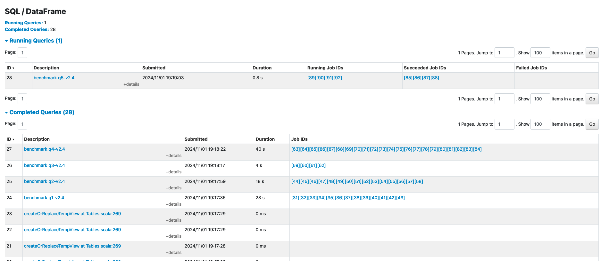
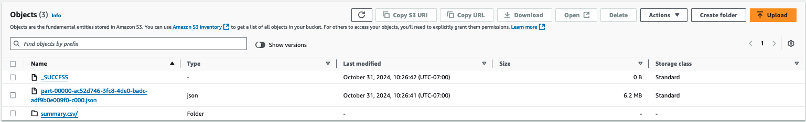

import ReplaceS3BucketPlaceholders from '../../../../../../docs/benchmarks/spark-operator-benchmark/_replace_s3_bucket_placeholders.mdx';

# 在Amazon EKS上运行Spark基准测试

以下指南提供了如何执行Spark的TPCDS基准测试的说明。

## 部署基准测试工具包

在这个[示例](https://github.com/awslabs/data-on-eks/tree/main/analytics/terraform/spark-k8s-operator)中，您将配置运行带有开源Spark Operator的Spark作业所需的以下资源。

此示例将运行Spark K8s Operator的EKS集群部署到新的VPC中。

- 创建一个新的示例VPC、2个私有子网、2个公共子网和RFC6598空间(100.64.0.0/10)中的2个子网，用于EKS Pod。
- 为公共子网创建互联网网关，为私有子网创建NAT网关
- 创建带有公共端点的EKS集群控制平面（仅用于演示目的），带有用于基准测试和核心服务的托管节点组，以及用于Spark工作负载的Karpenter NodePools。
- 部署Metrics server、Spark-operator、Apache Yunikorn、Karpenter、Cluster Autoscaler、Grafana、AMP和Prometheus服务器。

### 先决条件

确保您已在计算机上安装了以下工具。

1. [aws cli](https://docs.aws.amazon.com/cli/latest/userguide/install-cliv2.html)
2. [kubectl](https://Kubernetes.io/docs/tasks/tools/)
3. [terraform](https://learn.hashicorp.com/tutorials/terraform/install-cli)


### 部署

克隆仓库。

```bash
git clone https://github.com/awslabs/data-on-eks.git
cd data-on-eks
export DOEKS_HOME=$(pwd)
```

如果DOEKS_HOME变量被取消设置，您可以随时从data-on-eks目录使用`export
DATA_ON_EKS=$(pwd)`手动设置它。

导航到以下目录并运行`install.sh`脚本。

```bash
cd ${DOEKS_HOME}/analytics/terraform/spark-k8s-operator
chmod +x install.sh
./install.sh
```

现在创建一个S3_BUCKET变量，保存安装期间创建的存储桶名称。此存储桶将在后续示例中用于存储输出数据。如果S3_BUCKET变量被取消设置，您可以再次运行以下命令。

```bash
export S3_BUCKET=$(terraform output -raw s3_bucket_id_spark_history_server)
echo $S3_BUCKET
```
### 创建运行TPCDS基准测试的测试数据集
基准测试需要一个S3存储桶，其中包含要查询的输入数据并将结果保存回去。
如果您在S3中没有数据集，可以使用同一集群[运行数据生成作业](./data-generation.md)来创建一个。

一旦您有了一个带有示例数据集的S3存储桶，您就可以运行基准测试作业

## 运行TPCDS基准测试

### 扩展工作节点
对于这些基准测试，我们不是测量扩展速度，而是专注于Spark SQL查询和作业运行时间的性能。为确保作业不会被扩展活动或Spot中断打断，我们建议为基准测试使用托管节点组，并在提交作业之前扩展容量

蓝图[创建了两个托管节点组](https://github.com/awslabs/data-on-eks/blob/main/analytics/terraform/spark-k8s-operator/eks.tf#L120-L207)，我们用于这些基准测试：
- `spark_benchmark_ebs` - 此节点组配置为没有NVMe存储的实例，如r6g或c5
- `spark_benchmark_ssd` - 此节点组将在实例上可用的NVMe设备上设置RAID。这非常适合带有NVMe存储的实例，如r6gd和c5d。
这些节点组默认缩放为0以节省成本，但您可以配置要进行基准测试的实例类型，然后设置节点组的`min_size`和`desired_size`。

:::tip
所需的节点数量根据实例的大小和基准测试中使用的执行器Pod的资源请求而变化。目前，基准测试请求36个执行器，每个请求5vCPU和26Gi内存，总共180vCPU和936Gi内存。这将适合六个r6g.12xlarge实例。您可以将基准测试清单与您想要使用的实例类型进行比较，以找到所需的EC2实例数量。
:::


### 设置输入/输出的S3存储桶

<!-- Docusaurus will not render the {props.filename} inside of a ```codeblock``` -->
<ReplaceS3BucketPlaceholders filename="./tpcds-benchmark-1t-ebs.yaml" />
```bash
cd ${DOEKS_HOME}/analytics/terraform/spark-k8s-operator/examples/benchmark
sed -i.old s/\<S3_BUCKET\>/${S3_BUCKET}/g ./tpcds-benchmark-1t-ebs.yaml
```

### 提交基准测试作业

然后执行以下命令开始数据生成

```bash

kubectl apply -f tpcds-benchmark-1t-ebs.yaml
```

应用`tpcds-benchmark-1t-ebs.yaml`清单后，您应该会看到驱动程序和执行器Pod启动。完成基准查询的单次迭代大约需要一个小时。

您可以通过检查Spark驱动程序Pod的执行状态和日志来监控作业状态

```bash
kubectl get pod -n spark-team-a
```

输出：
```bash
NAME                             READY   STATUS    RESTARTS   AGE     IP               NODE                             NOMINATED NODE   READINESS GATES
benchmark-exec-ebs-exec-1        1/1     Running   0          75s     100.64.251.188   ip-100-64-219-156.ec2.internal   <none>           <none>
benchmark-exec-ebs-exec-10       1/1     Running   0          73s     100.64.213.1     ip-100-64-146-124.ec2.internal   <none>           <none>
...
benchmark-exec-ebs-exec-8        1/1     Running   0          74s     100.64.202.23    ip-100-64-219-156.ec2.internal   <none>           <none>
benchmark-exec-ebs-exec-9        1/1     Running   0          73s     100.64.238.20    ip-100-64-175-12.ec2.internal    <none>           <none>
tpcds-benchmark-1tb-ebs-driver   1/1     Running   0          2m33s   100.64.228.162   ip-100-64-213-174.ec2.internal   <none>           <none>
```
基准测试还配置为导出指标和日志，因此您可以使用[此处解释的Spark可观测性工具](https://awslabs.github.io/data-on-eks/docs/blueprints/data-analytics/observability-spark-on-eks#spark-history-server)查看基准测试。

要了解基准测试的进度，您可以使用Spark Web UI查看当前正在执行的查询。
端口转发到基准测试驱动程序以查看UI：
```bash
kubectl port-forward -n spark-team-a service/tpcds-benchmark-1tb-ebs-ui-svc 4040:4040
```
然后打开浏览器并输入localhost:4040。您可以查看正在运行和已完成的作业。基准测试将按顺序运行SQL查询，因此您可以通过检查查询编号来估计作业的进度。



基准测试完成后，您可以将节点组缩减回零以节省成本，并可以使用以下命令删除剩余的SparkApplication：
```bash
cd ${DOEKS_HOME}/analytics/terraform/spark-k8s-operator/examples/benchmark
kubectl delete -f tpcds-benchmark-1t-ebs.yaml
```

## 查看结果

基准测试完成后，它会将基准测试的结果放在清单文件中指定的S3存储桶中（默认：`s3a://<S3_BUCKET>/TPCDS-TEST-1T-RESULT`）。您可以导航到相应S3存储桶的S3控制台并进入目录：


当您进入结果目录时，您将看到一个文件夹列表，这些文件夹对应于作业运行的时间戳：


您可以通过选择最大的时间戳或找到与测试时间对应的文件夹来找到最新的结果。
在此文件夹内，您将看到一个名称类似于`part-00000-000000000-0000-0000-0000-000000000-0000.json`的文件，此文件包括用于作业的完整spark配置。


在名为`summary.csv`的子文件夹内，`part-00000-000000000-0000-0000-0000-000000000-0000.csv`文件包括基准测试的结果。


如果您打开此csv文件，您将看到4列数据，显示处理每个查询所需的时间。该文件不包括列标题，从左到右的列是：
- TPCDS查询编号
- 处理该查询所需的中值时间
- 处理该查询所需的最小时间
- 处理该查询所需的最大时间

:::tip
如果基准测试运行了单次迭代（这是默认设置），那么所有三列将显示相同的时间。
:::

此图像显示了3次迭代的输出，为清晰起见添加了列标题：


## 成本考虑

在使用c5d实例进行数据生成时，重要的是要考虑成本影响。这些配备本地NVMe存储的计算优化实例提供高性能，但可能比标准c5实例更昂贵。为了优化成本，至关重要的是仔细监控使用情况并适当扩展资源。本地NVMe存储提供快速I/O，但数据持久性不能保证，因此您应该考虑数据传输和备份解决方案的成本。竞价实例可以为可中断工作负载提供显著节约。此外，为长期、可预测的使用预留实例可以带来大幅折扣。另外，当不再需要这些实例时，通过将节点组的最小和所需大小调整为0来终止它们是至关重要的。这种做法有助于避免闲置资源带来的不必要成本。

:::caution
为避免对您的AWS账户产生不必要的费用，请删除在此部署期间创建的所有AWS资源
:::

此脚本将使用`-target`选项清理环境，以确保所有资源按正确顺序删除。

```bash
cd ${DOEKS_HOME}/analytics/terraform/spark-k8s-operator && chmod +x cleanup.sh
./cleanup.sh
```
