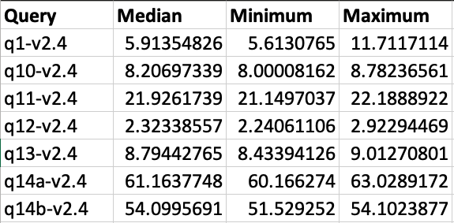

# 在 Amazon EKS 上运行 Spark 基准测试

以下指南提供了如何执行 Spark 的 TPCDS 基准测试的说明。

## 部署基准测试工具包

在此[示例](https://github.com/awslabs/data-on-eks/tree/main/analytics/terraform/spark-k8s-operator)中，您将配置运行带有开源 Spark Operator 的 Spark 作业所需的以下资源。

此示例将运行 Spark K8s Operator 的 EKS 集群部署到新的 VPC 中。

- 创建新的示例 VPC、2 个私有子网、2 个公有子网，以及 RFC6598 空间（100.64.0.0/10）中用于 EKS Pod 的 2 个子网。
- 为公有子网创建互联网网关，为私有子网创建 NAT 网关
- 创建具有公共端点的 EKS 集群控制平面（仅用于演示目的），具有用于基准测试和核心服务的托管节点组，以及用于 Spark 工作负载的 Karpenter NodePool。
- 部署 Metrics server、Spark-operator、Apache Yunikorn、Karpenter、Cluster Autoscaler、Grafana、AMP 和 Prometheus server。

### 先决条件

确保您已在计算机上安装了以下工具。

1. [aws cli](https://docs.aws.amazon.com/cli/latest/userguide/install-cliv2.html)
2. [kubectl](https://Kubernetes.io/docs/tasks/tools/)
3. [terraform](https://learn.hashicorp.com/tutorials/terraform/install-cli)

### 部署

克隆存储库。

```bash
git clone https://github.com/awslabs/data-on-eks.git
cd data-on-eks
export DOEKS_HOME=$(pwd)
```

如果 DOEKS_HOME 被取消设置，您始终可以从 data-on-eks 目录使用 `export DATA_ON_EKS=$(pwd)` 手动设置它。

导航到以下目录并运行 `install.sh` 脚本。

```bash
cd ${DOEKS_HOME}/analytics/terraform/spark-k8s-operator
chmod +x install.sh
./install.sh
```

现在创建一个 S3_BUCKET 变量，该变量保存在安装期间创建的存储桶的名称。此存储桶将在后续示例中用于存储输出数据。如果 S3_BUCKET 被取消设置，您可以再次运行以下命令。

```bash
export S3_BUCKET=$(terraform output -raw s3_bucket_id_spark_history_server)
echo $S3_BUCKET
```

### 创建用于运行 TPCDS 基准测试的测试数据集
基准测试需要一个包含输入数据的 S3 存储桶来查询并将结果保存回去。
如果您在 S3 中没有数据集，您可以使用同一集群[运行数据生成作业](./data-generation.md)来创建一个。

一旦您有了包含示例数据集的 S3 存储桶，您就可以运行基准测试作业

## 运行 TPCDS 基准测试

### 扩展 worker 节点
对于这些基准测试，我们不是在测量扩展速度，而是专注于 Spark SQL 查询的性能和作业运行时间。为了确保作业不被扩展活动或 Spot 中断所中断，我们建议为基准测试使用托管节点组，并在提交作业之前扩展容量

蓝图[创建了两个托管节点组](https://github.com/awslabs/data-on-eks/blob/main/analytics/terraform/spark-k8s-operator/eks.tf#L120-L207)，我们用于这些基准测试：
- `spark_benchmark_ebs` - 此节点组配置为没有 NVMe 存储的实例，如 r6g 或 c5
- `spark_benchmark_ssd` - 此节点组将在实例上可用的 NVMe 设备上设置 RAID。这对于具有 NVMe 存储的实例（如 r6gd 和 c5d）来说是完美的。
这些节点组默认缩放为 0 以节省成本，但您可以配置要进行基准测试的实例类型，然后为节点组设置 `min_size` 和 `desired_size`。

:::tip
所需的节点数量根据实例的大小和基准测试中使用的 executor Pod 的资源请求而变化。目前基准测试请求 36 个 executor，每个请求 5vCPU 和 26Gi 内存，总共 180vCPU 和 936Gi 内存。这将适合六个 r6g.12xlarge 实例。您可以将基准测试清单与您想要使用的实例类型进行比较，以找到所需的 EC2 实例数量。
:::

### 设置输入/输出的 S3 存储桶

您需要将基准测试文件中的 *\<S3_BUCKET\>* 占位符替换为之前创建的存储桶名称。您可以通过运行 `echo $S3_BUCKET` 来获取该值。

要自动执行此操作，您可以运行以下命令，这将创建一个 .old 备份文件并为您进行替换。

```bash
cd ${DOEKS_HOME}/analytics/terraform/spark-k8s-operator/examples/benchmark
sed -i.old s/\<S3_BUCKET\>/${S3_BUCKET}/g ./tpcds-benchmark-1t-ebs.yaml
```

### 提交基准测试作业

然后要开始数据生成，请执行以下命令

```bash

kubectl apply -f tpcds-benchmark-1t-ebs.yaml
```

应用 `tpcds-benchmark-1t-ebs.yaml` 清单后，您应该看到 driver 和 executor Pod 启动。执行基准测试查询的单次迭代大约需要一个小时才能完成。

您可以通过检查 Spark driver Pod 执行状态和日志来监控作业状态

```bash
kubectl get pod -n spark-team-a
```

输出：
```bash
NAME                             READY   STATUS    RESTARTS   AGE     IP               NODE                             NOMINATED NODE   READINESS GATES
benchmark-exec-ebs-exec-1        1/1     Running   0          75s     100.64.251.188   ip-100-64-219-156.ec2.internal   <none>           <none>
benchmark-exec-ebs-exec-10       1/1     Running   0          73s     100.64.213.1     ip-100-64-146-124.ec2.internal   <none>           <none>
...
benchmark-exec-ebs-exec-8        1/1     Running   0          74s     100.64.202.23    ip-100-64-219-156.ec2.internal   <none>           <none>
benchmark-exec-ebs-exec-9        1/1     Running   0          73s     100.64.238.20    ip-100-64-175-12.ec2.internal    <none>           <none>
tpcds-benchmark-1tb-ebs-driver   1/1     Running   0          2m33s   100.64.228.162   ip-100-64-213-174.ec2.internal   <none>           <none>
```

基准测试还配置为导出指标和日志，因此您可以使用[此处解释的 Spark 可观察性工具](https://awslabs.github.io/data-on-eks/docs/blueprints/data-analytics/observability-spark-on-eks#spark-history-server)来查看基准测试。

要了解基准测试进行到什么程度，您可以使用 Spark Web UI 查看当前正在执行的查询。
端口转发到基准测试 Driver 以查看 UI：
```bash
kubectl port-forward -n spark-team-a service/tpcds-benchmark-1tb-ebs-ui-svc 4040:4040
```
然后打开浏览器并输入 localhost:4040。您可以查看正在运行和已完成的作业。基准测试将按顺序运行 SQL 查询，因此您可以通过检查查询编号来估计作业进行到什么程度。


基准测试完成后，您可以将节点组缩放回零以节省成本，并且可以使用以下命令删除剩余的 SparkApplication：
```bash
cd ${DOEKS_HOME}/analytics/terraform/spark-k8s-operator/examples/benchmark
kubectl delete -f tpcds-benchmark-1t-ebs.yaml
```

## 查看结果

基准测试完成后，它将把基准测试结果放在清单文件中指定的 S3 存储桶中（默认：`s3a://<S3_BUCKET>/TPCDS-TEST-1T-RESULT`）。您可以导航到相应 S3 存储桶的 S3 控制台并进入目录：


当您进入结果目录时，您将看到一个文件夹列表，这些文件夹对应于作业运行的时间戳：


您可以通过选择最大的时间戳来找到最新结果，或找到与您的测试时间对应的文件夹。
在此文件夹内，您将看到一个名称类似 `part-00000-000000000-0000-0000-0000-000000000-0000.json` 的文件，此文件包含用于作业的完整 spark 配置。


在名为 `summary.csv` 的子文件夹内，`part-00000-000000000-0000-0000-0000-000000000-0000.csv` 文件包含基准测试的结果。


如果您打开此 csv 文件，您将看到 4 列数据，显示处理每个查询所花费的时间。该文件不包含列标题，从左到右的列是：
- TPCDS 查询编号
- 处理该查询所花费的中位数时间
- 处理该查询所花费的最短时间
- 处理该查询所花费的最长时间

:::tip
如果基准测试运行了单次迭代（这是默认设置），那么所有三列将显示相同的时间。
:::

此图像显示了 3 次迭代的输出，为清晰起见添加了列标题：


## 成本考虑

在使用 c5d 实例进行数据生成时，重要的是要考虑成本影响。这些具有本地 NVMe 存储的计算优化实例提供高性能，但可能比标准 c5 实例更昂贵。为了优化成本，仔细监控使用情况并适当扩展资源至关重要。本地 NVMe 存储提供快速 I/O，但不保证数据持久性，因此您应该考虑数据传输和备份解决方案的成本。Spot 实例可以为可中断的工作负载提供显著节省。此外，为长期、可预测的使用预留实例可以带来大幅折扣。另外，通过将节点组的最小和期望大小调整为 0，在不再需要这些实例时终止它们是至关重要的。这种做法有助于避免空闲资源产生的不必要成本。

:::caution
为避免对您的 AWS 账户产生不必要的费用，请删除在此部署期间创建的所有 AWS 资源
:::

此脚本将使用 `-target` 选项清理环境，以确保所有资源按正确顺序删除。

```bash
cd ${DOEKS_HOME}/analytics/terraform/spark-k8s-operator && chmod +x cleanup.sh
./cleanup.sh
```
