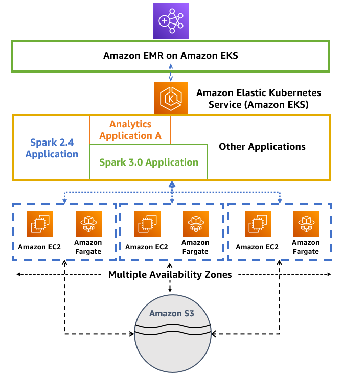

# EMR on EKS 最佳实践

## [EMR Containers 最佳实践指南](https://aws.github.io/aws-emr-containers-best-practices/)

Amazon EMR on Amazon EKS 使您能够在 Amazon Elastic Kubernetes Service (EKS) 上按需提交 Apache Spark 作业，而无需配置集群。使用 EMR on EKS，您可以将分析工作负载与其他基于 Kubernetes 的应用程序整合在同一个 Amazon EKS 集群上，以提高资源利用率并简化基础设施管理。

此链接提供了开始使用 Amazon EMR on EKS 的最佳实践和模板。我们在 GitHub 上发布此指南，以便我们可以快速迭代内容，为各种关注点提供及时有效的建议，并轻松整合来自更广泛社区的建议。

查看 EMR on EKS 最佳实践 GitHub 文档[这里](https://aws.github.io/aws-emr-containers-best-practices/)

### 架构
下图说明了 Amazon EMR on EKS 的解决方案架构。

