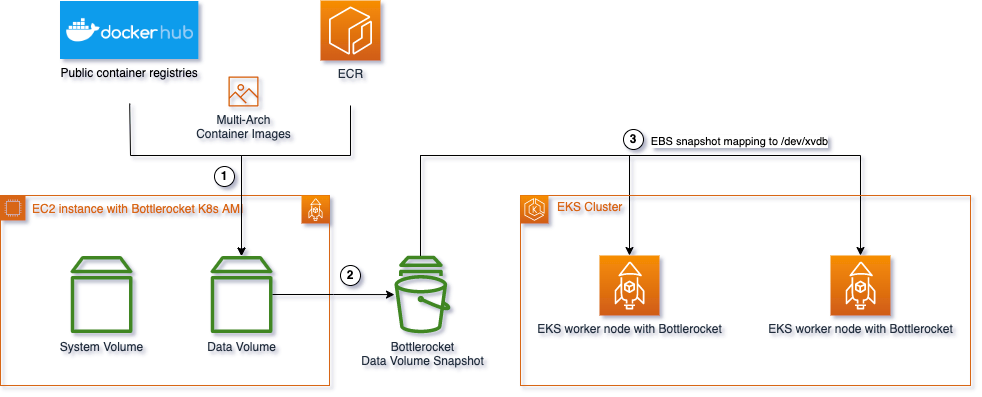

import CollapsibleContent from '../../../../../../src/components/CollapsibleContent';

# 使用EBS快照将容器镜像预加载到数据卷中

此模式的目的是通过将镜像缓存在Bottlerocket OS的数据卷中来减少大型镜像容器的冷启动时间。

数据分析和机器学习工作负载通常需要大型容器镜像（通常以GB为单位），从Amazon ECR或其他镜像注册表拉取和提取这些镜像可能需要几分钟。减少镜像拉取时间是提高这些容器启动速度的关键。

Bottlerocket OS是由AWS专门为运行容器而构建的基于Linux的开源操作系统。它有两个卷，一个OS卷和一个数据卷，后者用于存储工件和容器镜像。此示例将利用数据卷拉取镜像并拍摄快照以供以后使用。

为了演示在EBS快照中缓存镜像并在EKS集群中启动它们的过程，此示例将使用Amazon EKS优化的Bottlerocket AMI。

有关详细信息，请参阅GitHub示例和博客文章：
- [GitHub - 为AWS Bottlerocket实例缓存容器镜像](https://github.com/aws-samples/bottlerocket-images-cache/tree/main)
- [博客文章 - 使用Bottlerocket数据卷减少Amazon EKS上的容器启动时间](https://aws.amazon.com/blogs/containers/reduce-container-startup-time-on-amazon-eks-with-bottlerocket-data-volume/)

## 此脚本概述



1. 使用Bottlerocket for EKS AMI启动EC2实例。
2. 通过Amazon System Manager访问实例
3. 使用Amazon System Manager Run Command将要缓存的镜像拉取到此EC2中。
4. 关闭实例，为数据卷构建EBS快照。
5. 终止实例。

## 使用示例

```
git clone https://github.com/aws-samples/bottlerocket-images-cache/
cd bottlerocket-images-cache/

# 在终端中使用nohup避免断开连接
❯ nohup ./snapshot.sh --snapshot-size 150 -r us-west-2 \
  docker.io/rayproject/ray-ml:2.10.0-py310-gpu,public.ecr.aws/data-on-eks/ray2.11.0-py310-gpu-stablediffusion:latest &

❯ tail -f nohup.out

2024-07-15 17:18:53 I - [1/8] 部署EC2 CFN堆栈 ...
2024-07-15 17:22:07 I - [2/8] 启动SSM .
2024-07-15 17:22:08 I - SSM在实例i-07d10182abc8a86e1中启动。
2024-07-15 17:22:08 I - [3/8] 停止kubelet.service ..
2024-07-15 17:22:10 I - Kubelet服务已停止。
2024-07-15 17:22:10 I - [4/8] 清理现有镜像 ..
2024-07-15 17:22:12 I - 现有镜像已清理
2024-07-15 17:22:12 I - [5/8] 拉取镜像:
2024-07-15 17:22:12 I - 拉取docker.io/rayproject/ray-ml:2.10.0-py310-gpu - amd64 ...
2024-07-15 17:27:50 I - docker.io/rayproject/ray-ml:2.10.0-py310-gpu - amd64已拉取。
2024-07-15 17:27:50 I - 拉取docker.io/rayproject/ray-ml:2.10.0-py310-gpu - arm64 ...
2024-07-15 17:27:58 I - docker.io/rayproject/ray-ml:2.10.0-py310-gpu - arm64已拉取。
2024-07-15 17:27:58 I - 拉取public.ecr.aws/data-on-eks/ray2.11.0-py310-gpu-stablediffusion:latest - amd64 ...
2024-07-15 17:31:34 I - public.ecr.aws/data-on-eks/ray2.11.0-py310-gpu-stablediffusion:latest - amd64已拉取。
2024-07-15 17:31:34 I - 拉取public.ecr.aws/data-on-eks/ray2.11.0-py310-gpu-stablediffusion:latest - arm64 ...
2024-07-15 17:31:36 I - public.ecr.aws/data-on-eks/ray2.11.0-py310-gpu-stablediffusion:latest - arm64已拉取。
2024-07-15 17:31:36 I - [6/8] 停止实例 ...
2024-07-15 17:32:25 I - 实例i-07d10182abc8a86e1已停止
2024-07-15 17:32:25 I - [7/8] 创建快照 ...
2024-07-15 17:38:36 I - 快照snap-0c6d965cf431785ed已生成。
2024-07-15 17:38:36 I - [8/8] 清理。
2024-07-15 17:38:37 I - 堆栈已删除。
2024-07-15 17:38:37 I - --------------------------------------------------
2024-07-15 17:38:37 I - 全部完成！在us-west-2中创建了快照：snap-0c6d965cf431785ed
```

您可以复制快照ID `snap-0c6d965cf431785ed`并将其配置为工作节点的快照。

# 将快照与Amazon EKS和Karpenter一起使用

您可以在Karpenter节点类中指定`snapshotID`。在EC2NodeClass中添加内容：

```
apiVersion: karpenter.k8s.aws/v1beta1
kind: EC2NodeClass
metadata:
  name: default
spec:
  amiFamily: Bottlerocket # 确保OS是BottleRocket
  blockDeviceMappings:
    - deviceName: /dev/xvdb
      ebs:
        volumeSize: 150Gi
        volumeType: gp3
        kmsKeyID: "arn:aws:kms:<REGION>:<ACCOUNT_ID>:key/1234abcd-12ab-34cd-56ef-1234567890ab" # 如果使用自定义KMS密钥，请指定KMS ID
        snapshotID: snap-0123456789 # 在此处指定您的快照ID
```

# 端到端部署示例

端到端部署示例可以在[GPU上的Stable Diffusion](../../../../../zh/docusaurus-plugin-content-docs/current/gen-ai/inference/GPUs/stablediffusion-gpus.md)中找到。
