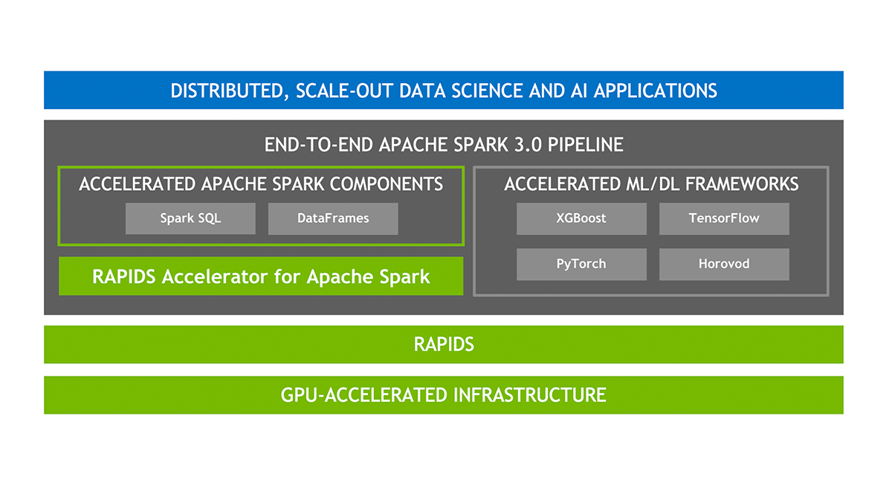
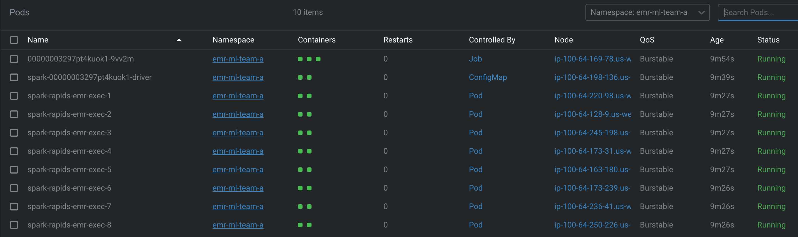
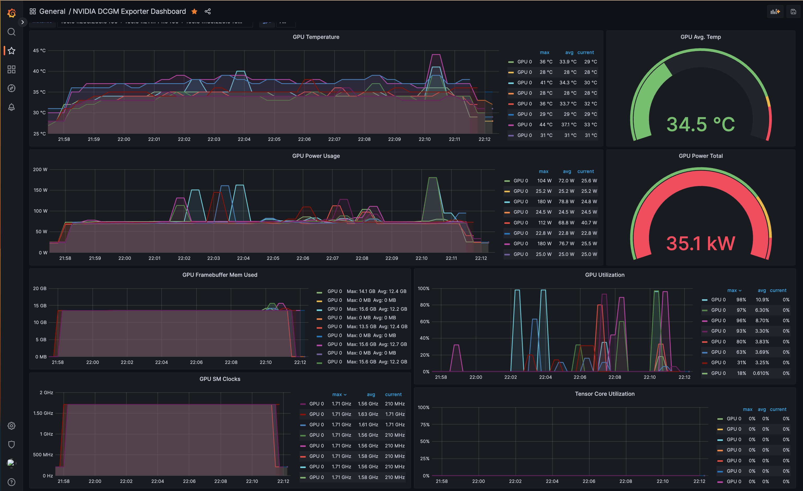

import CollapsibleContent from '../../../../../../src/components/CollapsibleContent';

# EMR on EKS NVIDIA RAPIDS Accelerator for Apache Spark

NVIDIA RAPIDS Accelerator for Apache Spark 是一个强大的工具，它建立在 NVIDIA CUDA® 的功能之上 - 这是一个变革性的并行计算平台，专为增强 NVIDIA GPU 架构上的计算过程而设计。RAPIDS 是 NVIDIA 开发的一个项目，包含一套基于 CUDA 的开源库，从而实现 GPU 加速的数据科学工作流程。

随着 Spark 3 的 RAPIDS Accelerator 的发明，NVIDIA 成功地通过显著提高 Spark SQL 和 DataFrame 操作的效率来革命化提取、转换和加载管道。通过合并 RAPIDS cuDF 库的功能和 Spark 分布式计算生态系统的广泛覆盖，RAPIDS Accelerator for Apache Spark 提供了处理大规模计算的强大解决方案。

此外，RAPIDS Accelerator 库集成了由 UCX 优化的高级洗牌，可以配置为支持 GPU 到 GPU 通信和 RDMA 功能，从而进一步提升其性能。



### EMR 对 NVIDIA RAPIDS Accelerator for Apache Spark 的支持
Amazon EMR 与 NVIDIA RAPIDS Accelerator for Apache Spark 的集成​ Amazon EMR on EKS 现在扩展其支持，包括使用 GPU 实例类型与 NVIDIA RAPIDS Accelerator for Apache Spark。随着人工智能 (AI) 和机器学习 (ML) 在数据分析领域的持续扩展，对快速且成本高效的数据处理需求不断增加，而 GPU 可以提供这种能力。NVIDIA RAPIDS Accelerator for Apache Spark 使用户能够利用 GPU 的卓越性能，从而实现大幅的基础设施成本节约。

### 功能
- 突出功能​ 在数据准备任务中体验性能提升，让您能够快速过渡到管道的后续阶段。这不仅加速了模型训练，还解放了数据科学家和工程师，让他们专注于优先任务。

- Spark 3 确保端到端管道的无缝协调 - 从数据摄取，通过模型训练，到可视化。同样的 GPU 加速设置可以同时服务于 Spark 和机器学习或深度学习框架。这消除了对离散集群的需求，并为整个管道提供 GPU 加速。

- Spark 3 在 Catalyst 查询优化器中扩展了对列式处理的支持。RAPIDS Accelerator 可以插入此系统以加速 SQL 和 DataFrame 操作符。当查询计划执行时，这些操作符可以利用 Spark 集群中的 GPU 来提高性能。

- NVIDIA 引入了一个创新的 Spark 洗牌实现，旨在优化 Spark 任务之间的数据交换。这个洗牌系统建立在 GPU 增强的通信库之上，包括 UCX、RDMA 和 NCCL，显著提高了数据传输速率和整体性能。

<CollapsibleContent header={<h2><span>部署解决方案</span></h2>}>

:::warning
在部署此蓝图之前，重要的是要了解使用 GPU 实例相关的成本。该蓝图设置了八个 g5.2xlarge GPU 实例来训练数据集，使用 NVIDIA Spark-RAPIDS 加速器。请务必相应地评估和规划这些成本。
:::

在这个[示例](https://github.com/awslabs/data-on-eks/tree/main/ai-ml/emr-spark-rapids)中，您将配置运行 XGBoost Spark RAPIDS Accelerator 作业所需的以下资源，使用 [Fannie Mae 的单户贷款性能数据](https://capitalmarkets.fanniemae.com/credit-risk-transfer/single-family-credit-risk-transfer/fannie-mae-single-family-loan-performance-data)。

此示例部署以下资源

- 创建新的示例 VPC、2 个私有子网和 2 个公有子网
- 为公有子网创建互联网网关，为私有子网创建 NAT 网关
- 创建具有公共端点的 EKS 集群控制平面（仅用于演示目的），包含核心托管节点组、Spark 驱动程序节点组和用于 ML 工作负载的 GPU Spot 节点组
- 用于 Spark 驱动程序和 Spark 执行器 GPU 节点组的 Ubuntu EKS AMI
- 部署 NVIDIA GPU Operator helm 附加组件
- 部署 Metrics server、Cluster Autoscaler、Karpenter、Grafana、AMP 和 Prometheus server
- 启用 EMR on EKS
  - 为数据团队创建两个命名空间（`emr-ml-team-a`、`emr-ml-team-b`）
  - 为两个命名空间创建 Kubernetes 角色和角色绑定（`emr-containers` 用户）
  - 两个团队作业执行所需的 IAM 角色
  - 使用 `emr-containers` 用户和 `AWSServiceRoleForAmazonEMRContainers` 角色更新 `AWS_AUTH` 配置映射
  - 在作业执行角色和 EMR 托管服务账户的身份之间创建信任关系
  - 为 `emr-ml-team-a` 和 `emr-ml-team-b` 创建 EMR 虚拟集群和 IAM 策略

### 先决条件

确保您已在计算机上安装了以下工具。

1. [aws cli](https://docs.aws.amazon.com/cli/latest/userguide/install-cliv2.html)
2. [kubectl](https://Kubernetes.io/docs/tasks/tools/)
3. [terraform](https://learn.hashicorp.com/tutorials/terraform/install-cli)

### 部署

克隆存储库

```bash
git clone https://github.com/awslabs/data-on-eks.git
```

导航到示例目录之一并运行 `install.sh` 脚本

```bash
cd data-on-eks/ai-ml/emr-spark-rapids/ && chmod +x install.sh
./install.sh
```

### 验证资源

验证 Amazon EKS 集群和 Amazon Managed service for Prometheus

```bash
aws eks describe-cluster --name emr-spark-rapids
```

```bash
# 创建 k8s 配置文件以与 EKS 进行身份验证
aws eks --region us-west-2 update-kubeconfig --name emr-spark-rapids

kubectl get nodes # 输出显示 EKS 托管节点组节点

# 验证 EMR on EKS 命名空间 `emr-ml-team-a` 和 `emr-ml-team-b`
kubectl get ns | grep emr-ml-team
```

```bash
kubectl get pods --namespace=gpu-operator

# 运行一个节点的 GPU 节点组的输出示例

    NAME                                                              READY   STATUS
    gpu-feature-discovery-7gccd                                       1/1     Running
    gpu-operator-784b7c5578-pfxgx                                     1/1     Running
    nvidia-container-toolkit-daemonset-xds6r                          1/1     Running
    nvidia-cuda-validator-j2b42                                       0/1     Completed
    nvidia-dcgm-exporter-vlttv                                        1/1     Running
    nvidia-device-plugin-daemonset-r5m7z                              1/1     Running
    nvidia-device-plugin-validator-hg78p                              0/1     Completed
    nvidia-driver-daemonset-6s9qv                                     1/1     Running
    nvidia-gpu-operator-node-feature-discovery-master-6f78fb7cbx79z   1/1     Running
    nvidia-gpu-operator-node-feature-discovery-worker-b2f6b           1/1     Running
    nvidia-gpu-operator-node-feature-discovery-worker-dc2pq           1/1     Running
    nvidia-gpu-operator-node-feature-discovery-worker-h7tpq           1/1     Running
    nvidia-gpu-operator-node-feature-discovery-worker-hkj6x           1/1     Running
    nvidia-gpu-operator-node-feature-discovery-worker-zjznr           1/1     Running
    nvidia-operator-validator-j7lzh                                   1/1     Running
```

</CollapsibleContent>

### 启动 XGBoost Spark 作业

#### 训练数据集
Fannie Mae 的单户贷款性能数据拥有从 2013 年开始的综合数据集。它为 Fannie Mae 单户业务部分的信贷表现提供了宝贵的见解。该数据集旨在帮助投资者更好地了解 Fannie Mae 拥有或担保的单户贷款的信贷表现。

#### 步骤 1：构建自定义 Docker 镜像

- 要从位于 `us-west-2` 的 EMR on EKS ECR 存储库中拉取 Spark Rapids 基础镜像，请登录：

```bash
aws ecr get-login-password --region us-west-2 | docker login --username AWS --password-stdin 895885662937.dkr.ecr.us-west-2.amazonaws.com
```

如果您位于不同的区域，请参考：此[指南](https://docs.aws.amazon.com/emr/latest/EMR-on-EKS-DevelopmentGuide/docker-custom-images-tag.html)。

- 要在本地构建 Docker 镜像，请使用以下命令：

使用提供的 `Dockerfile` 构建自定义 Docker 镜像。为镜像选择一个标签，例如 0.10。

:::info
请注意，构建过程可能需要一些时间，具体取决于您的网络速度。请记住，生成的镜像大小约为 `23.5GB`。
:::

```bash
cd ~/data-on-eks/ai-ml/emr-spark-rapids/examples/xgboost
docker build -t emr-6.10.0-spark-rapids-custom:0.10 -f Dockerfile .
```

- 将 `<ACCOUNTID>` 替换为您的 AWS 账户 ID。使用以下命令登录到您的 ECR 存储库：

```bash
aws ecr get-login-password --region us-west-2 | docker login --username AWS --password-stdin <ACCOUNTID>.dkr.ecr.us-west-2.amazonaws.com
```

- 要将 Docker 镜像推送到 ECR，请使用：

```bash
$ docker tag emr-6.10.0-spark-rapids-custom:0.10 <ACCOUNT_ID>.dkr.ecr.us-west-2.amazonaws.com/emr-6.10.0-spark-rapids-custom:0.10
$ docker push <ACCOUNT_ID>.dkr.ecr.us-west-2.amazonaws.com/emr-6.10.0-spark-rapids-custom:0.10
```

您可以在 `步骤3` 的作业执行期间使用此镜像。

### 步骤2：获取输入数据（Fannie Mae 的单户贷款性能数据）

此数据集来源于 [Fannie Mae 的单户贷款性能数据](http://www.fanniemae.com/portal/funding-the-market/data/loan-performance-data.html)。所有权利由 Fannie Mae 持有。

1. 访问 [Fannie Mae](https://capitalmarkets.fanniemae.com/credit-risk-transfer/single-family-credit-risk-transfer/fannie-mae-single-family-loan-performance-data) 网站
2. 点击 [单户贷款性能数据](https://datadynamics.fanniemae.com/data-dynamics/?&_ga=2.181456292.2043790680.1657122341-289272350.1655822609#/reportMenu;category=HP)
    - 如果您是第一次使用该网站，请注册为新用户
    - 使用凭据登录
3. 选择 [HP](https://datadynamics.fanniemae.com/data-dynamics/#/reportMenu;category=HP)
4. 点击 `下载数据` 并选择 `单户贷款性能数据`
5. 您将找到基于年份和季度排序的 `获取和性能` 文件的表格列表。点击文件进行下载。您可以下载三年（2020、2021 和 2022 - 每年 4 个文件，每个季度一个）的数据，这些数据将在我们的示例作业中使用。例如：2017Q1.zip
6. 解压下载的文件以将 csv 文件提取到本地计算机。例如：2017Q1.csv
7. 仅将 CSV 文件复制到 S3 存储桶的 `${S3_BUCKET}/${EMR_VIRTUAL_CLUSTER_ID}/spark-rapids-emr/input/fannie-mae-single-family-loan-performance/` 下。下面的示例使用三年的数据（每个季度一个文件，总共 12 个文件）。注意：`${S3_BUCKET}` 和 `${EMR_VIRTUAL_CLUSTER_ID}` 值可以从 Terraform 输出中提取。

```
 aws s3 ls s3://emr-spark-rapids-<aws-account-id>-us-west-2/949wt7zuphox1beiv0i30v65i/spark-rapids-emr/input/fannie-mae-single-family-loan-performance/
    2023-06-24 21:38:25 2301641519 2000Q1.csv
    2023-06-24 21:38:25 9739847213 2020Q2.csv
    2023-06-24 21:38:25 10985541111 2020Q3.csv
    2023-06-24 21:38:25 11372073671 2020Q4.csv
    2023-06-23 16:38:36 9603950656 2021Q1.csv
    2023-06-23 16:38:36 7955614945 2021Q2.csv
    2023-06-23 16:38:36 5365827884 2021Q3.csv
    2023-06-23 16:38:36 4390166275 2021Q4.csv
    2023-06-22 19:20:08 2723499898 2022Q1.csv
    2023-06-22 19:20:08 1426204690 2022Q2.csv
    2023-06-22 19:20:08  595639825 2022Q3.csv
    2023-06-22 19:20:08  180159771 2022Q4.csv
```

### 步骤3：运行 EMR Spark XGBoost 作业

在这里，我们将使用一个辅助 shell 脚本来执行作业。此脚本需要用户输入。

此脚本将询问您可以从 Terraform 输出中获得的某些输入。请参见下面的示例。

```bash
cd ai-ml/emr-spark-rapids/examples/xgboost/ && chmod +x execute_spark_rapids_xgboost.sh
./execute_spark_rapids_xgboost.sh

# 下面显示的示例输入
    Did you copy the fannie-mae-single-family-loan-performance data to S3 bucket(y/n): y
    Enter the customized Docker image URI: public.ecr.aws/o7d8v7g9/emr-6.10.0-spark-rapids:0.11
    Enter EMR Virtual Cluster AWS Region: us-west-2
    Enter the EMR Virtual Cluster ID: 949wt7zuphox1beiv0i30v65i
    Enter the EMR Execution Role ARN: arn:aws:iam::<ACCOUNTID>:role/emr-spark-rapids-emr-eks-data-team-a
    Enter the CloudWatch Log Group name: /emr-on-eks-logs/emr-spark-rapids/emr-ml-team-a
    Enter the S3 Bucket for storing PySpark Scripts, Pod Templates, Input data and Output data.<bucket-name>: emr-spark-rapids-<ACCOUNTID>-us-west-2
    Enter the number of executor instances (4 to 8): 8
```

验证 Pod 状态



:::info
请注意，第一次执行可能需要更长时间，因为它需要为 EMR 作业 Pod、驱动程序和执行器 Pod 下载镜像。每个 Pod 可能需要长达 8 分钟来下载 Docker 镜像。由于镜像缓存，后续运行应该更快（通常在 30 秒内）
:::

### 步骤4：验证作业结果

- 登录以从 CloudWatch 日志或您的 S3 存储桶检查 Spark 驱动程序 Pod 日志。

以下是日志文件的示例输出：

```
/emr-on-eks-logs/emr-spark-rapids/emr-ml-team-a
spark-rapids-emr/949wt7zuphox1beiv0i30v65i/jobs/0000000327fe50tosa4/containers/spark-0000000327fe50tosa4/spark-0000000327fe50tosa4-driver/stdout
```

以下是上述日志文件的示例输出：

    Raw Dataframe CSV Rows count : 215386024
    Raw Dataframe Parquet Rows count : 215386024
    ETL takes 222.34674382209778

    Training takes 95.90932035446167 seconds
    If features_cols param set, then features_col param is ignored.

    Transformation takes 63.999391317367554 seconds
    +--------------+--------------------+--------------------+----------+
    |delinquency_12|       rawPrediction|         probability|prediction|
    +--------------+--------------------+--------------------+----------+
    |             0|[10.4500541687011...|[0.99997103214263...|       0.0|
    |             0|[10.3076572418212...|[0.99996662139892...|       0.0|
    |             0|[9.81707763671875...|[0.99994546175003...|       0.0|
    |             0|[9.10498714447021...|[0.99988889694213...|       0.0|
    |             0|[8.81903457641601...|[0.99985212087631...|       0.0|
    +--------------+--------------------+--------------------+----------+
    only showing top 5 rows

    Evaluation takes 3.8372223377227783 seconds
    Accuracy is 0.996563056111921

### Fannie Mae 单一贷款性能数据集的 ML 管道

**步骤1**：预处理和清理数据集以处理缺失值、分类变量和其他数据不一致性。这可能涉及数据插补、独热编码和数据标准化等技术。

**步骤2**：从现有特征创建额外特征，这些特征可能为预测贷款性能提供更有用的信息。例如，您可以提取贷款价值比、借款人信用评分范围或贷款发放年份等特征。

**步骤3**：将数据集分为两部分：一部分用于训练 XGBoost 模型，另一部分用于评估其性能。这使您能够评估模型对未见数据的泛化能力。

**步骤4**：将训练数据集输入 XGBoost 以训练模型。XGBoost 将分析贷款属性及其相应的贷款性能标签，以学习它们之间的模式和关系。目标是根据给定特征预测贷款是否可能违约或表现良好。

**步骤5**：一旦模型训练完成，使用评估数据集来评估其性能。这涉及分析准确性、精确度、召回率或接收器操作特征曲线下面积 (AUC-ROC) 等指标，以衡量模型预测贷款性能的能力。

**步骤6**：如果性能不令人满意，您可以调整 XGBoost 超参数，如学习率、树深度或正则化参数，以提高模型的准确性或解决过拟合等问题。

**步骤7**：最后，使用训练和验证的 XGBoost 模型，您可以使用它对新的、未见的贷款数据进行预测。这些预测可以帮助识别与贷款违约相关的潜在风险或评估贷款性能。


### 使用 DCGM Exporter、Prometheus 和 Grafana 进行 GPU 监控

可观察性在管理和优化 GPU 等硬件资源方面发挥着至关重要的作用，特别是在 GPU 利用率很高的机器学习工作负载中。实时监控 GPU 使用情况、识别趋势和检测异常的能力可以显著影响性能调优、故障排除和高效资源利用。

[NVIDIA GPU Operator](https://github.com/NVIDIA/gpu-operator) 在 GPU 可观察性中发挥关键作用。它自动化部署在 Kubernetes 上运行 GPU 工作负载所需的组件。其组件之一，[DCGM (Data Center GPU Manager) Exporter](https://docs.nvidia.com/datacenter/cloud-native/gpu-telemetry/latest/index.html)，是一个开源项目，以 Prometheus（领先的开源监控解决方案）可以摄取的格式导出 GPU 指标。这些指标包括 GPU 温度、内存使用情况、GPU 利用率等。DCGM Exporter 允许您按 GPU 监控这些指标，提供对 GPU 资源的细粒度可见性。

NVIDIA GPU Operator 与 DCGM Exporter 结合，将 GPU 指标导出到 Prometheus 服务器。凭借其灵活的查询语言，Prometheus 允许您切片和切块数据以生成对资源使用模式的洞察。

然而，Prometheus 并非为长期数据存储而设计。这就是 [Amazon Managed Service for Prometheus (AMP)](https://aws.amazon.com/prometheus/) 发挥作用的地方。它为 Prometheus 提供完全托管、安全且可扩展的服务，使您能够轻松地大规模分析操作数据，而无需管理底层基础设施。

可视化这些指标和创建信息丰富的仪表板是 Grafana 擅长的地方。Grafana 是一个用于监控和可观察性的开源平台，提供丰富的可视化来直观地表示收集的指标。与 Prometheus 结合时，Grafana 可以以用户友好的方式显示 DCGM Exporter 收集的 GPU 指标。

NVIDIA GPU Operator 配置为将指标导出到 Prometheus 服务器，然后将这些指标远程写入 Amazon Managed Prometheus (AMP)。作为用户，您可以登录到作为蓝图一部分部署的 Grafana WebUI，并将 AMP 添加为数据源。之后，您可以导入开源 [GPU 监控仪表板](https://grafana.com/grafana/dashboards/12239-nvidia-dcgm-exporter-dashboard/)，该仪表板以易于理解的格式呈现 GPU 指标，促进实时性能监控和资源优化。

1. **NVIDIA GPU Operator**：安装在您的 Kubernetes 集群上，NVIDIA GPU Operator 负责管理 GPU 资源的生命周期。它在每个配备 GPU 的节点上部署 NVIDIA 驱动程序和 DCGM Exporter。
2. **DCGM Exporter**：DCGM Exporter 在每个节点上运行，收集 GPU 指标并将其暴露给 Prometheus。
3. **Prometheus**：Prometheus 是一个时间序列数据库，从各种来源（包括 DCGM Exporter）收集指标。它定期从导出器拉取指标并存储它们。在此设置中，您将配置 Prometheus 将收集的指标远程写入 AMP。
4. **Amazon Managed Service for Prometheus (AMP)**：AMP 是 AWS 提供的完全托管的 Prometheus 服务。它负责 Prometheus 数据的长期存储、可扩展性和安全性。
5. **Grafana**：Grafana 是一个可视化工具，可以查询 AMP 以获取收集的指标，并在信息丰富的仪表板上显示它们。

在此蓝图中，我们利用 DCGM 将 GPU 指标写入 Prometheus 和 Amazon Managed Prometheus (AMP)。要验证 GPU 指标，您可以通过运行以下命令使用 Grafana：

```bash
kubectl port-forward svc/grafana 3000:80 -n grafana
```

使用 `admin` 作为用户名登录 Grafana，并使用以下 AWS CLI 命令从 Secrets Manager 检索密码：

```bash
aws secretsmanager get-secret-value --secret-id emr-spark-rapids-grafana --region us-west-2
```

登录后，将 AMP 数据源添加到 Grafana 并导入开源 GPU 监控仪表板。然后，您可以探索指标并使用 Grafana 仪表板可视化它们，如下面的屏幕截图所示。



<CollapsibleContent header={<h2><span>清理</span></h2>}>

此脚本将使用 `-target` 选项清理环境，以确保所有资源按正确顺序删除。

```bash
cd data-on-eks/ai-ml/emr-spark-rapids/ && chmod +x cleanup.sh
./cleanup.sh
```

</CollapsibleContent>

:::caution
为避免对您的 AWS 账户产生不必要的费用，请删除在此部署期间创建的所有 AWS 资源
:::
