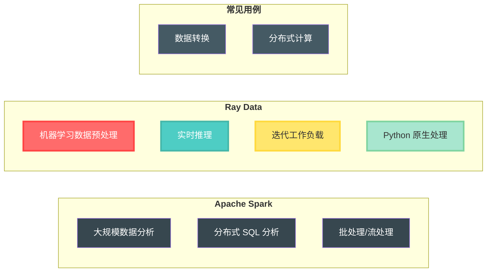
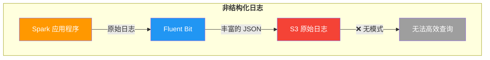
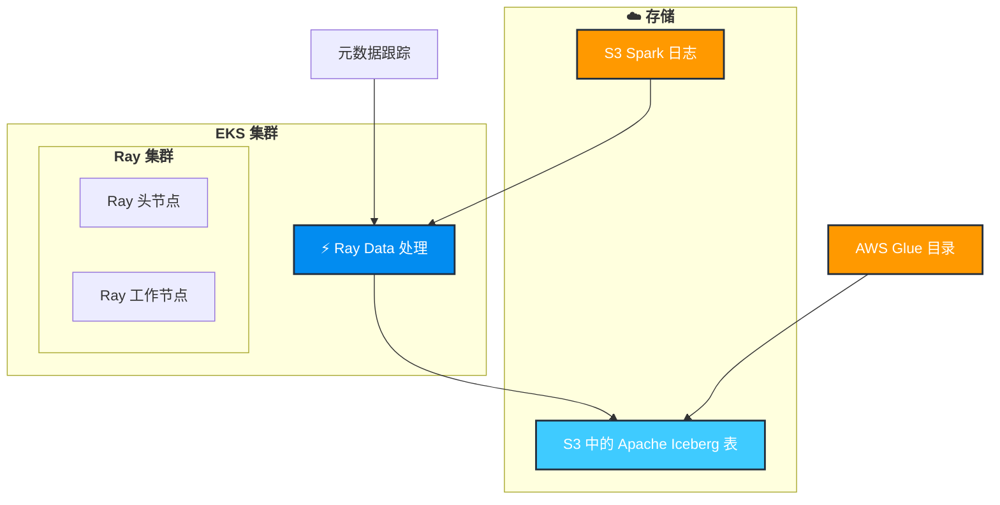

import Tabs from '@theme/Tabs';
import TabItem from '@theme/TabItem';
import CollapsibleContent from '../../../../../../src/components/CollapsibleContent';

# 使用 Ray Data 进行分布式数据处理

## 什么是 Ray Data？

[Ray Data](https://docs.ray.io/en/latest/data/data.html) 是一个可扩展的、框架无关的数据处理库，构建在 Ray 之上，专为分布式数据分析和机器学习工作负载而设计。它提供：

- **分布式处理**：跨多个 Ray 工作节点的并行数据处理
- **惰性求值**：操作被优化并仅在需要结果时执行
- **丰富的数据连接器**：对各种数据源的原生支持，包括 S3、数据库和文件系统
- **内存管理**：高效处理不适合内存的大型数据集
- **与机器学习库集成**：与 pandas、NumPy 和 PyArrow 无缝集成

## 为什么选择 Ray Data？这是 Spark 的替代工具吗？

Ray Data 是 **Spark 的补充**，而不是直接替代品。虽然两者都是分布式数据处理框架，但它们服务于不同的用例：



**Ray Data 在以下情况下表现出色：**
- 使用熟悉的 pandas/NumPy API 进行 Python 原生数据处理
- 与机器学习管道紧密集成
- 实时或流数据处理
- 复杂的迭代算法

**Spark 仍然是以下场景的理想选择：**
- 大规模 ETL 操作
- 复杂的基于 SQL 的分析
- 企业数据仓库工作负载
- 跨语言支持（Scala、Java、Python、R）

### 问题陈述

当 Apache Spark 应用程序在 Kubernetes 上运行时，它们会生成大量日志，这些日志由 Fluent Bit 捕获并写入 S3。然而，这些日志给数据工程师带来了几个挑战：

1. **非结构化格式**：Spark 日志以原始文本文件形式写入，没有一致的模式
2. **无查询能力**：工程师无法使用基于 SQL 的工具（如 Amazon Athena）轻松查询日志
3. **元数据丰富**：Fluent Bit 将 Kubernetes 元数据添加为 JSON，创建混合格式
4. **性能问题**：扫描原始日志文件进行故障排除既耗时又昂贵



**解决方案**：使用 Ray Data 定期处理这些非结构化日志，应用一致的模式，并将它们写入 Apache Iceberg 表。这使得：
- ✅ 通过 Amazon Athena 进行 SQL 查询
- ✅ 具有定义模式的结构化数据
- ✅ 高效的列式存储格式
- ✅ 时间旅行和版本控制功能

### 处理前 S3 中的日志片段

以下是 Fluent Bit 写入 S3 时 Spark 日志的样子：

```json
{
  "log": "2024-01-15 14:23:45 INFO SparkContext: Running Spark version 3.5.0\n",
  "stream": "stdout",
  "time": "2024-01-15T14:23:45.123456Z",
  "kubernetes": {
    "pod_name": "spark-driver-abc123",
    "namespace_name": "spark-team-a",
    "pod_id": "12345678-1234-1234-1234-123456789012",
    "labels": {
      "spark-role": "driver",
      "spark-app-id": "spark-application-12345"
    },
    "container_name": "spark-driver",
    "container_image": "spark:3.5.0"
  }
}
{
  "log": "2024-01-15 14:23:46 INFO ResourceUtils: Using Spark's default log4j profile\n",
  "stream": "stdout",
  "time": "2024-01-15T14:23:46.234567Z",
  "kubernetes": {
    "pod_name": "spark-driver-abc123",
    "namespace_name": "spark-team-a",
    "pod_id": "12345678-1234-1234-1234-123456789012",
    "labels": {
      "spark-role": "driver",
      "spark-app-id": "spark-application-12345"
    },
    "container_name": "spark-driver",
    "container_image": "spark:3.5.0"
  }
}
```

**主要挑战：**

- 每个日志行都包装在带有 Kubernetes 元数据的 JSON 中
- 实际的日志消息嵌入在 `log` 字段中
- 没有用于查询特定日志级别或组件的结构化模式
- 每个日志行重复冗余元数据

:::info Fluent Bit 丰富
Fluent Bit 自动使用 Kubernetes 元数据丰富每个日志行，包括 pod 名称、命名空间、标签和容器信息。此丰富在 [aws-for-fluentbit-values.yaml](https://github.com/awslabs/data-on-eks/blob/main/analytics/terraform/spark-k8s-operator/helm-values/aws-for-fluentbit-values.yaml) 文件中配置。虽然此元数据对调试很有价值，但它创建了难以高效查询的混合格式。
:::

## 📋 架构概述

### Ray Data 如何转换日志处理

Ray Data 定期从 S3 获取新日志，并行处理它们，并将结构化数据写入 Apache Iceberg 表。解决方案包括：



### Ray Data 处理的关键功能

#### 📊 **模式提取和解析**

Ray Data 智能地从非结构化日志中提取结构化字段：

- 🕐 **`timestamp`** - 从日志消息中解析
- 🏷️ **`log_level`** - 提取级别（INFO、WARN、ERROR、DEBUG）
- 🔧 **`component`** - Spark 组件（SparkContext、ResourceUtils 等）
- 📝 **`message`** - 实际日志内容
- 🏠 **`pod_name`** & **`namespace`** - 来自 Kubernetes 元数据
- 👷 **`spark_role`** - 驱动程序或执行器标识
- 🆔 **`application_id`** - 唯一的 Spark 应用程序标识符

#### 🔍 **智能过滤和查询**

处理后，您可以使用 SQL 轻松查询日志：

```sql
-- 查找特定应用程序的所有 ERROR 日志
SELECT timestamp, component, message
FROM spark_logs
WHERE log_level = 'ERROR'
  AND application_id = 'spark-application-12345'
  AND timestamp > '2024-01-15 00:00:00'
ORDER BY timestamp DESC;

-- 按组件分析日志模式
SELECT component, log_level, COUNT(*) as count
FROM spark_logs
WHERE namespace = 'spark-team-a'
GROUP BY component, log_level
ORDER BY count DESC;

-- 跟踪应用程序生命周期事件
SELECT timestamp, message
FROM spark_logs
WHERE component = 'SparkContext'
  AND (message LIKE '%Starting%' OR message LIKE '%Stopping%')
ORDER BY timestamp;
```

#### 🎯 **元数据管理**

- ✅ **幂等处理** - 跟踪已处理的文件夹以避免重复处理
- 📋 **元数据表** - 维护处理历史和状态
- 🔄 **自动发现** - 自动查找 S3 中的新日志文件夹
- ⚡ **增量更新** - 仅处理新数据以提高效率

## 🚀 入门指南

### 先决条件

在部署此蓝图之前，请确保您具有：

- ✅ **包含 Spark 应用程序日志的 S3 存储桶**：按照 [Spark Operator 蓝图](https://awslabs.github.io/data-on-eks/docs/blueprints/data-analytics/spark-operator-yunikorn) 生成 Spark 日志。
  **注意：** 执行 **使用 Karpenter 执行示例 Spark 作业** 步骤中的 **将示例数据放入 S3** 部分的步骤，以使用 Spark 应用程序日志填充 S3 存储桶。
- ✅ **配置了适当权限的 AWS CLI**
- ✅ kubectl
- ✅ **已安装 Terraform**（>= 1.0）

:::tip 首先生成 Spark 日志
Ray Data 管道处理 Spark 应用程序日志。确保您已从 [Spark Operator 蓝图](https://awslabs.github.io/data-on-eks/docs/blueprints/data-analytics/spark-operator-yunikorn#put-sample-data-in-s3) 运行出租车行程示例，以使用日志填充您的 S3 存储桶。

📁 **S3 中的 Spark 日志文件结构：**
```
s3://${S3_BUCKET}/
└── spark-application-logs/
    └── spark-team-a/
        ├── spark-application-1234567890-driver/
        │   └── stdout
        ├── spark-application-1234567890-exec-1/
        │   └── stdout
        └── spark-application-1234567890-exec-2/
            └── stdout
```

每个 `stdout` 文件包含来自 Fluent Bit 的 Kubernetes 元数据丰富的 JSON 格式日志。
:::

### 步骤 1：启用 Ray Data 处理

通过启用 `enable_raydata` 变量部署带有 Ray Data 组件的 EKS 集群。这将安装：
- **KubeRay Operator** - 在 Kubernetes 上管理 Ray 集群
- **Ray 自定义资源** - RayJob 和 RayCluster CRD
- **AWS 资源** - IAM 角色、S3 访问策略和 Glue 数据库
- **Ray Data 管道** - 命名空间、服务账户和 RBAC

<Tabs>
<TabItem value="terraform" label="使用 Terraform">

```bash
cd analytics/terraform/spark-k8s-operator

# 部署启用 Ray Data 支持的 EKS 集群
export TF_VAR_enable_raydata=true

terraform init
terraform plan
terraform apply -auto-approve
```

</TabItem>
<TabItem value="install-script" label="使用安装脚本">

```bash
cd analytics/terraform/spark-k8s-operator

# 设置环境变量并运行安装脚本
export TF_VAR_enable_raydata=true

./install.sh
```

</TabItem>
</Tabs>

:::info 部署时间
完整部署大约需要 20-25 分钟来创建 EKS 集群、安装操作器并配置所有 Ray Data 组件。
:::

此部署创建：
- 🎯 **KubeRay Operator** 用于 Ray 作业编排
- 🔐 **Ray 服务账户** 与 IRSA（服务账户的 IAM 角色）
- 📝 **IAM 角色** 具有 S3 和 Glue 权限
- 📊 **AWS Glue 数据库** 用于 Iceberg 目录
- 🌐 **Kubernetes 命名空间**（`raydata`）

### 步骤 2：验证 KubeRay Operator 安装

确认 KubeRay Operator 成功运行：

```bash
kubectl get po -n kuberay-operator
```

预期输出：
```
NAME                                READY   STATUS    RESTARTS   AGE
kuberay-operator-74fcdcc6bf-gpl5p   1/1     Running   0          10h
```

### 步骤 3：配置 Ray 作业

导航到示例目录并在部署脚本中更新 S3 配置。

```bash
cd examples/raydata-sparklogs-processing-job
```

在运行之前，在 `execute-rayjob.sh` shell 脚本中替换 **S3_BUCKET**、**CLUSTER_NAME** 和 **AWS_REGION** 变量。

### 步骤 4：部署 Ray 集群并执行 Ray 作业

```bash
# 使脚本可执行
chmod +x execute-rayjob.sh

# 部署处理作业
./execute-rayjob.sh deploy
```

## 📊 监控 RayJob 部署

### 检查作业状态

使用这些命令监控您的 Ray 作业：

```bash
# 实时监控作业进度
./execute-rayjob.sh monitor

# 检查当前状态
./execute-rayjob.sh status

# 查看处理日志
./execute-rayjob.sh logs

```

#### 检查 RayJob 日志

```text
2025-07-27 22:04:46,324 - spark-log-processor - INFO - ✅ Successfully processed 1287 records from spark-fb094270bf654473b372d0f773e86687
2025-07-27 22:04:46,324 - spark-log-processor - INFO - 🎯 Processing Summary:
2025-07-27 22:04:46,324 - spark-log-processor - INFO -   📊 Total records processed: 1287
2025-07-27 22:04:46,324 - spark-log-processor - INFO -   ✅ Successful folders: 1
2025-07-27 22:04:46,324 - spark-log-processor - INFO -   ❌ Failed folders: 0
2025-07-27 22:04:46,324 - spark-log-processor - INFO -   ✅ Successfully processed: ['spark-fb094270bf654473b372d0f773e86687']
2025-07-27 22:04:46,324 - spark-log-processor - INFO - ✅ Metadata-driven incremental processing completed
```

:::tip 幕后发生了什么？

当您部署 RayJob 时，会发生以下自动化过程：

1. **🚀 Ray 集群初始化** - KubeRay Operator 创建带有头节点和工作节点的 Ray 集群
2. **🔍 S3 发现** - Ray Data 扫描配置的 S3 存储桶路径以查找匹配 `spark-*` 模式的文件夹
3. **📊 元数据检查** - 查询 Iceberg 元数据表以识别未处理的文件夹
4. **📥 并行处理** - Ray 工作器并行从 S3 读取 JSON 日志文件
5. **🔄 数据转换** - 从 JSON 日志中提取结构化字段（时间戳、日志级别、组件等）
6. **✍️ Iceberg 写入** - 使用 ACID 保证将转换后的数据写入 Apache Iceberg 表
7. **📝 元数据更新** - 在元数据表中记录处理状态以确保幂等性
8. **🎯 完成** - 成功处理后关闭 Ray 集群

整个过程是**幂等的** - 您可以安全地重新运行它而不会重复数据，因为它只处理新的日志文件夹。
:::

### 访问 Ray 仪表板

<CollapsibleContent header={<h3>🎨 Ray 仪表板访问</h3>}>

```bash
# 获取仪表板访问信息
./execute-rayjob.sh dashboard

# 端口转发到本地机器
kubectl port-forward svc/spark-log-processor-head-svc 8265:8265 -n raydata
```

打开 http://localhost:8265 查看：
- 📈 作业执行进度
- 💻 资源利用率
- ⚡ 任务级指标
- 🌐 集群拓扑

</CollapsibleContent>

## ✅ 数据验证

### S3 存储桶结构

Ray Data 对输入 Spark 日志和输出 Iceberg 数据使用**相同的 S3 存储桶**，在单独的路径中组织：

```
s3://your-spark-logs-bucket/
├── spark-application-logs/           # 📥 输入：来自 Fluent Bit 的原始 Spark 日志
│   └── spark-team-a/
│       ├── spark-application-1234567890-driver/
│       │   └── stdout                # 带有 Kubernetes 元数据的 JSON 日志
│       ├── spark-application-1234567890-exec-1/
│       │   └── stdout
│       └── spark-application-1234567890-exec-2/
│           └── stdout
│
└── iceberg-warehouse/                # 📤 输出：处理后的 Iceberg 数据
    └── raydata_spark_logs.db/
        └── spark_logs/
            ├── metadata/             # Iceberg 元数据文件
            │   ├── 00000-xxx.metadata.json
            │   ├── snap-xxx.avro     # 时间旅行快照
            │   └── version-hint.text
            └── data/                 # Parquet 格式的实际数据
                ├── 00000-0-xxx.parquet
                ├── 00001-0-xxx.parquet
                └── ...
```

:::tip 相同存储桶，不同路径
- **输入路径**：`s3://bucket/spark-application-logs/` - 包含原始 JSON 日志
- **输出路径**：`s3://bucket/iceberg-warehouse/` - 包含结构化 Parquet 文件
- **存储格式**：Iceberg 使用高效的列式 Parquet 格式和用于 ACID 事务的元数据
:::

在 AWS S3 控制台中，它应该如下所示：


### RayData 处理后的日志片段

以下是 Ray Data 处理前后数据转换的样子：

<Tabs>
<TabItem value="before" label="处理前（原始 S3 JSON）">

**S3 中的原始 Fluent Bit 日志** - 每个日志行都包装在带有冗余元数据的 JSON 中：

```json
{
  "log": "2024-01-15 14:23:45 INFO SparkContext: Running Spark version 3.5.0\n",
  "stream": "stdout",
  "time": "2024-01-15T14:23:45.123456Z",
  "kubernetes": {
    "pod_name": "spark-driver-abc123",
    "namespace_name": "spark-team-a",
    "pod_id": "12345678-1234-1234-1234-123456789012",
    "labels": {
      "spark-role": "driver",
      "spark-app-id": "spark-application-12345"
    },
    "container_name": "spark-driver",
    "container_image": "spark:3.5.0"
  }
}
{
  "log": "2024-01-15 14:23:46 ERROR TaskSchedulerImpl: Lost executor 1: Container killed\n",
  "stream": "stderr",
  "time": "2024-01-15T14:23:46.234567Z",
  "kubernetes": {
    "pod_name": "spark-executor-def456",
    "namespace_name": "spark-team-a",
    "labels": {
      "spark-role": "executor",
      "spark-app-id": "spark-application-12345"
    }
  }
}
```

</TabItem>
<TabItem value="after" label="处理后（结构化 Iceberg）">

**Apache Iceberg 中的处理数据** - 为查询优化的清洁、结构化模式：

```sql
-- 查询处理后的数据
SELECT * FROM raydata_spark_logs.spark_logs LIMIT 2;
```

| timestamp | log_level | component | message | pod_name | namespace | spark_role | application_id |
|-----------|-----------|-----------|---------|----------|-----------|------------|----------------|
| 2024-01-15 14:23:45 | INFO | SparkContext | Running Spark version 3.5.0 | spark-driver-abc123 | spark-team-a | driver | spark-application-12345 |
| 2024-01-15 14:23:46 | ERROR | TaskSchedulerImpl | Lost executor 1: Container killed | spark-executor-def456 | spark-team-a | executor | spark-application-12345 |

**✅ 关键改进：**
- **结构化字段** - 易于查询特定日志级别、组件和时间范围
- **去重元数据** - 每个日志行没有冗余的 Kubernetes 元数据
- **列式存储** - 使用 Parquet 格式的高效存储和查询性能
- **模式演进** - 添加新字段而不破坏现有查询
- **ACID 事务** - 即使在并发处理期间也能保持一致的读取

</TabItem>
</Tabs>

### 选项 1：查询 Iceberg 表

使用蓝图中提供的内置数据验证脚本，该脚本自动设置 Python 虚拟环境和所有必需的依赖项：

```bash
# 使脚本可执行
chmod +x verify-iceberg-data.sh
```
在运行之前，在 `verify-iceberg-data.sh` shell 脚本中替换 **S3_BUCKET** 和 **AWS_REGION** 变量。

```bash
./verify-iceberg-data.sh
```

脚本自动...
- ✅ 创建隔离的 Python 虚拟环境
- ✅ 安装 PyIceberg 和所有依赖项（`pyiceberg[glue,s3fs]==0.7.0`）
- ✅ 连接到 AWS Glue 目录和 Iceberg 表
- ✅ 执行全面的数据验证
- ✅ 完成后清理临时文件和环境

<CollapsibleContent header={<h4>📋 示例脚本输出</h4>}>

```text
🔍 Connecting to Iceberg catalog...
✅ Connected to Iceberg catalog in region: us-west-2
📊 Loading table: raydata_spark_logs.spark_logs
✅ Table loaded successfully

📋 Table Schema:
  - timestamp: timestamp (optional)
  - log_level: string (optional)
  - message: string (optional)
  - pod_name: string (optional)
  - namespace_name: string (optional)
  - app: string (optional)
  - spark_app_selector: string (optional)
  - queue: string (optional)
  - spark_app_name: string (optional)
  - spark_role: string (optional)
  - spark_version: string (optional)
  - submission_id: string (optional)
  - container_name: string (optional)
  - container_image: string (optional)

🔍 Scanning table data...
✅ SUCCESS! Found 1287 records in Iceberg table

📋 Data Summary:
   📊 Total Records: 1287
   📅 Date Range: 2025-07-08 19:52:43.079161 to 2025-07-08 20:00:29.393901
   📱 Unique Pods: 5

📈 Log Level Distribution:
   INFO: 1269
   WARN: 14
   ERROR: 4

📝 Sample Records:

  Record 1:
    timestamp: 2025-07-08 19:52:43.079161
    log_level: WARN
    message: Unable to load native-hadoop library for your platform... using builtin-java classes where applicabl...

  Record 2:
    timestamp: 2025-07-08 19:52:43.460063
    log_level: WARN
    message: Cannot locate configuration: tried hadoop-metrics2-s3a-file-system.properties,hadoop-metrics2.proper...

  Record 3:
    timestamp: 2025-07-08 19:52:46.170113
    log_level: INFO
    message: Running Spark version 3.5.3

🎉 VERIFICATION SUCCESSFUL!
✅ Ray Data successfully processed and stored Spark logs in Iceberg format
✅ Data is accessible and queryable via PyIceberg
✅ You can now query this data using Amazon Athena or other SQL tools
[SUCCESS] Verification completed successfully!
==== Cleaning Up ====
[INFO] Removed verification script
[INFO] Removed virtual environment
[SUCCESS] Cleanup completed
```

</CollapsibleContent>

### 选项 2：使用 AWS CLI

在不查询数据的情况下检查表元数据：

```bash
# 在 Glue 目录中查看 Iceberg 表
aws glue get-table \
  --database-name raydata_spark_logs \
  --name spark_logs \
  --query 'Table.StorageDescriptor.Location'
```

## 🧹 清理

要清理资源：

```bash
# 仅删除 Ray 作业（保留基础设施）
./execute-rayjob.sh cleanup

# 删除所有基础设施
cd analytics/terraform/spark-k8s-operator
terraform destroy -var="enable_raydata_processing=true"
```

## 🌟 扩展您的数据管道

- **扩展处理**：在 `rayjob.yaml` 中调整 Ray 工作器数量以处理更大的工作负载
- **添加分析**：使用 Amazon QuickSight 或 Grafana 创建仪表板
- **自动化**：使用 Kubernetes CronJobs 安排定期处理
- **扩展**：处理其他数据类型，如指标、事件或应用程序数据

:::info 了解更多
- 📚 [Ray Data 文档](https://docs.ray.io/en/latest/data/data.html)
- 🧊 [Apache Iceberg 文档](https://iceberg.apache.org/)
- 🎯 [KubeRay 文档](https://ray-project.github.io/kuberay/)
- ☁️ [AWS Glue 目录](https://docs.aws.amazon.com/glue/latest/dg/catalog-and-crawler.html)
:::

此蓝图演示了 Ray Data 和 Apache Iceberg 如何协同工作，在 Amazon EKS 上构建可扩展、可靠的数据处理管道。这种组合提供了具有分布式处理能力、ACID 事务和智能元数据管理的现代数据湖架构。

<style>{`
.feature-grid {
  display: grid;
  grid-template-columns: repeat(auto-fit, minmax(250px, 1fr));
  gap: 1.5rem;
  margin: 2rem 0;
}

.feature-card {
  padding: 1.5rem;
  border: 1px solid var(--ifm-color-emphasis-300);
  border-radius: 8px;
  background: var(--ifm-background-surface-color);
  transition: transform 0.2s, box-shadow 0.2s;
}

.feature-card:hover {
  transform: translateY(-2px);
  box-shadow: 0 4px 12px rgba(0, 0, 0, 0.1);
}

.feature-card h3 {
  margin-top: 0;
  margin-bottom: 0.5rem;
  font-size: 1.2rem;
}

.feature-card p {
  margin: 0;
  color: var(--ifm-color-content-secondary);
}
`}</style>
