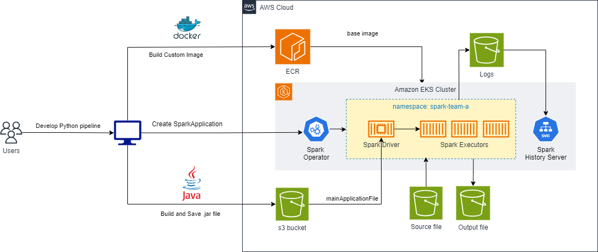

import Tabs from '@theme/Tabs';
import TabItem from '@theme/TabItem';
import CollapsibleContent from '../../../../../../src/components/CollapsibleContent';

import CodeBlock from '@theme/CodeBlock';

# 在 EKS 上使用 Spark 运行 Apache Beam 管道

[Apache Beam (Beam)](https://beam.apache.org/get-started/beam-overview/) 是一个灵活的编程模型，用于构建批处理和流数据处理管道。使用 Beam，开发人员可以编写一次代码并在各种执行引擎上运行，例如 *Apache Spark* 和 *Apache Flink*。这种灵活性允许组织利用不同执行引擎的优势，同时保持一致的代码库，减少管理多个代码库的复杂性并最小化供应商锁定的风险。

## EKS 上的 Beam

Kubernetes 的 Spark Operator 简化了在 Kubernetes 上部署和管理 Apache Spark。通过使用 Spark Operator，我们可以直接将 Apache Beam 管道作为 Spark 应用程序提交，并在 EKS 集群上部署和管理它们，利用 EKS 强大且托管的基础设施上的自动扩展和自愈能力等功能。

## 解决方案概述

在此解决方案中，我们将展示如何在带有 Spark Operator 的 EKS 集群上部署用 Python 编写的 Beam 管道。它使用来自 Apache Beam [github 存储库](https://github.com/apache/beam/tree/master/sdks/python)的示例管道。

## 部署 Beam 管道

<CollapsibleContent header={<h2>部署 Spark-Operator-on-EKS 解决方案</h2>}>

在这个[示例](https://github.com/awslabs/data-on-eks/tree/main/analytics/terraform/spark-k8s-operator)中，您将配置运行带有开源 Spark Operator 的 Spark 作业所需的以下资源。

它将运行 Spark K8s Operator 的 EKS 集群部署到新的 VPC 中。

- 创建新的示例 VPC、2 个私有子网、2 个公有子网，以及 RFC6598 空间（100.64.0.0/10）中用于 EKS Pod 的 2 个子网。
- 为公有子网创建互联网网关，为私有子网创建 NAT 网关
- 创建具有公共端点的 EKS 集群控制平面（仅用于演示目的），包含用于基准测试和核心服务的托管节点组，以及用于 Spark 工作负载的 Karpenter NodePool。
- 部署 Metrics server、Spark-operator、Apache Yunikorn、Karpenter、Grafana 和 Prometheus server。

### 先决条件

确保您已在计算机上安装了以下工具。

1. [aws cli](https://docs.aws.amazon.com/cli/latest/userguide/install-cliv2.html)
2. [kubectl](https://Kubernetes.io/docs/tasks/tools/)
3. [terraform](https://learn.hashicorp.com/tutorials/terraform/install-cli)

### 部署

克隆存储库。

</CollapsibleContent>
