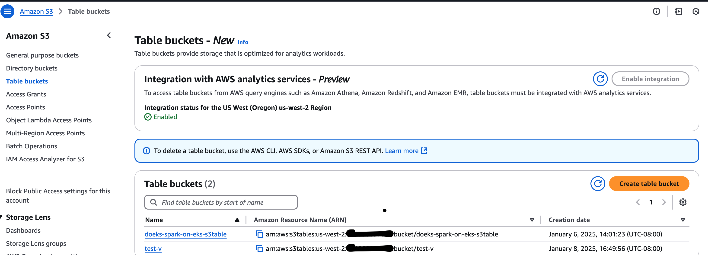
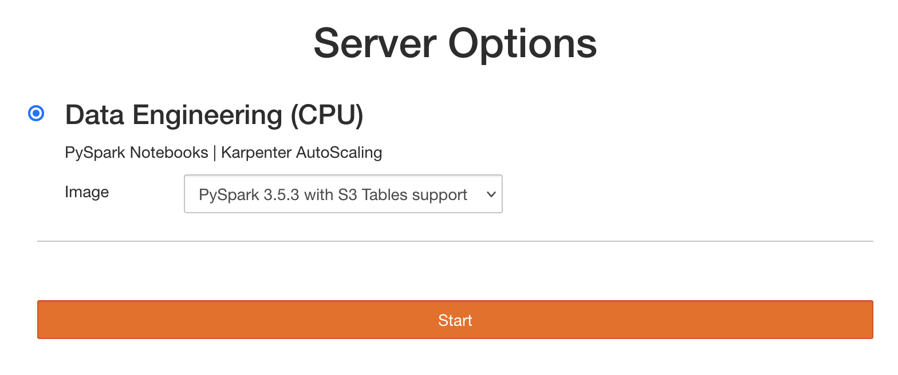
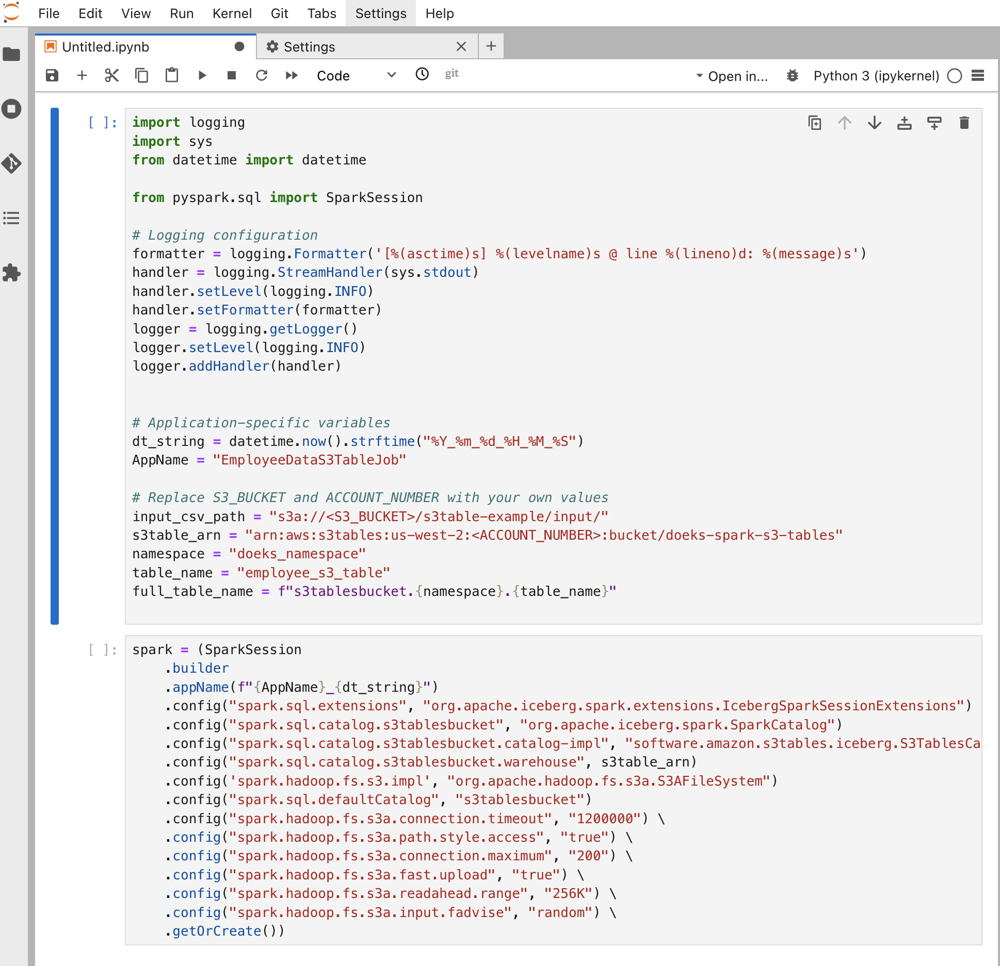

import Tabs from '@theme/Tabs';
import TabItem from '@theme/TabItem';
import CollapsibleContent from '../../../../../../src/components/CollapsibleContent';

import TaxiTripExecute from './_taxi_trip_exec.md'
import ReplaceS3BucketPlaceholders from './_replace_s3_bucket_placeholders.mdx';

import CodeBlock from '@theme/CodeBlock';

# S3 Tables 与 Amazon EKS


## 什么是 S3 Tables？

Amazon S3 Tables 是一个完全托管的表格数据存储，专为优化性能、简化安全性并为大规模分析工作负载提供经济高效的存储而构建。它直接与 Amazon EMR、Amazon Athena、Amazon Redshift、AWS Glue 和 AWS Lake Formation 等服务集成，为运行分析和机器学习工作负载提供无缝体验。

## 为什么在 Amazon EKS 上运行 S3 Tables？

对于已经采用 Amazon EKS 运行 Spark 工作负载并使用 Iceberg 等表格式的用户，利用 S3 Tables 在性能、成本效率和安全控制方面具有优势。这种集成允许组织将 Kubernetes 原生功能与 S3 Tables 的能力相结合，可能在其现有环境中改善查询性能和资源扩展。通过遵循本文档中详述的步骤，用户可以将 S3 Tables 无缝集成到他们的 EKS 设置中，为分析工作负载提供灵活且互补的解决方案。

## S3 Tables 与 Iceberg 表格式的区别

虽然 S3 Tables 使用 Apache Iceberg 作为底层实现，但它们提供了专为 AWS 客户设计的增强功能：

- **🛠️ 自动压缩**：S3 Tables 实现自动压缩，通过在后台智能地将较小的文件合并为更大、更高效的文件来优化数据存储。此过程降低存储成本，提高查询速度，并持续运行而无需手动干预。

- 🔄 **表维护**：它提供关键的维护任务，如快照管理和未引用文件删除。这种持续优化确保表保持高性能和成本效益，无需手动干预，减少运营开销，让团队专注于数据洞察。

- ❄️ **Apache Iceberg 支持**：提供对 Apache Iceberg 的内置支持，简化大规模数据湖管理，同时提高查询性能并降低成本。如果您希望体验以下结果，请考虑为您的数据湖使用 S3 Tables。

- 🔒 **简化安全性**：S3 Tables 将您的表视为 AWS 资源，在表级别启用细粒度的 AWS Identity and Access Management (IAM) 权限。这简化了数据治理，增强了安全性，并使访问控制与您熟悉的 AWS 服务更加直观和可管理。

- ⚡ **增强性能**：Amazon S3 Tables 引入了一种新型存储桶，专为存储 Apache Iceberg 表而构建。与在通用 S3 存储桶中存储 Iceberg 表相比，表存储桶提供高达 3 倍的查询性能和高达 10 倍的每秒事务数。这种性能增强支持高频更新、实时摄取和更苛刻的工作负载，确保随着数据量增长的可扩展性和响应性。

- 🛠️ **与 AWS 服务集成**：S3 Tables 与 AWS 分析服务（如 Athena、Redshift、EMR 和 Glue）紧密集成，为分析工作负载提供原生支持。

<CollapsibleContent header={<h2><span>部署解决方案</span></h2>}>

在这个[示例](https://github.com/awslabs/data-on-eks/tree/main/analytics/terraform/spark-k8s-operator)中，您将配置使用开源 Spark Operator 和 Apache YuniKorn 运行 Spark 作业所需的以下资源。

此示例将运行 Spark K8s Operator 的 EKS 集群部署到新的 VPC 中。

- 创建新的示例 VPC、2 个私有子网、2 个公有子网，以及 RFC6598 空间（100.64.0.0/10）中用于 EKS Pod 的 2 个子网。
- 为公有子网创建互联网网关，为私有子网创建 NAT 网关
- 创建具有公共端点的 EKS 集群控制平面（仅用于演示目的），包含用于基准测试和核心服务的托管节点组，以及用于 Spark 工作负载的 Karpenter NodePool。
- 部署 Metrics server、Spark-operator、Apache Yunikorn、Karpenter、Grafana 和 Prometheus server。

### 先决条件

确保您已在计算机上安装了以下工具。

1. [aws cli](https://docs.aws.amazon.com/cli/latest/userguide/install-cliv2.html)
2. [kubectl](https://Kubernetes.io/docs/tasks/tools/)
3. [terraform](https://learn.hashicorp.com/tutorials/terraform/install-cli)

### 部署

克隆存储库。

```bash
git clone https://github.com/awslabs/data-on-eks.git
cd data-on-eks
export DOEKS_HOME=$(pwd)
```

如果 DOEKS_HOME 被取消设置，您可以始终从 data-on-eks 目录使用 `export DATA_ON_EKS=$(pwd)` 手动设置它。

导航到示例目录之一并运行 `install.sh` 脚本。

```bash
cd ${DOEKS_HOME}/analytics/terraform/spark-k8s-operator
chmod +x install.sh
./install.sh
```

现在创建一个 `S3_BUCKET` 变量，该变量保存安装期间创建的存储桶的名称。此存储桶将在后续示例中用于存储输出数据。如果 S3_BUCKET 被取消设置，您可以再次运行以下命令。

```bash
export S3_BUCKET=$(terraform output -raw s3_bucket_id_spark_history_server)
echo $S3_BUCKET
```

</CollapsibleContent>

## 执行示例 Spark 作业

### 步骤 1：创建与 S3 Tables 兼容的 Apache Spark Docker 镜像

创建一个包含与 S3 Tables 通信所需 jar 文件的 Docker 镜像。

- 查看示例 [Dockerfile](https://github.com/awslabs/data-on-eks/blob/main/analytics/terraform/spark-k8s-operator/examples/s3-tables/Dockerfile-S3Table)
- 注意用于 S3 Tables 交互的[关键 jar 文件](https://github.com/awslabs/data-on-eks/blob/e3f1a6b08d719fc69f61d18b57cd5ad09cb01bd5/analytics/terraform/spark-k8s-operator/examples/s3-tables/Dockerfile-S3Table#L43C1-L48C1)，包括 Iceberg、AWS SDK bundle 和用于 Iceberg 运行时的 S3 Tables Catalog
- 根据您的环境需要自定义 Dockerfile
- 构建 Docker 镜像并将镜像推送到您首选的容器注册表

我们已经创建了一个 docker 镜像并发布在 ECR 中，仅用于演示目的。

### 步骤 2：为作业创建测试数据

导航到示例目录，使用此[shell](https://github.com/awslabs/data-on-eks/blob/main/analytics/terraform/spark-k8s-operator/examples/s3-tables/input-data-gen.sh)脚本为 Spark 作业输入生成示例员工数据。

```sh
cd analytics/terraform/spark-k8s-operator/examples/s3-tables
./input-data-gen.sh
```

此脚本将在您的当前目录中创建一个名为 `employee_data.csv` 的文件。默认情况下，它生成 100 条记录。

注意：如果您需要调整记录数量，可以修改 input-data-gen.sh 脚本。查找生成数据的循环并根据需要更改迭代计数。

### 步骤 3：将测试输入数据上传到 Amazon S3 存储桶

将 `<YOUR_S3_BUCKET>` 替换为您的蓝图创建的 S3 存储桶名称并运行以下命令。

```bash
aws s3 cp employee_data.csv s3://<S3_BUCKET>/s3table-example/input/
```

此命令将 CSV 文件上传到您的 S3 存储桶。Spark 作业稍后将引用此路径来读取输入数据。在执行命令之前，请确保您具有写入此存储桶的必要权限。

### 步骤 4：将 PySpark 脚本上传到 S3 存储桶

以下脚本是 [Spark 作业](https://github.com/awslabs/data-on-eks/blob/main/analytics/terraform/spark-k8s-operator/examples/s3-tables/s3table-iceberg-pyspark.py)的片段，您可以看到与 S3 Tables 配合工作所需的 Spark 配置。

```python
def main(args):
    if len(args) != 3:
        logger.error("Usage: spark-etl [input-csv-path] [s3table-arn]")
        sys.exit(1)

    # Input parameters
    input_csv_path = args[1]    # Path to the input CSV file
    s3table_arn = args[2]       # s3table arn

    # Initialize Spark session
    logger.info("Initializing Spark Session")
    spark = (SparkSession
             .builder
             .appName(f"{AppName}_{dt_string}")
             .config("spark.sql.extensions", "org.apache.iceberg.spark.extensions.IcebergSparkSessionExtensions")
             .config("spark.sql.catalog.s3tablesbucket", "org.apache.iceberg.spark.SparkCatalog")
             .config("spark.sql.catalog.s3tablesbucket.catalog-impl", "software.amazon.s3tables.iceberg.S3TablesCatalog")
             .config("spark.sql.catalog.s3tablesbucket.warehouse", s3table_arn)
             .config('spark.hadoop.fs.s3.impl', "org.apache.hadoop.fs.s3a.S3AFileSystem")
             .config("spark.sql.defaultCatalog", "s3tablesbucket")
             .getOrCreate())

    spark.sparkContext.setLogLevel("INFO")
    logger.info("Spark session initialized successfully")

    namespace = "doeks_namespace"
    table_name = "employee_s3_table"
    full_table_name = f"s3tablesbucket.{namespace}.{table_name}"

...

```

将 `S3_BUCKET` 替换为您的蓝图创建的 S3 存储桶名称，并运行以下命令将示例 [Spark 作业](https://github.com/awslabs/data-on-eks/blob/main/analytics/terraform/spark-k8s-operator/examples/s3-tables/s3table-iceberg-pyspark.py)上传到 S3 存储桶。

```bash
aws s3 cp s3table-iceberg-pyspark.py s3://<S3_BUCKET>/s3table-example/scripts/
```

导航到示例目录并提交 Spark 作业。

### 步骤 5：创建 Amazon S3 表存储桶

这是主要步骤，您将创建一个用于 S3 Tables 的 S3 表存储桶，您的 PySpark 作业稍后将访问它。

将 `<S3TABLE_BUCKET_NAME>` 替换为您所需的存储桶名称。将 `<REGION>` 替换为您的 AWS 区域。

```bash
aws s3tables create-table-bucket \
    --region "<REGION>" \
    --name "<S3TABLE_BUCKET_NAME>"
```

记下此命令生成的 S3TABLE BUCKET ARN。从 AWS 控制台验证 S3 表存储桶 ARN。



### 步骤 6：更新 Spark Operator YAML 文件

按如下方式更新 Spark Operator YAML 文件：

- 在您首选的文本编辑器中打开 [s3table-spark-operator.yaml](https://github.com/awslabs/data-on-eks/blob/main/analytics/terraform/spark-k8s-operator/examples/s3-tables/s3table-spark-operator.yaml) 文件。
- 将 `<S3_BUCKET>` 替换为此蓝图创建的 S3 存储桶（检查 Terraform 输出）。S3 存储桶是您在上述步骤中复制测试数据和示例 spark 作业的地方。
- 将 `<S3TABLE_BUCKET_ARN>` 替换为您在上一步中捕获的 S3 表存储桶 ARN。

您可以在下面看到 Spark Operator 作业配置的片段。

```yaml
---
apiVersion: "sparkoperator.k8s.io/v1beta2"
kind: SparkApplication
metadata:
  name: "s3table-example"
  namespace: spark-team-a
  labels:
    app: "s3table-example"
    applicationId: "s3table-example-nvme"
spec:
  type: Python
  sparkVersion: "3.5.3"
  mode: cluster
  # CAUTION: Unsupported test image
  # This image is created solely for testing and reference purposes.
  # Before use, please:
  # 1. Review the Dockerfile used to create this image
  # 2. Create your own image that meets your organization's security requirements
  image: "public.ecr.aws/data-on-eks/spark:3.5.3-scala2.12-java17-python3-ubuntu-s3table0.1.3-iceberg1.6.1"
  imagePullPolicy: IfNotPresent
  mainApplicationFile: "s3a://<S3_BUCKET>/s3table-example/scripts/s3table-iceberg-pyspark.py"
  arguments:
    - "s3a://<S3_BUCKET>/s3table-example/input/"
    - "<S3TABLE_BUCKET_ARN>"
  sparkConf:
    "spark.app.name": "s3table-example"
    "spark.kubernetes.driver.pod.name": "s3table-example"
    "spark.kubernetes.executor.podNamePrefix": "s3table-example"
    "spark.local.dir": "/data"
    "spark.speculation": "false"
    "spark.network.timeout": "2400"
    "spark.hadoop.fs.s3a.connection.timeout": "1200000"
    "spark.hadoop.fs.s3a.path.style.access": "true"
    "spark.hadoop.fs.s3a.connection.maximum": "200"
    "spark.hadoop.fs.s3a.fast.upload": "true"
    "spark.hadoop.fs.s3a.readahead.range": "256K"
    "spark.hadoop.fs.s3a.input.fadvise": "random"
    "spark.hadoop.fs.s3a.aws.credentials.provider.mapping": "com.amazonaws.auth.WebIdentityTokenCredentialsProvider=software.amazon.awssdk.auth.credentials.WebIdentityTokenFileCredentialsProvider"
    "spark.hadoop.fs.s3a.aws.credentials.provider": "software.amazon.awssdk.auth.credentials.WebIdentityTokenFileCredentialsProvider"  # AWS SDK V2 https://hadoop.apache.org/docs/stable/hadoop-aws/tools/hadoop-aws/aws_sdk_upgrade.html
...

```

### 步骤 7：执行 Spark 作业

将更新的 YAML 配置文件应用到您的 Kubernetes 集群以提交和执行 Spark 作业：

```bash
cd ${DOEKS_HOME}/analytics/terraform/spark-k8s-operator/examples/s3-tables
kubectl apply -f s3table-spark-operator.yaml
```

这将在 EKS 集群上调度 Spark 作业。Spark Operator 处理将作业提交到 Kubernetes API Server。

Kubernetes 将调度 Spark 驱动程序和执行器 Pod 在单独的工作节点上运行。如果需要，Karpenter 将根据 Terraform 脚本中的 nodepool 配置自动配置新节点。

监控 Spark 驱动程序 Pod 的日志以跟踪作业进度。Pod 默认使用 `c5d` 实例，但如果需要，您可以修改 YAML 和 Karpenter nodepool 以使用不同的 EC2 实例类型。

### 步骤 8：验证 Spark 驱动程序日志的输出

列出在 spark-team-a 命名空间下运行的 Pod：

```bash
kubectl get pods -n spark-team-a
```

验证驱动程序日志以查看 Spark 作业的完整输出。该作业从 S3 存储桶读取 CSV 数据，并使用 Iceberg 格式将其写回 S3 Tables 存储桶。它还计算处理的记录数并显示前 10 条记录：

```bash
kubectl logs <spark-driver-pod-name> -n spark-team-a
```

当作业成功完成时，您应该看到 Spark 驱动程序 Pod 转换为 `Succeeded` 状态，日志应显示如下输出。

```text
...
[2025-01-07 22:07:44,185] INFO @ line 59: Previewing employee data schema
root
 |-- id: integer (nullable = true)
 |-- name: string (nullable = true)
 |-- level: string (nullable = true)
 |-- salary: double (nullable = true)

....

25/01/07 22:07:44 INFO CodeGenerator: Code generated in 10.594982 ms
+---+-----------+------+--------+
|id |name       |level |salary  |
+---+-----------+------+--------+
|1  |Employee_1 |Mid   |134000.0|
|2  |Employee_2 |Senior|162500.0|
|3  |Employee_3 |Senior|174500.0|
|4  |Employee_4 |Exec  |69500.0 |
|5  |Employee_5 |Senior|54500.0 |
|6  |Employee_6 |Mid   |164000.0|
|7  |Employee_7 |Junior|119000.0|
|8  |Employee_8 |Senior|54500.0 |
|9  |Employee_9 |Senior|57500.0 |
|10 |Employee_10|Mid   |152000.0|
+---+-----------+------+--------+
only showing top 10 rows

....
```

作业成功后，您应该看到一个新的表和命名空间，如下图所示。


以下命令将显示 S3 Tables 的其他信息。

### 使用 S3Table API 验证 S3Table

使用 S3Table API 确认表已成功创建。只需替换 `<ACCOUNT_ID>` 并运行命令。

```bash
aws s3tables get-table --table-bucket-arn arn:aws:s3tables:<REGION>:<ACCOUNT_ID>:bucket/doeks-spark-on-eks-s3table \
--namespace doeks_namespace \
--name employee_s3_table
```

输出如下所示：

```text
输出如下所示。

{
    "name": "employee_s3_table",
    "type": "customer",
    "tableARN": "arn:aws:s3tables:us-west-2:<ACCOUNT_ID>:bucket/doeks-spark-on-eks-s3table/table/55511111-7a03-4513-b921-e372b0030daf",
    "namespace": [
        "doeks_namespace"
    ],
    "versionToken": "aafc39ddd462690d2a0c",
    "metadataLocation": "s3://55511111-7a03-4513-asdfsafdsfdsf--table-s3/metadata/00004-62cc4be3-59b5-4647-a78d-1cdf69ec5ed8.metadata.json",
    "warehouseLocation": "s3://55511111-7a03-4513-asdfsafdsfdsf--table-s3",
    "createdAt": "2025-01-07T22:14:48.689581+00:00",
    "createdBy": "<ACCOUNT_ID>",
    "modifiedAt": "2025-01-09T00:06:09.222917+00:00",
    "ownerAccountId": "<ACCOUNT_ID>",
    "format": "ICEBERG"
}
```

### 监控表维护作业状态：

```bash
aws s3tables get-table-maintenance-job-status --table-bucket-arn arn:aws:s3tables:us-west-2:"\<ACCOUNT_ID>:bucket/doeks-spark-on-eks-s3table --namespace doeks_namespace --name employee_s3_table
```

此命令提供有关 Iceberg 压缩、快照管理和未引用文件删除过程的信息。

```json
{
    "tableARN": "arn:aws:s3tables:us-west-2:<ACCOUNT_ID>:bucket/doeks-spark-on-eks-s3table/table/55511111-7a03-4513-b921-e372b0030daf",
    "status": {
        "icebergCompaction": {
            "status": "Successful",
            "lastRunTimestamp": "2025-01-08T01:18:08.857000+00:00"
        },
        "icebergSnapshotManagement": {
            "status": "Successful",
            "lastRunTimestamp": "2025-01-08T22:17:08.811000+00:00"
        },
        "icebergUnreferencedFileRemoval": {
            "status": "Successful",
            "lastRunTimestamp": "2025-01-08T22:17:10.377000+00:00"
        }
    }
}

```

:::info

要在 EKS 上使用 S3 Tables，需要节点级策略和 Pod 级策略。

	1.	**节点级策略**：这些添加到 Karpenter Node IAM 角色。作为参考，您可以在 [addons.tf](https://github.com/awslabs/data-on-eks/blob/e3f1a6b08d719fc69f61d18b57cd5ad09cb01bd5/analytics/terraform/spark-k8s-operator/addons.tf#L649C1-L687C5) 文件中查看权限配置。

	2.	**Pod 级策略**：这些对于创建命名空间、管理表以及读取/写入表数据是必需的。https://github.com/awslabs/data-on-eks/blob/e3f1a6b08d719fc69f61d18b57cd5ad09cb01bd5/analytics/terraform/spark-k8s-operator/main.tf#L98C1-L156C2 通过 IAM Roles for Service Accounts (IRSA) 为 `spark-team-a` 命名空间授予。这确保 Spark 作业 Pod 具有对 S3 Tables 执行操作所需的访问权限。

通过适当配置这些权限，您可以确保 Spark 作业的无缝执行和对资源的安全访问。

请注意，这些策略可以根据您的安全要求进一步调整并使其更加细粒度。

:::

<CollapsibleContent header={<h2><span>在 JupyterLab 中使用 S3 Tables</span></h2>}>

如果您想使用 JupyterLab 交互式地使用 S3 Tables，此蓝图允许您将 JupyterLab 单用户实例部署到您的集群。

> :warning: 此处提供的 JupyterHub 配置仅用于测试目的。
>
> :warning: 请查看配置并进行必要的更改以满足您的安全标准。

### 更新 Terraform 变量并应用

```bash
cd ${DOEKS_HOME}/analytics/terraform/spark-k8s-operator

echo 'enable_jupyterhub = true' >> spark-operator.tfvars
terraform apply -var-file spark-operator.tfvars
```

### 确保您的 S3 存储桶中有测试数据可用

```bash
cd analytics/terraform/spark-k8s-operator/examples/s3-tables
./input-data-gen.sh
aws s3 cp employee_data.csv s3://${S3_BUCKET}/s3table-example/input/
```

### 访问 JupyterHub UI 并配置 JupyterLab 服务器

1. 将代理服务端口转发到您的本地机器。

    ```bash
    kubectl port-forward svc/proxy-public 8888:80 -n jupyterhub
    ```

1. 转到 [`http://localhost:8888`](http://localhost:8888)。输入任何用户名，将密码字段留空，然后单击"登录"。

   

1. 单击开始。如果您想自己自定义，也可以从下拉列表中选择上游 PySpark NoteBook 镜像。

    

1. 从[示例 Jupyter Notebook](https://github.com/awslabs/data-on-eks/blob/main/analytics/terraform/spark-k8s-operator/examples/s3-tables/s3table-iceberg-pyspark.ipynb) 复制示例作为起点，以交互式测试 S3 Tables 功能。

    **确保在笔记本中更新 `S3_BUCKET` 和 `s3table_arn` 值**

    

</CollapsibleContent>

<CollapsibleContent header={<h2><span>清理</span></h2>}>

:::caution
为避免对您的 AWS 账户产生不必要的费用，请删除在此部署期间创建的所有 AWS 资源
:::

## 删除 S3 表

```bash
aws s3tables delete-table \
  --namespace doeks_namespace \
  --table-bucket-arn ${S3TABLE_ARN} \
  --name employee_s3_table
```

## 删除命名空间

```bash
aws s3tables delete-namespace \
  --namespace doeks_namespace \
  --table-bucket-arn ${S3TABLE_ARN}
```

## 删除存储桶表

```bash
aws s3tables delete-table-bucket \
  --region "<REGION>" \
  --table-bucket-arn ${S3TABLE_ARN}
```

## 删除 Jupyter Notebook 服务器

如果您创建了 Jupyter notebook 服务器

```bash
kubectl delete pods -n jupyterhub -l component=singleuser-server
```

## 删除 EKS 集群

此脚本将使用 `-target` 选项清理环境，以确保所有资源按正确顺序删除。

```bash
cd ${DOEKS_HOME}/analytics/terraform/spark-k8s-operator && chmod +x cleanup.sh
./cleanup.sh
```

</CollapsibleContent>
