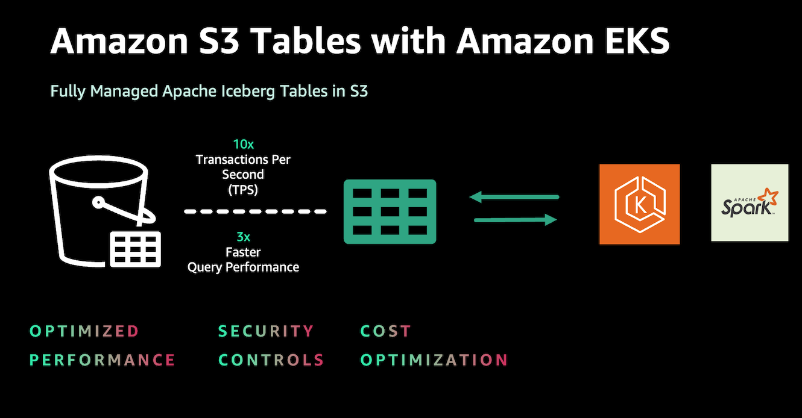
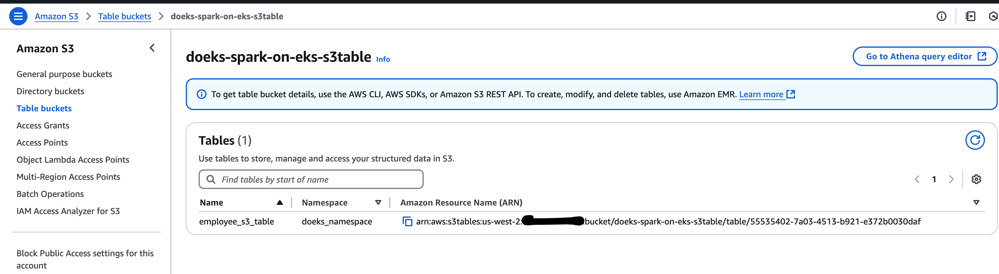

import Tabs from '@theme/Tabs';
import TabItem from '@theme/TabItem';
import CollapsibleContent from '../../../../../../src/components/CollapsibleContent';

import TaxiTripExecute from '../../../../../../docs/blueprints/data-analytics/_taxi_trip_exec.md'
import ReplaceS3BucketPlaceholders from '../../../../../../docs/blueprints/data-analytics/_replace_s3_bucket_placeholders.mdx';

import CodeBlock from '@theme/CodeBlock';

# Amazon EKS上的S3表




## 什么是S3表？

Amazon S3表是一个完全托管的表格数据存储，专为优化性能、简化安全性和为大规模分析工作负载提供成本效益高的存储而构建。它直接与Amazon EMR、Amazon Athena、Amazon Redshift、AWS Glue和AWS Lake Formation等服务集成，为运行分析和机器学习工作负载提供无缝体验。

## 为什么在Amazon EKS上运行S3表？

对于已经采用Amazon EKS进行Spark工作负载并使用Iceberg等表格格式的用户，利用S3表可以在性能、成本效益和安全控制方面提供优势。这种集成允许组织将Kubernetes原生功能与S3表的功能相结合，可能在其现有环境中改善查询性能和资源扩展。通过遵循本文档中详述的步骤，用户可以将S3表无缝集成到他们的EKS设置中，为分析工作负载提供灵活且互补的解决方案。

## S3表与Iceberg表格式有何不同

虽然S3表使用Apache Iceberg作为底层实现，但它们提供了专为AWS客户设计的增强功能：

- **🛠️ 自动压缩**：S3表实现了自动压缩，通过将较小的文件智能地组合成更大、更高效的文件，在后台优化数据存储。这个过程降低了存储成本，提高了查询速度，并且无需手动干预即可持续运行。

- 🔄 **表维护**：它提供了关键的维护任务，如快照管理和未引用文件的移除。这种持续优化确保表保持高性能和成本效益，无需手动干预，减少了运营开销，使团队能够专注于数据洞察。

- ❄️ **Apache Iceberg支持**：内置支持Apache Iceberg，简化了大规模数据湖的管理，同时提高了查询性能并降低了成本。如果您想体验以下结果，请考虑使用S3表作为您的数据湖。

- 🔒 **简化安全性**：S3表将您的表视为AWS资源，在表级别启用细粒度的AWS身份和访问管理(IAM)权限。这简化了数据治理，增强了安全性，并使访问控制与您熟悉的AWS服务更加直观和可管理。

- ⚡ **增强性能**：Amazon S3表引入了一种新型存储桶，专为存储Apache Iceberg表而构建。与在通用S3存储桶中存储Iceberg表相比，表存储桶提供高达3倍的查询性能和高达10倍的每秒事务数。这种性能增强支持高频更新、实时摄取和更高要求的工作负载，确保随着数据量增长的可扩展性和响应性。

- 🛠️ **与AWS服务集成**：S3表与AWS分析服务（如Athena、Redshift、EMR和Glue）紧密集成，为分析工作负载提供原生支持。


<CollapsibleContent header={<h2><span>部署解决方案</span></h2>}>

在这个[示例](https://github.com/awslabs/data-on-eks/tree/main/analytics/terraform/spark-k8s-operator)中，您将配置运行带有开源Spark Operator和Apache YuniKorn的Spark作业所需的以下资源。

此示例将Spark K8s Operator部署到新的VPC中的EKS集群。

- 创建一个新的示例VPC，2个私有子网，2个公共子网，以及RFC6598空间(100.64.0.0/10)中的2个子网用于EKS Pod。
- 为公共子网创建互联网网关，为私有子网创建NAT网关
- 创建带有公共端点的EKS集群控制平面（仅用于演示目的），带有用于基准测试和核心服务的托管节点组，以及用于Spark工作负载的Karpenter NodePools。
- 部署Metrics server、Spark-operator、Apache Yunikorn、Karpenter、Grafana和Prometheus服务器。

### 先决条件

确保您已在计算机上安装了以下工具。

1. [aws cli](https://docs.aws.amazon.com/cli/latest/userguide/install-cliv2.html)
2. [kubectl](https://Kubernetes.io/docs/tasks/tools/)
3. [terraform](https://learn.hashicorp.com/tutorials/terraform/install-cli)

### 部署

克隆仓库。

```bash
git clone https://github.com/awslabs/data-on-eks.git
cd data-on-eks
export DOEKS_HOME=$(pwd)
```

如果DOEKS_HOME变量被取消设置，您可以随时从data-on-eks目录使用`export
DATA_ON_EKS=$(pwd)`手动设置它。

导航到示例目录之一并运行`install.sh`脚本。

```bash
cd ${DOEKS_HOME}/analytics/terraform/spark-k8s-operator
chmod +x install.sh
./install.sh
```

现在创建一个`S3_BUCKET`变量，保存安装期间创建的存储桶名称。此存储桶将在后续示例中用于存储输出数据。如果S3_BUCKET变量被取消设置，您可以再次运行以下命令。

```bash
export S3_BUCKET=$(terraform output -raw s3_bucket_id_spark_history_server)
echo $S3_BUCKET
```

</CollapsibleContent>
## 执行示例Spark作业

### 步骤1：创建与S3表兼容的Apache Spark Docker镜像

创建一个包含S3表通信所需jar包的Docker镜像。

- 查看示例[Dockerfile](https://github.com/awslabs/data-on-eks/blob/main/analytics/terraform/spark-k8s-operator/examples/s3-tables/Dockerfile-S3Table)
- 注意S3表交互的[关键jar文件](https://github.com/awslabs/data-on-eks/blob/e3f1a6b08d719fc69f61d18b57cd5ad09cb01bd5/analytics/terraform/spark-k8s-operator/examples/s3-tables/Dockerfile-S3Table#L43C1-L48C1)，包括Iceberg、AWS SDK bundle和用于Iceberg运行时的S3表目录
- 根据您的环境需要自定义Dockerfile
- 构建Docker镜像并将镜像推送到您首选的容器注册表

我们已经创建了一个Docker镜像并发布在ECR中，仅用于演示目的。

### 步骤2：为作业创建测试数据

导航到示例目录，使用这个[shell](https://github.com/awslabs/data-on-eks/blob/main/analytics/terraform/spark-k8s-operator/examples/s3-tables/input-data-gen.sh)脚本为Spark作业输入生成示例员工数据。

```sh
cd analytics/terraform/spark-k8s-operator/examples/s3-tables
./input-data-gen.sh
```

此脚本将在您当前目录中创建一个名为`employee_data.csv`的文件。默认情况下，它生成100条记录。

注意：如果您需要调整记录数量，可以修改input-data-gen.sh脚本。查找生成数据的循环并根据需要更改迭代计数。

### 步骤3：将测试输入数据上传到Amazon S3存储桶

将`<YOUR_S3_BUCKET>`替换为您的蓝图创建的S3存储桶名称，并运行以下命令。

```bash
aws s3 cp employee_data.csv s3://<S3_BUCKET>/s3table-example/input/
```

此命令将CSV文件上传到您的S3存储桶。Spark作业稍后将引用此路径来读取输入数据。在执行命令之前，请确保您有必要的权限写入此存储桶。

### 步骤4：将PySpark脚本上传到S3存储桶

以下脚本是[Spark作业](https://github.com/awslabs/data-on-eks/blob/main/analytics/terraform/spark-k8s-operator/examples/s3-tables/s3table-iceberg-pyspark.py)的片段，您可以看到使用S3表所需的Spark配置。

```python
def main(args):
    if len(args) != 3:
        logger.error("Usage: spark-etl [input-csv-path] [s3table-arn]")
        sys.exit(1)

    # Input parameters
    input_csv_path = args[1]    # Path to the input CSV file
    s3table_arn = args[2]       # s3table arn

    # Initialize Spark session
    logger.info("Initializing Spark Session")
    spark = (SparkSession
             .builder
             .appName(f"{AppName}_{dt_string}")
             .config("spark.sql.extensions", "org.apache.iceberg.spark.extensions.IcebergSparkSessionExtensions")
             .config("spark.sql.catalog.s3tablesbucket", "org.apache.iceberg.spark.SparkCatalog")
             .config("spark.sql.catalog.s3tablesbucket.catalog-impl", "software.amazon.s3tables.iceberg.S3TablesCatalog")
             .config("spark.sql.catalog.s3tablesbucket.warehouse", s3table_arn)
             .config('spark.hadoop.fs.s3.impl', "org.apache.hadoop.fs.s3a.S3AFileSystem")
             .config("spark.sql.defaultCatalog", "s3tablesbucket")
             .getOrCreate())

    spark.sparkContext.setLogLevel("INFO")
    logger.info("Spark session initialized successfully")

    namespace = "doeks_namespace"
    table_name = "employee_s3_table"
    full_table_name = f"s3tablesbucket.{namespace}.{table_name}"

...

```

将`S3_BUCKET`替换为您的蓝图创建的S3存储桶名称，并运行以下命令将示例[Spark作业](https://github.com/awslabs/data-on-eks/blob/main/analytics/terraform/spark-k8s-operator/examples/s3-tables/s3table-iceberg-pyspark.py)上传到S3存储桶。

```bash
aws s3 cp s3table-iceberg-pyspark.py s3://<S3_BUCKET>/s3table-example/scripts/
```

导航到示例目录并提交Spark作业。

### 步骤5：创建Amazon S3表存储桶

这是主要步骤，您将创建一个S3表存储桶，用于S3表，您的PySpark作业稍后将访问它。

将`<S3TABLE_BUCKET_NAME>`替换为您想要的存储桶名称。将`<REGION>`替换为您的AWS区域。


```bash
aws s3tables create-table-bucket \
    --region "<REGION>" \
    --name "<S3TABLE_BUCKET_NAME>"
```

记下此命令生成的S3TABLE BUCKET ARN。从AWS控制台验证S3表存储桶ARN。


### 步骤6：更新Spark Operator YAML文件

如下更新Spark Operator YAML文件：

- 在您首选的文本编辑器中打开[s3table-spark-operator.yaml](https://github.com/awslabs/data-on-eks/blob/main/analytics/terraform/spark-k8s-operator/examples/s3-tables/s3table-spark-operator.yaml)文件。
- 将`<S3_BUCKET>`替换为此蓝图创建的S3存储桶(查看Terraform输出)。S3存储桶是您在上述步骤中复制测试数据和示例spark作业的地方。
- 将`<S3TABLE_BUCKET_ARN>`替换为您在上一步中捕获的S3表存储桶ARN。

您可以在下面看到Spark Operator作业配置的片段。


```yaml
---
apiVersion: "sparkoperator.k8s.io/v1beta2"
kind: SparkApplication
metadata:
  name: "s3table-example"
  namespace: spark-team-a
  labels:
    app: "s3table-example"
    applicationId: "s3table-example-nvme"
spec:
  type: Python
  sparkVersion: "3.5.3"
  mode: cluster
  # CAUTION: Unsupported test image
  # This image is created solely for testing and reference purposes.
  # Before use, please:
  # 1. Review the Dockerfile used to create this image
  # 2. Create your own image that meets your organization's security requirements
  image: "public.ecr.aws/data-on-eks/spark:3.5.3-scala2.12-java17-python3-ubuntu-s3table0.1.3-iceberg1.6.1"
  imagePullPolicy: IfNotPresent
  mainApplicationFile: "s3a://<S3_BUCKET>/s3table-example/scripts/s3table-iceberg-pyspark.py"
  arguments:
    - "s3a://<S3_BUCKET>/s3table-example/input/"
    - "<S3TABLE_BUCKET_ARN>"
  sparkConf:
    "spark.app.name": "s3table-example"
    "spark.kubernetes.driver.pod.name": "s3table-example"
    "spark.kubernetes.executor.podNamePrefix": "s3table-example"
    "spark.local.dir": "/data"
    "spark.speculation": "false"
    "spark.network.timeout": "2400"
    "spark.hadoop.fs.s3a.connection.timeout": "1200000"
    "spark.hadoop.fs.s3a.path.style.access": "true"
    "spark.hadoop.fs.s3a.connection.maximum": "200"
    "spark.hadoop.fs.s3a.fast.upload": "true"
    "spark.hadoop.fs.s3a.readahead.range": "256K"
    "spark.hadoop.fs.s3a.input.fadvise": "random"
    "spark.hadoop.fs.s3a.aws.credentials.provider.mapping": "com.amazonaws.auth.WebIdentityTokenCredentialsProvider=software.amazon.awssdk.auth.credentials.WebIdentityTokenFileCredentialsProvider"
    "spark.hadoop.fs.s3a.aws.credentials.provider": "software.amazon.awssdk.auth.credentials.WebIdentityTokenFileCredentialsProvider"  # AWS SDK V2 https://hadoop.apache.org/docs/stable/hadoop-aws/tools/hadoop-aws/aws_sdk_upgrade.html
...

```
### 步骤7：执行Spark作业

将更新后的YAML配置文件应用到您的Kubernetes集群，以提交和执行Spark作业：

```bash
cd ${DOEKS_HOME}/analytics/terraform/spark-k8s-operator/examples/s3-tables
kubectl apply -f s3table-spark-operator.yaml
```

这将在EKS集群上调度Spark作业。Spark Operator负责将作业提交到Kubernetes API服务器。

Kubernetes将调度Spark驱动程序和执行器pod在不同的工作节点上运行。如果需要，Karpenter将根据Terraform脚本中的nodepool配置自动配置新节点。

监控Spark驱动程序pod的日志以跟踪作业进度。pod默认使用`c5d`实例，但如果需要，您可以修改YAML和Karpenter nodepool以使用不同的EC2实例类型。

### 步骤8：验证Spark驱动程序日志的输出

列出在spark-team-a命名空间下运行的pod：

```bash
kubectl get pods -n spark-team-a
```

验证驱动程序日志以查看Spark作业的完整输出。该作业从S3存储桶读取CSV数据，并使用Iceberg格式将其写回S3表存储桶。它还计算处理的记录数并显示前10条记录：

```bash
kubectl logs <spark-driver-pod-name> -n spark-team-a
```

当作业成功完成时，您应该看到Spark驱动程序pod转换为`Succeeded`状态，日志应该显示如下输出。

```text
...
[2025-01-07 22:07:44,185] INFO @ line 59: Previewing employee data schema
root
 |-- id: integer (nullable = true)
 |-- name: string (nullable = true)
 |-- level: string (nullable = true)
 |-- salary: double (nullable = true)

....

25/01/07 22:07:44 INFO CodeGenerator: Code generated in 10.594982 ms
+---+-----------+------+--------+
|id |name       |level |salary  |
+---+-----------+------+--------+
|1  |Employee_1 |Mid   |134000.0|
|2  |Employee_2 |Senior|162500.0|
|3  |Employee_3 |Senior|174500.0|
|4  |Employee_4 |Exec  |69500.0 |
|5  |Employee_5 |Senior|54500.0 |
|6  |Employee_6 |Mid   |164000.0|
|7  |Employee_7 |Junior|119000.0|
|8  |Employee_8 |Senior|54500.0 |
|9  |Employee_9 |Senior|57500.0 |
|10 |Employee_10|Mid   |152000.0|
+---+-----------+------+--------+
only showing top 10 rows

....
```

作业成功后，您应该看到一个新的表和命名空间，如下图所示。




以下命令将显示S3表的其他信息。

### 使用S3Table API验证S3表

使用S3Table API确认表已成功创建。只需替换`<ACCOUNT_ID>`并运行命令。

```bash
aws s3tables get-table --table-bucket-arn arn:aws:s3tables:<REGION>:<ACCOUNT_ID>:bucket/doeks-spark-on-eks-s3table \
--namespace doeks_namespace \
--name employee_s3_table
```

输出如下所示：

```text
输出如下所示。

{
    "name": "employee_s3_table",
    "type": "customer",
    "tableARN": "arn:aws:s3tables:us-west-2:<ACCOUNT_ID>:bucket/doeks-spark-on-eks-s3table/table/55511111-7a03-4513-b921-e372b0030daf",
    "namespace": [
        "doeks_namespace"
    ],
    "versionToken": "aafc39ddd462690d2a0c",
    "metadataLocation": "s3://55511111-7a03-4513-asdfsafdsfdsf--table-s3/metadata/00004-62cc4be3-59b5-4647-a78d-1cdf69ec5ed8.metadata.json",
    "warehouseLocation": "s3://55511111-7a03-4513-asdfsafdsfdsf--table-s3",
    "createdAt": "2025-01-07T22:14:48.689581+00:00",
    "createdBy": "<ACCOUNT_ID>",
    "modifiedAt": "2025-01-09T00:06:09.222917+00:00",
    "ownerAccountId": "<ACCOUNT_ID>",
    "format": "ICEBERG"
}
```

### 监控表维护作业状态：

```bash
aws s3tables get-table-maintenance-job-status --table-bucket-arn arn:aws:s3tables:us-west-2:"\<ACCOUNT_ID>:bucket/doeks-spark-on-eks-s3table --namespace doeks_namespace --name employee_s3_table
```

此命令提供有关Iceberg压缩、快照管理和未引用文件移除过程的信息。

```json
{
    "tableARN": "arn:aws:s3tables:us-west-2:<ACCOUNT_ID>:bucket/doeks-spark-on-eks-s3table/table/55511111-7a03-4513-b921-e372b0030daf",
    "status": {
        "icebergCompaction": {
            "status": "Successful",
            "lastRunTimestamp": "2025-01-08T01:18:08.857000+00:00"
        },
        "icebergSnapshotManagement": {
            "status": "Successful",
            "lastRunTimestamp": "2025-01-08T22:17:08.811000+00:00"
        },
        "icebergUnreferencedFileRemoval": {
            "status": "Successful",
            "lastRunTimestamp": "2025-01-08T22:17:10.377000+00:00"
        }
    }
}

```


:::info

要在EKS上使用S3表，需要节点级策略和Pod级策略。

	1.	**节点级策略**：这些添加到Karpenter节点IAM角色。作为参考，您可以在[addons.tf](https://github.com/awslabs/data-on-eks/blob/e3f1a6b08d719fc69f61d18b57cd5ad09cb01bd5/analytics/terraform/spark-k8s-operator/addons.tf#L649C1-L687C5)文件中查看权限配置。

	2.	**Pod级策略**：这些对于创建命名空间、管理表以及读取/写入数据到表是必要的。https://github.com/awslabs/data-on-eks/blob/e3f1a6b08d719fc69f61d18b57cd5ad09cb01bd5/analytics/terraform/spark-k8s-operator/main.tf#L98C1-L156C2 通过`spark-team-a`命名空间的服务账户IAM角色(IRSA)授予。这确保Spark作业pod具有执行S3表操作所需的访问权限。

通过适当配置这些权限，您可以确保Spark作业的无缝执行和对资源的安全访问。

请注意，这些策略可以根据您的安全要求进一步调整并使其更加精细。

:::


<CollapsibleContent header={<h2><span>使用JupyterLab的S3表</span></h2>}>

如果您想使用JupyterLab与S3表交互式工作，此蓝图允许您将JupyterLab单用户实例部署到您的集群。

> :warning: 此处提供的JupyterHub配置仅用于测试目的。
>
> :warning: 查看配置并进行必要的更改以满足您的安全标准。

### 更新Terraform变量并应用

```bash
cd ${DOEKS_HOME}/analytics/terraform/spark-k8s-operator

echo 'enable_jupyterhub = true' >> spark-operator.tfvars
terraform apply -var-file spark-operator.tfvars
```

### 确保您的S3存储桶中有可用的测试数据

```bash
cd analytics/terraform/spark-k8s-operator/examples/s3-tables
./input-data-gen.sh
aws s3 cp employee_data.csv s3://${S3_BUCKET}/s3table-example/input/
```

### 访问JupyterHub UI并配置JupyterLab服务器

1. 将代理服务端口转发到您的本地机器。

    ```bash
    kubectl port-forward svc/proxy-public 8888:80 -n jupyterhub
    ```

1. 前往[`http://localhost:8888`](http://localhost:8888)。输入任何用户名，将密码字段留空，然后点击"登录"。

   

1. 点击开始。如果您想自定义，也可以从下拉列表中选择上游PySpark笔记本镜像。

    

1. 从[示例Jupyter笔记本](https://github.com/awslabs/data-on-eks/blob/main/analytics/terraform/spark-k8s-operator/examples/s3-tables/s3table-iceberg-pyspark.ipynb)复制示例作为起点，以交互式测试S3表功能。

    **确保在笔记本中更新`S3_BUCKET`和`s3table_arn`值**

    

</CollapsibleContent>
<CollapsibleContent header={<h2><span>清理</span></h2>}>

:::caution
为避免对您的AWS账户产生不必要的费用，请删除在此部署期间创建的所有AWS资源
:::

## 删除S3表

```bash
aws s3tables delete-table \
  --namespace doeks_namespace \
  --table-bucket-arn ${S3TABLE_ARN} \
  --name employee_s3_table
```

## 删除命名空间

```bash
aws s3tables delete-namespace \
  --namespace doeks_namespace \
  --table-bucket-arn ${S3TABLE_ARN}
```

## 删除存储桶表

```bash
aws s3tables delete-table-bucket \
  --region "<REGION>" \
  --table-bucket-arn ${S3TABLE_ARN}
```

## 删除Jupyter笔记本服务器

如果您创建了Jupyter笔记本服务器

```bash
kubectl delete pods -n jupyterhub -l component=singleuser-server
```


## 删除EKS集群

此脚本将使用`-target`选项清理环境，以确保所有资源按正确顺序删除。

```bash
cd ${DOEKS_HOME}/analytics/terraform/spark-k8s-operator && chmod +x cleanup.sh
./cleanup.sh
```

</CollapsibleContent>
