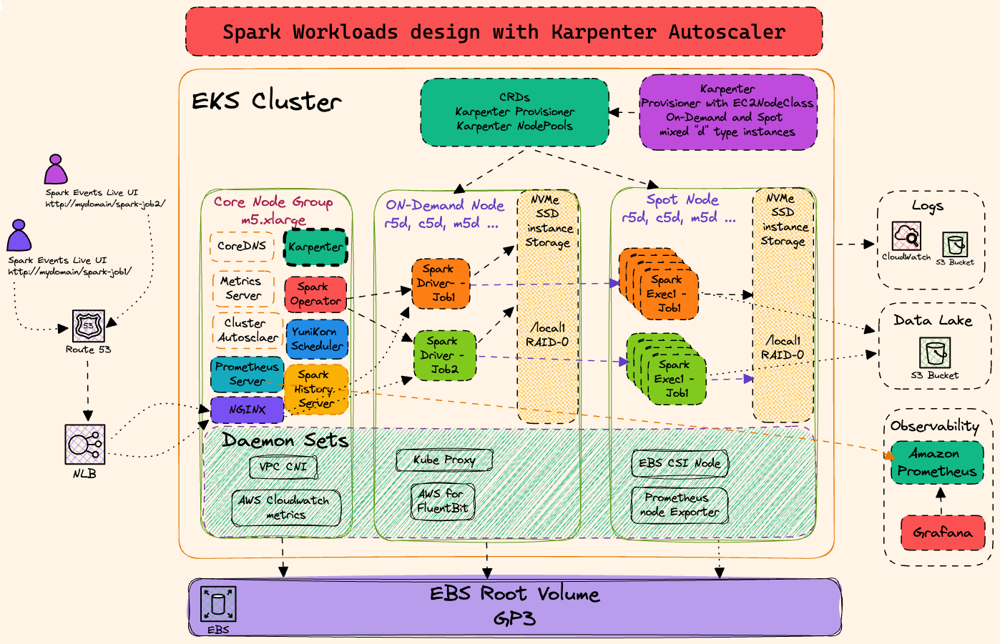

import Tabs from '@theme/Tabs';
import TabItem from '@theme/TabItem';
import CollapsibleContent from '../../../../../../src/components/CollapsibleContent';

import TaxiTripExecute from './_taxi_trip_exec.md'
import ReplaceS3BucketPlaceholders from './_replace_s3_bucket_placeholders.mdx';

import CodeBlock from '@theme/CodeBlock';

# Spark Operator with YuniKorn

## 介绍

Data on EKS 蓝图的 EKS 集群设计针对使用 Spark Operator 和 Apache YuniKorn 作为批处理调度器运行 Spark 应用程序进行了优化。此蓝图利用 Karpenter 来扩展工作节点，AWS for FluentBit 用于日志记录，Prometheus、Amazon Managed Prometheus 和开源 Grafana 的组合用于可观察性。此外，Spark History Server Live UI 配置为通过 NLB 和 NGINX 入口控制器监控正在运行的 Spark 作业。

<CollapsibleContent header={<h2><span>使用 Karpenter 的 Spark 工作负载</span></h2>}>

使用 Karpenter 作为自动扩展器，消除了 Spark 工作负载对托管节点组和 Cluster Autoscaler 的需求。在此设计中，Karpenter 及其 NodePool 负责创建按需和 Spot 实例，根据用户需求动态选择实例类型。与 Cluster Autoscaler 相比，Karpenter 提供了改进的性能，具有更高效的节点扩展和更快的响应时间。Karpenter 的关键功能包括从零扩展的能力，在没有资源需求时优化资源利用率并降低成本。此外，Karpenter 支持多个 NodePool，允许在为不同工作负载类型（如计算、内存和 GPU 密集型任务）定义所需基础设施时具有更大的灵活性。此外，Karpenter 与 Kubernetes 无缝集成，根据观察到的工作负载和扩展事件提供自动、实时的集群大小调整。这使得 EKS 集群设计更加高效和经济，能够适应 Spark 应用程序和其他工作负载不断变化的需求。



蓝图在下面的选项卡中配置 Karpenter NodePool 和 Ec2 类。

<Tabs>
<TabItem value="spark-memory-optimized" label="spark-memory-optimized">

此 NodePool 使用 r5d 实例类型，从 xlarge 到 8xlarge 大小，非常适合需要更多内存的 Spark 作业。

要查看 Karpenter 配置，[请在此处查看 `addons.tf` 文件](https://github.com/awslabs/data-on-eks/blob/main/analytics/terraform/spark-k8s-operator/addons.tf#L177-L223)
</TabItem>

<TabItem value="spark-graviton-memory-optimized" label="spark-graviton-memory-optimized">

此 NodePool 使用 r6g、r6gd、r7g、r7gd 和 r8g 实例类型，从 4xlarge 到 16xlarge 大小

要查看 Karpenter 配置，[请在此处查看 `addons.tf` 文件](https://github.com/awslabs/data-on-eks/blob/main/analytics/terraform/spark-k8s-operator/addons.tf#L117-L170)
</TabItem>

<TabItem value="spark-compute-optimized" label="spark-compute-optimized">

此 NodePool 使用 C5d 实例类型，从 4xlarge 到 24xlarge 大小，非常适合需要更多 CPU 时间的 Spark 作业。

要查看 Karpenter 配置，[请在此处查看 `addons.tf` 文件](https://github.com/awslabs/data-on-eks/blob/main/analytics/terraform/spark-k8s-operator/addons.tf#L63-L110)
</TabItem>

<TabItem value="spark-vertical-ebs-scale" label="spark-vertical-ebs-scale">

此 NodePool 使用广泛的 EC2 实例类型，在引导实例时创建并挂载辅助 EBS 卷。此卷大小根据 Ec2 实例上的核心数进行扩展。
这提供了可用于 Spark 工作负载的辅助存储位置，减少了实例根卷的负载，避免了对系统守护进程或 kubelet 的影响。由于较大的节点可以接受更多的 Pod，引导程序为较大的实例创建更大的卷。

要查看 Karpenter 配置，[请在此处查看 `addons.tf` 文件](https://github.com/awslabs/data-on-eks/blob/main/analytics/terraform/spark-k8s-operator/addons.tf#L230-L355)
</TabItem>

</Tabs>
</CollapsibleContent>

<CollapsibleContent header={<h2><span>用于 Spark shuffle 数据的 NVMe SSD 实例存储</span></h2>}>

需要注意的是，此 EKS 集群设计中的 NodePool 利用每个节点的 NVMe SSD 实例存储作为 Spark 工作负载的 shuffle 存储。这些高性能存储选项适用于所有"d"类型实例。

使用 NVMe SSD 实例存储作为 Spark 的 shuffle 存储带来了许多优势。首先，它提供低延迟和高吞吐量的数据访问，显著改善 Spark 的 shuffle 性能。这导致更快的作业完成时间和增强的整体应用程序性能。其次，使用本地 SSD 存储减少了对远程存储系统（如 EBS 卷）的依赖，这些系统在 shuffle 操作期间可能成为瓶颈。这也降低了为 shuffle 数据配置和管理额外 EBS 卷的相关成本。最后，通过利用 NVMe SSD 存储，EKS 集群设计提供了更好的资源利用率和增强的性能，允许 Spark 应用程序处理更大的数据集并更高效地处理更复杂的分析工作负载。这种优化的存储解决方案最终有助于为在 Kubernetes 上运行 Spark 工作负载量身定制更可扩展和经济高效的 EKS 集群。

NVMe SSD 实例存储由实例启动时的引导脚本配置（[Karpenter NodePool 配置为 `instanceStorePolicy: RAID0`](https://karpenter.sh/docs/concepts/nodeclasses/#specinstancestorepolicy)）。NVMe 设备被组合成单个 RAID0（条带化）阵列，然后挂载到 `/mnt/k8s-disks/0`。此目录进一步与 `/var/lib/kubelet`、`/var/lib/containerd` 和 `/var/log/pods` 链接，确保写入这些位置的所有数据都存储在 NVMe 设备上。因为在 Pod 内写入的数据将写入这些目录之一，Pod 受益于高性能存储，而无需利用 hostPath 挂载或 PersistentVolume

</CollapsibleContent>

<CollapsibleContent header={<h2><span>Spark Operator</span></h2>}>

Apache Spark 的 Kubernetes Operator 旨在使指定和运行 Spark 应用程序像在 Kubernetes 上运行其他工作负载一样简单和惯用。

* SparkApplication 控制器，监视 SparkApplication 对象的创建、更新和删除事件并对监视事件采取行动，
* 提交运行器，为从控制器接收的提交运行 spark-submit，
* Spark Pod 监视器，监视 Spark Pod 并向控制器发送 Pod 状态更新，
* 变异准入 Webhook，根据控制器添加的 Pod 上的注释处理 Spark 驱动程序和执行器 Pod 的自定义，
* 以及名为 sparkctl 的命令行工具，用于与操作器一起工作。

下图显示了 Spark Operator 附加组件的不同组件如何交互和协同工作。


</CollapsibleContent>

<CollapsibleContent header={<h2><span>部署解决方案</span></h2>}>

在这个[示例](https://github.com/awslabs/data-on-eks/tree/main/analytics/terraform/spark-k8s-operator)中，您将配置使用开源 Spark Operator 和 Apache YuniKorn 运行 Spark 作业所需的以下资源。

此示例将运行 Spark K8s Operator 的 EKS 集群部署到新的 VPC 中。

- 创建新的示例 VPC、2 个私有子网、2 个公有子网，以及 RFC6598 空间（100.64.0.0/10）中用于 EKS Pod 的 2 个子网。
- 为公有子网创建互联网网关，为私有子网创建 NAT 网关
- 创建具有公共端点的 EKS 集群控制平面（仅用于演示目的），包含用于基准测试和核心服务的托管节点组，以及用于 Spark 工作负载的 Karpenter NodePool。
- 部署 Metrics server、Spark-operator、Apache Yunikorn、Karpenter、Cluster Autoscaler、Grafana、AMP 和 Prometheus server。

### 先决条件

确保您已在计算机上安装了以下工具。

1. [aws cli](https://docs.aws.amazon.com/cli/latest/userguide/install-cliv2.html)
2. [kubectl](https://Kubernetes.io/docs/tasks/tools/)
3. [terraform](https://learn.hashicorp.com/tutorials/terraform/install-cli)

### 部署

克隆存储库。

```bash
git clone https://github.com/awslabs/data-on-eks.git
cd data-on-eks
export DOEKS_HOME=$(pwd)
```

如果 DOEKS_HOME 被取消设置，您可以始终从 data-on-eks 目录使用 `export DATA_ON_EKS=$(pwd)` 手动设置它。

导航到example目录之一并运行 `install.sh` 脚本。

```bash
cd ${DOEKS_HOME}/analytics/terraform/spark-k8s-operator
chmod +x install.sh
./install.sh
```

现在创建一个 S3_BUCKET 变量，该变量保存安装期间创建的存储桶的名称。此存储桶将在后续示例中用于存储输出数据。如果 S3_BUCKET 被取消设置，您可以再次运行以下命令。

```bash
export S3_BUCKET=$(terraform output -raw s3_bucket_id_spark_history_server)
echo $S3_BUCKET
```

</CollapsibleContent>

<CollapsibleContent header={<h2><span>使用 Karpenter 执行示例 Spark 作业</span></h2>}>

导航到example目录。您需要将此文件中的 `<S3_BUCKET>` 占位符替换为之前创建的存储桶名称。您可以通过运行 echo $S3_BUCKET 获取该值。

要自动执行此操作，您可以运行以下命令，这将创建一个 .old 备份文件并为您进行替换。

```bash
sed -i.old s/\<S3_BUCKET\>/${S3_BUCKET}/g ./pyspark-pi-job.yaml
```

提交 Spark 作业

```bash
cd ${DOEKS_HOME}/analytics/terraform/spark-k8s-operator/examples/karpenter
kubectl apply -f pyspark-pi-job.yaml
```

使用以下命令监控作业状态。
您应该看到由 karpenter 触发的新节点，YuniKorn 将在此节点上调度一个驱动程序 Pod 和 2 个执行器 Pod。

```bash
kubectl get pods -n spark-team-a -w
```

如果 Pod 已经完成，您可以检查 SparkApplication 的状态：
```bash
kubectl describe sparkapplication pyspark-pi-karpenter -n spark-team-a
```

您可以尝试以下示例来利用多个 Karpenter NodePool、EBS 作为动态 PVC 而不是 SSD 以及 YuniKorn Gang 调度。

## 将示例数据放入 S3

<TaxiTripExecute />

## 用于 Spark shuffle 存储的 NVMe 临时 SSD 磁盘

使用基于 NVMe 的临时 SSD 磁盘用于驱动程序和执行器 shuffle 存储的示例 PySpark 作业

```bash
cd ${DOEKS_HOME}/analytics/terraform/spark-k8s-operator/examples/karpenter/
```
<!-- Docusaurus will not render the {props.filename} inside of a ```codeblock``` -->
<ReplaceS3BucketPlaceholders filename="./nvme-ephemeral-storage.yaml" />
```bash
sed -i.old s/\<S3_BUCKET\>/${S3_BUCKET}/g ./nvme-ephemeral-storage.yaml
```

现在存储桶名称已就位，您可以创建 Spark 作业。

```bash
kubectl apply -f nvme-ephemeral-storage.yaml
```

## 用于 shuffle 存储的 EBS 动态 PVC
使用动态 PVC 为驱动程序和执行器 shuffle 存储使用 EBS ON_DEMAND 卷的示例 PySpark 作业

```bash
cd ${DOEKS_HOME}/analytics/terraform/spark-k8s-operator/examples/karpenter/
```
<!-- Docusaurus will not render the {props.filename} inside of a ```codeblock``` -->
<ReplaceS3BucketPlaceholders filename="./ebs-storage-dynamic-pvc.yaml" />
```bash
sed -i.old s/\<S3_BUCKET\>/${S3_BUCKET}/g ./ebs-storage-dynamic-pvc.yaml
```

现在存储桶名称已就位，您可以创建 Spark 作业。

```bash
kubectl apply -f ebs-storage-dynamic-pvc.yaml
```

## 使用基于 NVMe 的 SSD 磁盘进行 shuffle 存储的 Apache YuniKorn Gang 调度

使用 Apache YuniKorn 和 Spark Operator 进行 Gang 调度 Spark 作业

```bash
cd ${DOEKS_HOME}/analytics/terraform/spark-k8s-operator/examples/karpenter/
```
<!-- Docusaurus will not render the {props.filename} inside of a ```codeblock``` -->
<ReplaceS3BucketPlaceholders filename="./nvme-storage-yunikorn-gang-scheduling.yaml" />
```bash
sed -i.old s/\<S3_BUCKET\>/${S3_BUCKET}/g ./nvme-storage-yunikorn-gang-scheduling.yaml
```

现在存储桶名称已就位，您可以创建 Spark 作业。

```bash
kubectl apply -f nvme-storage-yunikorn-gang-scheduling.yaml
```

</CollapsibleContent>

<CollapsibleContent header={<h2><span>使用 Graviton 和 Intel 的 Karpenter Nodepool 权重</span></h2>}>

## 使用 Karpenter Nodepool 权重在 AWS Graviton 和 Intel EC2 实例上运行 Spark 作业

客户经常寻求利用 AWS Graviton 实例运行 Spark 作业，因为与传统 Intel 实例相比，它们具有成本节约和性能改进。然而，一个常见的挑战是 Graviton 实例在特定区域或可用区的可用性，特别是在高需求时期。为了解决这个问题，需要一个[回退策略](https://karpenter.sh/docs/concepts/scheduling/#weighted-nodepools)到等效的 Intel 实例。

#### 解决方案
**步骤 1：创建多架构 Spark Docker 镜像**
首先，通过创建多架构 Docker 镜像，确保您的 Spark 作业可以在 AWS Graviton（ARM 架构）和 Intel（AMD 架构）实例上运行。您可以在示例目录中找到示例 [Dockerfile](../../../../analytics/terraform/spark-k8s-operator/examples/docker/Dockerfile) 和[构建此镜像并将其推送到 Amazon Elastic Container Registry (ECR) 的说明](https://github.com/awslabs/data-on-eks/tree/main/analytics/terraform/spark-k8s-operator/examples/docker)。

**步骤 2：部署两个带权重的 Karpenter NodePool**
部署两个独立的 Karpenter NodePool：一个配置为 Graviton 实例，另一个配置为 Intel 实例。

Graviton NodePool (ARM)：将 Graviton NodePool 的权重设置为 `100`。这为您的 Spark 工作负载优先考虑 Graviton 实例。

Intel NodePool (AMD)：将 Intel NodePool 的权重设置为 `50`。这确保当 Graviton 实例不可用或达到其最大 CPU 容量时，Karpenter 将回退到 Intel NodePool。

内存优化的 Karpenter NodePool 配置了这些权重。

<Tabs>
<TabItem value="spark-memory-optimized" label="spark-memory-optimized">

此 NodePool 使用 r5d 实例类型，从 xlarge 到 8xlarge 大小，非常适合需要更多内存的 Spark 作业。

要查看 Karpenter 配置，[请在此处查看 `addons.tf` 文件](https://github.com/awslabs/data-on-eks/blob/main/analytics/terraform/spark-k8s-operator/addons.tf#L177-L223)
</TabItem>

<TabItem value="spark-graviton-memory-optimized" label="spark-graviton-memory-optimized">

此 NodePool 使用 r6g、r6gd、r7g、r7gd 和 r8g 实例类型，从 4xlarge 到 16xlarge 大小

要查看 Karpenter 配置，[请在此处查看 `addons.tf` 文件](https://github.com/awslabs/data-on-eks/blob/main/analytics/terraform/spark-k8s-operator/addons.tf#L117-L170)
</TabItem>
</Tabs>

**步骤 3：使用针对两个 NodePool 的标签选择器**
由于两个 NodePool 都有标签 `multiArch: Spark`，我们可以使用匹配该标签的 NodeSelector 配置我们的 Spark 作业。这将允许 Karpenter 从两个内存优化的 NodePool 配置节点，由于上面配置的权重，它将从 Graviton 实例开始。

```yaml
    nodeSelector:
      multiArch: Spark
```

</CollapsibleContent>

<CollapsibleContent header={<h2><span>清理</span></h2>}>

:::caution
为避免对您的 AWS 账户产生不必要的费用，请删除在此部署期间创建的所有 AWS 资源
:::

此脚本将使用 `-target` 选项清理环境，以确保所有资源按正确顺序删除。

```bash
cd ${DOEKS_HOME}/analytics/terraform/spark-k8s-operator && chmod +x cleanup.sh
./cleanup.sh
```

</CollapsibleContent>
