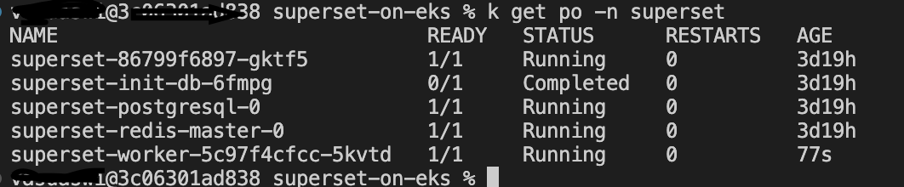
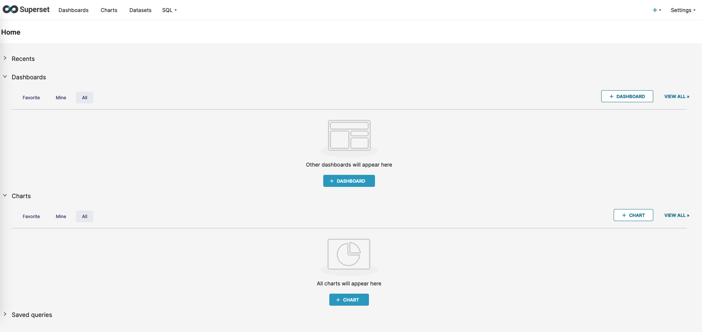
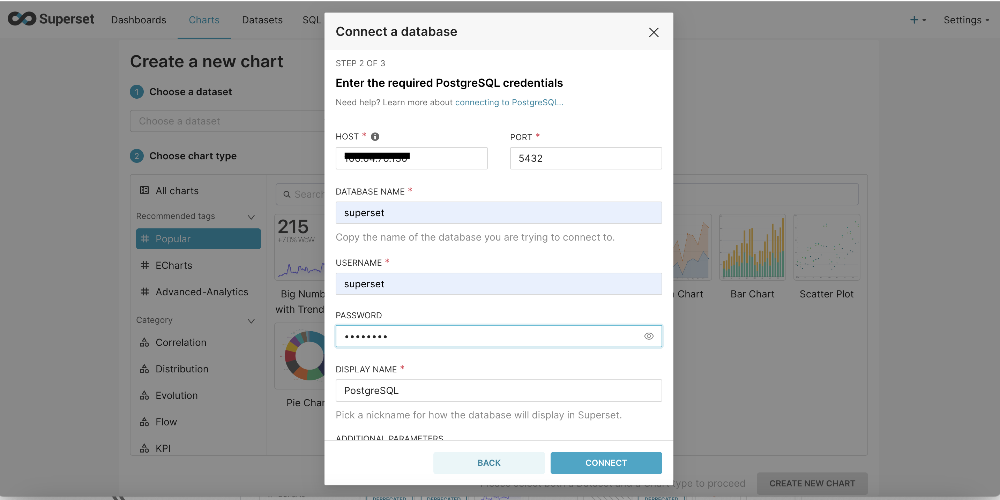
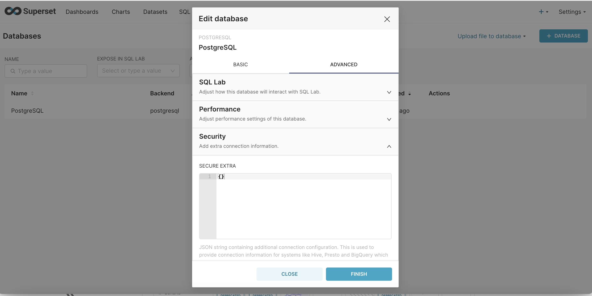
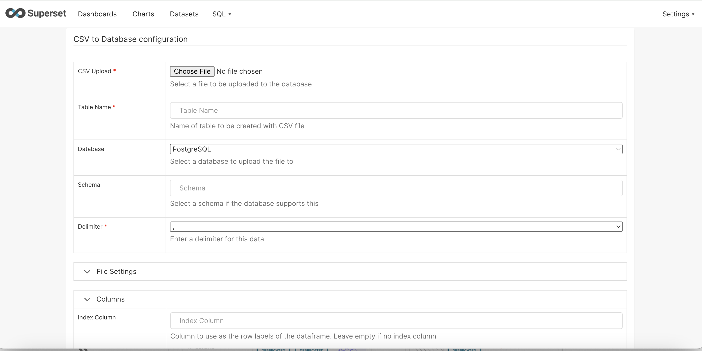

# Superset on EKS

## 介绍
[Apache Superset](https://superset.apache.org/)是一个流行的开源数据探索和可视化平台。Superset为数据科学家、分析师和业务用户提供了丰富的数据可视化集和简单的即席查询和分析功能。

这个[蓝图](https://github.com/awslabs/data-on-eks/tree/main/analytics/terraform/superset-on-eks)在EKS集群上部署Superset，使用Postgres作为后端数据库，Amazon Elastic Block Store (Amazon EBS)用于持久存储。

## AWS上的Superset

在AWS上，Superset可以在EKS集群上运行。通过使用EKS，您可以利用Kubernetes进行Superset服务的部署、扩展和管理。其他AWS服务如VPC、IAM和EBS提供了网络、安全和存储功能。

使用的关键AWS服务：

- Amazon EKS作为托管Kubernetes集群，用于运行Superset pod和服务。
- Amazon EBS提供可扩展的块存储，用于Superset持久存储。
- Amazon ECR存储Superset和依赖项的Docker容器镜像

## 部署解决方案

蓝图执行以下操作来在EKS上部署Superset：

- 创建带有公共和私有子网的新VPC
- 配置EKS集群控制平面和托管工作节点
- 创建Amazon EBS文件系统和访问点
- 构建Docker镜像并推送到Amazon ECR
- 通过Helm图表在EKS上安装Superset和服务
- 通过负载均衡器暴露Superset UI

 启用了Ingress，AWS LoadBalancer Controller将配置ALB来暴露Superset前端UI。

:::info
您可以通过更改`variables.tf`中的值来自定义蓝图，以部署到不同的区域（默认为`us-west-1`），使用不同的集群名称、子网/可用区数量，或禁用像fluentbit这样的附加组件
:::


### 先决条件

确保您已在计算机上安装了以下工具。

1. [aws cli](https://docs.aws.amazon.com/cli/latest/userguide/install-cliv2.html)
2. [kubectl](https://Kubernetes.io/docs/tasks/tools/)
3. [terraform](https://learn.hashicorp.com/tutorials/terraform/install-cli)
4. [Helm](https://helm.sh)

### 部署

克隆仓库

```bash
git clone https://github.com/awslabs/data-on-eks.git
```

导航到示例目录之一并运行`install.sh`脚本

```bash
cd data-on-eks/analytics/terraform/superset-on-eks
chmod +x install.sh
./install.sh
```
或者简单地
```bash
terraform init
terraform apply --auto-approve
```

### 架构概述


### 验证部署

部署完成后，我们可以访问Superset UI。出于演示目的，此蓝图使用公共LoadBalancer为Superset FrontEnd UI创建Ingress对象，并在corenode和superset节点中分别跨2个可用区部署多个pod。



您可以从输出superset_url中找到Superset前端的URL，或通过运行以下kubectl命令：

```sh
kubectl get ingress  -n superset

# 输出应该如下所示
NAME                CLASS     HOSTS   ADDRESS                                                                   PORTS   AGE
superset-ingress   aws-alb   *       k8s-superset-***.***.elb.amazonaws.com                                     80      125m
```


从输出中复制ADDRESS字段，然后打开浏览器并输入URL为`http://<address>/`。在提示时输入`admin`作为用户名和密码。我们可以像下面这样查看Superset UI。




为了可视化数据，我们首先需要连接到Postgres数据库。可以通过描述pod 'superset-postgresql-0'获取数据库的IP地址。基本上，数据库托管在superset-node上


```sh
k describe po superset-postgresql-0 -n superset

```


获取IP地址后，可以按照下面的截图建立数据库连接


一旦数据库连接建立，必须将其配置为允许文件上传。此功能允许将csv和其他格式文件上传为新表。请参考下面的截图

步骤-1：编辑数据库配置并导航到'ADVANCED'设置



步骤-2：在安全性下滚动到最后，并'勾选允许文件上传到数据库'


步骤-3：通过上传文件创建数据集



步骤-4：为了显示示例可视化，上传了一个关于各国COVID研究的示例CSV。这里有几个可视化，显示了各国在各种疫苗试验方面的进展


## 清理

要清理您的环境，请运行`cleanup.sh`脚本。

```bash
chmod +x cleanup.sh
./cleanup.sh
```
或者
```bash
terraform destroy --auto-approve
```
