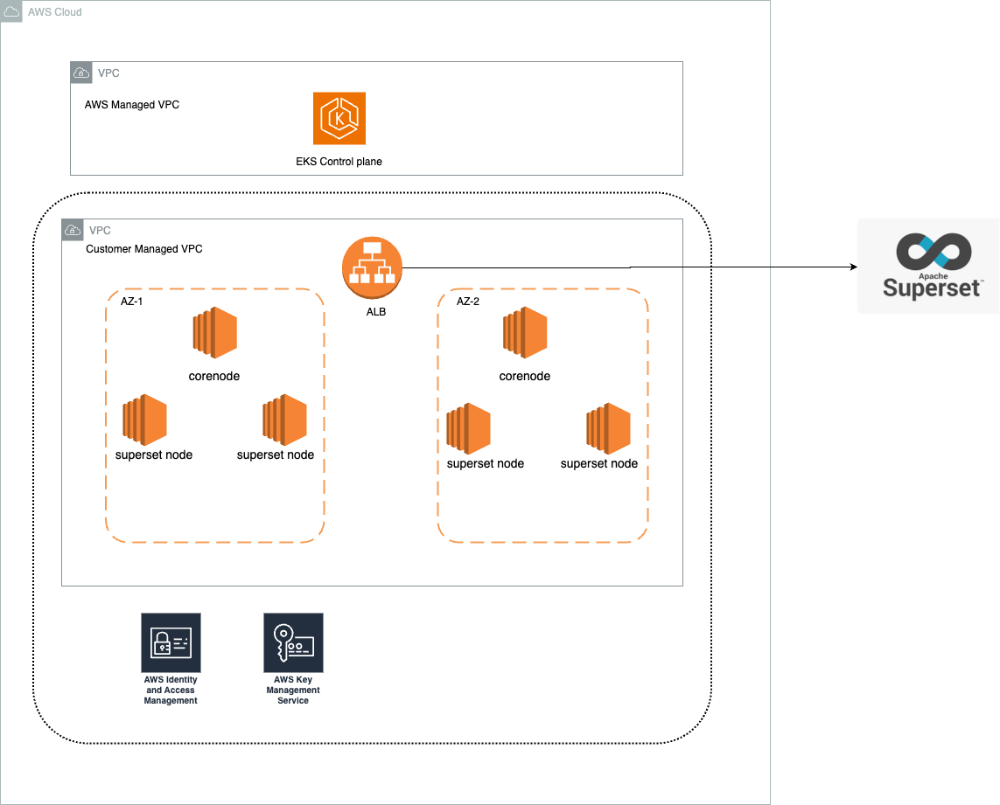
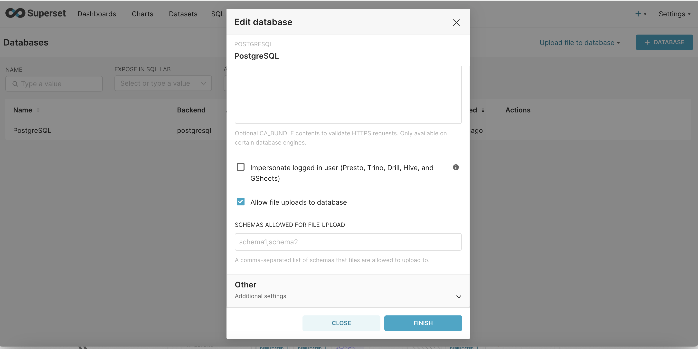
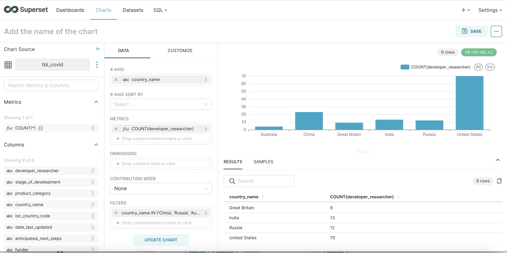

# Superset on EKS

## 介绍
[Apache Superset](https://superset.apache.org/) 是一个流行的开源数据探索和可视化平台。Superset 为数据科学家、分析师和业务用户提供丰富的数据可视化和简单的即席查询和分析功能。

这个[蓝图](https://github.com/awslabs/data-on-eks/tree/main/analytics/terraform/superset-on-eks)在 EKS 集群上部署 Superset，使用 Postgres 作为后端数据库，使用 Amazon Elastic Block Store (Amazon EBS) 进行持久存储。

## AWS 上的 Superset

在 AWS 上，Superset 可以在 EKS 集群上运行。通过使用 EKS，您可以利用 Kubernetes 进行 Superset 服务的部署、扩展和管理。其他 AWS 服务如 VPC、IAM 和 EBS 提供网络、安全和存储功能。

使用的关键 AWS 服务：

- Amazon EKS 作为托管 Kubernetes 集群来运行 Superset Pod 和服务。
- Amazon EBS 为 Superset 持久存储提供可扩展的块存储。
- Amazon ECR 存储 Superset 和依赖项的 Docker 容器镜像

## 部署解决方案

蓝图执行以下操作在 EKS 上部署 Superset：

- 创建具有公有和私有子网的新 VPC
- 配置 EKS 集群控制平面和托管工作节点
- 创建 Amazon EBS 文件系统和访问点
- 构建 Docker 镜像并推送到 Amazon ECR
- 通过 Helm 图表在 EKS 上安装 Superset 和服务
- 通过负载均衡器公开 Superset UI

启用 Ingress，AWS LoadBalancer Controller 将配置 ALB 以公开 Superset 前端 UI。

:::info
您可以通过更改 `variables.tf` 中的值来自定义蓝图，以部署到不同的区域（默认为 `us-west-1`），使用不同的集群名称、子网/可用区数量，或禁用 fluentbit 等附加组件
:::

### 先决条件

确保您已在计算机上安装了以下工具。

1. [aws cli](https://docs.aws.amazon.com/cli/latest/userguide/install-cliv2.html)
2. [kubectl](https://Kubernetes.io/docs/tasks/tools/)
3. [terraform](https://learn.hashicorp.com/tutorials/terraform/install-cli)
4. [Helm](https://helm.sh)

### 部署
克隆存储库

```bash
git clone https://github.com/awslabs/data-on-eks.git
```

导航到其中一个示例目录并运行 `install.sh` 脚本

```bash
cd data-on-eks/analytics/terraform/superset-on-eks
chmod +x install.sh
./install.sh
```
或者简单地
```bash
terraform init
terraform apply --auto-approve
```

### 架构概述



### 验证部署

部署完成后，我们可以访问 Superset UI。出于演示目的，此蓝图为 Superset 前端 UI 创建了具有公共 LoadBalancer 的 Ingress 对象，并且在 corenode 和 superset 节点中分别跨 2 个可用区有多个 Pod。


您可以从输出 superset_url 找到 Superset 前端的 URL，或通过运行以下 kubectl 命令：

```sh
kubectl get ingress  -n superset

# 输出应如下所示
NAME                CLASS     HOSTS   ADDRESS                                                                   PORTS   AGE
superset-ingress   aws-alb   *       k8s-superset-***.***.elb.amazonaws.com                                     80      125m
```

从输出中复制 ADDRESS 字段，然后打开浏览器并输入 URL 为 `http://<address>/`。提示时输入 `admin` 作为用户名和密码。我们可以查看如下的 Superset UI。


为了可视化数据，我们需要首先连接到 Postgres 数据库。数据库的 IP 地址可以通过描述 Pod 'superset-postgresql-0' 获得。基本上数据库托管在 superset-node 上

```sh
k describe po superset-postgresql-0 -n superset

```

获得 IP 地址后，可以按照下面的屏幕截图建立数据库连接


连接数据库后，必须配置它以允许文件上传。此功能允许将 csv 和其他格式文件上传为新表。请参考以下屏幕截图

步骤 1：编辑数据库配置并导航到"高级"设置


步骤 2：在安全性下滚动到最底部并"勾选允许文件上传到数据库"



步骤 3：通过上传文件创建数据集


步骤 4：为了显示示例可视化，上传了各国 COVID 研究的示例 CSV。以下是一些可视化，显示了各国在各种疫苗试验方面的进展




## 清理

要清理您的环境，请运行 `cleanup.sh` 脚本。

```bash
chmod +x cleanup.sh
./cleanup.sh
```
否则
```bash
terraform destroy --auto-approve
```
