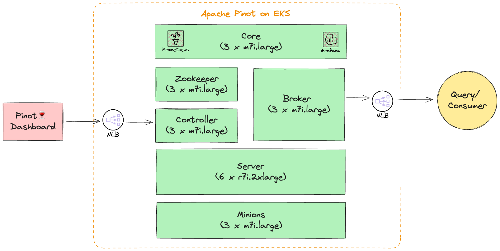

# 在 EKS 上部署 Apache Pinot (🍷)

[Apache Pinot](https://pinot.apache.org/) 是实时分布式 OLAP 数据存储，专为低延迟和高吞吐量分析而构建。您可以使用 Pinot 从流式或批处理数据源（例如 Apache Kafka、Amazon Kinesis Data Streams、Amazon S3 等）摄取并立即查询数据。

Apache Pinot 包括以下特征：

- 即使在极高吞吐量下也能实现**超低延迟**分析。
- **列式数据存储**，具有多种智能索引和预聚合技术。
- **向上**和**向外扩展**，没有上限。
- 基于集群大小和预期每秒查询数 (QPS) 阈值的**一致性能**。

它是面向用户的实时分析和其他分析用例的完美解决方案，包括内部仪表板、异常检测和即席数据探索。您可以在其[文档](https://docs.pinot.apache.org/)中了解更多关于 Apache Pinot 及其组件的信息。

在此蓝图中，我们将在由 Elastic Kubernetes Service (EKS) 管理的 Kubernetes 集群上部署 Apache Pinot。在 EKS 集群上部署 Apache Pinot 的一些好处包括

- 使用 Kubernetes 管理 Apache Pinot 集群
- 独立扩展每一层
- 没有单点故障
- 自动恢复

## 架构

在此设置中，我们在跨 3 个可用区的私有子网中部署所有 Apache Pinot 组件。这允许更大的灵活性和弹性。大多数 Pinot 组件可以在最新一代通用计算实例 (`m7i`) 上运行，除了需要内存优化实例类型 (`r7i`) 的服务器组件。我们还设置内部 NLB 以轻松与控制器和代理组件通信。

> 注意：所有 Apache Pinot 组件都在 `StatefulSet` 上运行。

> 注意：此蓝图目前不利用 [DeepStore](https://docs.pinot.apache.org/basics/components/table/segment/deep-store)，而是使用 EBS 卷在服务器上存储表段。

> 注意：根据您的用例，您需要更新集群大小和配置以更好地适应您的用例。您可以在[这里](https://startree.ai/blog/capacity-planning-in-apache-pinot-part-1)和[这里](https://startree.ai/blog/capacity-planning-in-apache-pinot-part-2)阅读更多关于 Apache Pinot 容量规划的信息。

## 先决条件 📝

确保您已在计算机上安装了以下工具。

1. [aws cli](https://docs.aws.amazon.com/cli/latest/userguide/install-cliv2.html)
2. [kubectl](https://Kubernetes.io/docs/tasks/tools/)
3. [terraform](https://learn.hashicorp.com/tutorials/terraform/install-cli)

## 部署 ⚙️

### 使用 Apache Pinot 部署 EKS 集群

首先，克隆存储库。
