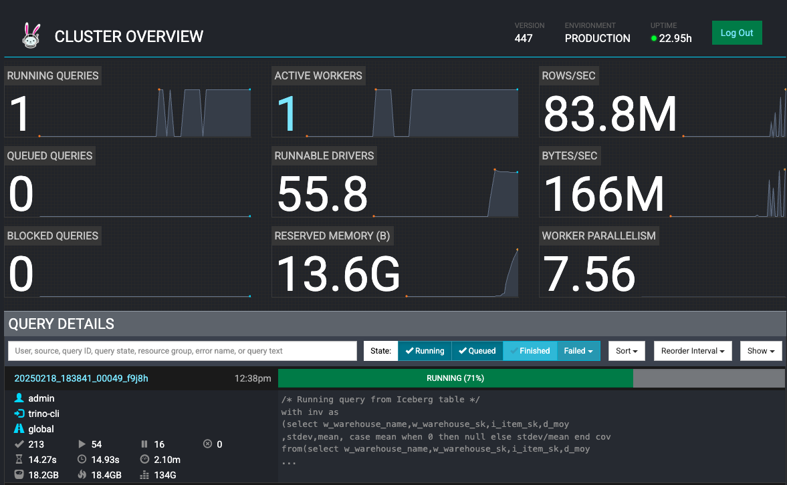

# 在EKS上部署Trino

## 介绍

[Trino](https://trino.io/)是一个开源、快速、分布式查询引擎，设计用于对包括Amazon S3、关系数据库、分布式数据存储和数据仓库在内的多种数据源运行大数据分析的SQL查询。

当Trino执行查询时，它通过将执行分解为一系列阶段的层次结构来实现，这些阶段作为一系列任务分布在Trino工作节点网络上。Trino集群由一个协调器和许多用于并行处理的工作节点组成，可以作为Kubernetes pod部署在EKS集群上。协调器和工作节点协作访问连接的数据源，模式和引用存储在目录中。要访问数据源，您可以使用Trino提供的众多[连接器](https://trino.io/docs/current/connector.html)之一来适配Trino。示例包括Hive、Iceberg和Kafka。有关Trino项目的更多详细信息，可以在此[链接](https://trino.io)上找到。

## 蓝图解决方案

此蓝图将在EKS集群（Kubernetes版本1.29）上部署Trino，节点使用Karpenter（v0.34.0）配置。为了优化成本和性能，Karpenter将为Trino协调器配置按需节点，为Trino工作节点配置EC2 Spot实例。借助Trino的多架构容器镜像，Karpenter [NodePool](https://karpenter.sh/v0.34/concepts/nodepools/)将允许配置具有不同CPU架构的EC2实例，包括基于AWS Graviton的实例。Trino使用[官方Helm图表](https://trinodb.github.io/charts/charts/trino/)部署，为用户提供自定义值以利用Hive和Iceberg连接器。示例将使用AWS上的Glue和Iceberg表作为后端数据源，使用S3作为存储。

## 部署解决方案

让我们来看一下部署步骤。

### 先决条件

确保您已在计算机上安装了以下工具。

1. [aws cli](https://docs.aws.amazon.com/cli/latest/userguide/install-cliv2.html)
2. [kubectl](https://Kubernetes.io/docs/tasks/tools/)
3. [terraform](https://learn.hashicorp.com/tutorials/terraform/install-cli)
4. [Trino CLI客户端](https://trino.io/docs/current/client/cli.html)
<details>
<summary> 点击查看Trino CLI的安装步骤</summary>
```bash
wget https://repo1.maven.org/maven2/io/trino/trino-cli/427/trino-cli-427-executable.jar
mv trino-cli-427-executable.jar trino
chmod +x trino
```
</details>

### 部署带有Trino的EKS集群

首先，克隆仓库

```bash
git clone https://github.com/awslabs/data-on-eks.git
```

导航到`distributed-databases/trino`并运行`install.sh`脚本。在提示时，输入您想要配置资源的AWS区域（例如，`us-west-2`）。

```bash
cd data-on-eks/distributed-databases/trino

./install.sh
```

### 验证部署

验证Amazon EKS集群

```bash
#选择您部署资源的区域
aws eks describe-cluster --name trino-on-eks --region us-west-2
```

更新本地kubeconfig，以便我们可以访问kubernetes集群（您也可以从terraform输出`configure_kubectl`中获取此命令）

```bash
aws eks update-kubeconfig --name trino-on-eks --region us-west-2
```

首先，让我们验证集群中是否有由Karpenter配置的工作节点。让我们也看看它们的可用区和容量类型（按需或竞价型）

```bash
kubectl get nodes --selector=karpenter.sh/nodepool=trino-sql-karpenter -L topology.kubernetes.io/zone -L karpenter.sh/capacity-type -L node.kubernetes.io/instance-type
```
#### 输出
```bash
NAME                                        STATUS   ROLES    AGE   VERSION               ZONE         CAPACITY-TYPE   INSTANCE-TYPE
ip-10-1-11-49.us-west-2.compute.internal    Ready    <none>   24m   v1.29.0-eks-5e0fdde   us-west-2b   on-demand       t4g.medium
```
我们可以看到，Karpenter为运行Trino协调器配置了按需节点。
:::info

对于像Trino这样在大规模并行处理集群上运行的分布式大数据查询引擎，建议将集群部署在同一可用区，以避免产生高额的跨可用区数据传输成本。这就是为什么Karpenter NodePool被配置为在同一可用区启动EKS节点的原因。

:::

现在，让我们验证在`trino`命名空间中运行的协调器和工作节点pod

```bash
kubectl get pods --namespace=trino
```
#### 输出
```bash
NAME                                 READY   STATUS    RESTARTS   AGE
trino-coordinator-5cfd685c8f-mchff   1/1     Running   0          37m
```

接下来，我们将端口转发trino服务，以便可以在本地访问它

```bash
kubectl -n trino port-forward service/trino 8080:8080
```

现在，让我们通过网络浏览器访问`http://localhost:8080`的Trino UI，并在登录窗口中使用用户名`admin`登录，如下所示：


Trino Web UI将显示0个活动工作节点：


## 使用Trino进行数据库查询执行

### 示例#1：使用Hive连接器

在此示例中，我们将使用AWS Glue设置Hive元存储，源数据存储在S3中，并使用爬虫从中推断模式以构建Glue表。

使用带有Glue连接器的EKS上的Trino，我们将使用Trino CLI运行示例SQL查询来检索数据。

#### 设置

从`examples`目录运行hive脚本，以设置带有2022年纽约出租车数据集（Parquet格式）的蓝图S3存储桶，并构建Glue元存储：

```bash
cd examples/
./hive-setup.sh
```

您将看到一些输出显示进度，如果成功，将看到将存储元数据的Glue表的名称为`hive`。

#### 运行查询
您应该已经安装了Trino CLI作为先决条件。蓝图已经配置了Hive连接器，连接到我们在上一节中设置的存储桶，因此您应该能够查询数据源，无需额外设置。

首先，如果您已关闭上一节的会话，请端口转发您的trino服务以在本地访问它：
```
kubectl -n trino port-forward service/trino 8080:8080
```

在端口转发运行时，打开另一个终端选项卡，其中有Trino CLI，并运行以下命令访问协调器：
```bash
./trino http://127.0.0.1:8080 --user admin
```

成功后，您将能够获得执行命令的提示。您可以使用`help`命令查看支持的命令列表。您运行的第一个命令将触发trino工作节点从0到1的自动扩展，并需要几分钟才能完成。

例如：

要显示目录列表，运行查询 - `SHOW CATALOGS;`，您可以看到蓝图配置的`hive`和`iceberg`目录等
#### 输出
```bash
 Catalog
---------
 hive
 iceberg
 system
 tpcds
 tpch
(5 rows)

Query 20240215_200117_00003_6jdxw, FINISHED, 1 node
Splits: 1 total, 1 done (100.00%)
0.49 [0 rows, 0B] [0 rows/s, 0B/s]
```

要查看Hive目录中的模式（数据库），运行查询 - `SHOW SCHEMAS FROM hive;`：
#### 输出
```bash
  Schema
--------------------
 information_schema
 taxi_hive_database
(2 rows)
```

让我们使用`taxi_hive_database`并显示此数据库中的表 -
```
USE hive.taxi_hive_database;
```
```
SHOW TABLES;
```
#### 输出
```
Table
-------
hive
(1 row)
```

最后，运行一个简单的查询来列出项目 - `SELECT * FROM hive LIMIT 5;`
#### 输出
```
vendorid |  tpep_pickup_datetime   |  tpep_dropoff_datetime  | passenger_count | trip_distance | ratecodeid | store_and_fwd_flag | pulocationid | dolocation>
----------+-------------------------+-------------------------+-----------------+---------------+------------+--------------------+--------------+----------->
        1 | 2022-09-01 00:28:12.000 | 2022-09-01 00:36:22.000 |             1.0 |           2.1 |        1.0 | N                  |          100 |          2>
        1 | 2022-11-01 00:24:49.000 | 2022-11-01 00:31:04.000 |             2.0 |           1.0 |        1.0 | N                  |          158 |          1>
        1 | 2022-11-01 00:37:32.000 | 2022-11-01 00:42:23.000 |             2.0 |           0.8 |        1.0 | N                  |          249 |          1>
        2 | 2022-09-01 00:02:24.000 | 2022-09-01 00:09:39.000 |             1.0 |          1.32 |        1.0 | N                  |          238 |          1>
        2 | 2022-09-01 00:47:25.000 | 2022-09-01 00:56:09.000 |             1.0 |          2.94 |        1.0 | N                  |
```

#### 清理Hive资源

1. 使用`exit`命令退出Trino CLI。

2. 从`examples`目录运行清理脚本，删除hive脚本创建的所有资源：

```
cd data-on-eks/distributed-databases/trino/examples
./hive-cleanup.sh
```
### 示例#2：使用Iceberg连接器

在此示例中，我们将设置使用AWS Glue作为目录类型的Apache Iceberg，并将数据以PARQUET格式存储在Amazon S3中。

使用带有Iceberg连接器的EKS上的Trino，我们将使用Trino CLI创建上述资源并运行示例SQL查询来插入和检索数据。

#### 运行查询

- 让我们找出蓝图创建的S3数据存储桶。我们将使用此存储桶以PARQUET格式存储Iceberg表中的数据。
```bash
cd data-on-eks/distributed-databases/trino
export BUCKET=$(terraform output --state="./terraform.tfstate" --raw data_bucket)
echo $BUCKET
```
#### 输出
```bash
trino-data-bucket-20240215180855515400000001
```

- 现在，让我们创建一个Iceberg模式，其中包含从[TPCDS](https://trino.io/docs/current/connector/tpcds.html)的sf10000模式表填充的表。我们将使用CREATE TABLE AS SELECT (CTAS)语句。SQL文件`examples/trino_sf10000_tpcds_to_iceberg.sql`包含以下SQL语句：

```bash
use tpcds.sf10000;
select * from tpcds.sf10000.item limit 10;
select * from tpcds.sf10000.warehouse limit 10;

/* 删除表和模式 */

drop schema iceberg.iceberg_schema;
drop table iceberg.iceberg_schema.warehouse;
drop table iceberg.iceberg_schema.item;
drop table iceberg.iceberg_schema.inventory;
drop table iceberg.iceberg_schema.date_dim;

/* Iceberg模式创建 */

create schema if not exists iceberg.iceberg_schema
with (LOCATION = 's3://trino-data-bucket-20240215180855515400000001/iceberg/');

/* 使用CTAS从tpcds表创建Iceberg表 */

create table if not exists iceberg.iceberg_schema.inventory
with (FORMAT = 'PARQUET')
as select *
from tpcds.sf10000.inventory;

create table if not exists iceberg.iceberg_schema.date_dim
with (FORMAT = 'PARQUET')
as select d_date_sk,
cast(d_date_id as varchar(16)) as d_date_id,
d_date,
d_month_seq,
d_week_seq,
d_quarter_seq,
d_year,
d_dow,
d_moy,
d_dom,
d_qoy,
d_fy_year,
d_fy_quarter_seq,
d_fy_week_seq,
cast(d_day_name as varchar(9)) as d_day_name,
cast(d_quarter_name as varchar(6)) as d_quarter_name,
cast(d_holiday as varchar(1)) as d_holiday,
cast(d_weekend as varchar(1)) as d_weekend,
cast(d_following_holiday as varchar(1)) as d_following_holiday,
d_first_dom,
d_last_dom,
d_same_day_ly,
d_same_day_lq,
cast(d_current_day as varchar(1)) as d_current_day,
cast(d_current_week as varchar(1)) as d_current_week,
cast(d_current_month as varchar(1)) as d_current_month,
cast(d_current_quarter as varchar(1)) as d_current_quarter
from tpcds.sf10000.date_dim;

create table if not exists iceberg.iceberg_schema.warehouse
with (FORMAT = 'PARQUET')
as select
w_warehouse_sk,
cast(w_warehouse_id as varchar(16)) as w_warehouse_id,
w_warehouse_name,
w_warehouse_sq_ft,
cast(w_street_number as varchar(10)) as w_street_number,
w_street_name,
cast(w_street_type as varchar(15)) as w_street_type,
cast(w_suite_number as varchar(10)) as w_suite_number,
w_city,
w_county,
cast(w_state as varchar(2)) as w_state,
cast(w_zip as varchar(10)) as w_zip,
w_country,
w_gmt_offset
from tpcds.sf10000.warehouse;

create table if not exists iceberg.iceberg_schema.item
with (FORMAT = 'PARQUET')
as select
i_item_sk,
cast(i_item_id as varchar(16)) as i_item_id,
i_rec_start_date,
i_rec_end_date,
i_item_desc,
i_current_price,
i_wholesale_cost,
i_brand_id,
cast(i_brand as varchar(50)) as i_brand,
i_class_id,
cast(i_class as varchar(50)) as i_class,
i_category_id,
cast(i_category as varchar(50)) as i_category,
i_manufact_id,
cast(i_manufact as varchar(50)) as i_manufact,
cast(i_size as varchar(50)) as i_size,
cast(i_formulation as varchar(20)) as i_formulation,
cast(i_color as varchar(20)) as i_color,
cast(i_units as varchar(10)) as i_units,
cast(i_container as varchar(10)) as i_container,
i_manager_id,
cast(i_product_name as varchar(50)) as i_product_name
from tpcds.sf10000.item;


/* 从Iceberg表中选择 */

select * from iceberg.iceberg_schema.date_dim limit 10;
select * from iceberg.iceberg_schema.item limit 10;
select * from iceberg.iceberg_schema.inventory limit 10;

/* 从Iceberg表运行查询 */

with inv as
(select w_warehouse_name,w_warehouse_sk,i_item_sk,d_moy
,stdev,mean, case mean when 0 then null else stdev/mean end cov
from(select w_warehouse_name,w_warehouse_sk,i_item_sk,d_moy
,stddev_samp(inv_quantity_on_hand) stdev,avg(inv_quantity_on_hand) mean
from iceberg.iceberg_schema.inventory
,iceberg.iceberg_schema.item
,iceberg.iceberg_schema.warehouse
,iceberg.iceberg_schema.date_dim
where inv_item_sk = i_item_sk
and inv_warehouse_sk = w_warehouse_sk
and inv_date_sk = d_date_sk
and d_year =1999
group by w_warehouse_name,w_warehouse_sk,i_item_sk,d_moy) foo
where case mean when 0 then 0 else stdev/mean end > 1)
select inv1.w_warehouse_sk,inv1.i_item_sk,inv1.d_moy,inv1.mean, inv1.cov
,inv2.w_warehouse_sk,inv2.i_item_sk,inv2.d_moy,inv2.mean, inv2.cov
from inv inv1,inv inv2
where inv1.i_item_sk = inv2.i_item_sk
and inv1.w_warehouse_sk = inv2.w_warehouse_sk
and inv1.d_moy=4
and inv2.d_moy=4+1
and inv1.cov > 1.5
order by inv1.w_warehouse_sk,inv1.i_item_sk,inv1.d_moy,inv1.mean,inv1.cov,inv2.d_moy,inv2.mean, inv2.cov;
```

- 上述SQL命令将执行以下操作：
    - 创建名为`iceberg_schema`的Iceberg模式
    - 创建4个Iceberg表 - `warehouse`、`item`、`inventory`和`date_dim`，数据来自tpcds的相同表
    - 从上述Iceberg表查询数据

- 现在，让我们使用Trino CLI执行上述SQL命令：
```bash
envsubst < examples/trino_sf10000_tpcds_to_iceberg.sql > examples/iceberg.sql
./trino --file 'examples/iceberg.sql' --server http://localhost:8080 --user admin --ignore-errors
```

- 您可以在Trino UI网络监视器中看到已完成和正在运行的SQL查询，如下所示：


- 让我们打开另一个终端，查看KEDA如何在上述SQL命令运行时扩展Trino工作节点pod：
```bash
kubectl get hpa -n trino -w
```
#### 输出
```bash
NAME                                REFERENCE                 TARGETS                MINPODS   MAXPODS   REPLICAS   AGE
keda-hpa-keda-scaler-trino-worker   Deployment/trino-worker   <unknown>/1, <unknown>/1 + 1 more...   1         15        0          37m
keda-hpa-keda-scaler-trino-worker   Deployment/trino-worker   0/1, 1/1 + 1 more...                   1         15        1          38m
keda-hpa-keda-scaler-trino-worker   Deployment/trino-worker   0/1, 500m/1 + 1 more...                1         15        1          40m
keda-hpa-keda-scaler-trino-worker   Deployment/trino-worker   0/1, 0/1 + 1 more...                   1         15        1          40m
keda-hpa-keda-scaler-trino-worker   Deployment/trino-worker   0/1, 0/1 + 1 more...                   1         15        1          40m
keda-hpa-keda-scaler-trino-worker   Deployment/trino-worker   0/1, 0/1 + 1 more...                   1         15        1          40m
keda-hpa-keda-scaler-trino-worker   Deployment/trino-worker   0/1, 0/1 + 1 more...                   1         15        2          41m
keda-hpa-keda-scaler-trino-worker   Deployment/trino-worker   0/1, 0/1 + 1 more...                   1         15        2          41m
keda-hpa-keda-scaler-trino-worker   Deployment/trino-worker   0/1, 0/1 + 1 more...                   1         15        2          41m
```
您可以看到HPA随着查询负载和工作节点平均CPU利用率的增加，从初始0个工作节点扩展到2个工作节点：


### 示例#3（可选）：Trino中的容错执行
[容错执行](https://trino.io/docs/current/admin/fault-tolerant-execution.html)是Trino中的一种选择性机制，使用[Project Tardigrade](https://trino.io/blog/2022/05/05/tardigrade-launch.html#what-is-project-tardigrade)实现。如果没有容错配置，当查询的任何组件任务因任何原因（例如，工作节点故障或终止）而失败时，Trino查询就会失败。这些失败的查询必须从头开始重新启动，导致更长的执行时间、计算资源浪费和支出，特别是对于长时间运行的查询。

当在Trino中配置了容错执行和[重试策略](https://trino.io/docs/current/admin/fault-tolerant-execution.html#retry-policy)时，中间交换数据会使用[交换管理器](https://trino.io/docs/current/admin/fault-tolerant-execution.html#exchange-manager)存储在外部存储（如Amazon S3或HDFS）中。然后，Trino会重试失败的查询（如果重试策略配置为"QUERY"）或失败的任务（如果重试策略配置为"TASK"）。在查询执行期间发生工作节点中断或其他故障时，Trino的剩余工作节点会重用交换管理器数据来重试并完成查询。
:::info
**QUERY重试策略**指示Trino在工作节点上发生错误时重试整个查询。当Trino集群的大部分工作负载由许多小查询组成时，建议使用此重试策略。

**TASK重试策略**指示Trino在失败时重试单个任务。当Trino执行大型批处理查询时，建议使用此策略。集群可以更有效地重试查询中的较小任务，而不是重试整个查询。
:::
- 此蓝图已部署了具有容错配置的Trino集群，在协调器和工作节点pod中的**`config.properties`**文件中使用`TASK`重试策略。让我们通过在协调器pod内打开bash命令shell来验证这一点：
```bash
COORDINATOR_POD=$(kubectl get pods -l "app.kubernetes.io/instance=trino,app.kubernetes.io/component=coordinator" -o name -n trino)
kubectl exec --stdin --tty $COORDINATOR_POD -n trino -- /bin/bash
cat /etc/trino/config.properties
```
#### 输出
```bash
coordinator=true
node-scheduler.include-coordinator=false
http-server.http.port=8080
query.max-memory=280GB
query.max-memory-per-node=22GB
discovery.uri=http://localhost:8080
retry-policy=TASK
exchange.compression-enabled=true
query.low-memory-killer.delay=0s
query.remote-task.max-error-duration=1m
query.hash-partition-count=50
```
- 蓝图还在协调器和工作节点pod中的**`exchange-manager.properties`**文件中使用Amazon S3存储桶配置了交换管理器。让我们也在协调器pod内验证这一点
```bash
cat /etc/trino/exchange-manager.properties
```
#### 输出
```bash
exchange-manager.name=filesystem
exchange.base-directories=s3://trino-exchange-bucket-20240215180855570800000004
exchange.s3.region=us-west-2
exchange.s3.iam-role=arn:aws:iam::xxxxxxxxxx:role/trino-sa-role
```
请记下上面的交换管理器S3存储桶名称。您可以在AWS控制台中浏览上述S3存储桶的内容。当没有查询运行时，它将为空。
- 现在，让我们退出协调器pod的bash shell
```bash
exit
```

通过以下步骤，我们现在将通过运行`select`查询并在查询仍在运行时终止几个Trino工作节点来测试容错执行。
- 在`examples`文件夹中找到`trino_select_query_iceberg.sql`文件，其中包含以下SQL命令：
```bash
with inv as
(select w_warehouse_name,w_warehouse_sk,i_item_sk,d_moy
,stdev,mean, case mean when 0 then null else stdev/mean end cov
from(select w_warehouse_name,w_warehouse_sk,i_item_sk,d_moy
,stddev_samp(inv_quantity_on_hand) stdev,avg(inv_quantity_on_hand) mean
from iceberg.iceberg_schema.inventory
,iceberg.iceberg_schema.item
,iceberg.iceberg_schema.warehouse
,iceberg.iceberg_schema.date_dim
where inv_item_sk = i_item_sk
and inv_warehouse_sk = w_warehouse_sk
and inv_date_sk = d_date_sk
and d_year =1999
group by w_warehouse_name,w_warehouse_sk,i_item_sk,d_moy) foo
where case mean when 0 then 0 else stdev/mean end > 1)
select inv1.w_warehouse_sk,inv1.i_item_sk,inv1.d_moy,inv1.mean, inv1.cov
,inv2.w_warehouse_sk,inv2.i_item_sk,inv2.d_moy,inv2.mean, inv2.cov
from inv inv1,inv inv2
where inv1.i_item_sk = inv2.i_item_sk
and inv1.w_warehouse_sk = inv2.w_warehouse_sk
and inv1.d_moy=4
and inv2.d_moy=4+1
and inv1.cov > 1.5
order by inv1.w_warehouse_sk,inv1.i_item_sk,inv1.d_moy,inv1.mean,inv1.cov,inv2.d_moy,inv2.mean, inv2.cov;
```
- 现在，让我们先运行select查询
```bash
./trino --file 'examples/trino_select_query_iceberg.sql' --server http://localhost:8080 --user admin --ignore-errors
```
- 在上述命令之后立即，当上述查询仍在运行时，打开另一个终端并使用以下命令将工作节点pod缩减到只有1个工作节点，终止所有其他工作节点：
```bash
kubectl scale deployment trino-worker -n trino --replicas=1
```
在浏览器上查看Trino Web UI，现在只有1个活动工作节点在运行，因为其他工作节点已被终止：


- 转到Amazon S3控制台，验证中间交换数据在名称以`trino-exchange-bucket`开头的交换管理器S3存储桶中的存储。


- 现在，让我们再次查看Trino Web UI监视器，以验证查询的完成，尽管由于终止的工作节点导致6个任务失败（我们在下面的截图中用红色圈出了它们）。

:::info
请注意，根据在终止的工作节点上运行的任务数量，Trino Web UI中的失败任务数量可能不同。

此外，根据由使用CPU利用率指标的水平Pod自动扩缩器(HPA)扩展的工作节点pod，您可能会看到不同数量的活动工作节点
:::


#### 清理Iceberg资源

1. 让我们打开Trino CLI
```bash
./trino http://127.0.0.1:8080 --user admin
```

2. 现在，让我们通过在Trino CLI上运行以下SQL命令来删除Iceberg表和模式：
 ```bash
drop table iceberg.iceberg_schema.warehouse;
drop table iceberg.iceberg_schema.item;
drop table iceberg.iceberg_schema.inventory;
drop table iceberg.iceberg_schema.date_dim;
drop schema iceberg.iceberg_schema;
```
3. 使用`exit`命令退出Trino CLI。

## 清理 🧹

要删除作为此蓝图一部分配置的所有组件，请使用以下命令销毁所有资源。

```bash
cd data-on-eks/distributed-databases/trino
./cleanup.sh
```

:::caution

为避免对您的AWS账户产生不必要的费用，请删除在此部署期间创建的所有AWS资源

例如，Trino交换管理器的S3存储桶
:::

## 结论

Trino是一种用于从数据源快速查询大量数据的工具。在此示例中，我们分享了一个基于terraform的蓝图，该蓝图在Amazon EKS上部署了具有容错配置的Trino，以及构建完整EKS集群所需的附加组件（即Karpenter用于节点自动扩展，Metrics server和HPA用于Trino工作节点pod自动扩展，使用Prometheus/Grafana堆栈进行监控）。在众多功能中，我们重点介绍了几个示例，展示如何使用Amazon S3作为存储创建Iceberg或Hive数据存储，并运行简单的Trino查询以获取结果。我们还在Spot实例上部署和扩展了Trino工作节点，以优化成本。我们还演示了Trino的容错功能，这使其适合使用Spot实例来降低长时间运行的批处理查询的成本。
