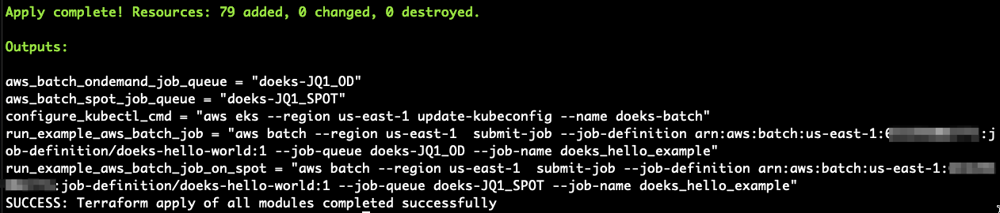

# AWS Batch on EKS
AWS Batch 是一个完全托管的 AWS 原生批处理计算服务，它在 AWS 托管容器编排服务（如 Amazon Elastic Kubernetes Service (EKS)）之上规划、调度和运行您的容器化批处理工作负载（机器学习、仿真和分析）。

AWS Batch 为高性能计算工作负载添加了必要的操作语义和资源，使它们能够在您现有的 EKS 集群上高效且经济地运行。

具体来说，Batch 提供了一个始终在线的作业队列来接受工作请求。您创建一个 AWS Batch 作业定义（这是作业的模板），然后将它们提交到 Batch 作业队列。然后 Batch 负责为您的 EKS 集群在 Batch 特定的命名空间中配置节点，并在这些实例上放置 Pod 来运行您的工作负载。

此示例提供了一个蓝图，用于建立使用 AWS Batch 在 Amazon EKS 集群上运行工作负载的完整环境，包括：
* 所有必要的支持基础设施，如 VPC、IAM 角色、安全组等。
* 用于您的工作负载的 EKS 集群
* 用于在 EC2 按需和 Spot 实例上运行作业的 AWS Batch 资源。

您可以在[此处](https://github.com/awslabs/data-on-eks/tree/main/schedulers/terraform/aws-batch-eks)找到蓝图。

## 注意事项

AWS Batch 适用于离线分析和数据处理任务，例如重新格式化媒体、训练机器学习模型、批量推理或其他不与用户交互的计算和数据密集型任务。

特别是，Batch *针对运行时间超过三分钟的作业进行了调优*。如果您的作业很短（少于一分钟），请考虑将更多工作打包到单个 AWS Batch 作业请求中，以增加作业的总运行时间。

## 先决条件

确保您已在本地安装了以下工具：

1. [aws cli](https://docs.aws.amazon.com/cli/latest/userguide/install-cliv2.html)
2. [kubectl](https://Kubernetes.io/docs/tasks/tools/)
3. [terraform](https://learn.hashicorp.com/tutorials/terraform/install-cli)

## 部署

**要配置此示例：**

1. 将存储库克隆到本地机器。
   ```bash
   git clone https://github.com/awslabs/data-on-eks.git
   cd data-on-eks/schedulers/terraform/aws-batch
   ```
2. 运行安装脚本。
   ```bash
   /bin/sh install.sh
   ```
   在命令提示符处输入区域以继续。

脚本将运行 Terraform 来建立所有资源。完成后，您将看到如下的 terraform 输出。



在您的环境中配置了以下组件：

- 示例 VPC，包含 2 个私有子网和 2 个公有子网
- 公有子网的互联网网关和私有子网的 NAT 网关
- 带有一个托管节点组的 EKS 集群控制平面。
- EKS 托管插件：VPC_CNI、CoreDNS、EBS_CSI_Driver、CloudWatch
- AWS Batch 资源，包括
  - 按需计算环境和作业队列
  - Spot 计算环境和作业队列
  - 运行 `echo "hello world!"` 的示例 Batch 作业定义

## 验证

## 使用 AWS Batch 在您的 EKS 集群上运行示例作业

以下命令将更新本地机器上的 `kubeconfig`，并允许您使用 `kubectl` 与 EKS 集群交互以验证部署。

### 运行 `update-kubeconfig` 命令

从 `terraform apply` 的 `configure_kubectl_cmd` 输出值运行命令。如果您没有此命令，可以使用 `terraform output` 命令获取 terraform 堆栈输出值。

```bash
# 不要复制这个！这只是一个示例，请参阅上面的运行内容。
aws eks --region us-east-1 update-kubeconfig --name doeks-batch
```

### 列出节点

配置 `kubectl` 后，您可以使用它来检查集群节点和命名空间。要获取节点信息，请运行以下命令。

```bash
kubectl get nodes
```

输出应如下所示。

```
NAME                           STATUS   ROLES    AGE    VERSION
ip-10-1-107-168.ec2.internal   Ready    <none>   3m7s   v1.30.2-eks-1552ad0
ip-10-1-141-25.ec2.internal    Ready    <none>   3m7s   v1.30.2-eks-1552ad0
```

要获取集群创建的命名空间，请运行以下命令。

```bash
kubectl get ns
```

输出应如下所示。

```
NAME                STATUS   AGE
amazon-cloudwatch   Active   2m22s
default             Active   10m
doeks-aws-batch     Active   103s
kube-node-lease     Active   10m
kube-public         Active   10m
kube-system         Active   10m
```

命名空间 `doeks-aws-batch` 将被 Batch 用于添加 Batch 管理的 EC2 实例作为节点并在这些节点上运行作业。

:::note
AWS Batch kubernetes 命名空间可作为 terraform 的输入变量进行配置。如果您选择在 `variables.tf` 文件中更改它，那么您需要调整后续命令以适应更改。
:::

### 运行"Hello World!"作业

`terraform apply` 的输出包含在按需和 Spot 作业队列上运行示例 **Hello World!** 作业定义的 AWS CLI 命令。您可以使用 `terraform output` 再次查看这些命令。

**要在按需资源上运行示例作业定义：**

1. 从 terraform 输出 `run_example_aws_batch_job` 运行提供的命令。它应该看起来像：
   ```bash
   JOB_ID=$(aws batch --region us-east-1  submit-job --job-definition arn:aws:batch:us-east-1:653295002771:job-definition/doeks-hello-world:2 --job-queue doeks-JQ1_OD --job-name doeks_hello_example --output text --query jobId) && echo $JOB_ID
   ## 输出应该是 Batch 作业 ID
   be1f781d-753e-4d10-a7d4-1b6de68574fc
   ```
   响应将填充 `JOB_ID` shell 变量，您可以在后续步骤中使用它。

## 检查状态

您可以使用 AWS CLI 从 AWS Batch API 检查作业状态：

```bash
aws batch --no-cli-pager \
describe-jobs --jobs $JOB_ID --query "jobs[].[jobId,status]"
```

这将输出类似以下内容：

```
[
    [
        "a13e1cff-121c-4a0b-a9c5-fab953136e20",
        "RUNNABLE"
    ]
]
```

:::tip
如果您看到空结果，很可能是您使用的默认 AWS 区域与部署的区域不同。通过设置 `AWS_DEFAULT_REGION` shell 变量来调整默认区域的值。

```bash
export AWS_DEFAULT_REGION=us-east-1
```
:::

我们可以使用 `kubectl` 监控 Batch 管理的节点和 Pod 的状态。首先，让我们跟踪节点启动并加入集群：

```bash
kubectl get nodes -w
```
这将持续监控 EKS 节点的状态，并定期输出它们的就绪状态。

```
NAME                           STATUS   ROLES    AGE   VERSION
ip-10-1-107-168.ec2.internal   Ready    <none>   12m   v1.30.2-eks-1552ad0
ip-10-1-141-25.ec2.internal    Ready    <none>   12m   v1.30.2-eks-1552ad0
ip-10-1-60-65.ec2.internal     NotReady   <none>   0s    v1.30.2-eks-1552ad0
ip-10-1-60-65.ec2.internal     NotReady   <none>   0s    v1.30.2-eks-1552ad0
ip-10-1-60-65.ec2.internal     NotReady   <none>   0s    v1.30.2-eks-1552ad0
# ... 更多行
```

当新的 Batch 管理节点正在启动时（状态为 **NotReady** 的新节点），您可以按 `Control-c` 键组合退出监视过程。这将允许您监控在 AWS Batch 命名空间中启动的 Pod 状态：

```bash
kubectl get pods -n doeks-aws-batch -w
```
:::note
AWS Batch kubernetes 命名空间可作为 terraform 的输入变量进行配置。如果您选择在 `variables.tf` 文件中更改它，那么您需要调整前面的命令以适应更改。
:::

这将持续监控 Batch 在集群上放置的 Pod 状态，并定期输出它们的状态。

```
NAME                                             READY   STATUS    RESTARTS   AGE
aws-batch.32d8f53f-29dc-31b4-9ce4-13504ccf74c1   0/1     Pending   0          0s
aws-batch.32d8f53f-29dc-31b4-9ce4-13504ccf74c1   0/1     ContainerCreating   0          0s
aws-batch.32d8f53f-29dc-31b4-9ce4-13504ccf74c1   1/1     Running             0          17s
aws-batch.32d8f53f-29dc-31b4-9ce4-13504ccf74c1   0/1     Completed           0          52s
aws-batch.32d8f53f-29dc-31b4-9ce4-13504ccf74c1   0/1     Completed           0          53s
aws-batch.32d8f53f-29dc-31b4-9ce4-13504ccf74c1   0/1     Terminating         0          53s
aws-batch.32d8f53f-29dc-31b4-9ce4-13504ccf74c1   0/1     Terminating         0          53s
```

一旦 Pod 处于 **Terminating** 状态，您可以按 `Control-c` 键组合退出监视过程。要从 AWS Batch 查看作业状态，请使用以下命令：

```bash
aws batch --no-cli-pager \
describe-jobs --jobs $JOB_ID --query "jobs[].[jobId,status]"
```

这将显示作业 ID 和状态，应该是 `SUCCEEDED`。

```
[
    [
        "a13e1cff-121c-4a0b-a9c5-fab953136e20",
        "SUCCEEDED"
    ]
]
```

要在 CloudWatch 日志组管理控制台中找到应用程序容器日志，我们需要应用程序容器的 Pod 名称。`kubectl get pods` 输出没有给我们一个好的方法来确定哪个 Pod 是带有应用程序容器的 Pod。此外，一旦 Pod 被终止，Kubernetes 调度器就无法再提供有关作业节点或 Pod 的任何信息。好在 AWS Batch 保留了作业记录！

我们可以使用 AWS Batch 的 API 查询主节点的 `podName` 和其他信息。要从 MNP 作业获取特定节点的信息，您需要在作业 ID 后面加上模式 `"#<NODE_INDEX>"`。对于我们在作业定义中定义为索引 `"0"` 的主节点，这将转换为以下 AWS CLI 命令：

```bash
aws batch describe-jobs --jobs "$JOB_ID" --query "jobs[].eksAttempts[].{nodeName: nodeName, podName: podName}"
```

输出应类似于以下内容。

```
[
    {
        "nodeName": "ip-10-1-60-65.ec2.internal",
        "podName": "aws-batch.32d8f53f-29dc-31b4-9ce4-13504ccf74c1"
    }
]
```

**要查看应用程序容器日志：**
1. 导航到 [Amazon CloudWatch 管理控制台日志组面板](https://console.aws.amazon.com/cloudwatch/home?#logsV2:log-groups$3FlogGroupNameFilter$3Ddoeks-batch)。
2. 在 **日志组** 列表表中，选择您集群的应用程序日志。这些由您的集群名称和后缀 `application` 标识。
   
3. 在 **日志流** 列表表中，输入前面步骤中 `podName` 的值。这将突出显示 Pod 中两个容器的两个日志。选择 `application` 容器的日志流。
   
4. 在 **日志事件** 部分，在过滤栏中，选择 **Display**，然后选择 **View in plain text**。您应该在日志事件的 `"log"` 属性中看到日志消息"Hello World!"。

## 清理

要清理您的环境——从集群中删除所有 AWS Batch 资源和 kubernetes 构造——请运行 `cleanup.sh` 脚本。

```bash
chmod +x cleanup.sh
./cleanup.sh
```

为避免 CloudWatch 日志产生数据费用，您还应该从集群中删除日志组。您可以通过导航到 [CloudWatch 管理控制台的 **日志组** 页面](https://console.aws.amazon.com/cloudwatch/home?#logsV2:log-groups$3FlogGroupNameFilter$3Ddoeks-batch) 找到这些。
