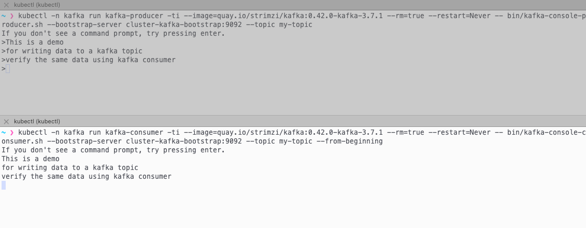

import CollapsibleContent from '../../../../../../src/components/CollapsibleContent';

# Apache Kafka
[Apache Kafka](https://kafka.apache.org/)是一个开源分布式事件流处理平台，被数千家公司用于高性能数据管道、流分析、数据集成和关键任务应用程序。这个蓝图使用**KRaft (Kafka Raft)模式**实现Kafka，这是一个重要的架构改进，消除了对Zookeeper的需求。

## 为什么选择KRaft以及它是什么？
KRaft模式简化了Kafka部署，增强了可扩展性，并改进了整体系统性能。通过使用内置的共识协议，KRaft减少了操作复杂性，可能加快了代理启动时间，并允许更好地处理元数据操作。这种架构转变使Kafka能够更有效地管理更大的集群，对于希望简化其事件流基础设施并为未来可扩展性需求做准备的组织来说，这是一个有吸引力的选择。

## 用于Apache Kafka的Strimzi
[Strimzi](https://strimzi.io/)提供了一种在各种部署配置中在Kubernetes上运行Apache Kafka集群的方法。Strimzi结合了安全性和简单配置，基于操作符模式使用kubectl和/或GitOps在Kubernetes上部署和管理Kafka。

从版本`0.32.0`开始，Strimzi提供了使用KRaft部署Kafka集群的完全支持，使组织更容易利用这种新架构。通过使用Strimzi，您可以在Kubernetes上无缝部署和管理KRaft模式的Kafka集群，利用其自定义资源定义(CRDs)和操作符来处理配置和生命周期管理的复杂性。

## 架构

:::info

架构图正在制作中

:::

<CollapsibleContent header={<h2><span>托管替代方案</span></h2>}>

### Amazon Managed Streaming for Apache Kafka (MSK)
[Amazon Managed Streaming for Apache Kafka (Amazon MSK)](https://aws.amazon.com/msk/)是一项完全托管的服务，使您能够构建和运行使用Apache Kafka处理流数据的应用程序。Amazon MSK提供控制平面操作，如创建、更新和删除集群。它允许您使用Apache Kafka数据平面操作，如生产和消费数据。它运行开源版本的Apache Kafka。这意味着支持来自合作伙伴和Apache Kafka社区的现有应用程序、工具和插件。您可以使用Amazon MSK创建使用[支持的Apache Kafka版本](https://docs.aws.amazon.com/msk/latest/developerguide/supported-kafka-versions.html)中列出的任何Apache Kafka版本的集群。Amazon MSK提供基于集群或无服务器的部署类型。

### Amazon Kinesis Data Streams (KDS)
[Amazon Kinesis Data Streams (KDS)](https://aws.amazon.com/kinesis/data-streams/)允许用户实时收集和处理大量数据记录。您可以创建数据处理应用程序，称为Kinesis Data Streams应用程序。典型的Kinesis Data Streams应用程序从数据流中读取数据记录。您可以将处理后的记录发送到仪表板，用它们生成警报，动态更改定价和广告策略，或将数据发送到各种其他AWS服务。Kinesis Data Streams支持您选择的流处理框架，包括Kinesis Client Library (KCL)、Apache Flink和Apache Spark Streaming。它是无服务器的，并且自动扩展。

</CollapsibleContent>

<CollapsibleContent header={<h2><span>自管理Kafka时的存储考虑因素</span></h2>}>

Kafka集群最常见的资源瓶颈是网络吞吐量、存储吞吐量以及使用网络附加存储（如[Amazon Elastic Block Store (EBS)](https://aws.amazon.com/ebs/)）的代理之间的网络吞吐量。

### 使用EBS作为持久存储后端的优势
1. **提高灵活性和更快的恢复**：容错通常通过集群内的代理（服务器）复制和/或维护跨可用区或区域的副本来实现。由于EBS卷的生命周期独立于Kafka代理，如果代理失败需要替换，附加到失败代理的EBS卷可以重新附加到替换代理。替换代理的大部分复制数据已经在EBS卷中可用，不需要通过网络从另一个代理复制。这避免了使替换代理跟上当前操作所需的大部分复制流量。
2. **及时扩展**：EBS卷的特性可以在使用时进行修改。代理存储可以随时间自动扩展，而不是为峰值配置存储或添加额外的代理。
3. **针对频繁访问的高吞吐量工作负载进行优化**：如st1这样的卷类型可能是一个很好的选择，因为这些卷提供相对较低的成本，支持大型1 MiB I/O块大小，每卷最大IOPS为500，并包括能够突发至每TB 250 MB/s，基准吞吐量为每TB 40 MB/s，每卷最大吞吐量为500 MB/s的能力。

### 在AWS上自管理Kafka时应该使用什么EBS卷？
* 通用型SSD卷**gp3**具有平衡的价格和性能，被广泛使用，您可以**独立**配置存储（最高16TiB）、IOPS（最高16,000）和吞吐量（最高1,000MiB/s）
* **st1**是一种低成本HDD选项，适用于频繁访问和吞吐量密集型工作负载，最高500 IOPS和500 MiB/s
* 对于关键应用程序，如Zookeeper，预置IOPS卷（**io2 Block Express, io2**）提供更高的耐久性

### 出于性能原因使用NVMe SSD实例存储如何？
虽然EBS提供了灵活性和易于管理，但一些高性能用例可能受益于使用本地NVMe SSD实例存储。这种方法可以提供显著的性能改进，但在数据持久性和操作复杂性方面存在权衡。

#### 使用NVMe SSD实例存储的考虑因素和挑战
1. **数据持久性**：本地存储是临时的。如果实例失败或终止，该存储上的数据将丢失。这需要仔细考虑您的复制策略和灾难恢复计划，特别是如果集群很大（数百TB的数据）。
2. **集群升级**：升级Kafka或EKS变得更加复杂，因为您需要确保在对具有本地存储的节点进行更改之前，数据被正确迁移或复制。
3. **扩展复杂性**：扩展集群可能需要数据重新平衡，与使用网络附加存储相比，这可能更耗时和资源密集。
4. **实例类型锁定**：您的实例类型选择变得更加有限，因为您需要选择具有适当本地存储选项的实例。

#### 那么，什么时候应该考虑使用本地存储？
1. 对于每毫秒延迟都很重要的极高性能要求。
2. 当您的用例可以容忍单个节点故障可能导致的数据丢失，依靠Kafka的复制来保证数据持久性。

虽然本地存储可以提供性能优势，但重要的是要仔细权衡这些优势与操作挑战，特别是在像EKS这样的动态环境中。对于大多数用例，我们建议从EBS存储开始，因为它具有灵活性和更容易管理的特点，只有在特定的高性能场景中，权衡是合理的，才考虑本地存储。

</CollapsibleContent>

<CollapsibleContent header={<h2><span>部署解决方案</span></h2>}>

在这个[示例](https://github.com/awslabs/data-on-eks/tree/main/streaming/kafka)中，您将配置以下资源在EKS上运行Kafka集群。

此示例将Kafka与EKS集群一起部署到新的VPC中。

- 创建一个新的示例VPC，3个私有子网和3个公共子网。
- 为公共子网创建互联网网关，为私有子网创建NAT网关。
- 创建具有公共端点的EKS集群控制平面（仅用于演示目的）和一个托管节点组。
- 部署指标服务器、Karpenter、自管理ebs-csi-driver、Strimzi Kafka操作符、Grafana操作符。
- Strimzi Kafka操作符是部署到`strimzi-kafka-operator`命名空间的Apache Kafka的Kubernetes操作符。默认情况下，操作符监视并处理所有命名空间中的`kafka`。

### 先决条件
确保您已在机器上安装了以下工具。

1. [aws cli](https://docs.aws.amazon.com/cli/latest/userguide/install-cliv2.html)
2. [kubectl](https://Kubernetes.io/docs/tasks/tools/)
3. [terraform](https://learn.hashicorp.com/tutorials/terraform/install-cli)

### 部署

克隆仓库：

```bash
git clone https://github.com/awslabs/data-on-eks.git
```

导航到示例目录之一并运行`install.sh`脚本：

```bash
cd data-on-eks/streaming/kafka
chmod +x install.sh
./install.sh
```

:::info

此部署可能需要20到30分钟。

:::

## 验证部署

### 创建kube配置

创建kube配置文件。

```bash
aws eks --region $AWS_REGION update-kubeconfig --name kafka-on-eks
```

### 获取节点

检查部署是否为核心节点组创建了约3个节点：

```bash
kubectl get nodes
```

您应该看到类似于以下内容：

```text
NAME                                       STATUS   ROLES    AGE     VERSION
ip-10-1-0-193.eu-west-1.compute.internal   Ready    <none>   5h32m   v1.31.0-eks-a737599
ip-10-1-1-231.eu-west-1.compute.internal   Ready    <none>   5h32m   v1.31.0-eks-a737599
ip-10-1-2-20.eu-west-1.compute.internal    Ready    <none>   5h32m   v1.31.0-eks-a737599
```
</CollapsibleContent>

<CollapsibleContent header={<h2><span>创建Kafka集群</span></h2>}>

## 部署Kafka集群清单

创建专用于Kafka集群的命名空间：

```bash
kubectl create namespace kafka
```

部署Kafka集群清单：

```bash
kubectl apply -f kafka-manifests/
```

在Grafana中部署Strimzi Kafka仪表板：

```bash
kubectl apply -f monitoring-manifests/
```

### 检查由Karpenter配置的节点

检查您现在是否看到约9个节点，3个节点用于核心节点组，6个节点用于跨3个可用区的Kafka代理：

```bash
kubectl get nodes
```

您应该看到类似于以下内容：

```text
NAME                                       STATUS   ROLES    AGE     VERSION
ip-10-1-1-231.eu-west-1.compute.internal   Ready    <none>   5h32m   v1.31.0-eks-a737599
ip-10-1-2-20.eu-west-1.compute.internal    Ready    <none>   5h32m   v1.31.0-eks-a737599
ip-10-1-0-193.eu-west-1.compute.internal   Ready    <none>   5h32m   v1.31.0-eks-a737599
ip-10-1-0-151.eu-west-1.compute.internal   Ready    <none>   62m     v1.31.0-eks-5da6378
ip-10-1-0-175.eu-west-1.compute.internal   Ready    <none>   62m     v1.31.0-eks-5da6378
ip-10-1-1-104.eu-west-1.compute.internal   Ready    <none>   62m     v1.31.0-eks-5da6378
ip-10-1-1-106.eu-west-1.compute.internal   Ready    <none>   62m     v1.31.0-eks-5da6378
ip-10-1-2-4.eu-west-1.compute.internal     Ready    <none>   62m     v1.31.0-eks-5da6378
ip-10-1-2-56.eu-west-1.compute.internal    Ready    <none>   62m     v1.31.0-eks-5da6378
```

### 验证Kafka代理和控制器

验证由Strimzi操作符创建的Kafka代理和控制器pod及其状态。

```bash
kubectl get strimzipodsets.core.strimzi.io -n kafka
```

您应该看到类似于以下内容：

```text
NAME                 PODS   READY PODS   CURRENT PODS   AGE
cluster-broker       3      3            3              64m
cluster-controller   3      3            3              64m
```

让我们确认您已在KRaft模式下创建了Kafka集群：

```bash
kubectl get kafka.kafka.strimzi.io -n kafka
```

您应该看到类似于以下的输出：

```text
NAME      DESIRED KAFKA REPLICAS   DESIRED ZK REPLICAS   READY   METADATA STATE   WARNINGS
cluster                                                  True    KRaft            True
```

### 验证运行中的Kafka pod
让我们确认Kafka集群的pod正在运行：

```bash
kubectl get pods -n kafka
```

您应该看到类似于以下的输出：

```text
NAME                                      READY   STATUS    RESTARTS   AGE
cluster-broker-0                          1/1     Running   0          24m
cluster-broker-1                          1/1     Running   0          15m
cluster-broker-2                          1/1     Running   0          8m31s
cluster-controller-3                      1/1     Running   0          16m
cluster-controller-4                      1/1     Running   0          7m8s
cluster-controller-5                      1/1     Running   0          7m48s
cluster-cruise-control-74f5977f48-l8pzp   1/1     Running   0          24m
cluster-entity-operator-d46598d9c-xgwnh   2/2     Running   0          24m
cluster-kafka-exporter-5ff5ff4675-2cz9m   1/1     Running   0          24m
```
</CollapsibleContent>

<CollapsibleContent header={<h2><span>创建Kafka主题并运行示例测试</span></h2>}>

我们将创建一个kafka主题并运行示例生产者脚本，向kafka主题生产新消息。

### 创建kafka主题

运行此命令在`kafka`命名空间下创建一个名为`test-topic`的新主题：

```bash
kubectl apply -f examples/kafka-topics.yaml
```

确认主题已创建：

```bash
kubectl get kafkatopic.kafka.strimzi.io -n kafka
```

您应该看到类似于以下的输出：

```text
NAME         CLUSTER   PARTITIONS   REPLICATION FACTOR   READY
test-topic   cluster   12           3                    True
```

验证`test-topic`主题的状态。

```bash
kubectl exec -it cluster-broker-0 -c kafka -n kafka -- /bin/bash -c "/opt/kafka/bin/kafka-topics.sh --list --bootstrap-server localhost:9092"
```

您应该看到类似于以下的输出：

```text
strimzi.cruisecontrol.metrics
strimzi.cruisecontrol.modeltrainingsamples
strimzi.cruisecontrol.partitionmetricsamples
test-topic
```

### 执行示例Kafka生产者

打开两个终端，一个用于Kafka生产者，一个用于Kafka消费者。执行以下命令并按两次回车，直到看到`>`提示符。开始输入一些随机内容。这些数据将被写入`test-topic`。

```bash
kubectl -n kafka run kafka-producer -ti --image=quay.io/strimzi/kafka:0.43.0-kafka-3.8.0 --rm=true --restart=Never -- bin/kafka-console-producer.sh --bootstrap-server cluster-kafka-bootstrap:9092 --topic test-topic
```

### 执行示例Kafka消费者

现在，您可以通过在另一个终端中运行Kafka消费者pod来验证写入`test-topic`的数据

```bash
kubectl -n kafka run kafka-consumer -ti --image=quay.io/strimzi/kafka:0.43.0-kafka-3.8.0 --rm=true --restart=Never -- bin/kafka-console-consumer.sh --bootstrap-server cluster-kafka-bootstrap:9092 --topic test-topic --from-beginning
```

### Kafka生产者和消费者输出



</CollapsibleContent>

<CollapsibleContent header={<h2><span>Kafka的Grafana仪表板</span></h2>}>

### 登录Grafana
通过运行以下命令登录Grafana仪表板。

```bash
kubectl port-forward svc/kube-prometheus-stack-grafana 8080:80 -n kube-prometheus-stack
```
使用本地[Grafana Web UI](http:/localhost:8080/)打开浏览器

输入用户名为`admin`，**密码**可以通过以下命令从AWS Secrets Manager中提取。

```bash
aws secretsmanager get-secret-value --secret-id kafka-on-eks-grafana --region $AWS_REGION --query "SecretString" --output text
```

### 打开Strimzi Kafka仪表板

转到`http:/localhost:8080/dashboards`的`仪表板`页面，然后点击`General`，然后点击`Strimizi Kafka`。

您应该看到在部署期间创建的以下内置Kafka仪表板：


</CollapsibleContent>

<CollapsibleContent header={<h2><span>清理</span></h2>}>

要清理您的环境，请运行以下命令并输入与创建EKS集群时使用的相同区域：

```bash
cd data-on-eks/streaming/kafka
chmod +x cleanup.sh
./cleanup.sh
```

:::info

这可能需要20到30分钟。

:::
</CollapsibleContent>
